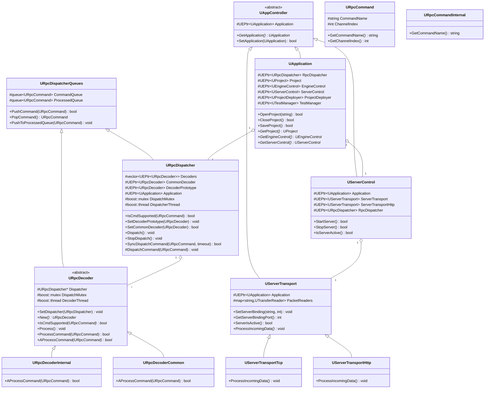
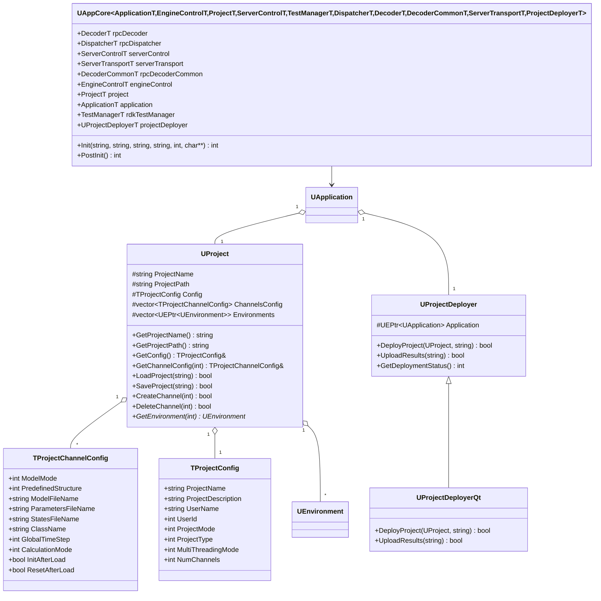
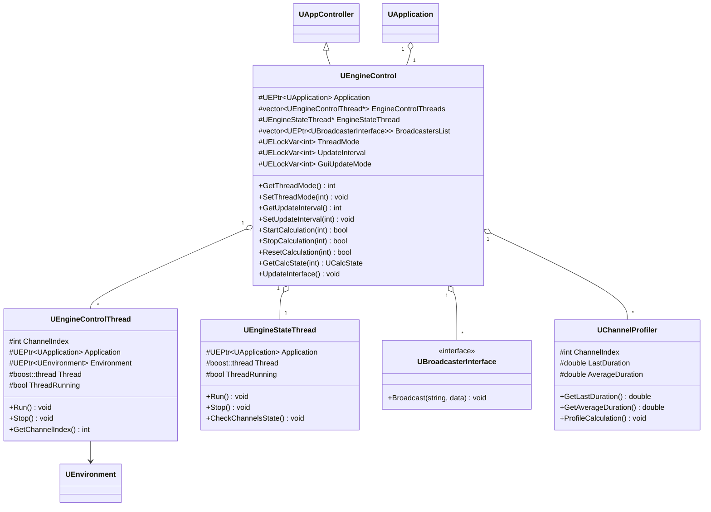
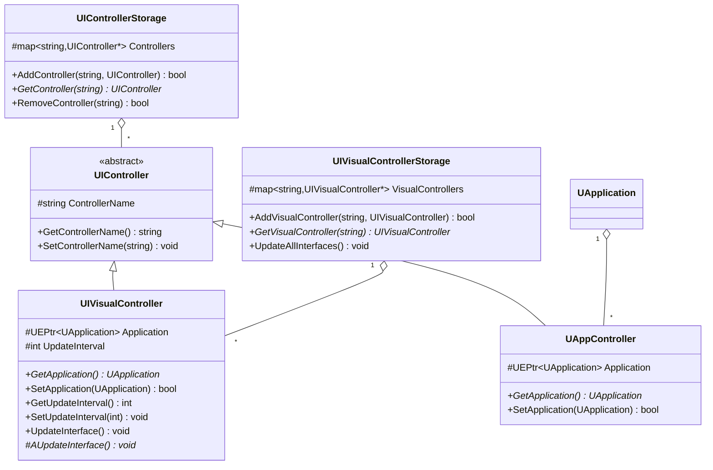
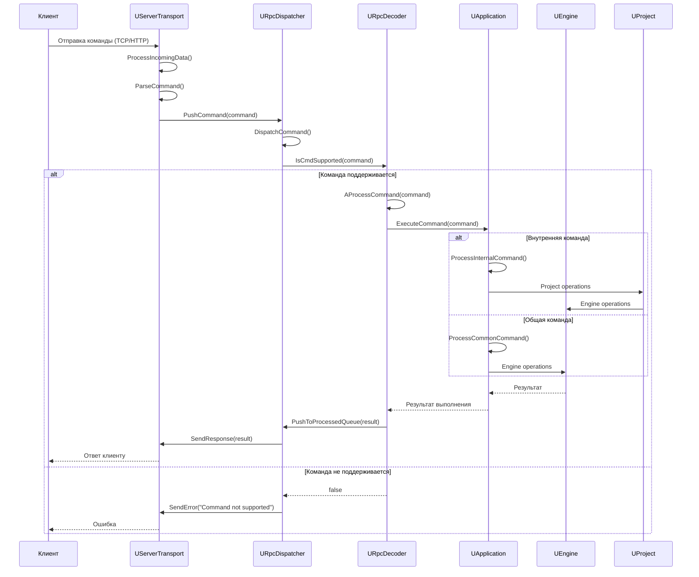
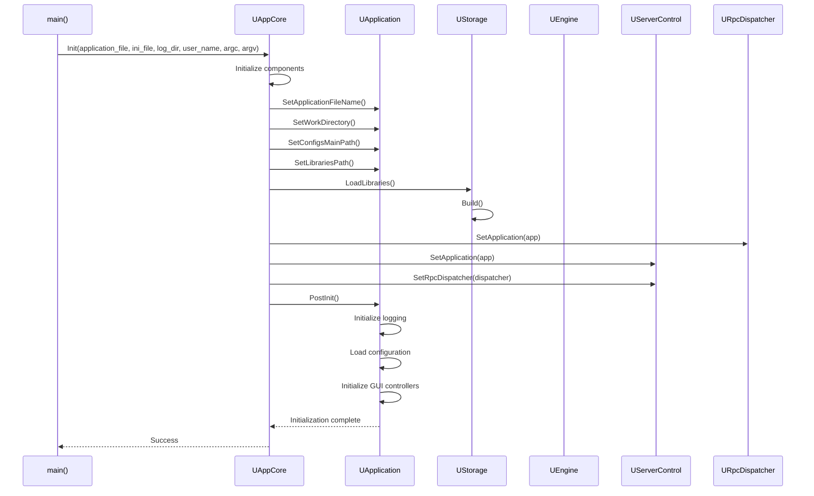
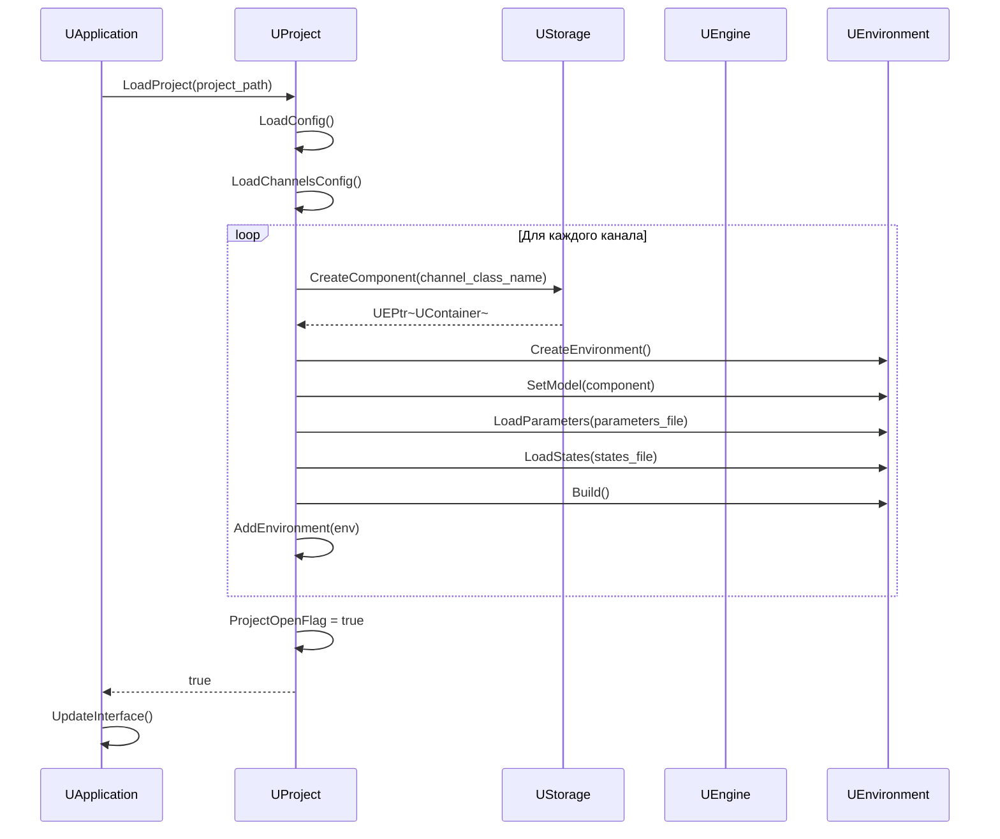

# Детальная документация модуля Core/Application

## RU

### Обзор

Модуль `Core/Application` реализует уровень приложения Rdk Core, включая систему RPC (Remote Procedure Call), управление проектами, серверную часть, управление движком и интеграцию с GUI. Этот модуль обеспечивает высокоуровневый интерфейс для работы с системой.

### UML диаграмма классов RPC системы



### UML диаграмма классов управления проектами



### UML диаграмма классов управления движком



### UML диаграмма классов визуальных контроллеров



### Диаграмма последовательности обработки RPC команды (расширенная)



### Диаграмма последовательности инициализации приложения



### Диаграмма последовательности открытия проекта



### Описание основных классов

#### UApplication

Главный класс приложения. Управляет всеми подсистемами: проектами, движком, сервером, RPC диспетчером.

**Основные свойства:**
- `RpcDispatcher` - диспетчер RPC команд
- `Project` - активный проект
- `EngineControl` - контроллер движка
- `ServerControl` - контроллер сервера
- `ProjectDeployer` - деплоер проектов
- `TestManager` - менеджер тестов

**Основные методы:**
- `OpenProject(path)` - открытие проекта
- `CloseProject()` - закрытие проекта
- `SaveProject()` - сохранение проекта
- `GetProject()` - получение активного проекта
- `GetEngineControl()` - получение контроллера движка
- `GetServerControl()` - получение контроллера сервера

#### URpcDispatcher

Диспетчер RPC команд. Управляет очередями команд и распределяет их по декодерам.

**Основные свойства:**
- `Decoders` - массив декодеров для каналов
- `CommonDecoder` - общий декодер сервера
- `DecoderPrototype` - прототип для создания новых декодеров
- `Application` - указатель на приложение

**Основные методы:**
- `IsCmdSupported(command)` - проверка поддержки команды
- `SetDecoderPrototype(decoder)` - установка прототипа декодера
- `Dispatch()` - диспетчеризация команд из очереди
- `StopDispatch()` - остановка диспетчеризации
- `SyncDispatchCommand(command, timeout)` - синхронная диспетчеризация команды

#### URpcDecoder

Абстрактный класс декодера RPC команд. Реализует декодирование и выполнение команд.

**Основные методы:**
- `New()` - создание копии декодера
- `IsCmdSupported(command)` - проверка поддержки команды
- `Process()` - обработка команд из очереди
- `ProcessCommand(command)` - обработка одной команды
- `AProcessCommand(command)` - абстрактный метод обработки команды (переопределяется)

#### URpcDecoderInternal

Декодер внутренних команд приложения. Обрабатывает команды управления проектами, движком и т.д.

#### URpcDecoderCommon

Декодер общих команд сервера. Обрабатывает команды, доступные всем клиентам.

#### URpcCommand

Базовый класс RPC команды.

**Основные свойства:**
- `CommandName` - имя команды
- `ChannelIndex` - индекс канала

#### UServerTransport

Абстрактный класс транспорта сервера. Определяет интерфейс для приема и отправки RPC команд.

**Основные методы:**
- `SetServerBinding(address, port)` - установка адреса и порта
- `GetServerBindingPort()` - получение порта
- `ServerIsActive()` - проверка активности сервера
- `ProcessIncomingData()` - обработка входящих данных

#### UServerTransportTcp

Реализация транспорта через TCP.

#### UServerTransportHttp

Реализация транспорта через HTTP.

#### UServerControl

Контроллер серверной части. Управляет транспортом и RPC диспетчером.

**Основные методы:**
- `StartServer()` - запуск сервера
- `StopServer()` - остановка сервера
- `IsServerActive()` - проверка активности сервера

#### UProject

Класс проекта. Управляет конфигурацией проекта и каналами.

**Основные свойства:**
- `Config` - конфигурация проекта
- `ChannelsConfig` - конфигурации каналов
- `Environments` - окружения выполнения для каналов

**Основные методы:**
- `LoadProject(path)` - загрузка проекта
- `SaveProject(path)` - сохранение проекта
- `CreateChannel(index)` - создание канала
- `DeleteChannel(index)` - удаление канала
- `GetEnvironment(index)` - получение окружения канала

#### UProjectDeployer

Класс для развертывания проектов. Управляет деплоем конфигураций и загрузкой результатов.

**Основные методы:**
- `DeployProject(project, target)` - развертывание проекта
- `UploadResults(path)` - загрузка результатов
- `GetDeploymentStatus()` - получение статуса развертывания

#### UEngineControl

Контроллер движка. Управляет выполнением расчетов в однопоточном и многопоточном режимах.

**Основные свойства:**
- `ThreadMode` - режим работы (однопоточный/многопоточный)
- `UpdateInterval` - интервал обновления интерфейса
- `GuiUpdateMode` - режим обновления GUI
- `EngineControlThreads` - потоки управления каналами
- `EngineStateThread` - поток мониторинга состояния

**Основные методы:**
- `StartCalculation(channel)` - запуск расчета канала
- `StopCalculation(channel)` - остановка расчета канала
- `ResetCalculation(channel)` - сброс расчета канала
- `GetCalcState(channel)` - получение состояния расчета
- `UpdateInterface()` - обновление интерфейса

#### UEngineControlThread

Поток управления расчетом одного канала.

**Основные методы:**
- `Run()` - выполнение потока
- `Stop()` - остановка потока
- `GetChannelIndex()` - получение индекса канала

#### UEngineStateThread

Поток мониторинга состояния расчета всех каналов.

**Основные методы:**
- `Run()` - выполнение потока
- `Stop()` - остановка потока
- `CheckChannelsState()` - проверка состояния каналов

#### UAppCore

Шаблонный класс для инициализации приложения. Создает и настраивает все компоненты приложения.

**Основные свойства:**
- `application` - экземпляр приложения
- `engineControl` - контроллер движка
- `project` - проект
- `serverControl` - контроллер сервера
- `rpcDispatcher` - RPC диспетчер
- `rpcDecoder` - RPC декодер

**Основные методы:**
- `Init(...)` - инициализация приложения
- `PostInit()` - пост-инициализация

#### UIVisualController

Базовый класс визуальных контроллеров для связи с GUI.

**Основные методы:**
- `UpdateInterface()` - обновление интерфейса
- `AUpdateInterface()` - абстрактный метод обновления (переопределяется)

### Примеры использования

#### Инициализация приложения

```cpp
#include "Rdk/Core/Application/UAppCore.h"
#include "Rdk/Core/Application/UApplication.h"

// Создание ядра приложения
RDK::UAppCore<
    RDK::UApplication,
    RDK::UEngineControl,
    RDK::UProject,
    RDK::UServerControl,
    RDK::UTestManager,
    RDK::URpcDispatcher,
    RDK::URpcDecoderInternal,
    RDK::URpcDecoderCommon,
    RDK::UServerTransportTcp,
    RDK::UProjectDeployer
> app_core;

// Инициализация
int result = app_core.Init(
    "application.exe",
    "config.ini",
    "/path/to/logs",
    "username",
    argc,
    argv
);

if (result == 0) {
    // Пост-инициализация
    app_core.PostInit();
    
    // Получение приложения
    RDK::UApplication* app = &app_core.application;
}
```

#### Открытие проекта

```cpp
// Открытие проекта
if (app->OpenProject("/path/to/project.xml")) {
    RDK::UProject* project = app->GetProject();
    
    // Получение конфигурации
    const RDK::TProjectConfig& config = project->GetConfig();
    std::cout << "Project: " << config.ProjectName << std::endl;
    std::cout << "Channels: " << config.NumChannels << std::endl;
}
```

#### Управление расчетом

```cpp
RDK::UEngineControl* engine_control = app->GetEngineControl();

// Запуск расчета канала 0
engine_control->StartCalculation(0);

// Проверка состояния
RDK::UEngineControl::UCalcState state = engine_control->GetCalcState(0);
if (state == RDK::UEngineControl::csRunning) {
    std::cout << "Calculation is running" << std::endl;
}

// Остановка расчета
engine_control->StopCalculation(0);
```

#### Работа с RPC

```cpp
// Получение RPC диспетчера
RDK::URpcDispatcher* dispatcher = app->GetRpcDispatcher();

// Создание команды
RDK::UEPtr<RDK::URpcCommand> command = /* ... */;

// Синхронная отправка команды
bool success = dispatcher->SyncDispatchCommand(command, 5000); // timeout 5 сек
```

### См. также

- [Architecture.md](Architecture.md) - общая архитектура
- [Engine-Detailed.md](Engine-Detailed.md) - детальная документация движка
- [Diagrams/RPC-Flow.md](Diagrams/RPC-Flow.md) - поток обработки RPC команд
- [Console-Application.md](Console-Application.md) - консольное приложение

---

## EN

### Overview

The `Core/Application` module implements the application layer of Rdk Core, including the RPC (Remote Procedure Call) system, project management, server components, engine control, and GUI integration. This module provides a high-level interface for working with the system.

### RPC System

The RPC system allows remote control of the application:
- `URpcDispatcher` - command dispatcher
- `URpcDecoder` - command decoder
- `UServerTransport` - transport layer (TCP/HTTP)
- `UServerControl` - server controller

### Project Management

Project management provides:
- `UProject` - project class
- `UProjectDeployer` - project deployment
- Multi-channel support
- Configuration management

### Engine Control

Engine control manages calculation execution:
- `UEngineControl` - engine controller
- `UEngineControlThread` - calculation thread
- `UEngineStateThread` - state monitoring thread

### See Also

- [Architecture.md](Architecture.md) - general architecture
- [Engine-Detailed.md](Engine-Detailed.md) - engine detailed documentation
- [Diagrams/RPC-Flow.md](Diagrams/RPC-Flow.md) - RPC command processing flow
- [Console-Application.md](Console-Application.md) - console application


