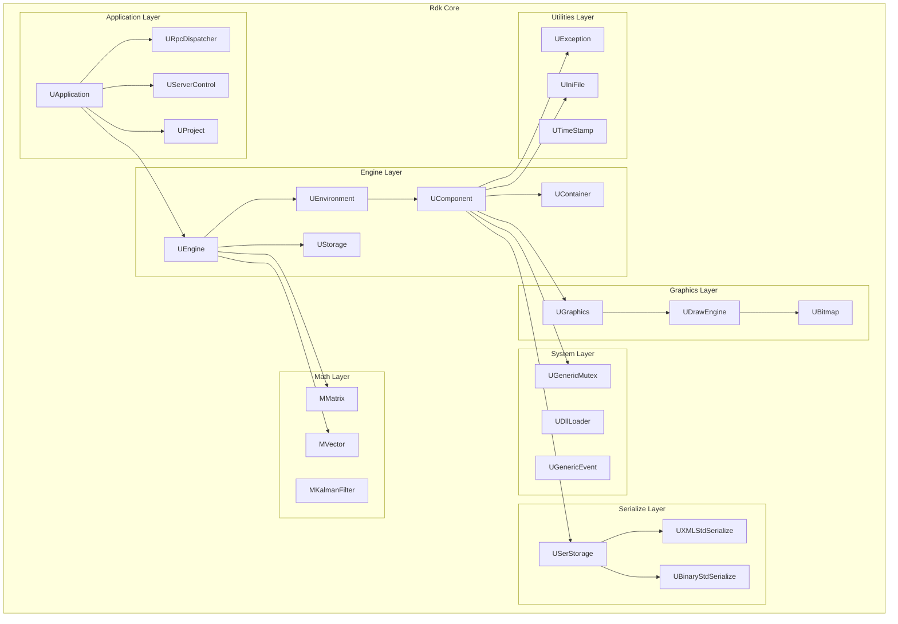
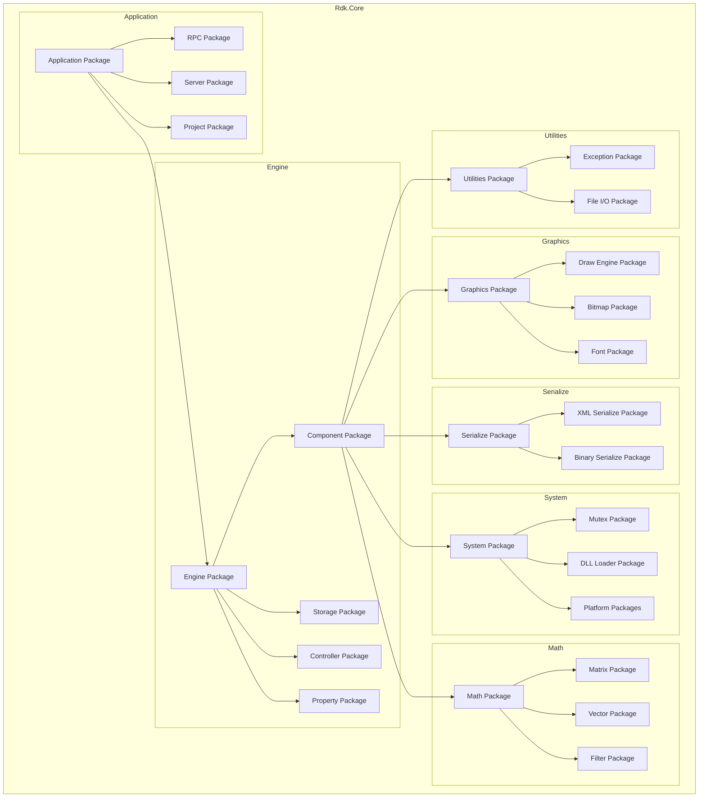
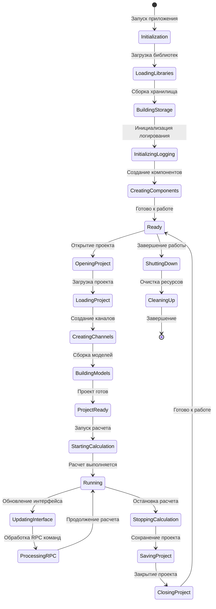
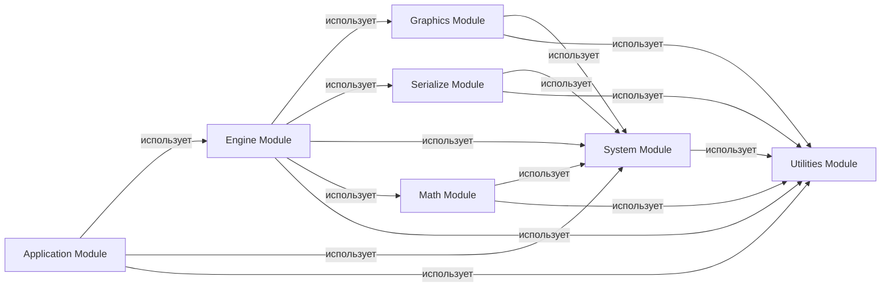
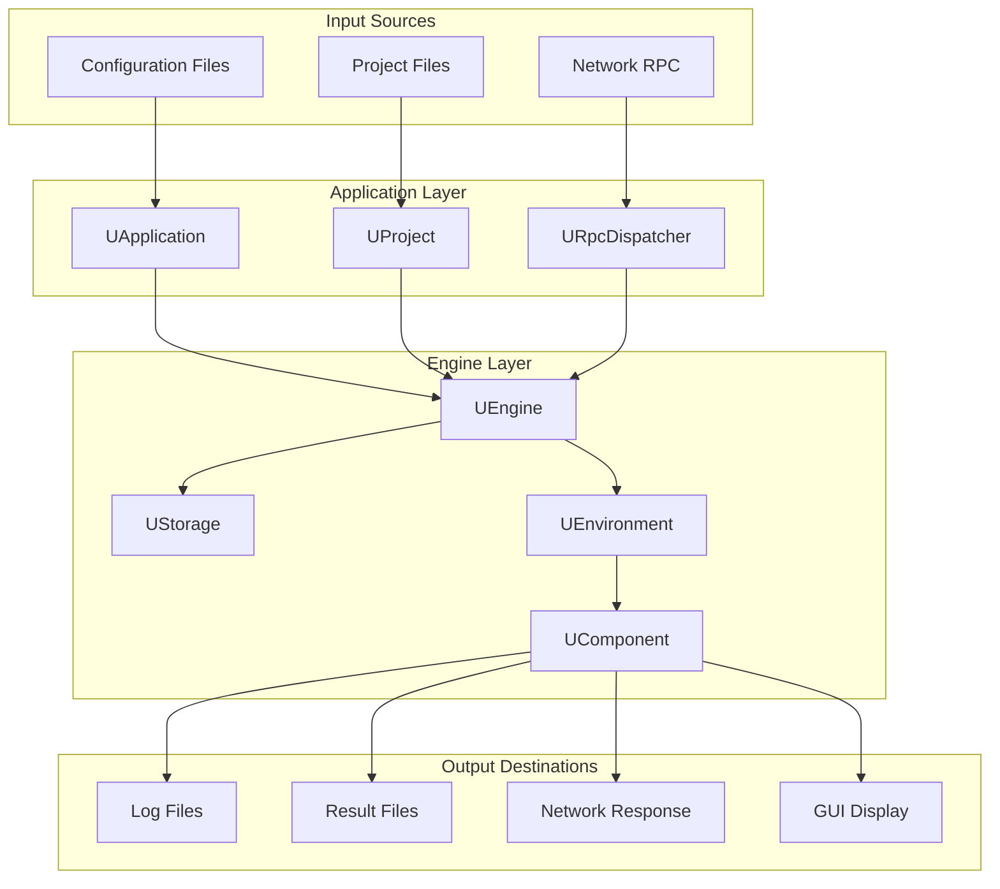
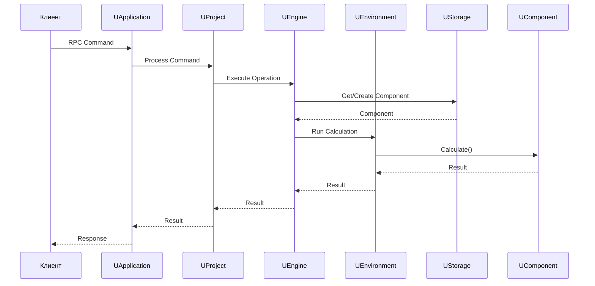

# Обзорные диаграммы архитектуры Rdk Core

## RU

### Обзор

Этот документ содержит обзорные диаграммы архитектуры Rdk Core на высоком уровне: диаграммы компонентов, развертывания, пакетов и активности.

### Диаграмма компонентов (Component Diagram)

Диаграмма показывает основные модули Rdk Core и их взаимосвязи.

### Диаграмма развертывания (Deployment Diagram)

Диаграмма показывает развертывание приложения с Rdk Core и связи с внешними библиотеками.

```mermaid
flowchart TB
    subgraph "Application Server"
        subgraph "Rdk Core Application"
            AppProcess[Application Process]
            subgraph "Rdk Core Libraries"
                CoreLib[Rdk Core Library]
                EngineLib[Engine Module]
                AppLib[Application Module]
                GraphicsLib[Graphics Module]
                SerializeLib[Serialize Module]
                SystemLib[System Module]
                MathLib[Math Module]
                UtilsLib[Utilities Module]
            end
        end
        
        subgraph "Component Libraries"
            BasicLib[Rdk-BasicLib]
            PulseLib[Nmsdk-PulseLib]
            HardwareLib[Rdk-HardwareLib]
            CvLib[Rdk-CvBasicLib]
        end
    end
    
    subgraph "External Dependencies"
        QtLib[Qt5 Core]
        BoostLib[Boost Thread]
        GlogLib[Google Glog]
        OpenCVLib[OpenCV]
    end
    
    subgraph "Storage"
        ConfigFiles[Configuration Files]
        ProjectFiles[Project Files]
        LogFiles[Log Files]
    end
    
    subgraph "Network"
        TCPClient[TCP Clients]
        HTTPClient[HTTP Clients]
    end
    
    AppProcess --> CoreLib
    CoreLib --> EngineLib
    CoreLib --> AppLib
    CoreLib --> GraphicsLib
    CoreLib --> SerializeLib
    CoreLib --> SystemLib
    CoreLib --> MathLib
    CoreLib --> UtilsLib
    
    AppProcess --> BasicLib
    AppProcess --> PulseLib
    AppProcess --> HardwareLib
    AppProcess --> CvLib
    
    CoreLib --> QtLib
    CoreLib --> BoostLib
    CoreLib --> GlogLib
    CvLib --> OpenCVLib
    
    AppProcess --> ConfigFiles
    AppProcess --> ProjectFiles
    AppProcess --> LogFiles
    
    AppProcess --> TCPClient
    AppProcess --> HTTPClient
```

### Диаграмма пакетов (Package Diagram)

Диаграмма показывает структуру пакетов всех модулей Rdk Core.

### Диаграмма активности (Activity Diagram) выполнения приложения

Диаграмма показывает жизненный цикл приложения от инициализации до завершения работы.

### Диаграмма зависимостей модулей

Диаграмма показывает зависимости между модулями Rdk Core.

### Диаграмма потоков данных (Data Flow Diagram)

Диаграмма показывает потоки данных в системе Rdk Core.

### Диаграмма взаимодействия компонентов

Диаграмма показывает взаимодействие основных компонентов системы.

### См. также

- [Architecture.md](Architecture.md) - общая архитектура подсистем
- [Engine-Detailed.md](Engine-Detailed.md) - детальная документация движка
- [Application-Detailed.md](Application-Detailed.md) - детальная документация приложения

---

## EN

### Overview

This document contains high-level architecture diagrams of Rdk Core: component diagrams, deployment diagrams, package diagrams, and activity diagrams.

### Component Diagram

Shows the main modules of Rdk Core and their relationships.

### Deployment Diagram

Shows application deployment with Rdk Core and connections to external libraries.

### Package Diagram

Shows the package structure of all Rdk Core modules.

### Activity Diagram

Shows the application lifecycle from initialization to shutdown.

### Module Dependencies

Shows dependencies between Rdk Core modules.

### Data Flow Diagram

Shows data flows in the Rdk Core system.

### Component Interaction

Shows interaction between main system components.

### See Also

- [Architecture.md](Architecture.md) - general subsystem architecture
- [Engine-Detailed.md](Engine-Detailed.md) - engine detailed documentation
- [Application-Detailed.md](Application-Detailed.md) - application detailed documentation
