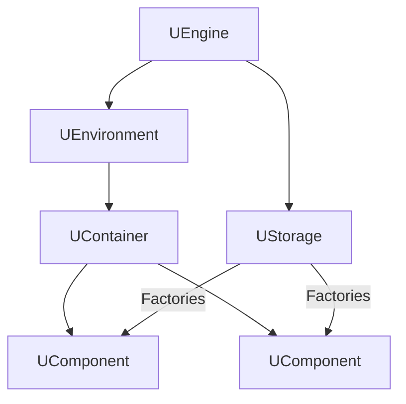

# Архитектура Rdk Core

## RU

### Обзор

Детальное описание архитектуры подсистем Rdk Core.

### Подсистемы

#### Core/Application

Управление приложением, RPC, сервер, проекты.

**Основные классы:**
- `UApplication` - главный класс приложения
- `UEngineControl` - управление движком
- `URpcDispatcher` - диспетчер RPC команд
- `UServerTransport` - транспорт сервера

См. [Docs/Rdk-Core/Application-Architecture.md](../../Docs/Rdk-Core/Application-Architecture.md)

#### Core/Engine

Движок и компонентная система.

**Основные классы:**
- `UEngine` - главный класс движка
- `UComponent` - базовый класс компонентов
- `UContainer` - контейнер компонентов
- `UEnvironment` - окружение выполнения
- `UStorage` - хранилище компонентов

**Взаимодействие классов:**

В коде это соответствует тому, что:
- `UEngine` инициализирует `UStorage` и `UEnvironment` (см. `UEngine::Init` и связанные методы),
- `UStorage` загружает библиотеки (`ULibrary`) и регистрирует классы компонентов через фабрики,
- `UEnvironment` управляет жизненным циклом компонентов, вызывая `Reset/Calculate` у корневых контейнеров,
- `UContainer` и `UNet` группируют компоненты и делегируют вызовы их методам жизненного цикла.

См. [Docs/Rdk-Core/Engine-Architecture.md](../../Docs/Rdk-Core/Engine-Architecture.md)

#### Core/Graphics

Система графики для визуализации.

**Основные классы:**
- `UGraphics` - основной класс графики
- `UDrawEngine` - движок отрисовки
- `UBitmap` - растровое изображение

См. [Docs/Rdk-Core/Graphics-Architecture.md](../../Docs/Rdk-Core/Graphics-Architecture.md)

#### Core/Serialize

Система сериализации данных и компонентов.

**Основные классы:**
- `USerStorage` - хранилище данных
- `UXMLStdSerialize` - XML сериализация
- `UBinaryStdSerialize` - бинарная сериализация

См. [Docs/Rdk-Core/Serialize-Architecture.md](../../Docs/Rdk-Core/Serialize-Architecture.md)

#### Core/System

Кроссплатформенные системные абстракции.

**Основные классы:**
- `UGenericMutex` - универсальный мьютекс
- `UGenericEvent` - универсальное событие
- `UDllLoader` - загрузчик DLL/SO

См. [Docs/Rdk-Core/System-Platform-Abstraction.md](../../Docs/Rdk-Core/System-Platform-Abstraction.md)

### Диаграммы

Диаграммы классов и последовательностей для каждой подсистемы доступны в корневой документации:

- [Архитектура приложения](../../Docs/Rdk-Core/Application-Architecture.md)
- [Архитектура движка](../../Docs/Rdk-Core/Engine-Architecture.md)
- [Архитектура графики](../../Docs/Rdk-Core/Graphics-Architecture.md)
- [Архитектура сериализации](../../Docs/Rdk-Core/Serialize-Architecture.md)
- [Системные абстракции](../../Docs/Rdk-Core/System-Platform-Abstraction.md)

---

## EN

### Overview

Detailed description of Rdk Core subsystem architecture.

### Subsystems

#### Core/Application

Application management, RPC, server, projects.

#### Core/Engine

Engine and component system.

**Class interaction:**

This reflects the actual roles in code:
- `UEngine` initializes `UStorage` and `UEnvironment`,
- `UStorage` loads `ULibrary` instances and registers component classes via factories,
- `UEnvironment` drives the execution lifecycle (`Reset/Calculate`) for root containers,
- `UContainer` / `UNet` group components and propagate lifecycle calls to them.

#### Core/Graphics

Graphics system for visualization.

#### Core/Serialize

Data and component serialization system.

#### Core/System

Cross-platform system abstractions.

### Diagrams

Class and sequence diagrams for each subsystem are available in the root documentation:

- [Application Architecture](../../Docs/Rdk-Core/Application-Architecture.md)
- [Engine Architecture](../../Docs/Rdk-Core/Engine-Architecture.md)
- [Graphics Architecture](../../Docs/Rdk-Core/Graphics-Architecture.md)
- [Serialization Architecture](../../Docs/Rdk-Core/Serialize-Architecture.md)
- [System Abstractions](../../Docs/Rdk-Core/System-Platform-Abstraction.md)
