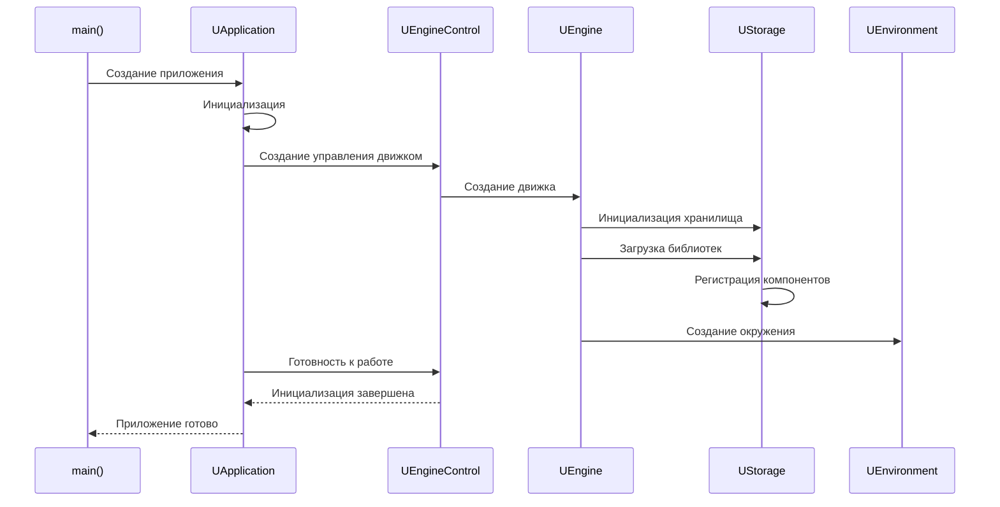
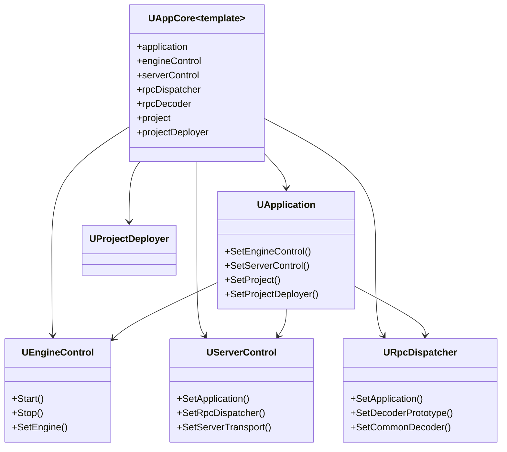
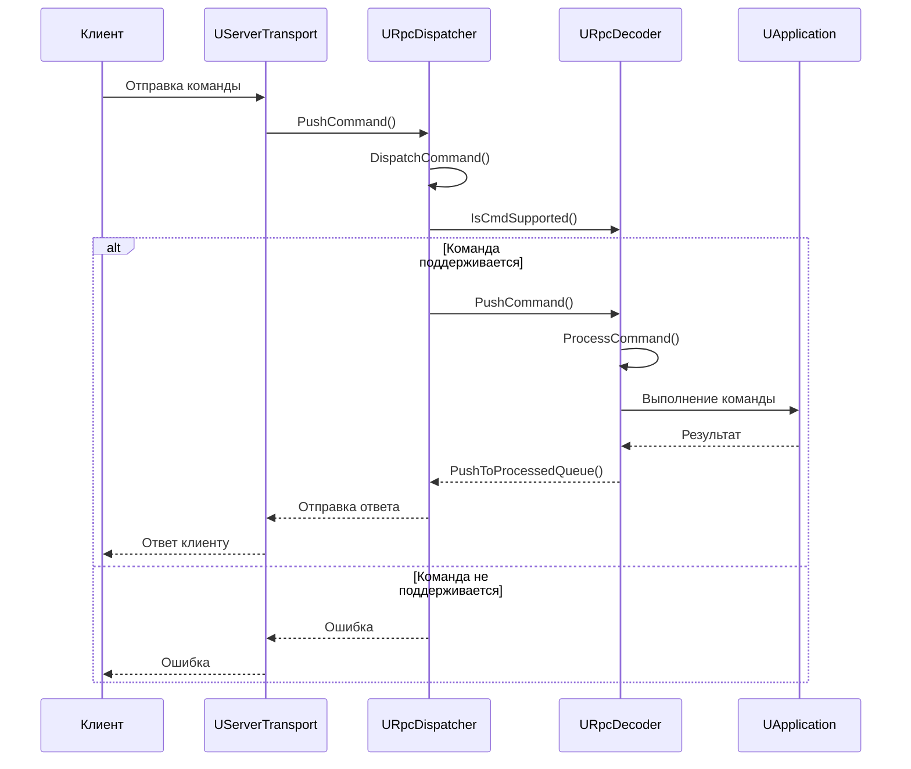
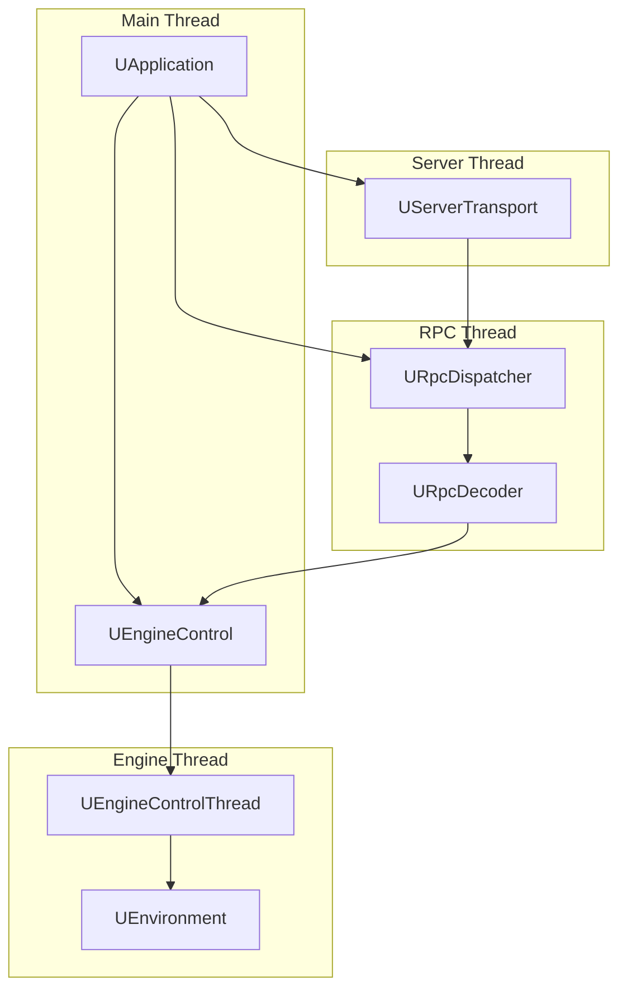

# Архитектура приложения (Application Architecture)

## RU

### Обзор

Модуль `Rdk/Core/Application` предоставляет инфраструктуру для управления приложением, RPC-систему, серверную функциональность и управление проектами.

### Основные компоненты

#### UApplication

Главный класс приложения, управляющий жизненным циклом и координацией всех подсистем.

**Основные функции:**
- Инициализация и завершение работы
- Управление движком
- Координация RPC и сервера
- Управление проектами

Архитектурно `UApplication` является центральной точкой входа для всех подсистем: при инициализации он настраивает `UEngineControl`, `UServerControl`, RPC‑подсистему, тестовый менеджер и `UProjectDeployer` (см. шаблон `UAppCore` в `UAppCore.h`).

**Последовательность запуска приложения:**

Эта диаграмма обобщает код инициализации в `UAppCore::Init` и последующие вызовы методов `UApplication` и `UEngineControl`: сначала загружается конфигурация (INI/проект), затем строится и инициализируется движок (`UEngine`, `UStorage`, `UEnvironment`), после чего приложение переходит в рабочее состояние.

#### Классовые связи уровня Application

Диаграмма отражает связи, явно устанавливаемые в конструкторе `UAppCore`: `rpcDecoder.SetDispatcher(&rpcDispatcher)`, `serverControl.SetApplication(&application)`, `application.SetEngineControl(&engineControl)` и т.д. Это позволяет шаблонному классу `UAppCore` собирать конкретную конфигурацию приложения из параметризованных типов.

#### UEngineControl

Управление движком выполнения компонентов.

**Основные функции:**
- Запуск/остановка выполнения
- Управление шагами времени
- Синхронизация потоков выполнения

#### RPC система

Система удаленных вызовов процедур для взаимодействия с приложением через сеть.

**Основные классы:**
- `URpcDispatcher` - диспетчер RPC команд
- `URpcDecoder` - декодер RPC команд
- `URpcCommand` - команда RPC
- `URpcDecoderCommon` - общий декодер
- `URpcDecoderInternal` - внутренний декодер

**Последовательность обработки RPC команды:**

Здесь:
- транспорт (`UServerTransport`) принимает запросы по TCP/HTTP и передаёт их в `URpcDispatcher`,
- `URpcDispatcher` выбирает подходящий декодер (`URpcDecoder`, `URpcDecoderCommon`, `URpcDecoderInternal`) и передаёт ему команду,
- декодер вызывает соответствующие методы `UApplication` или связанных контроллеров,
- результат команды возвращается вызывающему клиенту через транспорт.

#### UServerTransport

Транспортный слой для сервера.

**Реализации:**
- `UServerTransportTcp` - TCP транспорт
- `UServerTransportTcpQt` - TCP транспорт на Qt
- `UServerTransportHttp` - HTTP транспорт

#### UProject и UProjectDeployer

Управление проектами и их развертывание.

**Основные функции:**
- Загрузка/сохранение проектов
- Развертывание проектов на удаленные системы
- Управление конфигурациями

Класс `UProject` отвечает за структуру проекта (список компонентов, соединения и настройки), а `UProjectDeployer` реализует копирование и обновление конфигураций между локальными и удалёнными каталогами (используется в `UAppCore` и `UApplication`).

### Потоки выполнения

Эта схема соответствует многопоточной архитектуре: как минимум отдельные потоки используются для RPC‑обработки, выполнения движка и сетевого сервера. `UApplication` создаёт и связывает соответствующие контроллеры, а `URpcDispatcher` и `UServerTransport` обеспечивают передачу команд между клиентами и приложением.

### Платформенные реализации

#### Qt (`Core/Application/Qt`)
Современная кроссплатформенная реализация на Qt.

**Основные классы:**
- `UEngineControlQt` - управление движком на Qt
- `UProjectDeployerQt` - развертывание проектов на Qt
- `UServerTransportTcpQt` - TCP транспорт на Qt

#### Borland C++ Builder (`Core/Application/Bcb`)
Реализация для Borland C++ Builder (legacy).

**Основные классы:**
- `Application.bcb.*` - приложение для BCB
- `URpcDispatcherVcl` - RPC диспетчер для VCL

#### Boost (`Core/Application/Boost`)
Реализация на Boost (опционально).

### См. также

- [Архитектура движка](Engine-Architecture.md)
- [Rdk Core Overview](Overview.md)
- [Детальная документация Application](../Application-Detailed.md)
- [Управление конфигурациями](../Configuration-Management.md)
- [Управление проектами](../Guides/Project-Management.md)

---

## EN

### Overview

The `Rdk/Core/Application` module provides infrastructure for application management, RPC system, server functionality, and project management.

### Main Components

#### UApplication

Main application class managing lifecycle and coordination of all subsystems.

**Key responsibilities:**
- application startup/shutdown,
- configuring and owning `UEngineControl`, `UServerControl`, RPC dispatcher and decoders,
- managing projects (`UProject`) and deployment (`UProjectDeployer`).

#### UEngineControl

Control of component execution engine.

It wraps `UEngine`, exposes high‑level `Start/Stop` operations and manages timing / threading for the engine execution loop.

#### RPC System

Remote Procedure Call system for interacting with the application over the network.

**Main Classes:**
- `URpcDispatcher` - RPC command dispatcher
- `URpcDecoder` - RPC command decoder
- `URpcCommand` - RPC command
- `URpcDecoderCommon` - common decoder
- `URpcDecoderInternal` - internal decoder

`URpcDispatcher` owns queues of incoming/processed commands and routes them to appropriate decoders. Decoders validate and decode payloads, then call methods on `UApplication` or related controllers, pushing results back to the dispatcher for sending via transports.

#### UServerTransport

Transport layer for the server.

**Implementations:**
- `UServerTransportTcp` - TCP transport
- `UServerTransportTcpQt` - TCP transport on Qt
- `UServerTransportHttp` - HTTP transport

#### UProject and UProjectDeployer

Project management and deployment.

`UProject` encapsulates project structure (components, connections, settings), while `UProjectDeployer` handles copying and updating configuration files between local and remote locations as configured in `UAppCore` / `UApplication`.

### Execution Threads

The flowchart in the Russian section illustrates the main threads:
- **Main Thread**: hosts `UApplication` and primary UI / control logic,
- **Engine Thread**: runs the execution loop via `UEngineControl` and `UEnvironment`,
- **RPC Thread**: processes command queues in `URpcDispatcher` / `URpcDecoder`,
- **Server Thread**: accepts network connections and forwards commands to the dispatcher.

### Platform Implementations

#### Qt (`Core/Application/Qt`)
Modern cross-platform implementation on Qt.

#### Borland C++ Builder (`Core/Application/Bcb`)
Implementation for Borland C++ Builder (legacy).

#### Boost (`Core/Application/Boost`)
Implementation on Boost (optional).

### See Also

- [Engine Architecture](Engine-Architecture.md)
- [Rdk Core Overview](Overview.md)
- [Detailed Application Documentation](../Application-Detailed.md)
- [Configuration Management](../Configuration-Management.md)
- [Project Management](../Guides/Project-Management.md)
