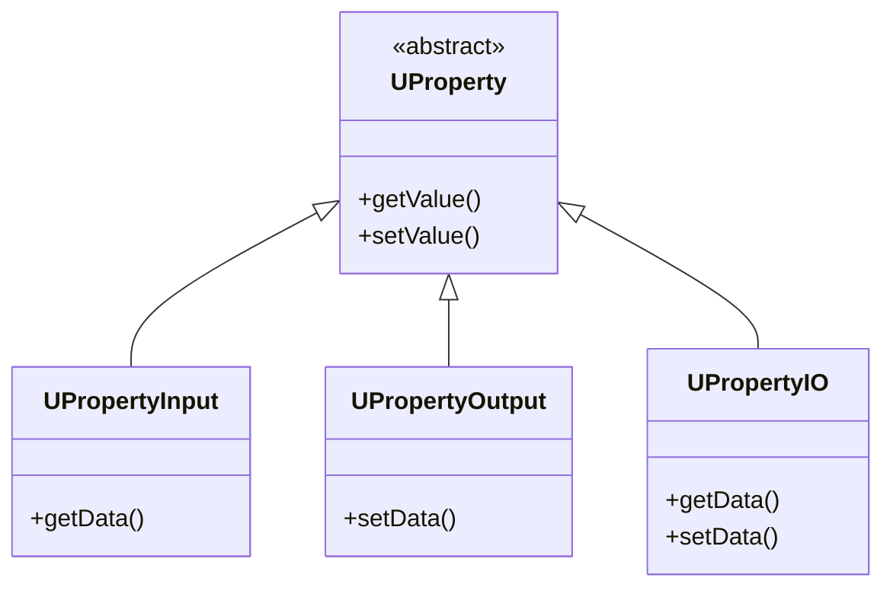
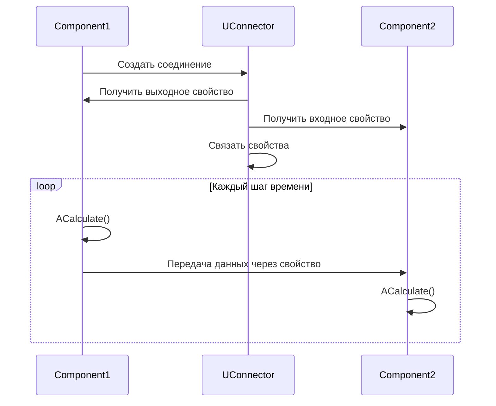
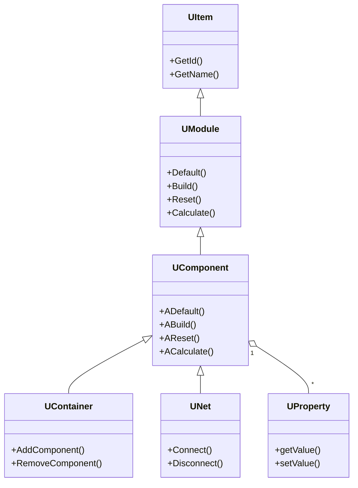
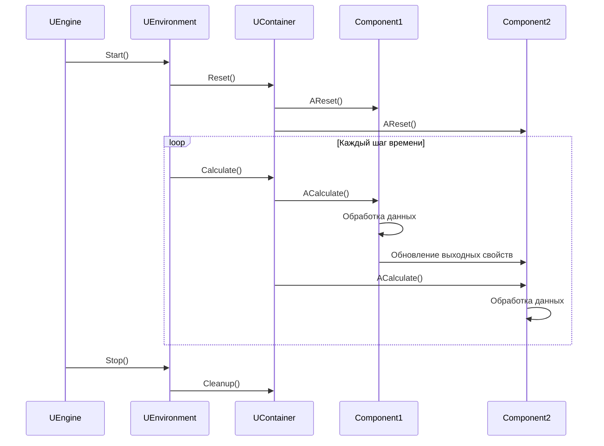
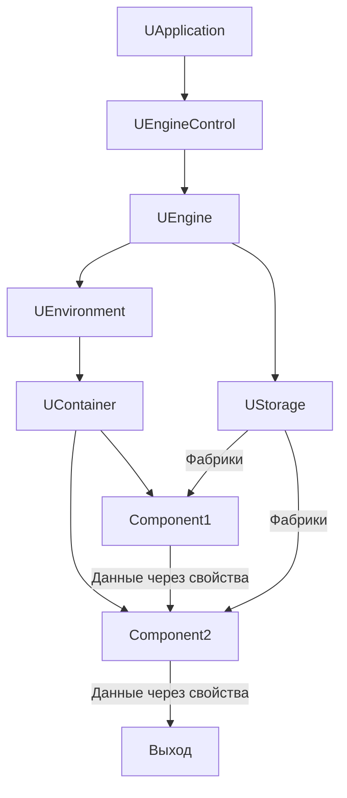

# Архитектура движка (Engine Architecture)

## RU

### Обзор

Модуль `Rdk/Core/Engine` реализует ядро компонентной системы - движок выполнения компонентов, систему свойств, контейнеры и сети компонентов.

### Основные компоненты

#### UEngine

Главный класс движка, управляющий окружением и хранилищем компонентов.

**Основные функции:**
- Создание и управление окружением (`UEnvironment`)
- Управление хранилищем компонентов (`UStorage`)
- Координация выполнения компонентов

#### UComponent

Базовый класс для всех компонентов в системе.

**Жизненный цикл компонента:**

Ниже показана диаграмма состояний, обобщающая переходы между основными методами жизненного цикла компонента. Она напрямую отражает шаблон вызовов `ADefault()`, `ABuild()`, `AReset()`, `ACalculate()` в базовом классе `UComponent`.

```mermaid
stateDiagram-v2
    [*] --> Default: Создание
    Default --> Build: Настройка параметров
    Build --> Ready: Готов к работе
    Ready --> Reset: Перед вычислениями
    Reset --> Calculate: Вычисление
    Calculate --> Calculate: Повтор
    Calculate --> Reset: Новый цикл
    Ready --> [*]: Удаление
```

**Методы жизненного цикла:**
- `ADefault()` - инициализация значений по умолчанию
- `ABuild()` - построение структуры компонента
- `AReset()` - сброс состояния перед вычислениями
- `ACalculate()` - выполнение вычислений

#### UContainer

Контейнер для группировки компонентов.

**Основные функции:**
- Хранение компонентов
- Управление жизненным циклом группы компонентов
- Изоляция компонентов друг от друга
- Управление списком дочерних компонентов и быстрым доступом по идентификатору (`CompsLookupTable`, `ComponentsIdIndex`)
- Управление статическими компонентами (`StaticComponents`) и контроллерами (`Controllers`)

#### UNet

Сеть компонентов - контейнер для соединения компонентов в вычислительную сеть.

**Основные функции:**
- Организация компонентов в сеть
- Управление соединениями между компонентами
- Выполнение сети компонентов

UNet, как правило, использует те же механизмы свойств и коннекторов, что и обычные контейнеры, но добавляет логику работы с топологией сети (порядок обхода и вычислений).

#### UEnvironment

Окружение выполнения компонентов.

**Основные функции:**
- Управление временем выполнения (TimeStep)
- Логирование
- Обработка исключений
- Координация выполнения компонентов

#### UStorage

Хранилище (реестр) компонентов.

**Основные функции:**
- Реестр классов компонентов
- Фабрики для создания компонентов
- Описания компонентов (`UComponentDescription`)
- Управление библиотеками (`ULibrary`)

`UStorage` отвечает за регистрацию компонентных классов (методы `AddClass`, `CheckClass`), загрузку библиотек (`AddCollection`, `InitRTlibs`, `BuildStorage`) и поиск зависимостей (`FindCollection`, `FindComponentDependencies`). При старте движка `UEngine` инициализирует `UStorage`, загружает библиотеки через `RdkLoadPredefinedLibraries`, а затем строит внутренний реестр классов.

### Система свойств

#### Типы свойств



**Типы свойств:**
- `ptParameter` - параметр компонента
- `ptState` - состояние компонента
- `ptTemp` - временное свойство
- `ptInput` - входное свойство
- `ptOutput` - выходное свойство

**Группы свойств:**
- `pgPublic` - публичное свойство
- `pgSystem` - системное свойство
- `pgInput` - входная группа
- `pgOutput` - выходная группа

В коде эти флаги комбинируются, образуя типы наподобие `ptPubInput`, `ptPubOutput` и т.д. (см. перечисления в `UComponent.h`). Они используются при регистрации свойств в `UComponent::AddLookupProperty` и далее при поиске и фильтрации свойств по ролям.

С точки зрения архитектуры, каждое свойство инкапсулирует:
- ссылку на владельца (`Owner` в базовых классах свойств),
- тип и группу (bitmask флагов),
- механизм сериализации (через `USerStorage` и XML/Binary сериализаторы),
- опциональную поддержку потокобезопасности (мьютекс `UGenericMutex`).

### Соединение компонентов

Следующая диаграмма показывает, как два компонента связываются через коннектор и их свойства ввода/вывода. Она построена по мотивам методов `UConnector::ConnectToItem` и `UItem::Connect`, где производится поиск свойств (`FindProperty`) и вызов `SetPointer` для установки связи.



### Архитектура классов

Диаграмма ниже обобщает иерархию ключевых классов движка. В коде это соответствует наследованию `UModule` от `UItem`, а `UComponent`, `UContainer`, `UNet` — от `UModule`. Свойства (`UProperty` и производные) ассоциированы с компонентами через таблицу `PropertiesLookupTable` в `UComponent`.



### Выполнение компонентов

**Последовательность выполнения:**

Диаграмма последовательностей ниже демонстрирует типичное выполнение цикла расчётов: `UEngine` запускает `UEnvironment`, окружение вызывает операции `Reset/Calculate` на корневом контейнере, а тот, в свою очередь, делегирует вызовы методам `AReset` и `ACalculate` дочерних компонентов.



### Поток управления и данных

**Как течёт управление и данные в системе:**

Эта диаграмма объединяет воедино уровни `UApplication`, `UEngineControl`, `UEngine`, `UEnvironment`, контейнеры и отдельные компоненты. Она иллюстрирует, что:
- управление сверху вниз идёт от приложения к движку и далее к окружению и контейнерам,
- данные между компонентами текут через свойства и коннекторы,
- создание компонентов опосредовано `UStorage` и фабриками.



### Фабрики компонентов

#### UComponentFactory

Фабрика для создания компонентов определенного типа.

**Основные функции:**
- Создание экземпляров компонентов
- Регистрация в хранилище
- Управление метаданными компонентов

В `ULibrary::UploadClass` можно увидеть типичный сценарий: создаётся экземпляр компонента, вызывается его `Build()`, после чего формируется фабрика (`UVirtualMethodFactory` или `UComponentFactoryMethod`) и регистрируется в `UStorage::AddClass`. Далее при запросе создания объекта по имени класса `UStorage` использует эту фабрику для инстанцирования нового компонента.

### См. также

- [Компонентная система](../Guides/Component-System.md)
- [Rdk Core Overview](Overview.md)
- [Детальная документация Engine](../Engine-Detailed.md)
- [Создание компонентов](../Guides/Creating-Components.md)

---

## EN

### Overview

The `Rdk/Core/Engine` module implements the core of the component system - component execution engine, property system, containers, and component networks.

### Main Components

#### UEngine

Main engine class managing environment and component storage.

**Key responsibilities:**
- owns and initializes `UStorage` and `UEnvironment`,
- loads component libraries via `RdkLoadPredefinedLibraries` and configures them in `Storage`,
- coordinates execution loop and error handling,
- maintains caches like `AccessCache` for fast component lookup by name.

#### UComponent

Base class for all components in the system.

**Component Lifecycle methods:**
- `ADefault()` – initialize default values for parameters and states,
- `ABuild()` – build internal structure (create sub‑components, properties, connections),
- `AReset()` – reset state before a calculation cycle,
- `ACalculate()` – perform the actual computation step.

These methods correspond to the state diagram in the Russian section and are invoked by containers and the environment according to the execution sequence diagram.

#### UContainer

Container for grouping components.

**Key responsibilities:**
- stores child components in internal vectors and maps,
- provides fast lookup by ID and name (`CompsLookupTable`, `ComponentsIdIndex`),
- manages static components and associated controllers,
- participates in the execution loop by propagating lifecycle calls to children.

#### UNet

Component network - container for connecting components into a computational network.

In addition to `UContainer` responsibilities, `UNet` adds logic related to network topology and connection management between nested components, using connectors and property endpoints.

#### UEnvironment

Component execution environment.

Typical responsibilities include:
- time management (`TimeStep` and related helpers),
- logging and exception routing via `UExceptionLogger`,
- orchestrating `Reset/Calculate` cycles for root containers and networks.

#### UStorage

Component storage (registry).

`UStorage` holds:
- a registry of component classes and their factories (`UClassesStorage`),
- descriptions (`UClassesDescription`, `UContainerDescription`),
- references to loaded libraries (`ULibrary`, `URuntimeLibrary`).

On engine startup it is initialized by adding collections (`AddCollection`), building runtime libraries (`InitRTlibs`, `BuildStorage`) and loading class descriptions (`LoadClassesDescription`). Methods like `FindCollection` and `FindComponentDependencies` are used to resolve dependencies between components and libraries.

### Property System

**Property Types:**
- `ptParameter` - component parameter
- `ptState` - component state
- `ptTemp` - temporary property
- `ptInput` - input property
- `ptOutput` - output property

**Property Groups:**
- `pgPublic` - public property
- `pgSystem` - system property
- `pgInput` - input group
- `pgOutput` - output group

In code these flags are combined into convenience constants like `ptPubInput`, `ptPubOutput`, etc. (`UComponent.h`). They are used when registering properties in `UComponent::AddLookupProperty` and when searching for properties of a given role.

Each property object encapsulates:
- pointer to its owner component,
- type and group bitmask,
- serialization support via `USerStorage` and XML/Binary serializers,
- optional thread‑safety using `UGenericMutex` and cached pointers (e.g. `CachedConnectedOutput` in templated property classes).

### Component Connection

Components are connected by linking output and input properties via connectors. Internally, methods like `UConnector::ConnectToItem` and `UItem::Connect`:
- locate output and input properties using `FindProperty`,
- verify compatibility (data type and property group),
- call `SetPointer` / `AttachTo` on property endpoints to establish the link.

Data is then propagated every calculation step by reading from output properties and writing into inputs, as shown in the sequence diagram in the Russian section.

### Class Architecture

The class diagram in the Russian section summarizes the inheritance hierarchy:
- `UItem` → `UModule` → `UComponent` → (`UContainer`, `UNet`),
- `UComponent` aggregates multiple `UProperty` instances.

This reflects the actual hierarchy in `UItem.h`, `UModule.h`, `UComponent.h` and is the basis for the component engine architecture.

### Component Execution

Execution is orchestrated by `UEngine` and `UEnvironment`:
- `UEngine` configures storage and environment, then starts the main loop,
- `UEnvironment` calls `Reset` and `Calculate` on root containers,
- containers delegate lifecycle calls to child components in a defined order (often respecting network topology).

The corresponding sequence is illustrated by the execution diagram in the Russian section.

### Component Factories

#### UComponentFactory

Factory for creating components of a specific type.

Factories are created either from prototype instances (`UVirtualMethodFactory`) or from factory functions (`UComponentFactoryMethod`) inside `ULibrary::UploadClass`. `UStorage::AddClass` registers these factories, and later `UStorage` uses them to construct component instances by class name or ID.

### See Also

- [Component System](../Guides/Component-System.md)
- [Rdk Core Overview](Overview.md)
- [Detailed Engine Documentation](../Engine-Detailed.md)
- [Creating Components](../Guides/Creating-Components.md)

```mermaid
stateDiagram-v2
    [*] --> Default: Creation
    Default --> Build: Настройка параметров
    Build --> Ready: Ready
    Ready --> Reset: Перед вычислениями
    Reset --> Calculate: Calculate
    Calculate --> Calculate: Повтор
    Calculate --> Reset: Новый цикл
    Ready --> [*]: Удаление
```


