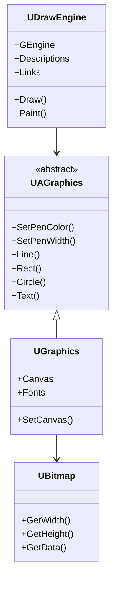
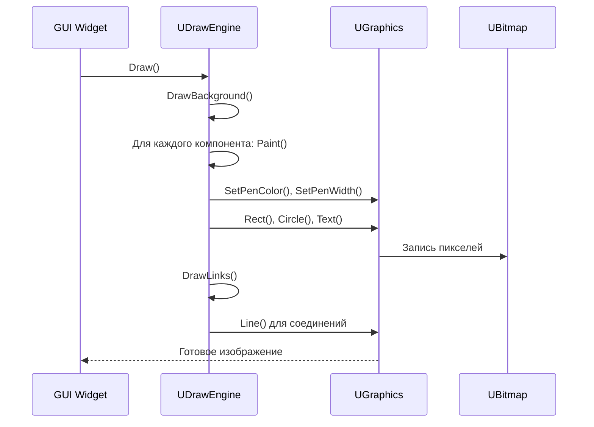
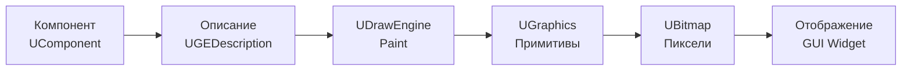

# Архитектура графики (Graphics Architecture)

## RU

### Обзор

Модуль `Rdk/Core/Graphics` предоставляет систему графики для визуализации компонентов и данных.

### Основные компоненты

#### UGraphics

Основной класс графики, предоставляющий абстрактный интерфейс для работы с графикой.

`UGraphics` наследуется от `UAGraphics` и добавляет управление канвой (`UBitmap* Canvas`) и коллекцией шрифтов (`map<string,UBitmapFont> Fonts`). Он реализует конкретные графические примитивы (пиксели, линии, прямоугольники, эллипсы, текст) для работы с растровыми изображениями.

#### UAGraphics

Абстрактная графика - базовый класс для графических операций.

`UAGraphics` определяет интерфейс для всех графических операций: управление пером (цвет, толщина, позиция), работа со шрифтами (`UAFont`), базовые примитивы рисования. Конкретные реализации (`UGraphics`) работают с пиксельными данными через указатель на `UBitmap`.

**Иерархия классов графики:**

#### UDrawEngine

Движок отрисовки для визуализации компонентов и их соединений.

**Основные функции:**
- Отрисовка компонентов
- Отрисовка соединений между компонентами
- Управление координатами и масштабированием

`UDrawEngine` использует XML‑описание сети (`USerStorageXML NetXml`) и таблицы описаний компонентов (`DescriptionsTableT Descriptions`) и связей (`DescriptionsLinksTableT Links`). Метод `Draw()` последовательно вызывает `DrawBackground()`, отрисовку каждого элемента через `Paint()`, и затем `DrawLinks()` для соединений.

**Процесс отрисовки компонента:**

**Конвейер отрисовки:**

#### UBitmap

Растровое изображение для работы с пиксельными данными.

**Основные функции:**
- Загрузка/сохранение изображений
- Обработка пиксельных данных
- Конвертация форматов

`UBitmap` хранит пиксельные данные в виде массива `UBColor*` и предоставляет методы доступа к ширине, высоте и данным изображения. Используется как канва для рисования в `UGraphics` и как контейнер для изображений, передаваемых между компонентами.

#### UBitmapVector

Вектор растровых изображений для работы с последовательностями изображений.

#### UFont

Работа со шрифтами для текстовой визуализации.

### Сериализация графики

#### UGraphicsXMLSerialize

XML сериализация графических данных.

Используется для сохранения графических объектов (`UBitmap`, `UColorT`, `UBRect` и т.д.) в человекочитаемом XML формате. Реализуется через перегрузку операторов `operator<<` и `operator>>` для `USerStorageXML`.

#### UGraphicsBinarySerialize

Бинарная сериализация графических данных для эффективного хранения.

Оптимизированная сериализация для быстрой загрузки больших изображений и графических данных. Использует `USerStorageBinary` и перегрузку операторов для бинарного формата.

#### UGraphicsIO

Ввод-вывод графических данных.

Утилиты для загрузки изображений из файлов (JPEG, PNG и др.) и сохранения в различные форматы. Интегрируется с `UBitmap` для работы с файловой системой.

### Интеграция с GUI

Графическая система интегрируется с GUI через виджеты:

- `UModernDiagramWidget` - виджет для визуализации диаграмм компонентов
- `UDrawEngineImageWidget` - виджет для отображения изображений

### См. также

- [GUI Overview](../../Docs/GUI/Overview.md)
- [Style System](../../Docs/GUI/Style-System.md)
- [Rdk Core Overview](Overview.md)
- [Детальная документация Graphics](../../Rdk/Docs/Graphics-Detailed.md)

---

## EN

### Overview

The `Rdk/Core/Graphics` module provides a graphics system for visualizing components and data.

### Main Components

#### UGraphics

Main graphics class providing abstract interface for graphics operations.

`UGraphics` inherits from `UAGraphics` and adds canvas management (`UBitmap* Canvas`) and font collection (`map<string,UBitmapFont> Fonts`). It implements concrete graphics primitives (pixels, lines, rectangles, ellipses, text) for working with bitmap images.

#### UAGraphics

Abstract graphics - base class for graphics operations.

`UAGraphics` defines the interface for all graphics operations: pen management (color, width, position), font handling (`UAFont`), basic drawing primitives. Concrete implementations (`UGraphics`) work with pixel data through a pointer to `UBitmap`.

#### UDrawEngine

Drawing engine for visualizing components and their connections.

`UDrawEngine` uses XML network description (`USerStorageXML NetXml`) and tables of component descriptions (`DescriptionsTableT Descriptions`) and links (`DescriptionsLinksTableT Links`). The `Draw()` method sequentially calls `DrawBackground()`, renders each element via `Paint()`, and then `DrawLinks()` for connections.

#### UBitmap

Bitmap image for working with pixel data.

`UBitmap` stores pixel data as an array `UBColor*` and provides access methods for width, height, and image data. Used as a canvas for drawing in `UGraphics` and as a container for images passed between components.

#### UBitmapVector

Vector of bitmap images for working with image sequences.

#### UFont

Font handling for text visualization.

### Graphics Serialization

#### UGraphicsXMLSerialize

XML serialization of graphics data.

Used for saving graphics objects (`UBitmap`, `UColorT`, `UBRect`, etc.) in human-readable XML format. Implemented via operator overloading `operator<<` and `operator>>` for `USerStorageXML`.

#### UGraphicsBinarySerialize

Binary serialization of graphics data for efficient storage.

Optimized serialization for fast loading of large images and graphics data. Uses `USerStorageBinary` and operator overloading for binary format.

#### UGraphicsIO

Graphics data input/output.

Utilities for loading images from files (JPEG, PNG, etc.) and saving to various formats. Integrates with `UBitmap` for file system operations.

### GUI Integration

The graphics system integrates with GUI through widgets:
- `UModernDiagramWidget` uses `UDrawEngine` to render component diagrams,
- `UDrawEngineImageWidget` displays `UBitmap` images from components,
- widgets call `UDrawEngine::Draw()` to update visualizations.

### See Also

- [GUI Overview](../../Docs/GUI/Overview.md)
- [Style System](../../Docs/GUI/Style-System.md)
- [Rdk Core Overview](Overview.md)
- [Детальная документация Graphics](../Graphics-Detailed.md)
