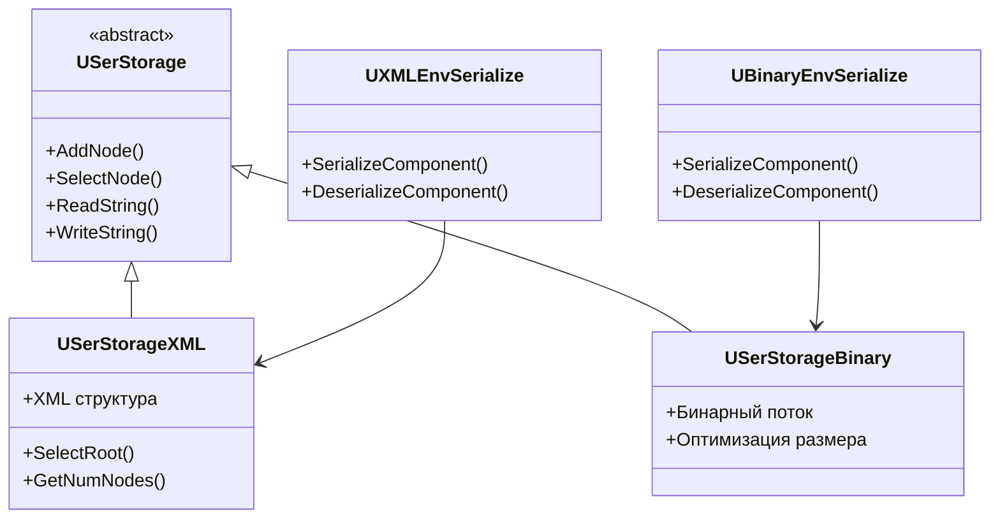
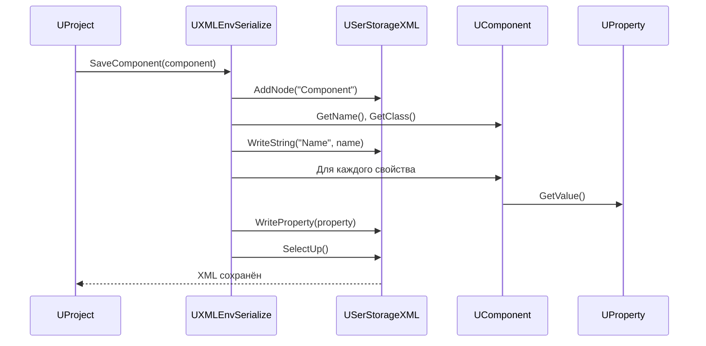
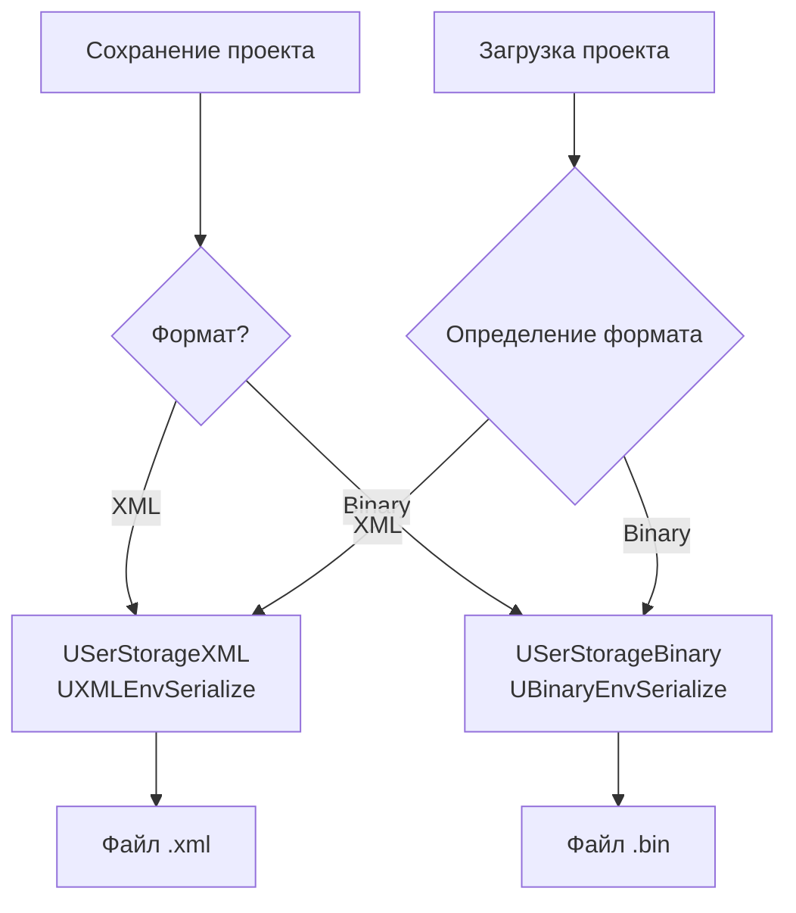

# Архитектура сериализации (Serialization Architecture)

## RU

### Обзор

Модуль `Rdk/Core/Serialize` предоставляет систему сериализации данных и компонентов в различных форматах.

### Основные компоненты

#### USerStorage

Базовое хранилище данных для сериализации.

**Основные функции:**
- Сохранение и загрузка данных
- Управление форматами сериализации

`USerStorage` является базовым интерфейсом для всех операций сериализации. Определяет методы для работы с узлами дерева данных, атрибутами и значениями, которые реализуются в `USerStorageXML` и `USerStorageBinary`.

**Иерархия классов сериализации:**



#### USerStorageXML

XML хранилище для человекочитаемого формата.

**Основные функции:**
- Сериализация в XML
- Десериализация из XML
- Валидация XML структуры

`USerStorageXML` реализует `USerStorage` для работы с XML‑документами. Использует древовидную структуру узлов (`SelectNode`, `AddNode`, `SelectUp`) и атрибутов (`SetNodeAttribute`, `GetNodeAttribute`). Поддерживает навигацию по дереву и чтение/запись значений в текстовом формате.

#### USerStorageBinary

Бинарное хранилище для эффективного хранения.

**Основные функции:**
- Бинарная сериализация
- Бинарная десериализация
- Оптимизация размера данных

`USerStorageBinary` реализует `USerStorage` для бинарного формата. Оптимизирован для быстрой загрузки и минимального размера файлов. Использует бинарные потоки для записи/чтения данных без преобразования в текстовый формат.

### Форматы сериализации

#### XML сериализация

Используется для:
- Конфигурационных файлов
- Проектов
- Человекочитаемых данных

**Пример структуры:**

```xml
<Component>
  <Name>MyComponent</Name>
  <Properties>
    <Property name="Value" type="double">42.0</Property>
  </Properties>
</Component>
```

#### Бинарная сериализация

Используется для:
- Эффективного хранения больших объемов данных
- Быстрой загрузки проектов
- Оптимизации производительности

### Сериализация компонентов

#### UXMLEnvSerialize

XML сериализация окружения и компонентов.

**Основные функции:**
- Сериализация компонентов в XML
- Сериализация контейнеров
- Сериализация сетей компонентов

`UXMLEnvSerialize` предоставляет перегрузки операторов `operator<<` и `operator>>` для сериализации типов движка (`UComponent`, `UContainer`, `UNet`, `UProperty`, `ULink`, `UIdVector` и др.) в `USerStorageXML`. Используется в `UProject::Save()` и `UProject::Load()` для сохранения/загрузки проектов.

**Процесс сериализации компонента:**



**Выбор формата сериализации:**



#### UBinaryEnvSerialize

Бинарная сериализация окружения и компонентов.

**Основные функции:**
- Бинарная сериализация компонентов
- Бинарная сериализация контейнеров
- Оптимизация размера

`UBinaryEnvSerialize` предоставляет перегрузки операторов для бинарной сериализации типов движка в `USerStorageBinary`. Используется для быстрой загрузки больших проектов и оптимизации использования дискового пространства. Процесс аналогичен XML‑сериализации, но данные записываются в бинарном формате без текстового представления.

### Сериализация свойств

Свойства компонентов автоматически сериализуются при сохранении компонента.

**Типы сериализуемых свойств:**
- Параметры (`ptParameter`)
- Состояния (`ptState`)
- Входы и выходы (`ptInput`, `ptOutput`)

Сериализация свойств происходит через перегрузку операторов в шаблонных классах `UProperty` и `UVProperty`. Каждый тип данных (int, double, string, vector, map и т.д.) имеет специализацию операторов `operator<<` и `operator>>` для `USerStorageXML` и `USerStorageBinary`. При сохранении компонента все его свойства, зарегистрированные в `PropertiesLookupTable`, последовательно сериализуются в соответствующий формат.

### См. также

- [Engine Architecture](Engine-Architecture.md)
- [Component System](../Guides/Component-System.md)
- [Rdk Core Overview](Overview.md)
- [Детальная документация Serialize](../Serialize-Detailed.md)
- [Руководство по сериализации](../Guides/Serialization-Guide.md)

---

## EN

### Overview

The `Rdk/Core/Serialize` module provides a serialization system for data and components in various formats.

### Main Components

#### USerStorage

Base data storage for serialization.

`USerStorage` is the base interface for all serialization operations. Defines methods for working with tree nodes, attributes, and values, which are implemented in `USerStorageXML` and `USerStorageBinary`.

#### USerStorageXML

XML storage for human-readable format.

`USerStorageXML` implements `USerStorage` for working with XML documents. Uses a tree structure of nodes (`SelectNode`, `AddNode`, `SelectUp`) and attributes (`SetNodeAttribute`, `GetNodeAttribute`). Supports tree navigation and reading/writing values in text format.

#### USerStorageBinary

Binary storage for efficient storage.

`USerStorageBinary` implements `USerStorage` for binary format. Optimized for fast loading and minimal file size. Uses binary streams for writing/reading data without conversion to text format.

### Serialization Formats

#### XML Serialization

Used for:
- Configuration files
- Projects
- Human-readable data

XML format is preferred for configuration files and projects that need to be edited manually or inspected by developers. The format is self-describing and supports validation.

#### Binary Serialization

Used for:
- Efficient storage of large data volumes
- Fast project loading
- Performance optimization

Binary format is used when performance and file size are critical. It requires less disk space and loads faster, but is not human-readable.

### Component Serialization

#### UXMLEnvSerialize

XML serialization of environment and components.

`UXMLEnvSerialize` provides operator overloads `operator<<` and `operator>>` for serializing engine types (`UComponent`, `UContainer`, `UNet`, `UProperty`, `ULink`, `UIdVector`, etc.) to `USerStorageXML`. Used in `UProject::Save()` and `UProject::Load()` for saving/loading projects.

#### UBinaryEnvSerialize

Binary serialization of environment and components.

`UBinaryEnvSerialize` provides operator overloads for binary serialization of engine types to `USerStorageBinary`. Used for fast loading of large projects and optimizing disk space usage.

### Property Serialization

Component properties are automatically serialized when saving a component.

Property serialization occurs through operator overloading in templated classes `UProperty` and `UVProperty`. Each data type (int, double, string, vector, map, etc.) has operator specialization `operator<<` and `operator>>` for `USerStorageXML` and `USerStorageBinary`. When saving a component, all its properties registered in `PropertiesLookupTable` are sequentially serialized to the appropriate format.

### See Also

- [Engine Architecture](Engine-Architecture.md)
- [Component System](../Guides/Component-System.md)
- [Rdk Core Overview](Overview.md)
