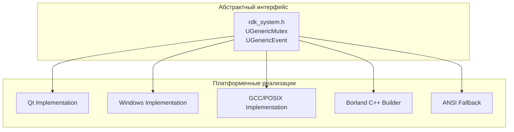
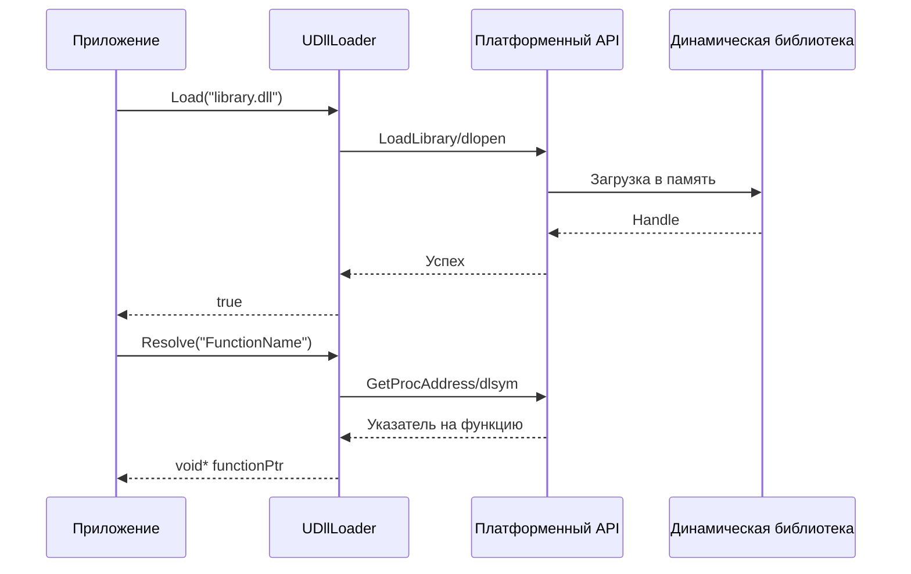
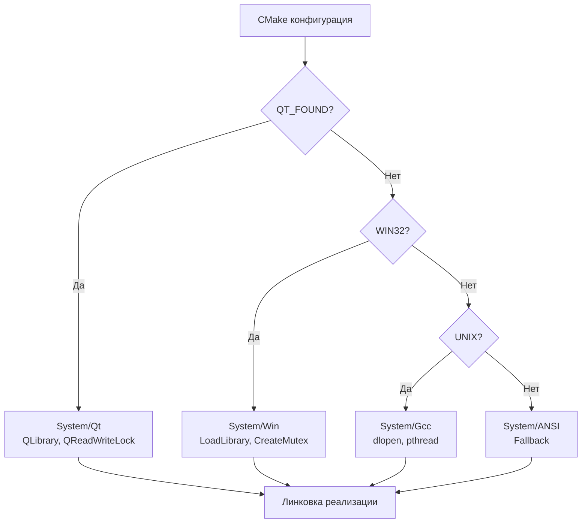

# Системные абстракции (System Platform Abstraction)

## RU

### Обзор

Модуль `Rdk/Core/System` предоставляет кроссплатформенные абстракции для системных операций, обеспечивая единый интерфейс для различных платформ.

### Архитектура абстракций



### Основные абстракции

#### rdk_system.h

Системные функции для файловых операций, времени, сна и загрузки библиотек.

**Основные функции:**
- `GetCurrentStartupTime()` - получение времени запуска
- `Sleep()` - задержка выполнения
- `CreateNewDirectory()` - создание директории
- `LoadLibrary()` - загрузка библиотеки
- `GetProcAddress()` - получение адреса функции

#### UGenericMutex

Универсальный мьютекс для синхронизации потоков.

**Реализации:**
- `Qt/UGenericMutex.qt.cpp` - на базе `QReadWriteLock`
- `Win/UGenericMutex.win.cpp` - на базе WinAPI `CreateMutex`
- `Gcc/UGenericMutex.gcc.cpp` - на базе `pthread_rwlock_t`
- `BCB/UGenericMutex.bcb.cpp` - для Borland C++ Builder
- `ANSI/` - fallback реализация

**Основные методы:**
- `exclusive_lock()` - эксклюзивная блокировка
- `shared_lock()` - разделяемая блокировка
- `unlock()` - разблокировка

#### UGenericEvent

Универсальное событие для синхронизации потоков.

**Реализации:**
- `Qt/UGenericEvent.qt.cpp` - на базе `QWaitCondition`
- `Win/UGenericEvent.win.cpp` - на базе WinAPI `CreateEvent`
- `Gcc/UGenericEvent.gcc.cpp` - на базе `pthread_cond_t`
- `BCB/UGenericEvent.bcb.cpp` - для Borland C++ Builder

**Основные методы:**
- `wait()` - ожидание события
- `signal()` - сигнализация события
- `reset()` - сброс события

#### UDllLoader

Загрузчик динамических библиотек (DLL/SO).

**Реализации:**
- `Qt/UDllLoader.qt.cpp` - на базе Qt (`QLibrary`)
- `Win/UDllLoader.win.cpp` - на базе WinAPI (`LoadLibraryA`, `GetProcAddress`)
- `Gcc/UDllLoader.gcc.cpp` - на базе POSIX (`dlopen`, `dlsym`)
- `BCB/UDllLoader.bcb.cpp` - для Borland C++ Builder

**Основные методы:**
- `Load()` - загрузка библиотеки
- `Resolve()` / `GetProcAddress()` - получение адреса функции
- `Unload()` - выгрузка библиотеки

**Процесс загрузки библиотеки:**



`UDllLoader` используется в `ULibrary` и `URuntimeLibrary` для загрузки библиотек компонентов во время выполнения. Фабрика `UCreateAndLoadDllLoader()` создаёт экземпляр загрузчика для конкретной платформы.

#### USharedMemoryLoader

Загрузчик разделяемой памяти.

**Реализации:**
- `Qt/USharedMemoryLoader.qt.cpp` - на базе Qt
- `Win/USharedMemoryLoader.win.cpp` - на базе WinAPI
- `Gcc/USharedMemoryLoader.gcc.cpp` - на базе POSIX shared memory

### Выбор реализации

Реализация выбирается на этапе сборки через CMake:

```cmake
# В CMakeLists.txt
if(QT_FOUND)
    add_subdirectory(System/Qt)
elseif(WIN32)
    add_subdirectory(System/Win)
elseif(UNIX)
    add_subdirectory(System/Gcc)
endif()
```

**Процесс выбора реализации:**



Каждая реализация предоставляет одинаковый интерфейс (`UGenericMutex`, `UGenericEvent`, `UDllLoader`), но использует нативные API платформы для оптимальной производительности.

### Использование абстракций

**Пример использования мьютекса:**

```cpp
// Создание мьютекса
UGenericMutex* mutex = UCreateMutex();

// Эксклюзивная блокировка
mutex->exclusive_lock();

// Критическая секция
// ...

// Разблокировка
mutex->unlock();
```

**Пример использования события:**

```cpp
// Создание события
UGenericEvent* event = UCreateEvent(false);

// В потоке 1: ожидание события
event->wait();

// В потоке 2: сигнализация события
event->signal();
```

### Преимущества абстракций

1. **Кроссплатформенность** - единый код работает на разных платформах
2. **Простота использования** - единый интерфейс для всех платформ
3. **Гибкость** - легко добавить поддержку новых платформ
4. **Производительность** - использование нативных API каждой платформы

### Поддерживаемые платформы

- **Linux** - через GCC/POSIX реализации
- **Windows** - через WinAPI реализации
- **Qt** - кроссплатформенная реализация на Qt
- **Borland C++ Builder** - для legacy приложений

### См. также

- [Cross-Platform Support](../../../Docs/Build-And-Deploy/Cross-Platform.md)
- [Rdk Core Overview](Overview.md)
- [Application Architecture](Application-Architecture.md)
- [Детальная документация System](../System-Detailed.md)

---

## EN

### Overview

The `Rdk/Core/System` module provides cross-platform abstractions for system operations, ensuring a unified interface for different platforms.

### Main Abstractions

#### rdk_system.h

System functions for file operations, time, sleep, and library loading.

#### UGenericMutex

Universal mutex for thread synchronization.

**Implementations:**
- `Qt/UGenericMutex.qt.cpp` - based on `QReadWriteLock`
- `Win/UGenericMutex.win.cpp` - based on WinAPI `CreateMutex`
- `Gcc/UGenericMutex.gcc.cpp` - based on `pthread_rwlock_t`
- `BCB/UGenericMutex.bcb.cpp` - for Borland C++ Builder

#### UGenericEvent

Universal event for thread synchronization.

**Implementations:**
- `Qt/UGenericEvent.qt.cpp` - based on `QWaitCondition`
- `Win/UGenericEvent.win.cpp` - based on WinAPI `CreateEvent`
- `Gcc/UGenericEvent.gcc.cpp` - based on `pthread_cond_t`

#### UDllLoader

Dynamic library loader (DLL/SO).

**Implementations:**
- `Qt/UDllLoader.qt.cpp` - based on Qt
- `Win/UDllLoader.win.cpp` - based on WinAPI
- `Gcc/UDllLoader.gcc.cpp` - based on `dlopen`

#### USharedMemoryLoader

Shared memory loader.

### Implementation Selection

Implementation is selected at build time through CMake.

### Using Abstractions

### Advantages of Abstractions

1. **Cross-platform** - single code works on different platforms
2. **Ease of use** - unified interface for all platforms
3. **Flexibility** - easy to add support for new platforms
4. **Performance** - uses native API of each platform

### Supported Platforms

- **Linux** - through GCC/POSIX implementations
- **Windows** - through WinAPI implementations
- **Qt** - cross-platform implementation on Qt
- **Borland C++ Builder** - for legacy applications

### See Also

- [Cross-Platform Support](../../../Docs/Build-And-Deploy/Cross-Platform.md)
- [Rdk Core Overview](Overview.md)
- [Application Architecture](Application-Architecture.md)


