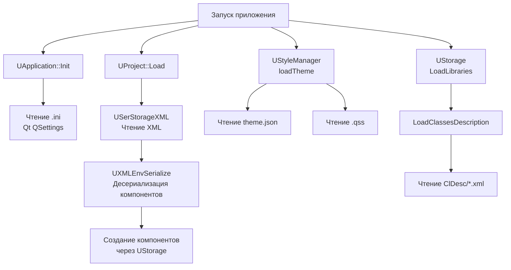
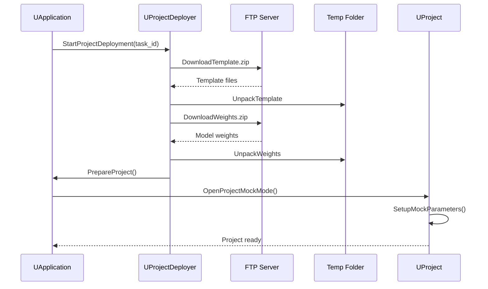
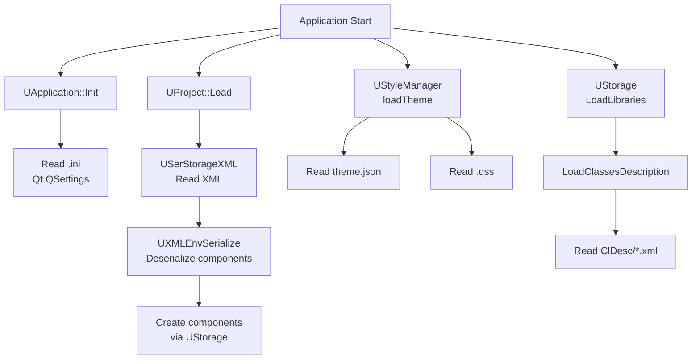

# Управление конфигурациями

## RU

### Назначение

Этот документ описывает работу с конфигурационными файлами в Rdk Core: загрузку проектов, чтение настроек приложения, деплой проектов.

### Модули, работающие с конфигурациями

#### UProject

**Назначение:** Загрузка и сохранение проектов из XML конфигураций.

**Расположение:** `Rdk/Core/Application/UProject.*`

**Основные методы:**
- `Load(path)` - загрузка проекта из XML файла
- `Save(path)` - сохранение проекта в XML файл
- `GetConfig()` - получение конфигурации проекта

**См. также:** [Application-Detailed.md](Application-Detailed.md) - детальная документация UProject

#### UXMLEnvSerialize

**Назначение:** Десериализация компонентов из XML.

**Расположение:** `Rdk/Core/Engine/UXMLEnvSerialize.*`

**Основные методы:**
- `DeserializeComponent(xml, storage)` - десериализация компонента из XML
- `SerializeComponent(component, xml)` - сериализация компонента в XML

**См. также:** [Serialize-Detailed.md](Serialize-Detailed.md) - детальная документация сериализации

#### UApplication

**Назначение:** Чтение настроек приложения из INI файлов.

**Расположение:** `Rdk/Core/Application/UApplication.*`

**Основные методы:**
- `Init(config_path)` - инициализация с загрузкой настроек из INI
- `GetSetting(key)` - получение настройки из конфигурации

**См. также:** [Application-Detailed.md](Application-Detailed.md) - детальная документация UApplication

#### UStyleManager

**Назначение:** Загрузка стилей из JSON файлов.

**Расположение:** `Rdk/GUI/Qt/UStyleManager.*`

**Основные методы:**
- `loadTheme(theme_path)` - загрузка темы из JSON файла
- `getColor(color_name)` - получение цвета из темы

**Примечание:** Стили хранятся в `Bin/Styles/`, но загружаются через классы из Rdk.

### Типы конфигурационных файлов

#### Проекты (`.xml`)

XML файлы, описывающие структуру проекта, компоненты и их связи.

**Чтение:**
- Через `UProject::Load()` - загрузка проекта
- Через `UXMLEnvSerialize` - десериализация компонентов

**Структура:**
```xml
<Project>
  <Name>MyProject</Name>
  <Components>
    <Component Name="Source" Class="UMatrixSource">
      <Properties>
        <Property Name="FileName" Type="string">data.csv</Property>
      </Properties>
    </Component>
  </Components>
</Project>
```

**См. также:** [Bin/Docs/Examples/Config-Example.md](../../Bin/Docs/Examples/Config-Example.md) - примеры конфигураций

#### Настройки приложения (`.ini`)

INI файлы с настройками приложения.

**Чтение:**
- Через `UApplication::Init()` - автоматическая загрузка при инициализации
- Через Qt `QSettings` - системные утилиты Qt

**Пример:**
```ini
[Application]
LogLevel=INFO
LogPath=/path/to/logs

[Project]
DefaultPath=/path/to/projects
```

#### Описания классов (`ClDesc/*.xml`)

XML файлы с метаданными о компонентах.

**Чтение:**
- Через `UStorage::LoadClassesDescription()` - автоматическая загрузка при загрузке библиотек

**См. также:** [Bin/Docs/Examples/ClDesc-Example.md](../../Bin/Docs/Examples/ClDesc-Example.md) - примеры ClDesc

### Процесс чтения конфигураций

**Поток чтения конфигураций:**



### Процесс деплоя проектов

`UProjectDeployer` используется для развертывания проектов на удалённые системы.

**Основные этапы:**

1. **Загрузка данных** (`StartProjectDeployment`):
   - Загрузка шаблонов, скриптов, весов моделей и данных с FTP сервера

2. **Распаковка**:
   - `DeployTemplate` - распаковка ZIP архивов шаблонов
   - `DeployScript` - распаковка скриптов
   - `DeployWeights` - распаковка весов моделей
   - `DeployData` - распаковка данных

3. **Подготовка проекта** (`PrepareProject`):
   - Копирование во временное хранилище
   - Открытие в mock режиме (`OpenProjectMockMode`)
   - Настройка путей и связей

**Процесс деплоя:**



**См. также:** [Application-Detailed.md](Application-Detailed.md) - детальная документация UProjectDeployer

### Примеры использования

#### Загрузка проекта

```cpp
#include "Rdk/Core/Application/UApplication.h"
#include "Rdk/Core/Application/UProject.h"

RDK::UApplication app;
app.Initialize();

// Загрузка проекта
if (app.OpenProject("Bin/Configs/MyProject.xml")) {
    RDK::UProject* project = app.GetProject();
    // Работа с проектом
}
```

#### Сохранение проекта

```cpp
// Сохранение текущего проекта
if (app.SaveProject()) {
    // Проект сохранен
}
```

#### Работа с настройками приложения

```cpp
// Инициализация с загрузкой настроек
RDK::UAppCore<...> app_core;
int result = app_core.Init(
    "application.exe",
    "config.ini",  // Путь к INI файлу
    "/path/to/logs",
    "username",
    argc,
    argv
);
```

### Связанная документация

- [Application-Detailed.md](Application-Detailed.md) - детальная документация модуля Application
- [Serialize-Detailed.md](Serialize-Detailed.md) - детальная документация сериализации
- [Project Management](Guides/Project-Management.md) - детальное руководство по управлению проектами
- [Bin/Docs/Configs-Structure.md](../../Bin/Docs/Configs-Structure.md) - структура конфигурационных файлов в Bin
- [Bin/Docs/Examples/Config-Example.md](../../Bin/Docs/Examples/Config-Example.md) - примеры конфигураций
- [Docs/Components-And-Configuration/Configuration-Files-Overview.md](../../Docs/Components-And-Configuration/Configuration-Files-Overview.md) - обзор конфигураций

---

## EN

### Purpose

This document describes working with configuration files in Rdk Core: loading projects, reading application settings, deploying projects.

### Modules Working with Configurations

#### UProject

**Purpose:** Loading and saving projects from XML configurations.

**Location:** `Rdk/Core/Application/UProject.*`

**Main Methods:**
- `Load(path)` - load project from XML file
- `Save(path)` - save project to XML file
- `GetConfig()` - get project configuration

**See Also:** [Application-Detailed.md](Application-Detailed.md) - detailed UProject documentation

#### UXMLEnvSerialize

**Purpose:** Deserializing components from XML.

**Location:** `Rdk/Core/Engine/UXMLEnvSerialize.*`

**Main Methods:**
- `DeserializeComponent(xml, storage)` - deserialize component from XML
- `SerializeComponent(component, xml)` - serialize component to XML

**See Also:** [Serialize-Detailed.md](Serialize-Detailed.md) - detailed serialization documentation

#### UApplication

**Purpose:** Reading application settings from INI files.

**Location:** `Rdk/Core/Application/UApplication.*`

**Main Methods:**
- `Init(config_path)` - initialization with loading settings from INI
- `GetSetting(key)` - get setting from configuration

**See Also:** [Application-Detailed.md](Application-Detailed.md) - detailed UApplication documentation

#### UStyleManager

**Purpose:** Loading styles from JSON files.

**Location:** `Rdk/GUI/Qt/UStyleManager.*`

**Main Methods:**
- `loadTheme(theme_path)` - load theme from JSON file
- `getColor(color_name)` - get color from theme

**Note:** Styles are stored in `Bin/Styles/`, but loaded through classes from Rdk.

### Configuration File Types

#### Projects (`.xml`)

XML files describing project structure, components, and their connections.

**Reading:**
- Via `UProject::Load()` - load project
- Via `UXMLEnvSerialize` - deserialize components

**Structure:**
```xml
<Project>
  <Name>MyProject</Name>
  <Components>
    <Component Name="Source" Class="UMatrixSource">
      <Properties>
        <Property Name="FileName" Type="string">data.csv</Property>
      </Properties>
    </Component>
  </Components>
</Project>
```

**See Also:** [Bin/Docs/Examples/Config-Example.md](../../Bin/Docs/Examples/Config-Example.md) - configuration examples

#### Application Settings (`.ini`)

INI files with application settings.

**Reading:**
- Via `UApplication::Init()` - automatic loading during initialization
- Via Qt `QSettings` - Qt system utilities

**Example:**
```ini
[Application]
LogLevel=INFO
LogPath=/path/to/logs

[Project]
DefaultPath=/path/to/projects
```

#### Class Descriptions (`ClDesc/*.xml`)

XML files with component metadata.

**Reading:**
- Via `UStorage::LoadClassesDescription()` - automatic loading when loading libraries

**See Also:** [Bin/Docs/Examples/ClDesc-Example.md](../../Bin/Docs/Examples/ClDesc-Example.md) - ClDesc examples

### Configuration Reading Process

**Configuration reading flow:**



### Project Deployment Process

`UProjectDeployer` is used to deploy projects to remote systems.

**Main Stages:**

1. **Data Loading** (`StartProjectDeployment`):
   - Download templates, scripts, model weights, and data from FTP server

2. **Unpacking**:
   - `DeployTemplate` - unpack ZIP archives of templates
   - `DeployScript` - unpack scripts
   - `DeployWeights` - unpack model weights
   - `DeployData` - unpack data

3. **Project Preparation** (`PrepareProject`):
   - Copy to temporary storage
   - Open in mock mode (`OpenProjectMockMode`)
   - Configure paths and connections

**Deployment Process:**


**See Also:** [Application-Detailed.md](Application-Detailed.md) - detailed UProjectDeployer documentation

### Usage Examples

#### Loading Project

```cpp
#include "Rdk/Core/Application/UApplication.h"
#include "Rdk/Core/Application/UProject.h"

RDK::UApplication app;
app.Initialize();

// Load project
if (app.OpenProject("Bin/Configs/MyProject.xml")) {
    RDK::UProject* project = app.GetProject();
    // Work with project
}
```

#### Saving Project

```cpp
// Save current project
if (app.SaveProject()) {
    // Project saved
}
```

#### Working with Application Settings

```cpp
// Initialize with loading settings
RDK::UAppCore<...> app_core;
int result = app_core.Init(
    "application.exe",
    "config.ini",  // Path to INI file
    "/path/to/logs",
    "username",
    argc,
    argv
);
```

### Related Documentation

- [Application-Detailed.md](Application-Detailed.md) - detailed Application module documentation
- [Serialize-Detailed.md](Serialize-Detailed.md) - detailed serialization documentation
- [Project Management](Guides/Project-Management.md) - детальное руководство по управлению проектами
- [Bin/Docs/Configs-Structure.md](../../Bin/Docs/Configs-Structure.md) - configuration file structure in Bin
- [Bin/Docs/Examples/Config-Example.md](../../Bin/Docs/Examples/Config-Example.md) - configuration examples
- [Docs/Components-And-Configuration/Configuration-Files-Overview.md](../../Docs/Components-And-Configuration/Configuration-Files-Overview.md) - configuration overview
