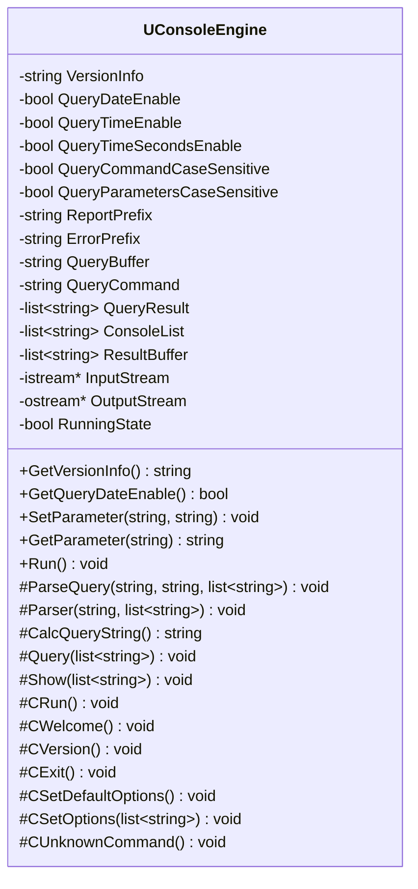
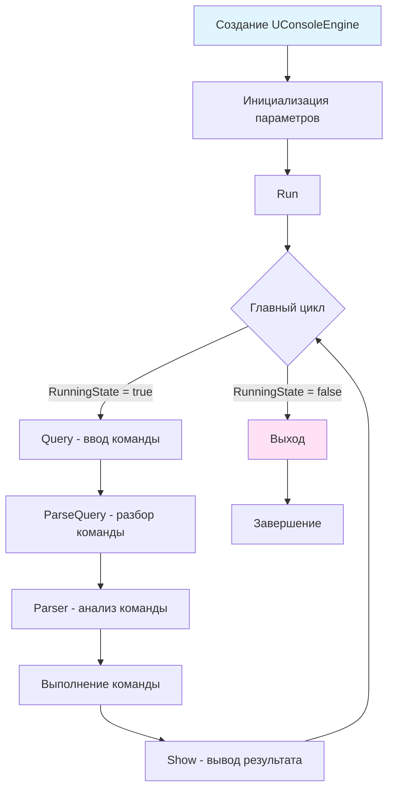
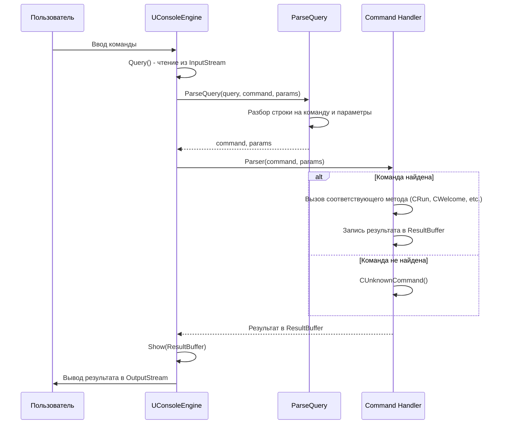
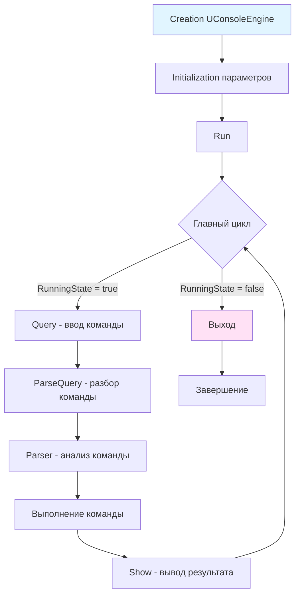

# Консольное приложение (Console Application)

## RU

### Обзор

Класс `UConsoleEngine` из модуля `Rdk/Core/Console/` предоставляет инфраструктуру для создания интерактивных консольных приложений с поддержкой команд, параметров и настраиваемого интерфейса.

### Архитектура

**Основные компоненты:**



### Жизненный цикл консоли



### Команды консоли

Консоль поддерживает следующие встроенные команды:

#### `run` - Запуск работы консоли

Запускает главный цикл консоли. Если консоль уже запущена, команда игнорируется.

**Использование:**
```
> run
```

#### `welcome` - Приветствие

Выводит приветственное сообщение консоли.

**Использование:**
```
> welcome
Welcome to console engine
```

#### `ver` - Версия

Выводит информацию о версии консоли.

**Использование:**
```
> ver
Console Engine v1.0.0
```

#### `exit` - Выход

Завершает работу консоли, устанавливая `RunningState = false`.

**Использование:**
```
> exit
...console closed.
```

#### `setd` - Восстановление настроек по умолчанию

Восстанавливает все параметры консоли к значениям по умолчанию.

**Использование:**
```
> setd
Default options restored
```

#### `set` - Установка параметров

Устанавливает значение параметра консоли.

**Синтаксис:**
```
set <parameter_name> <value>
```

**Доступные параметры:**

- `QueryDateEnable` - отображение даты в строке запроса (0/1)
- `QueryTimeEnable` - отображение времени в строке запроса (0/1)
- `QueryTimeSecondsEnable` - отображение секунд в строке запроса (0/1)
- `ReportPrefix` - префикс строки ответа
- `ErrorPrefix` - префикс строки сообщения об ошибке

**Примеры:**
```
> set QueryDateEnable 1
> set QueryTimeEnable 1
> set ReportPrefix "> "
> set ErrorPrefix "ERROR: "
```

### Обработка команд

**Процесс обработки команды:**



### Параметры консоли

#### QueryDateEnable

Разрешает отображение текущей даты в строке запроса.

**По умолчанию:** `false`

**Пример:**
```cpp
console.SetParameter("QueryDateEnable", "1");
// Строка запроса будет содержать дату: "2026.01.20 > "
```

#### QueryTimeEnable

Разрешает отображение текущего времени в строке запроса.

**По умолчанию:** `false`

**Пример:**
```cpp
console.SetParameter("QueryTimeEnable", "1");
// Строка запроса будет содержать время: "14:30 > "
```

#### QueryTimeSecondsEnable

Разрешает отображение секунд в строке запроса (работает только если `QueryTimeEnable = true`).

**По умолчанию:** `false`

**Пример:**
```cpp
console.SetParameter("QueryTimeEnable", "1");
console.SetParameter("QueryTimeSecondsEnable", "1");
// Строка запроса будет содержать время с секундами: "14:30:45 > "
```

#### QueryCommandCaseSensitive

Определяет, чувствительна ли команда к регистру символов.

**По умолчанию:** `true`

**Пример:**
```cpp
// Если QueryCommandCaseSensitive = true
> RUN    // команда не найдена
> run    // команда найдена

// Если QueryCommandCaseSensitive = false
> RUN    // команда найдена
> run    // команда найдена
```

#### QueryParametersCaseSensitive

Определяет, чувствительны ли параметры к регистру символов.

**По умолчанию:** `true`

#### ReportPrefix

Префикс, добавляемый перед строкой ответа консоли.

**По умолчанию:** пустая строка

**Пример:**
```cpp
console.SetParameter("ReportPrefix", "> ");
// Ответы будут выводиться с префиксом: "> Welcome to console engine"
```

#### ErrorPrefix

Префикс, добавляемый перед сообщением об ошибке.

**По умолчанию:** пустая строка

**Пример:**
```cpp
console.SetParameter("ErrorPrefix", "ERROR: ");
// Ошибки будут выводиться с префиксом: "ERROR: unknown command"
```

### Примеры использования

#### Базовое использование

```cpp
#include "Rdk/Core/Console/UConsoleEngine.h"

int main() {
    // Создание консоли
    RDK::UConsoleEngine console("Console Engine v1.0.0");
    
    // Настройка параметров
    std::string param = "QueryTimeEnable";
    std::string value = "1";
    console.SetParameter(param, value);
    
    // Запуск консоли
    console.Run();
    
    return 0;
}
```

#### Создание кастомных команд

Для добавления собственных команд необходимо наследоваться от `UConsoleEngine` и переопределить метод `Parser()`:

```cpp
#include "Rdk/Core/Console/UConsoleEngine.h"

class MyConsoleEngine : public RDK::UConsoleEngine {
public:
    MyConsoleEngine(const std::string& version) 
        : RDK::UConsoleEngine(version) {
    }
    
protected:
    // Переопределяем парсер для добавления новых команд
    virtual void Parser(const std::string& command, 
                       std::list<std::string>& params) override {
        // Проверяем кастомные команды
        if (command == "hello") {
            CHello(params);
            return;
        }
        
        if (command == "calc") {
            CCalc(params);
            return;
        }
        
        // Вызываем базовый парсер для стандартных команд
        RDK::UConsoleEngine::Parser(command, params);
    }
    
    // Кастомная команда hello
    virtual void CHello(std::list<std::string>& params) {
        std::string name = params.empty() ? "World" : params.front();
        ResultBuffer.push_back("Hello, " + name + "!");
    }
    
    // Кастомная команда calc
    virtual void CCalc(std::list<std::string>& params) {
        if (params.size() < 3) {
            ResultBuffer.push_back(GetUnknownParameterMSG());
            return;
        }
        
        std::string op = params.front();
        params.pop_front();
        
        double a = RDK::atof(params.front());
        params.pop_front();
        double b = RDK::atof(params.front());
        
        double result = 0.0;
        if (op == "+") {
            result = a + b;
        } else if (op == "-") {
            result = a - b;
        } else if (op == "*") {
            result = a * b;
        } else if (op == "/") {
            if (b != 0.0) {
                result = a / b;
            } else {
                ResultBuffer.push_back(CalcErrorMessage("Division by zero"));
                return;
            }
        } else {
            ResultBuffer.push_back(CalcErrorMessage("Unknown operator"));
            return;
        }
        
        ResultBuffer.push_back(RDK::sntoa(result));
    }
};

int main() {
    MyConsoleEngine console("My Console v1.0");
    console.Run();
    return 0;
}
```

**Использование кастомных команд:**
```
> hello
Hello, World!
> hello Alice
Hello, Alice!
> calc + 10 20
30
> calc / 100 4
25
```

#### Использование с файловыми потоками

Консоль может работать с любыми потоками ввода/вывода:

```cpp
#include "Rdk/Core/Console/UConsoleEngine.h"
#include <fstream>
#include <sstream>

// Консоль с файловым вводом
void RunConsoleFromFile(const std::string& input_file, 
                        const std::string& output_file) {
    std::ifstream input(input_file);
    std::ofstream output(output_file);
    
    RDK::UConsoleEngine console("Batch Console v1.0");
    
    // Установка потоков
    // Примечание: UConsoleEngine использует указатели на потоки,
    // поэтому потоки должны существовать во время работы консоли
    
    // Для работы с файлами нужно модифицировать UConsoleEngine
    // или создать обертку, которая управляет потоками
    
    console.Run();
}
```

#### Интеграция с движком

Пример интеграции консоли с `UEngine` для управления компонентами:

```cpp
#include "Rdk/Core/Console/UConsoleEngine.h"
#include "Rdk/Core/Engine/UEngine.h"

class EngineConsole : public RDK::UConsoleEngine {
private:
    RDK::UEngine* Engine;
    
public:
    EngineConsole(const std::string& version, RDK::UEngine* engine)
        : RDK::UConsoleEngine(version), Engine(engine) {
    }
    
protected:
    virtual void Parser(const std::string& command, 
                       std::list<std::string>& params) override {
        if (command == "start") {
            CStart();
            return;
        }
        
        if (command == "stop") {
            CStop();
            return;
        }
        
        if (command == "reset") {
            CReset();
            return;
        }
        
        if (command == "calculate") {
            CCalculate();
            return;
        }
        
        RDK::UConsoleEngine::Parser(command, params);
    }
    
    virtual void CStart() {
        if (Engine && Engine->Start()) {
            ResultBuffer.push_back("Engine started");
        } else {
            ResultBuffer.push_back(CalcErrorMessage("Failed to start engine"));
        }
    }
    
    virtual void CStop() {
        if (Engine && Engine->Stop()) {
            ResultBuffer.push_back("Engine stopped");
        } else {
            ResultBuffer.push_back(CalcErrorMessage("Failed to stop engine"));
        }
    }
    
    virtual void CReset() {
        if (Engine && Engine->Reset()) {
            ResultBuffer.push_back("Engine reset");
        } else {
            ResultBuffer.push_back(CalcErrorMessage("Failed to reset engine"));
        }
    }
    
    virtual void CCalculate() {
        if (Engine && Engine->Calculate()) {
            ResultBuffer.push_back("Calculation completed");
        } else {
            ResultBuffer.push_back(CalcErrorMessage("Calculation failed"));
        }
    }
};

int main() {
    RDK::UEngine engine;
    // ... инициализация движка ...
    
    EngineConsole console("Engine Console v1.0", &engine);
    console.Run();
    
    return 0;
}
```

### Формат строки запроса

Строка запроса формируется методом `CalcQueryString()` и может содержать:

1. Дата (если `QueryDateEnable = true`): `YYYY.MM.DD `
2. Время (если `QueryTimeEnable = true`): `HH:MM` или `HH:MM:SS` (если `QueryTimeSecondsEnable = true`)
3. Префикс ответа (`ReportPrefix`)
4. Курсор ввода

**Примеры форматов:**

```
>                                    // Базовый формат
2026.01.20 >                        // С датой
14:30 >                             // С временем
2026.01.20 14:30:45 >               // С датой и временем с секундами
[Console] >                         // С кастомным префиксом
```

### Обработка исключений

Консоль имеет встроенную обработку исключений через метод `ProcessingException()`. При возникновении исключения в процессе выполнения команды вызывается этот метод, который может логировать ошибку или выполнять другие действия.

**Пример обработки исключений:**

```cpp
class SafeConsoleEngine : public RDK::UConsoleEngine {
protected:
    virtual void ProcessingException(void) override {
        ResultBuffer.push_back(CalcErrorMessage("Exception occurred"));
        // Дополнительная обработка исключений
    }
};
```

### Расширение функциональности

Для расширения функциональности консоли рекомендуется:

1. **Наследование от UConsoleEngine** - создание производного класса
2. **Переопределение Parser()** - добавление новых команд
3. **Переопределение методов сообщений** - кастомизация текстов сообщений
4. **Добавление кастомных параметров** - расширение системы параметров через `GetParameter()` и `SetParameter()`

### См. также

- [Application Architecture](Architecture/Application-Architecture.md) - архитектура приложения
- [Engine Architecture](Architecture/Engine-Architecture.md) - архитектура движка

---

## EN

### Overview

The `UConsoleEngine` class from the `Rdk/Core/Console/` module provides infrastructure for creating interactive console applications with command support, parameters, and customizable interface.

### Architecture

**Main Components:**

The console engine consists of command parser, parameter management, input/output streams, and command handlers.

### Console Commands

The console supports the following built-in commands:

#### `run` - Start Console

Starts the main console loop.

#### `welcome` - Welcome Message

Displays welcome message.

#### `ver` - Version

Displays console version information.

#### `exit` - Exit

Terminates the console by setting `RunningState = false`.

#### `setd` - Reset Default Options

Restores all console parameters to default values.

#### `set` - Set Parameter

Sets a console parameter value.

**Syntax:**
```
set <parameter_name> <value>
```

**Available Parameters:**

- `QueryDateEnable` - display date in query string (0/1)
- `QueryTimeEnable` - display time in query string (0/1)
- `QueryTimeSecondsEnable` - display seconds in query string (0/1)
- `ReportPrefix` - response string prefix
- `ErrorPrefix` - error message prefix

### Command Processing

**Command Processing Flow:**

The console processes commands through parsing, analysis, and execution stages.

### Usage Examples

#### Basic Usage

```cpp
#include "Rdk/Core/Console/UConsoleEngine.h"

int main() {
    RDK::UConsoleEngine console("Console Engine v1.0.0");
    console.SetParameter("QueryTimeEnable", "1");
    console.Run();
    return 0;
}
```

#### Custom Commands

To add custom commands, inherit from `UConsoleEngine` and override `Parser()`:

```cpp
class MyConsoleEngine : public RDK::UConsoleEngine {
protected:
    virtual void Parser(const std::string& command, 
                       std::list<std::string>& params) override {
        if (command == "hello") {
            CHello(params);
            return;
        }
        RDK::UConsoleEngine::Parser(command, params);
    }
    
    virtual void CHello(std::list<std::string>& params) {
        std::string name = params.empty() ? "World" : params.front();
        ResultBuffer.push_back("Hello, " + name + "!");
    }
};
```

### Query String Format

The query string is formed by `CalcQueryString()` and may contain:

1. Date (if `QueryDateEnable = true`): `YYYY.MM.DD `
2. Time (if `QueryTimeEnable = true`): `HH:MM` or `HH:MM:SS` (if `QueryTimeSecondsEnable = true`)
3. Response prefix (`ReportPrefix`)
4. Input cursor

### Exception Handling

The console has built-in exception handling through `ProcessingException()` method.

### Extending Functionality

To extend console functionality:

1. Inherit from `UConsoleEngine`
2. Override `Parser()` to add new commands
3. Override message methods for customization
4. Add custom parameters through `GetParameter()` and `SetParameter()`

### See Also

- [Application Architecture](../../Docs/Rdk-Core/Application-Architecture.md) - application architecture
- [Engine Architecture](../../Docs/Rdk-Core/Engine-Architecture.md) - engine architecture





