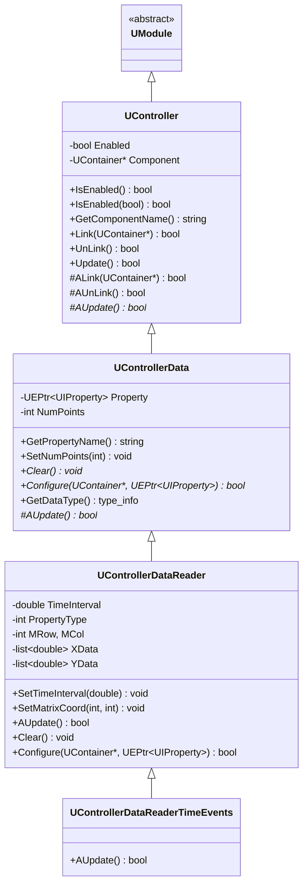
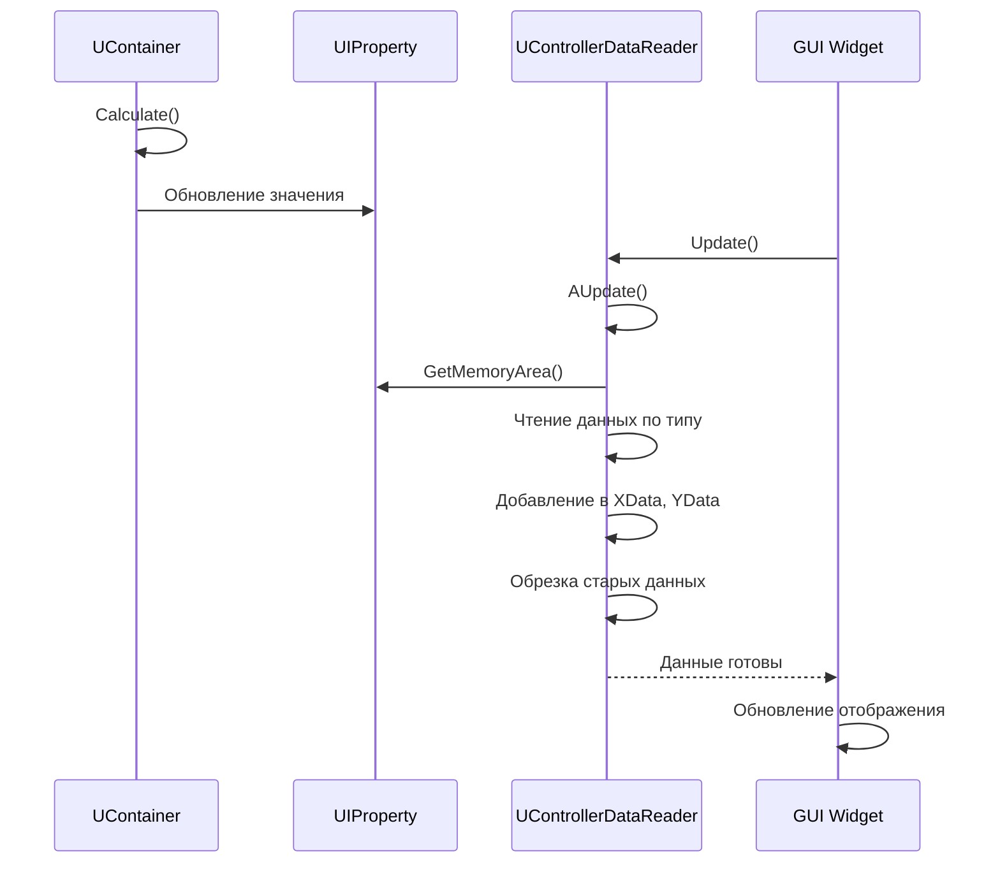
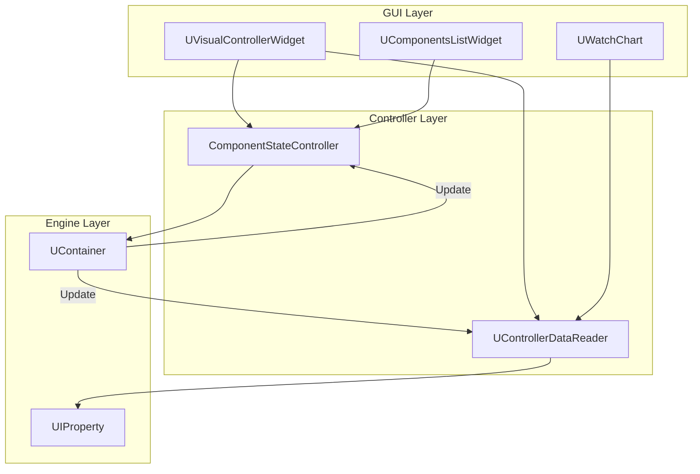
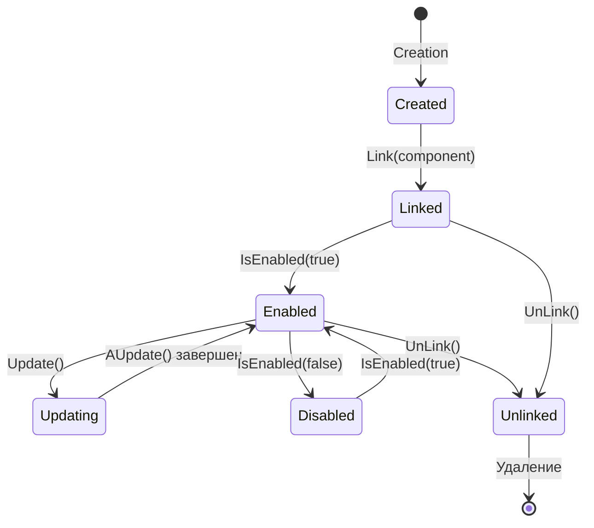
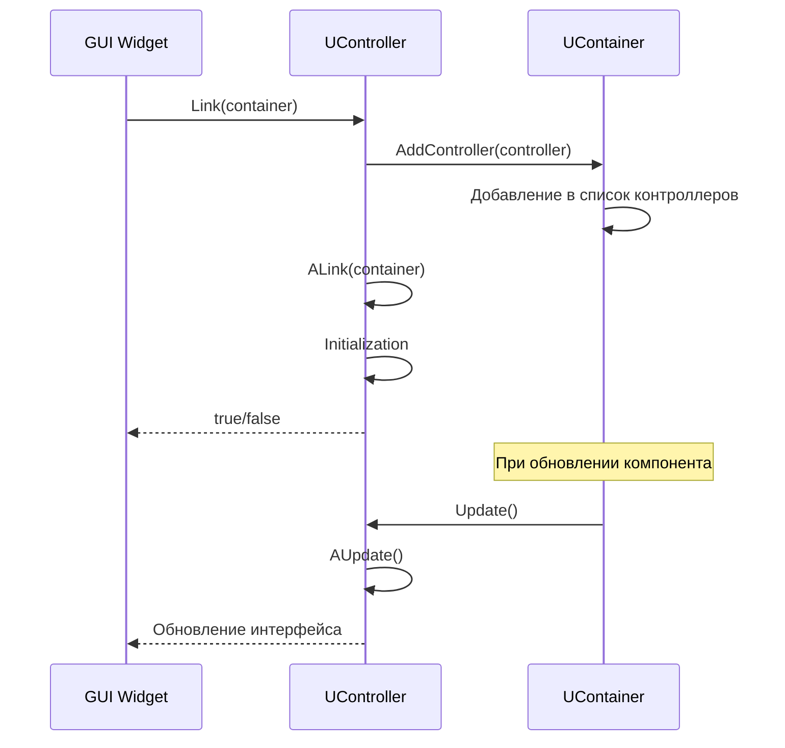

# Система контроллеров (Controllers System)

## RU

### Обзор

Система контроллеров (`UController`) обеспечивает связь между компонентами (`UContainer`) и интерфейсом пользователя (GUI виджеты). Контроллеры позволяют отслеживать изменения свойств компонентов и обновлять интерфейс в реальном времени.

### Архитектура

**Иерархия контроллеров:**



### Основные классы

#### UController - Базовый класс контроллеров

Базовый класс для всех контроллеров, обеспечивающий связь между компонентами и интерфейсом.

**Основные методы:**

- `Link(UContainer*)` - связывает контроллер с компонентом
- `UnLink()` - отвязывает контроллер от компонента
- `Update()` - обновляет интерфейс (вызывает `AUpdate()` если `Enabled = true`)
- `IsEnabled()` / `IsEnabled(bool)` - управление состоянием контроллера
- `GetComponentName()` - получение имени связанного компонента

**Жизненный цикл контроллера:**


**Примеры использования:**

```cpp
#include "Rdk/Core/Engine/UController.h"

// Создание базового контроллера
class MyController : public RDK::UController {
protected:
    virtual bool AUpdate(void) override {
        if (!Component) return false;
        
        // Обновление интерфейса на основе состояния компонента
        std::string component_name = GetComponentName();
        std::cout << "Component: " << component_name << " updated" << std::endl;
        
        return true;
    }
    
    virtual bool ALink(RDK::UContainer* component) override {
        // Дополнительная инициализация при связывании
        std::cout << "Controller linked to: " << component->GetName() << std::endl;
        return true;
    }
    
    virtual bool AUnLink(bool forchilds) override {
        // Очистка при отвязывании
        std::cout << "Controller unlinked" << std::endl;
        return true;
    }
};

// Использование контроллера
RDK::UContainer* component = /* получение компонента */;
MyController controller;

// Связывание с компонентом
if (controller.Link(component)) {
    controller.IsEnabled(true);
    
    // Обновление интерфейса
    controller.Update();
    
    // Отвязывание
    controller.UnLink();
}
```

#### UControllerData - Точки съема данных

Базовый класс для контроллеров, которые читают данные из свойств компонентов.

**Основные возможности:**

- Связь с конкретным свойством (`UEPtr<UIProperty>`)
- Хранение истории данных (`NumPoints`)
- Настройка через `Configure()`

**Примеры использования:**

```cpp
#include "Rdk/Core/Engine/UController.h"

// Создание контроллера для чтения данных
class PropertyMonitorController : public RDK::UControllerData {
protected:
    virtual bool AUpdate(void) override {
        if (!Property) return false;
        
        // Чтение данных из свойства
        std::string prop_name = GetPropertyName();
        std::cout << "Property " << prop_name << " updated" << std::endl;
        
        return true;
    }
    
    virtual void Clear(void) override {
        // Очистка хранимых данных
    }
    
    virtual bool Configure(RDK::UContainer* container, 
                          RDK::UEPtr<RDK::UIProperty> property) override {
        // Настройка контроллера
        if (!container || !property) return false;
        
        if (!Link(container)) return false;
        
        Property = property;
        SetNumPoints(100); // хранить последние 100 точек
        
        return true;
    }
};
```

#### UControllerDataReader - Чтение данных из свойств

Конкретная реализация контроллера для чтения числовых данных из свойств компонентов с поддержкой различных типов данных.

**Поддерживаемые типы свойств:**

- `1` - `double` (простое свойство)
- `2` - `int` (простое свойство)
- `3` - `MDMatrix<double>` (матрица)
- `4` - `MDMatrix<int>` (матрица)
- `5` - `MDVector<double>` (вектор)
- `6` - `MDVector<int>` (вектор)

**Основные возможности:**

- Хранение временных рядов данных (`XData`, `YData`)
- Настройка временного интервала (`SetTimeInterval()`)
- Работа с элементами матриц (`SetMatrixCoord()`)

**Процесс обновления данных:**



**Примеры использования:**

```cpp
#include "Rdk/Core/Engine/UController.h"
#include "Rdk/Core/Engine/UEnvironment.h"

// Регистрация контроллера через UEnvironment
RDK::UELockPtr<RDK::UEnvironment> env = RDK::GetEnvironmentLock();
if (env) {
    // Регистрация контроллера для чтения свойства компонента
    RDK::UControllerDataReader* reader = env->RegisterDataReader(
        "ComponentName",      // имя компонента
        "OutputProperty",     // имя свойства
        0,                    // индекс строки матрицы (если матрица)
        0                     // индекс столбца матрицы (если матрица)
    );
    
    if (reader) {
        // Настройка временного интервала (в секундах)
        reader->SetTimeInterval(10.0); // хранить данные за последние 10 секунд
        
        // Для матричных свойств - указание координат
        reader->SetMatrixCoord(0, 0); // элемент (0, 0) матрицы
        
        // Включение контроллера
        reader->IsEnabled(true);
    }
}

// Получение данных из контроллера
RDK::UControllerDataReader* reader = env->GetDataReader(
    "ComponentName",
    "OutputProperty",
    0, 0
);

if (reader) {
    // Получение временных рядов
    std::list<double>& x_data = reader->XData; // временные метки
    std::list<double>& y_data = reader->YData; // значения
    
    // Использование данных для отображения
    for (auto it_x = x_data.begin(), it_y = y_data.begin();
         it_x != x_data.end() && it_y != y_data.end();
         ++it_x, ++it_y) {
        double time = *it_x;
        double value = *it_y;
        // Добавление точки на график
    }
}
```

**Использование в GUI виджетах:**

```cpp
// Пример из UWatchChart - создание серии графика
void UWatchChart::createSerie(int channelIndex, 
                              const QString componentName, 
                              const QString propertyName,
                              const QString type, 
                              int jx, int jy, 
                              double time_interval, 
                              double y_shift) {
    // Создание серии графика
    series.push_back(new UWatchSerie());
    chart->addSeries(series.last());
    
    // Регистрация контроллера для чтения данных
    RDK::UELockPtr<RDK::UEnvironment> env = RDK::GetEnvironmentLock();
    
    RDK::UControllerDataReader* data_reader = env->RegisterDataReader(
        componentName.toStdString(),
        propertyName.toStdString(),
        jx,  // координата X матрицы
        jy   // координата Y матрицы
    );
    
    if (data_reader) {
        series.last()->data_reader = data_reader;
        data_reader->SetTimeInterval(time_interval);
        data_reader->IsEnabled(true);
    }
}

// Обновление данных серии
void UWatchChart::updateSerieData(UWatchSerie* serie) {
    if (!serie || !serie->data_reader) return;
    
    // Обновление контроллера
    serie->data_reader->Update();
    
    // Получение данных
    std::list<double>& x_data = serie->data_reader->XData;
    std::list<double>& y_data = serie->data_reader->YData;
    
    // Обновление графика
    QVector<QPointF> points;
    auto it_x = x_data.begin();
    auto it_y = y_data.begin();
    
    for (; it_x != x_data.end() && it_y != y_data.end(); ++it_x, ++it_y) {
        points.append(QPointF(*it_x, *it_y + serie->YShift));
    }
    
    serie->replace(points);
}
```

#### UControllerDataReaderTimeEvents - События по времени

Специализированный контроллер для чтения временных событий из матрицы, где события хранятся в нулевой строке.

**Примеры использования:**

```cpp
// Использование для событий
RDK::UControllerDataReaderTimeEvents* events_reader = 
    new RDK::UControllerDataReaderTimeEvents();

RDK::UEPtr<RDK::UIProperty> events_property = 
    component->FindProperty("Events");

if (events_property && events_reader->Configure(component, events_property)) {
    events_reader->IsEnabled(true);
    
    // Обновление данных
    events_reader->Update();
    
    // Получение временных меток событий
    std::list<double>& event_times = events_reader->XData;
}
```

### Управление контроллерами в UContainer

Контейнеры управляют списком контроллеров через методы `AddController()` и `DelController()`. При обновлении компонента вызывается `Update()` для всех связанных контроллеров.

**Процесс связывания контроллера:**


**Примеры управления контроллерами:**

```cpp
// Контейнер автоматически вызывает Update() для всех контроллеров
RDK::UContainer* container = /* получение контейнера */;

// Создание контроллера
MyController* controller = new MyController();

// Связывание (контейнер автоматически добавляет контроллер в список)
controller->Link(container);

// При обновлении компонента все контроллеры обновляются автоматически
container->UpdateControllers(); // внутренний метод контейнера

// Отвязывание (контейнер автоматически удаляет контроллер из списка)
controller->UnLink();
```

### Создание кастомных контроллеров

#### Пример: Контроллер для мониторинга состояния компонента

```cpp
#include "Rdk/Core/Engine/UController.h"
#include "Rdk/Core/Engine/UContainer.h"

class ComponentStateController : public RDK::UController {
private:
    bool last_ready_state;
    int last_calculation_count;
    
public:
    ComponentStateController() 
        : last_ready_state(false), last_calculation_count(0) {
    }
    
protected:
    virtual bool ALink(RDK::UContainer* component) override {
        if (!component) return false;
        
        // Инициализация состояния
        last_ready_state = component->IsReady();
        last_calculation_count = component->GetCalculationCount();
        
        return true;
    }
    
    virtual bool AUpdate(void) override {
        if (!Component) return false;
        
        // Проверка изменений состояния
        bool current_ready = Component->IsReady();
        int current_count = Component->GetCalculationCount();
        
        if (current_ready != last_ready_state) {
            std::cout << "Component ready state changed: " 
                      << (current_ready ? "Ready" : "Not Ready") << std::endl;
            last_ready_state = current_ready;
        }
        
        if (current_count != last_calculation_count) {
            std::cout << "Calculation count: " << current_count << std::endl;
            last_calculation_count = current_count;
        }
        
        return true;
    }
    
    virtual bool AUnLink(bool forchilds) override {
        last_ready_state = false;
        last_calculation_count = 0;
        return true;
    }
};
```

#### Пример: Контроллер для чтения строковых данных

```cpp
class StringPropertyController : public RDK::UControllerData {
private:
    std::list<std::string> history;
    int max_history_size;
    
public:
    StringPropertyController(int max_size = 100) 
        : max_history_size(max_size) {
    }
    
protected:
    virtual bool AUpdate(void) override {
        if (!Property) return false;
        
        // Чтение строкового значения
        // Примечание: требует знания типа свойства
        const std::string* str_data = 
            reinterpret_cast<const std::string*>(Property->GetMemoryArea());
        
        if (str_data) {
            history.push_back(*str_data);
            
            // Ограничение размера истории
            if (history.size() > max_history_size) {
                history.pop_front();
            }
            
            std::cout << "Property updated: " << *str_data << std::endl;
        }
        
        return true;
    }
    
    virtual void Clear(void) override {
        history.clear();
    }
    
    virtual bool Configure(RDK::UContainer* container, 
                          RDK::UEPtr<RDK::UIProperty> property) override {
        if (!container || !property) return false;
        
        // Проверка типа свойства
        if (property->GetLanguageType() != typeid(std::string)) {
            return false;
        }
        
        if (!Link(container)) return false;
        
        Property = property;
        return true;
    }
    
    // Получение истории значений
    const std::list<std::string>& GetHistory() const {
        return history;
    }
};
```

### Интеграция с GUI виджетами

Контроллеры интегрируются с GUI виджетами через `UVisualControllerWidget` - базовый класс для виджетов, которые обновляются на основе состояния компонентов.

**Схема интеграции:**



**Пример виджета с контроллером:**

```cpp
#include "Rdk/GUI/Qt/UVisualControllerWidget.h"
#include "Rdk/Core/Engine/UController.h"

class PropertyDisplayWidget : public UVisualControllerWidget {
    Q_OBJECT
    
private:
    QLabel* value_label;
    RDK::UControllerDataReader* data_reader;
    
public:
    PropertyDisplayWidget(QWidget* parent, RDK::UApplication* app)
        : UVisualControllerWidget(parent, app), data_reader(nullptr) {
        value_label = new QLabel(this);
        layout()->addWidget(value_label);
        
        UpdateInterval = 100; // обновление каждые 100 мс
    }
    
    void SetProperty(const QString& component_name, const QString& property_name) {
        // Отвязывание старого контроллера
        if (data_reader) {
            data_reader->UnLink();
            data_reader = nullptr;
        }
        
        // Регистрация нового контроллера
        RDK::UELockPtr<RDK::UEnvironment> env = RDK::GetEnvironmentLock();
        if (env) {
            data_reader = env->RegisterDataReader(
                component_name.toStdString(),
                property_name.toStdString(),
                0, 0
            );
            
            if (data_reader) {
                data_reader->SetTimeInterval(1.0);
                data_reader->IsEnabled(true);
            }
        }
    }
    
protected:
    virtual void AUpdateInterface() override {
        if (!data_reader) return;
        
        // Обновление данных контроллера
        data_reader->Update();
        
        // Получение последнего значения
        if (!data_reader->YData.empty()) {
            double last_value = data_reader->YData.back();
            value_label->setText(QString::number(last_value));
        }
    }
};
```

### Best Practices

1. **Всегда проверяйте указатели** - перед использованием `Component` или `Property` проверяйте их на `nullptr`
2. **Управление жизненным циклом** - контроллеры должны быть отвязаны перед удалением
3. **Оптимизация обновлений** - используйте `Enabled` флаг для временного отключения обновлений
4. **Ограничение размера данных** - для контроллеров данных используйте `SetNumPoints()` или `SetTimeInterval()` для ограничения памяти
5. **Потокобезопасность** - контроллеры могут вызываться из разных потоков, учитывайте это при реализации `AUpdate()`

### См. также

- [Engine Architecture](Architecture/Engine-Architecture.md) - архитектура движка и компонентов
- [GUI Widgets Reference](../../Docs/GUI/Widgets-Reference.md) - GUI виджеты
- [Property System](Diagrams/Property-System.md) - система свойств

---

## EN

### Overview

The controller system (`UController`) provides connection between components (`UContainer`) and user interface (GUI widgets). Controllers allow tracking property changes and updating the interface in real-time.

### Architecture

**Controller Hierarchy:**

The controller system follows a hierarchical structure with base `UController` class and specialized data reading controllers.

### Main Classes

#### UController - Base Controller Class

Base class for all controllers, providing connection between components and interface.

**Main Methods:**

- `Link(UContainer*)` - link controller to component
- `UnLink()` - unlink controller from component
- `Update()` - update interface (calls `AUpdate()` if `Enabled = true`)
- `IsEnabled()` / `IsEnabled(bool)` - manage controller state
- `GetComponentName()` - get linked component name

**Usage Examples:**

```cpp
#include "Rdk/Core/Engine/UController.h"

class MyController : public RDK::UController {
protected:
    virtual bool AUpdate(void) override {
        if (!Component) return false;
        // Update interface based on component state
        return true;
    }
};

RDK::UContainer* component = /* get component */;
MyController controller;
controller.Link(component);
controller.IsEnabled(true);
controller.Update();
```

#### UControllerData - Data Sampling Points

Base class for controllers that read data from component properties.

**Main Features:**

- Link to specific property (`UEPtr<UIProperty>`)
- Data history storage (`NumPoints`)
- Configuration through `Configure()`

#### UControllerDataReader - Property Data Reader

Concrete implementation for reading numeric data from component properties with support for various data types.

**Supported Property Types:**

- `1` - `double` (simple property)
- `2` - `int` (simple property)
- `3` - `MDMatrix<double>` (matrix)
- `4` - `MDMatrix<int>` (matrix)
- `5` - `MDVector<double>` (vector)
- `6` - `MDVector<int>` (vector)

**Usage Examples:**

```cpp
RDK::UELockPtr<RDK::UEnvironment> env = RDK::GetEnvironmentLock();
RDK::UControllerDataReader* reader = env->RegisterDataReader(
    "ComponentName",
    "OutputProperty",
    0, 0
);

if (reader) {
    reader->SetTimeInterval(10.0);
    reader->IsEnabled(true);
    
    // Get data
    std::list<double>& x_data = reader->XData;
    std::list<double>& y_data = reader->YData;
}
```

### Controller Management in UContainer

Containers manage controller lists through `AddController()` and `DelController()` methods. When a component is updated, `Update()` is called for all linked controllers.

### Creating Custom Controllers

To create custom controllers:

1. Inherit from `UController` or `UControllerData`
2. Override `AUpdate()` for update logic
3. Override `ALink()` and `AUnLink()` for initialization/cleanup
4. Implement `Configure()` for data controllers

### Integration with GUI Widgets

Controllers integrate with GUI widgets through `UVisualControllerWidget` - base class for widgets that update based on component state.

### Best Practices

1. Always check pointers before using `Component` or `Property`
2. Manage lifecycle - controllers should be unlinked before deletion
3. Optimize updates - use `Enabled` flag to temporarily disable updates
4. Limit data size - use `SetNumPoints()` or `SetTimeInterval()` for data controllers
5. Thread safety - controllers may be called from different threads

### See Also

- [Engine Architecture](../../Docs/Rdk-Core/Engine-Architecture.md) - engine and component architecture
- [GUI Widgets Reference](../../Docs/GUI/Widgets-Reference.md) - GUI widgets
- [Property System](Diagrams/Property-System.md) - property system








