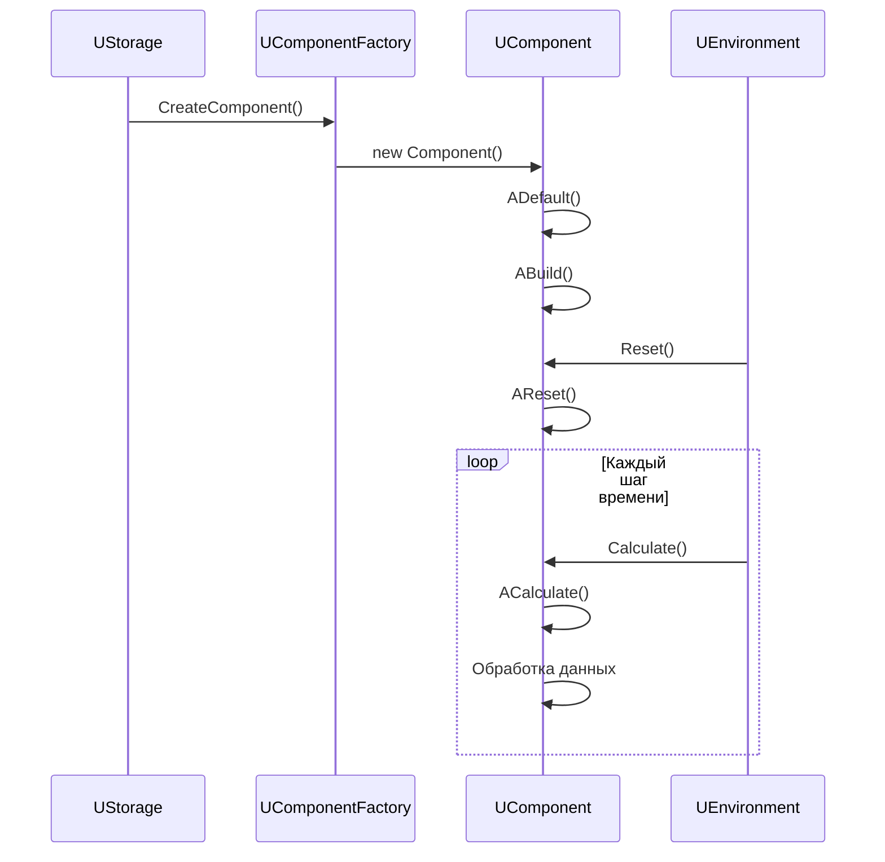

# Жизненный цикл компонента

## RU

### Диаграмма состояний

```mermaid
stateDiagram-v2
    [*] --> Created: Создание компонента
    Created --> Default: ADefault()
    Default --> Built: ABuild()
    Built --> Ready: Готов к работе
    Ready --> Reset: AReset()
    Reset --> Calculate: ACalculate()
    Calculate --> Calculate: Повтор вычислений
    Calculate --> Reset: Новый цикл
    Ready --> [*]: Удаление компонента
    
    Built --> Error: Ошибка сборки
    Calculate --> Error: Ошибка вычисления
    Error --> [*]: Удаление
```

### Последовательность методов



---

## EN

### State Diagram

### Method Sequence
