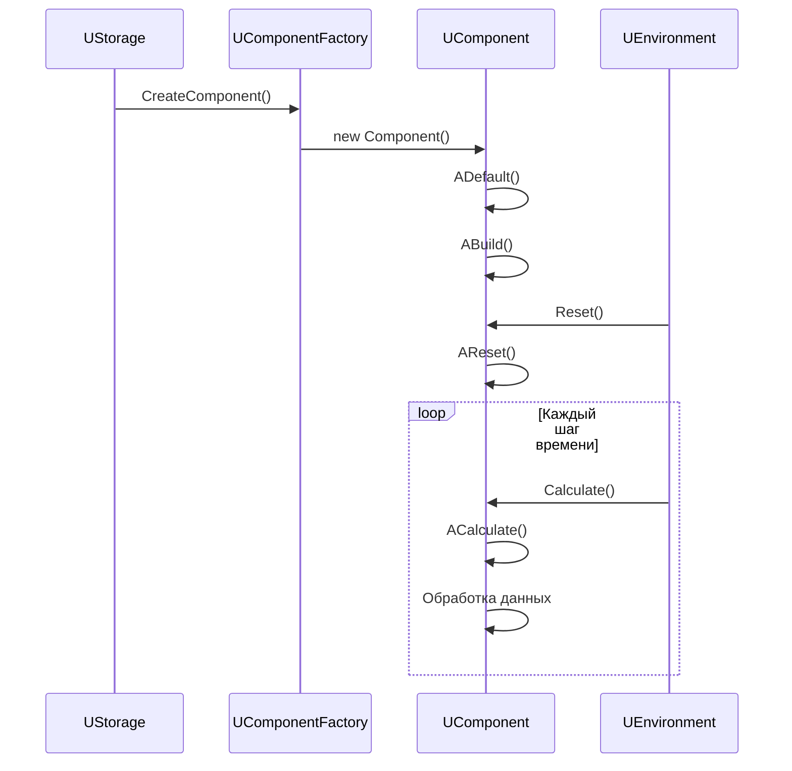

# Жизненный цикл компонента

## RU

### Диаграмма состояний

Диаграмма ниже отражает, как методы `ADefault()`, `ABuild()`, `AReset()`, `ACalculate()` и обработка ошибок формируют жизненный цикл любого наследника `UComponent`. Она соответствует тому, как базовый класс компонента вызывается из контейнеров и окружения (`UEnvironment`), и полезна для понимания того, в каком порядке и при каких условиях должен инициализироваться и работать компонент.

```mermaid
stateDiagram-v2
    [*] --> Created: Создание компонента
    Created --> Default: ADefault()
    Default --> Built: ABuild()
    Built --> Ready: Готов к работе
    Ready --> Reset: AReset()
    Reset --> Calculate: ACalculate()
    Calculate --> Calculate: Повтор вычислений
    Calculate --> Reset: Новый цикл
    Ready --> [*]: Удаление компонента
    
    Built --> Error: Ошибка сборки
    Calculate --> Error: Ошибка вычисления
    Error --> [*]: Удаление
```

### Последовательность методов

Эта диаграмма показывает, какие объекты задействованы при создании и выполнении компонента:
- `UStorage` и `UComponentFactory` отвечают за создание экземпляра,
- сам `UComponent` внутри себя вызывает `ADefault()` и `ABuild()`,
- окружение `UEnvironment` управляет вызовами `Reset/Calculate` на каждом шаге времени.



---

## EN

### State Diagram

The state diagram above represents how `ADefault()`, `ABuild()`, `AReset()`, `ACalculate()` and error handling form the lifecycle of any `UComponent` descendant. It follows the way base lifecycle methods are invoked by containers and the environment (`UEnvironment`), and helps to reason about when a component must be initialized, built, reset and destroyed.

### Method Sequence

The sequence diagram shows which objects are involved in creating and executing a component:
- `UStorage` and `UComponentFactory` are responsible for instance creation,
- the `UComponent` itself calls `ADefault()` and `ABuild()` internally,
- the `UEnvironment` drives `Reset/Calculate` calls every time step.

```mermaid
stateDiagram-v2
    [*] --> Created: Creation компонента
    Created --> Default: ADefault()
    Default --> Built: ABuild()
    Built --> Ready: Ready
    Ready --> Reset: AReset()
    Reset --> Calculate: ACalculate()
    Calculate --> Calculate: Повтор вычислений
    Calculate --> Reset: Новый цикл
    Ready --> [*]: Удаление компонента
    
    Built --> Error: Ошибка сборки
    Calculate --> Error: Ошибка вычисления
    Error --> [*]: Удаление
```


