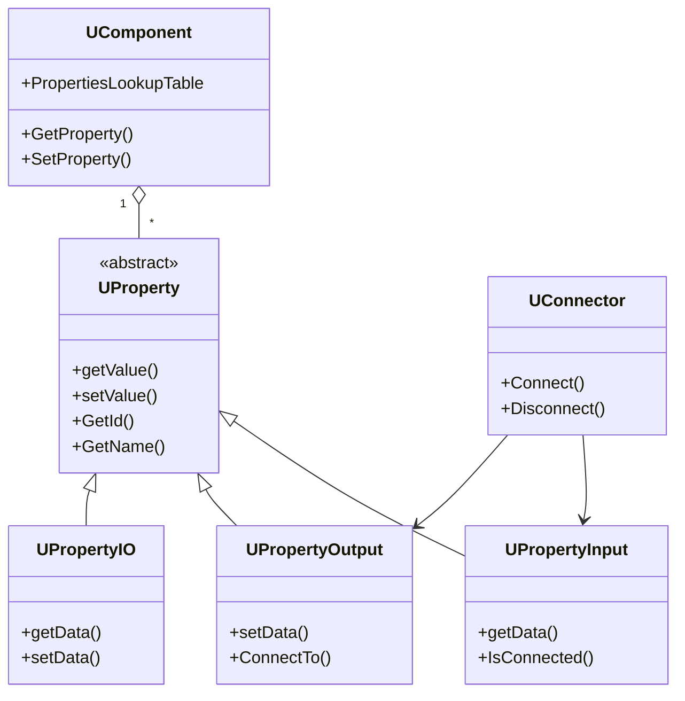
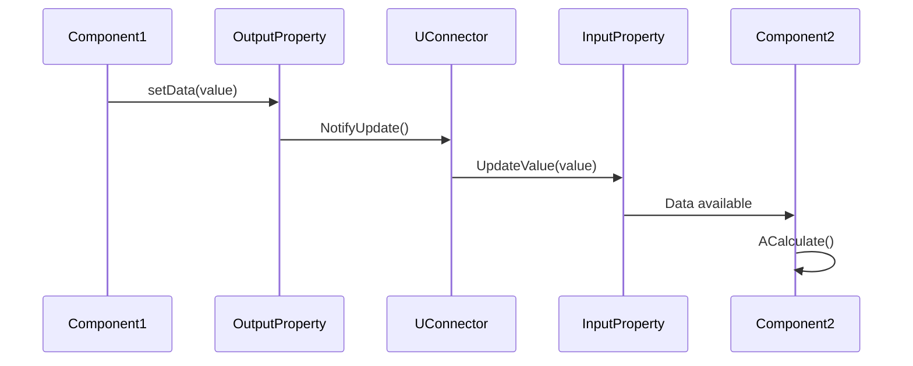

# Система свойств компонентов

## RU

### Диаграмма классов свойств

```mermaid
classDiagram
    class UProperty {
        <<abstract>>
        +getValue()
        +setValue()
        +GetId()
        +GetName()
    }
    
    class UPropertyInput {
        +getData()
        +IsConnected()
    }
    
    class UPropertyOutput {
        +setData()
        +ConnectTo()
    }
    
    class UPropertyIO {
        +getData()
        +setData()
    }
    
    class UComponent {
        +PropertiesLookupTable
        +GetProperty()
        +SetProperty()
    }
    
    class UConnector {
        +Connect()
        +Disconnect()
    }
    
    UProperty <|-- UPropertyInput
    UProperty <|-- UPropertyOutput
    UProperty <|-- UPropertyIO
    UComponent "1" o-- "*" UProperty
    UConnector --> UPropertyInput
    UConnector --> UPropertyOutput
```

### Соединение свойств

```mermaid
sequenceDiagram
    participant Comp1 as Component1
    participant PropOut as OutputProperty
    participant Connector as UConnector
    participant PropIn as InputProperty
    participant Comp2 as Component2
    
    Comp1->>PropOut: setData(value)
    PropOut->>Connector: NotifyUpdate()
    Connector->>PropIn: UpdateValue(value)
    PropIn->>Comp2: Data available
    Comp2->>Comp2: ACalculate()
```

---

## EN

### Property Classes Diagram

### Property Connection
