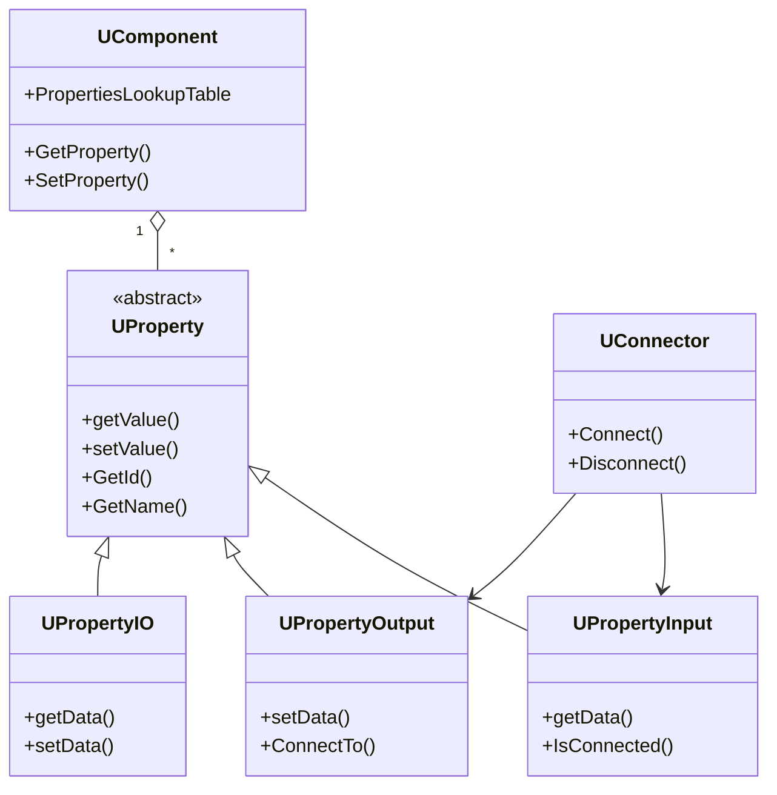
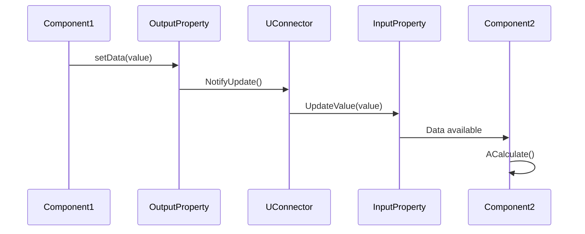

# Система свойств компонентов

## RU

### Диаграмма классов свойств

Диаграмма ниже обобщает иерархию классов свойств, которая реализована в шаблонных классах `UProperty`, `UVProperty`, `UVBaseDataProperty` и интерфейсах `UIPropertyInput` / `UIPropertyOutput`. В коде свойства регистрируются внутри `UComponent` через таблицу `PropertiesLookupTable`, а коннектор `UConnector` использует интерфейсы ввода/вывода для установки связей между компонентами.

### Соединение свойств

Следующая диаграмма деталирует, как данные передаются между двумя компонентами через свойства и коннектор:
- компонент‑источник записывает значение в выходное свойство (`setData`),
- выходное свойство уведомляет коннектор об обновлении,
- коннектор обновляет входное свойство целевого компонента,
- целевой компонент использует новое значение во время выполнения `ACalculate()`.

Эта последовательность соответствует логике методов `UConnector::ConnectToItem`, `UIPropertyInput::SetPointer` и связанных маршрутов чтения/записи данных.

---

## EN

### Property Classes Diagram

The class diagram above summarizes the property class hierarchy implemented by templated `UProperty`, `UVProperty`, `UVBaseDataProperty` and the `UIPropertyInput` / `UIPropertyOutput` interfaces. In code, properties are registered inside `UComponent` via the `PropertiesLookupTable`, and the `UConnector` uses input/output interfaces to wire components together.

### Property Connection

The sequence diagram explains how data flows between two components via properties and a connector:
- the source component writes a value to its output property (`setData`),
- the output property notifies the connector about the update,
- the connector updates the target input property,
- the target component consumes the new value during its `ACalculate()` call.

This sequence follows the logic of `UConnector::ConnectToItem`, `UIPropertyInput::SetPointer` and related data access paths in the engine.
