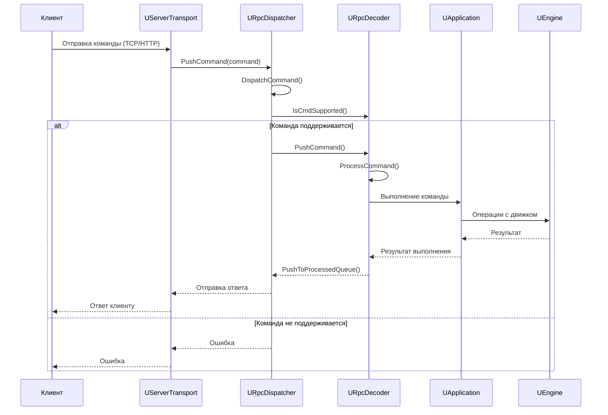
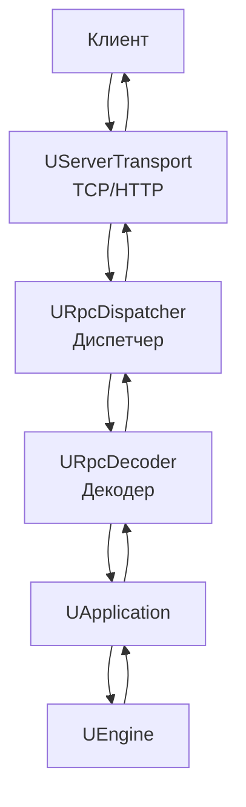

# Поток обработки RPC команд

## RU

### Последовательность обработки RPC команды

```mermaid
sequenceDiagram
    participant Client as Клиент
    participant Transport as UServerTransport
    participant Dispatcher as URpcDispatcher
    participant Decoder as URpcDecoder
    participant App as UApplication
    participant Engine as UEngine
    
    Client->>Transport: Отправка команды (TCP/HTTP)
    Transport->>Dispatcher: PushCommand(command)
    Dispatcher->>Dispatcher: DispatchCommand()
    Dispatcher->>Decoder: IsCmdSupported()
    
    alt Команда поддерживается
        Dispatcher->>Decoder: PushCommand()
        Decoder->>Decoder: ProcessCommand()
        Decoder->>App: Выполнение команды
        App->>Engine: Операции с движком
        Engine-->>App: Результат
        App-->>Decoder: Результат выполнения
        Decoder-->>Dispatcher: PushToProcessedQueue()
        Dispatcher-->>Transport: Отправка ответа
        Transport-->>Client: Ответ клиенту
    else Команда не поддерживается
        Dispatcher-->>Transport: Ошибка
        Transport-->>Client: Ошибка
    end
```

### Архитектура RPC системы

```mermaid
flowchart TB
    Client[Клиент]
    Transport[UServerTransport<br/>TCP/HTTP]
    Dispatcher[URpcDispatcher<br/>Диспетчер]
    Decoder[URpcDecoder<br/>Декодер]
    App[UApplication]
    Engine[UEngine]
    
    Client --> Transport
    Transport --> Dispatcher
    Dispatcher --> Decoder
    Decoder --> App
    App --> Engine
    Engine --> App
    App --> Decoder
    Decoder --> Dispatcher
    Dispatcher --> Transport
    Transport --> Client
```

---

## EN

### RPC Command Processing Sequence

### RPC System Architecture
