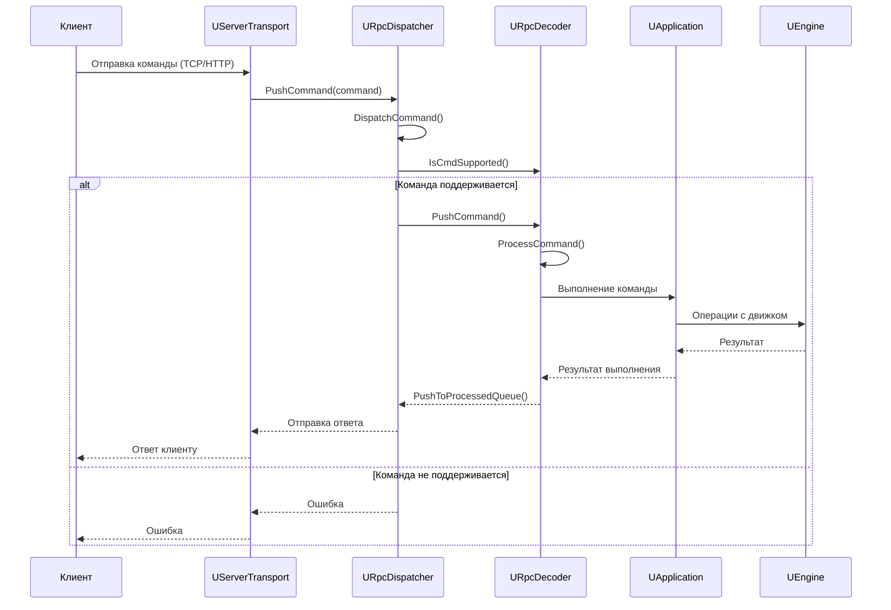
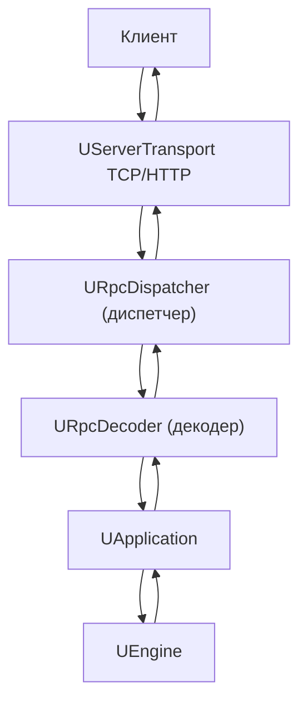

# Поток обработки RPC команд

## RU

### Последовательность обработки RPC команды

### Архитектура RPC системы

В совокупности эти две диаграммы иллюстрируют, как входящие RPC‑команды проходят через транспорт, диспетчер, декодер и приложение до движка и обратно к клиенту. Они непосредственно соответствуют коду в `URpcDispatcher`, `URpcDecoder`, `UServerTransport` и методам `UApplication`, вызываемым декодером.

---

## EN

### RPC Command Processing Sequence

The sequence diagram above shows how an incoming RPC command is processed:
- the client sends a command via TCP/HTTP transport,
- `UServerTransport` pushes the command into `URpcDispatcher`,
- the dispatcher selects a suitable decoder, which executes the command by calling `UApplication` / engine methods,
- the result is returned back to the client through the dispatcher and transport.

### RPC System Architecture

The flowchart describes the static architecture of the RPC system:
- the client only talks to `UServerTransport`,
- `URpcDispatcher` and `URpcDecoder` form the core of the routing/decoding logic,
- `UApplication` and `UEngine` are the ultimate handlers of most RPC commands.

