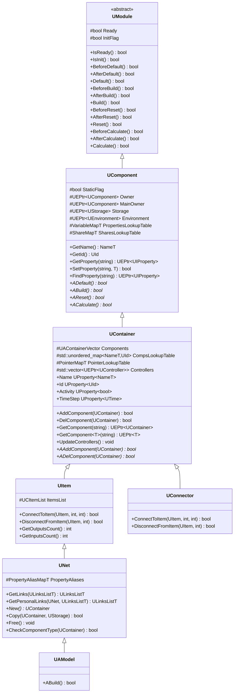
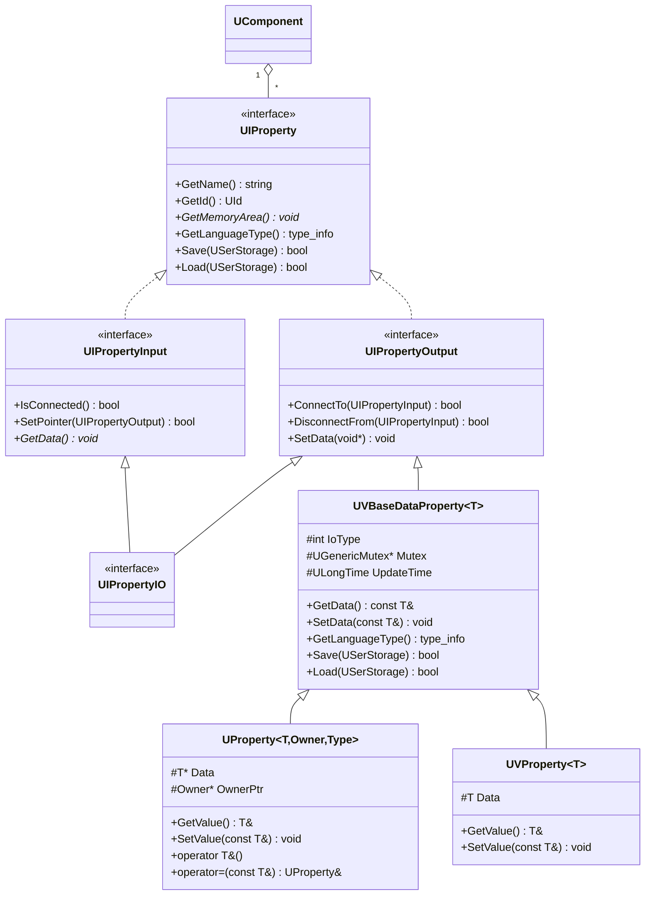
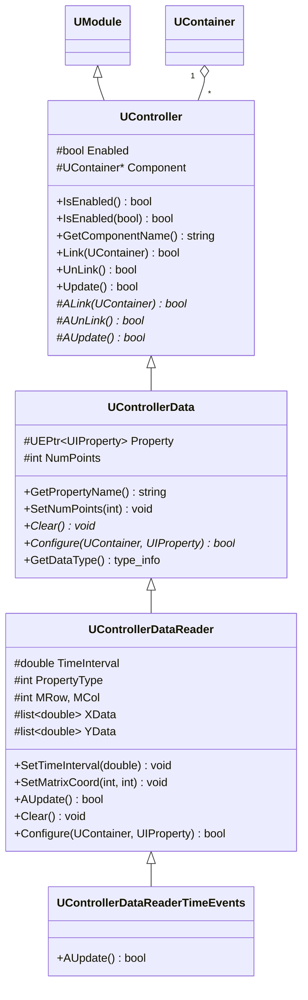
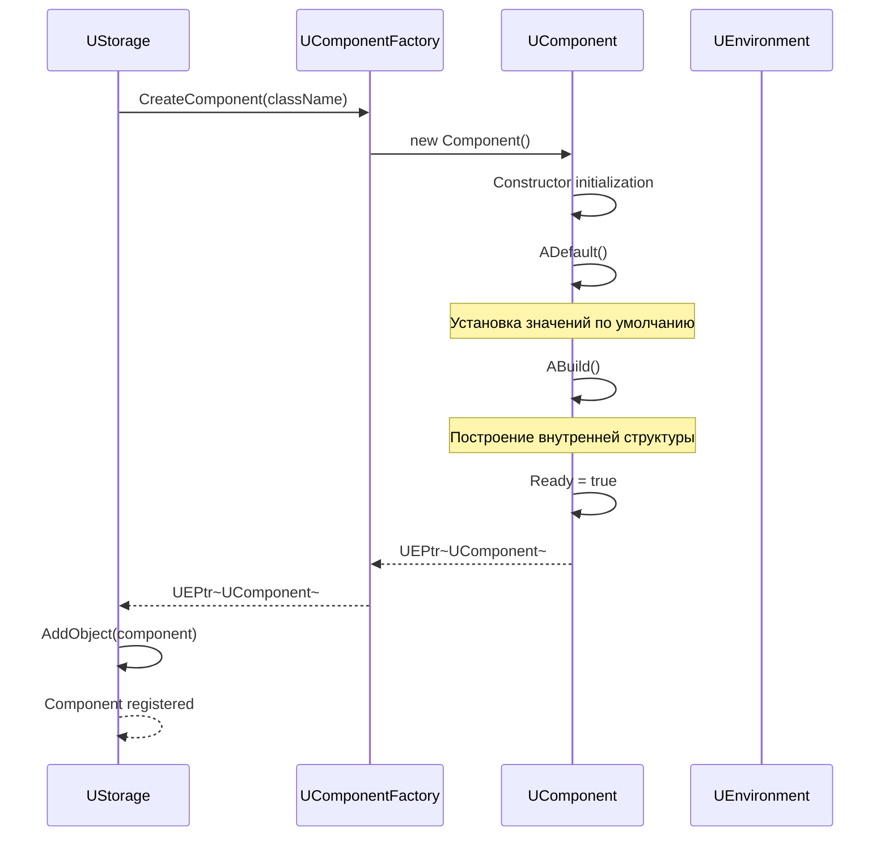
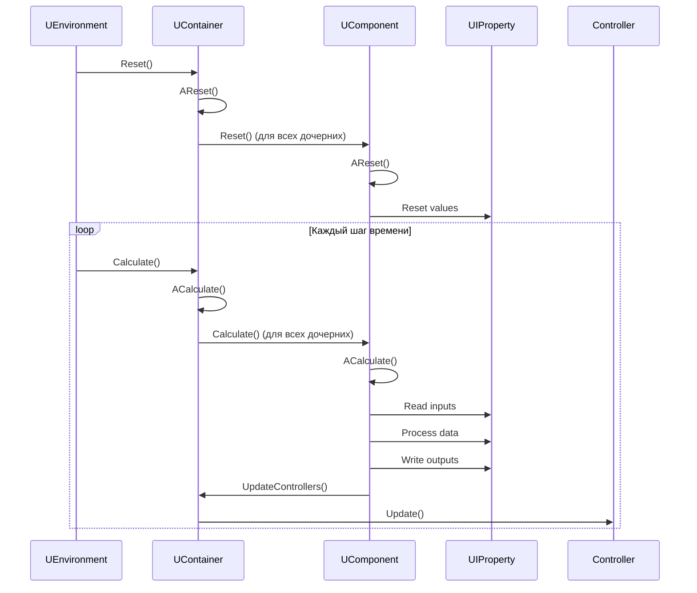
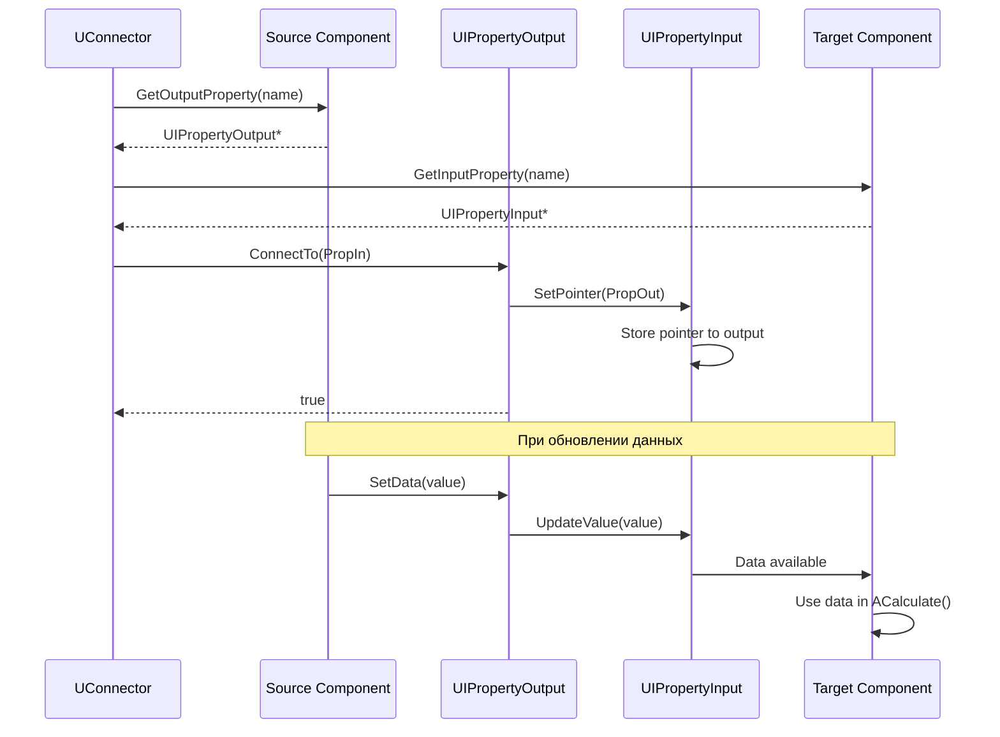
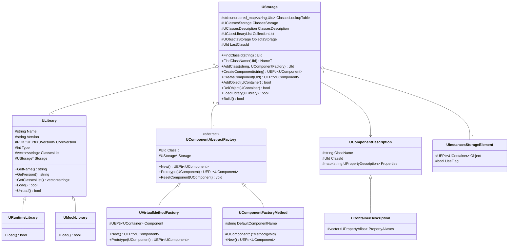
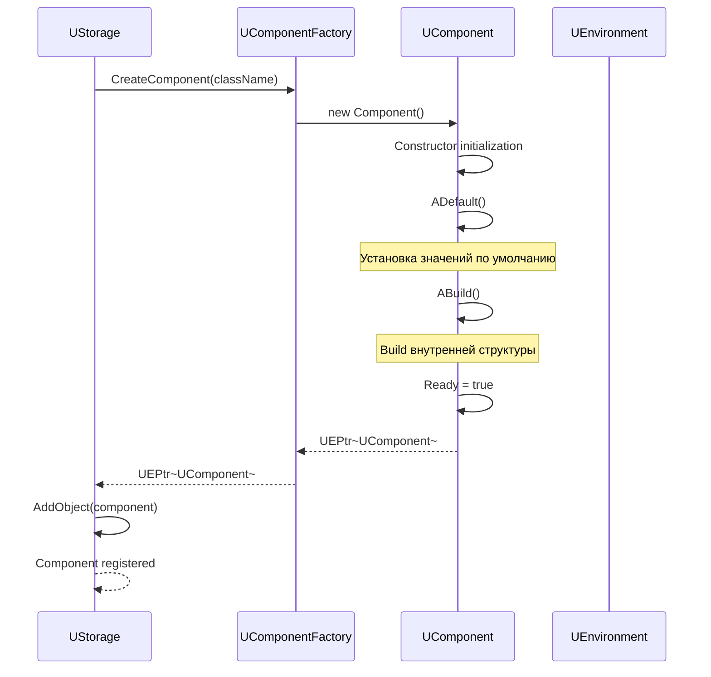
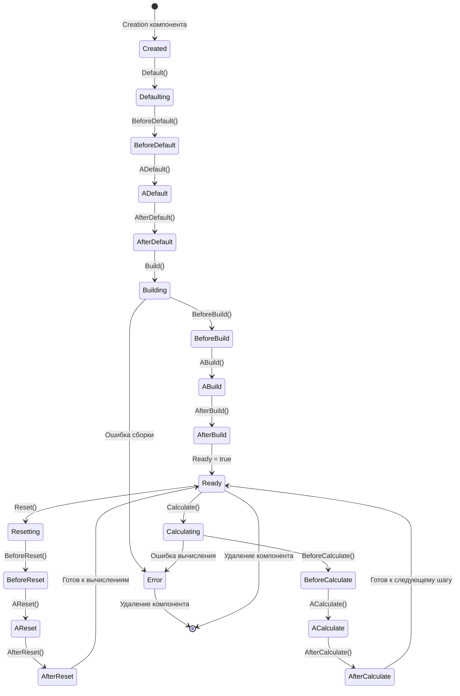

# Детальная документация модуля Core/Engine

## RU

### Обзор

Модуль `Core/Engine` является центральным модулем Rdk Core, реализующим компонентную архитектуру системы. Он предоставляет инфраструктуру для создания, управления и выполнения компонентов, систему свойств, контроллеры для связи с GUI, и механизмы хранения и загрузки компонентов.

### UML диаграмма классов иерархии компонентов



### UML диаграмма классов системы свойств



### UML диаграмма классов системы хранения


### UML диаграмма классов контроллеров



### Диаграмма последовательности создания компонента



### Диаграмма последовательности выполнения компонента



### Диаграмма последовательности подключения свойств



### Диаграмма состояний компонента (расширенная)


### Описание основных классов

#### UModule

Базовый абстрактный класс для всех модулей системы. Предоставляет жизненный цикл: Default, Build, Reset, Calculate.

**Основные методы:**
- `Default()` - восстановление настроек по умолчанию
- `Build()` - сборка внутренней структуры
- `Reset()` - сброс состояния перед вычислениями
- `Calculate()` - выполнение вычислений

**Виртуальные методы для переопределения:**
- `ADefault()` - пользовательская логика установки значений по умолчанию
- `ABuild()` - пользовательская логика сборки
- `AReset()` - пользовательская логика сброса
- `ACalculate()` - пользовательская логика вычислений

#### UComponent

Базовый класс для всех компонентов системы. Наследуется от `UModule` и добавляет систему свойств, связи с хранилищем и окружением.

**Основные свойства:**
- `PropertiesLookupTable` - таблица свойств компонента
- `SharesLookupTable` - таблица общих ресурсов
- `Owner` - указатель на родительский компонент
- `Storage` - указатель на хранилище компонентов
- `Environment` - указатель на окружение выполнения

**Основные методы:**
- `GetProperty(name)` - получение свойства по имени
- `SetProperty(name, value)` - установка значения свойства
- `FindProperty(name)` - поиск свойства
- `GetName()` - получение имени компонента
- `GetId()` - получение идентификатора компонента

#### UContainer

Класс-контейнер для группировки других компонентов. Наследуется от `UComponent` и добавляет управление дочерними компонентами.

**Основные свойства:**
- `Components` - вектор дочерних компонентов
- `CompsLookupTable` - таблица соответствий имен и ID компонентов
- `Controllers` - список контроллеров для связи с GUI
- `Name` - имя контейнера (свойство)
- `Id` - идентификатор контейнера (свойство)
- `Activity` - флаг активности контейнера
- `TimeStep` - шаг времени контейнера

**Основные методы:**
- `AddComponent(component)` - добавление дочернего компонента
- `DelComponent(component)` - удаление дочернего компонента
- `GetComponent(name)` - получение дочернего компонента по имени
- `GetComponent<T>(name)` - получение дочернего компонента с приведением типа
- `UpdateControllers()` - обновление всех контроллеров

**Виртуальные методы:**
- `AAddComponent(component)` - пользовательская логика при добавлении компонента
- `ADelComponent(component)` - пользовательская логика при удалении компонента

#### UNet

Специализированный контейнер для сетей компонентов. Наследуется от `UItem` и `UContainer`, добавляет управление связями между компонентами и алиасами свойств.

**Основные свойства:**
- `PropertyAliases` - карта алиасов свойств вложенных компонентов

**Основные методы:**
- `GetLinks(linkslist)` - получение всех связей в сети
- `GetPersonalLinks(net, linkslist)` - получение связей между двумя сетями
- `New()` - создание нового экземпляра сети
- `Copy(target, storage)` - копирование сети
- `Free()` - освобождение сети
- `CheckComponentType(comp)` - проверка допустимости типа компонента

#### UItem

Базовый класс для элементов, которые могут иметь входы и выходы. Наследуется от `UContainer`.

**Основные свойства:**
- `ItemsList` - список подключенных элементов

**Основные методы:**
- `ConnectToItem(item, output, input)` - подключение к элементу
- `DisconnectFromItem(item, input)` - отключение от элемента
- `GetOutputsCount()` - получение количества выходов
- `GetInputsCount()` - получение количества входов

#### UConnector

Специализированный контейнер для управления связями между компонентами. Наследуется от `UContainer`.

**Основные методы:**
- `ConnectToItem(item, output, input)` - подключение к элементу
- `DisconnectFromItem(item, input)` - отключение от элемента

#### UEngine

Главный класс движка системы. Управляет хранилищем компонентов и окружением выполнения.

**Основные свойства:**
- `Storage` - хранилище компонентов
- `Environment` - окружение выполнения

**Основные методы:**
- `Init()` - инициализация движка
- `Start()` - запуск движка
- `Stop()` - остановка движка
- `Reset()` - сброс состояния движка
- `Calculate()` - выполнение одного шага вычислений

#### UEnvironment

Окружение выполнения компонентов. Управляет жизненным циклом компонентов и временем выполнения.

**Основные свойства:**
- `Storage` - хранилище компонентов
- `Model` - корневой компонент модели
- `Time` - управление временем
- `MinInterstepsInterval` - минимальный интервал между итерациями
- `MaxCalcTime` - максимальное время расчета

**Основные методы:**
- `Reset()` - сброс окружения
- `Calculate()` - выполнение одного шага вычислений
- `RTCalculate()` - выполнение расчета в реальном времени
- `GetModel()` - получение корневого компонента модели
- `SetModel(component)` - установка корневого компонента модели

#### UStorage

Хранилище компонентов и классов. Управляет регистрацией классов, созданием экземпляров и загрузкой библиотек.

**Основные свойства:**
- `ClassesStorage` - хранилище классов (фабрик)
- `ObjectsStorage` - хранилище экземпляров компонентов
- `CollectionList` - список загруженных библиотек
- `ClassesDescription` - описания классов

**Основные методы:**
- `AddClass(name, factory)` - регистрация класса компонента
- `CreateComponent(className)` - создание экземпляра компонента
- `CreateComponent(classId)` - создание экземпляра по ID класса
- `AddObject(component)` - добавление экземпляра в хранилище
- `DelObject(component)` - удаление экземпляра из хранилища
- `LoadLibrary(library)` - загрузка библиотеки компонентов
- `Build()` - сборка всех компонентов

#### ULibrary

Базовый класс для библиотек компонентов. Предоставляет интерфейс для загрузки классов компонентов.

**Основные свойства:**
- `Name` - имя библиотеки
- `Version` - версия библиотеки
- `CoreVersion` - версия ядра, использованная при сборке
- `Type` - тип библиотеки (внутренняя, внешняя, заглушка)
- `ClassesList` - список классов библиотеки

**Основные методы:**
- `Load()` - загрузка библиотеки
- `Unload()` - выгрузка библиотеки
- `GetClassesList()` - получение списка классов

#### UComponentFactory

Абстрактная фабрика для создания компонентов. Определяет интерфейс для создания экземпляров компонентов.

**Основные методы:**
- `New()` - создание нового компонента
- `Prototype(prototype)` - создание компонента на основе прототипа
- `ResetComponent(component)` - сброс компонента к исходному состоянию

#### UIProperty

Интерфейс для свойств компонентов. Определяет базовые методы работы со свойствами.

**Основные методы:**
- `GetName()` - получение имени свойства
- `GetId()` - получение ID свойства
- `GetMemoryArea()` - получение указателя на данные
- `GetLanguageType()` - получение типа данных
- `Save(storage)` - сохранение свойства
- `Load(storage)` - загрузка свойства

#### UIPropertyInput / UIPropertyOutput

Интерфейсы для входных и выходных свойств. Используются для связи компонентов через коннектор.

**UIPropertyInput:**
- `IsConnected()` - проверка подключения
- `SetPointer(output)` - установка указателя на выходное свойство
- `GetData()` - получение данных

**UIPropertyOutput:**
- `ConnectTo(input)` - подключение к входному свойству
- `DisconnectFrom(input)` - отключение от входного свойства
- `SetData(data)` - установка данных

#### UController

Базовый класс контроллеров для связи компонентов с GUI. Наследуется от `UModule`.

**Основные свойства:**
- `Enabled` - флаг активности контроллера
- `Component` - указатель на связанный компонент

**Основные методы:**
- `Link(component)` - связывание с компонентом
- `UnLink()` - отвязывание от компонента
- `Update()` - обновление контроллера

**Виртуальные методы:**
- `ALink(component)` - пользовательская логика при связывании
- `AUnLink()` - пользовательская логика при отвязывании
- `AUpdate()` - пользовательская логика обновления

#### UControllerDataReader

Контроллер для чтения данных из свойств компонентов. Используется для отображения данных в GUI (графики, таблицы).

**Основные свойства:**
- `Property` - указатель на свойство
- `TimeInterval` - временной интервал для хранения данных
- `XData`, `YData` - временные ряды данных

**Основные методы:**
- `SetTimeInterval(interval)` - установка временного интервала
- `SetMatrixCoord(row, col)` - установка координат для матричных свойств
- `Configure(container, property)` - настройка контроллера

### Примеры использования

#### Создание компонента

```cpp
#include "Rdk/Core/Engine/UEngine.h"
#include "Rdk/Core/Engine/UStorage.h"

// Получение хранилища
RDK::UStorage* storage = engine->GetStorage();

// Создание компонента по имени класса
RDK::UEPtr<RDK::UContainer> component = storage->CreateComponent("MyComponent");

if (component) {
    // Установка имени
    component->Name = "MyComponentInstance";
    
    // Установка параметров
    component->Activity = true;
    component->TimeStep = 0.001; // 1 мс
    
    // Добавление в хранилище
    storage->AddObject(component);
}
```

#### Создание контейнера с дочерними компонентами

```cpp
// Создание контейнера
RDK::UEPtr<RDK::UContainer> container = storage->CreateComponent("UContainer");
container->Name = "MyContainer";

// Создание дочерних компонентов
RDK::UEPtr<RDK::UContainer> child1 = storage->CreateComponent("Component1");
child1->Name = "Child1";

RDK::UEPtr<RDK::UContainer> child2 = storage->CreateComponent("Component2");
child2->Name = "Child2";

// Добавление дочерних компонентов
container->AddComponent(child1);
container->AddComponent(child2);
```

#### Работа со свойствами

```cpp
// Получение свойства
RDK::UEPtr<RDK::UIProperty> prop = component->GetProperty("MyProperty");

if (prop) {
    // Для типизированных свойств можно использовать GetProperty<T>
    auto typed_prop = component->GetProperty<double>("MyDoubleProperty");
    if (typed_prop) {
        double value = typed_prop->GetValue();
        typed_prop->SetValue(value + 1.0);
    }
}
```

#### Подключение свойств через коннектор

```cpp
// Создание коннектора
RDK::UEPtr<RDK::UConnector> connector = storage->CreateComponent<RDK::UConnector>();

// Получение компонентов
RDK::UEPtr<RDK::UContainer> source = /* ... */;
RDK::UEPtr<RDK::UContainer> target = /* ... */;

// Подключение выхода source к входу target
if (connector->ConnectToItem(source.Get(), 0, 0)) {
    // Связь установлена
}
```

#### Использование контроллера для чтения данных

```cpp
#include "Rdk/Core/Engine/UController.h"
#include "Rdk/Core/Engine/UEnvironment.h"

// Получение окружения
RDK::UELockPtr<RDK::UEnvironment> env = RDK::GetEnvironmentLock();
if (env) {
    // Регистрация контроллера для чтения свойства
    RDK::UControllerDataReader* reader = env->RegisterDataReader(
        "ComponentName",
        "OutputProperty",
        0, 0  // координаты матрицы
    );
    
    if (reader) {
        reader->SetTimeInterval(10.0); // хранить данные за 10 секунд
        reader->IsEnabled(true);
        
        // Получение данных
        std::list<double>& x_data = reader->XData;
        std::list<double>& y_data = reader->YData;
    }
}
```

### См. также

- [Architecture.md](Architecture.md) - общая архитектура
- [Controllers-System.md](Controllers-System.md) - детальное описание системы контроллеров
- [Diagrams/Component-Lifecycle.md](Diagrams/Component-Lifecycle.md) - жизненный цикл компонента
- [Diagrams/Property-System.md](Diagrams/Property-System.md) - система свойств

---

## EN

### Overview

The `Core/Engine` module is the central module of Rdk Core, implementing the component architecture of the system. It provides infrastructure for creating, managing, and executing components, a property system, controllers for GUI integration, and mechanisms for storing and loading components.

### Class Hierarchy

The module implements a hierarchical component system:
- `UModule` - base class for all modules
- `UComponent` - base class for components with properties
- `UContainer` - container for grouping components
- `UItem` - base for elements with inputs/outputs
- `UNet` - specialized container for networks
- `UConnector` - connector for managing links

### Property System

Components use a property system for data exchange:
- `UIProperty` - base interface for properties
- `UIPropertyInput` - interface for input properties
- `UIPropertyOutput` - interface for output properties
- `UProperty<T>` - typed property implementation

### Storage System

The storage system manages component classes and instances:
- `UStorage` - component storage
- `ULibrary` - component library
- `UComponentFactory` - factory for creating components

### Controller System

Controllers provide connection between components and GUI:
- `UController` - base controller class
- `UControllerDataReader` - controller for reading property data

### See Also

- [Architecture.md](Architecture.md) - general architecture
- [Controllers-System.md](Controllers-System.md) - controller system details
- [Diagrams/Component-Lifecycle.md](Diagrams/Component-Lifecycle.md) - component lifecycle
- [Diagrams/Property-System.md](Diagrams/Property-System.md) - property system









