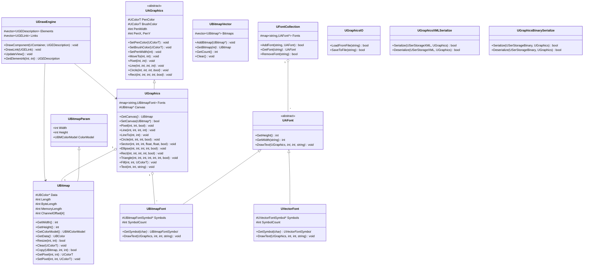
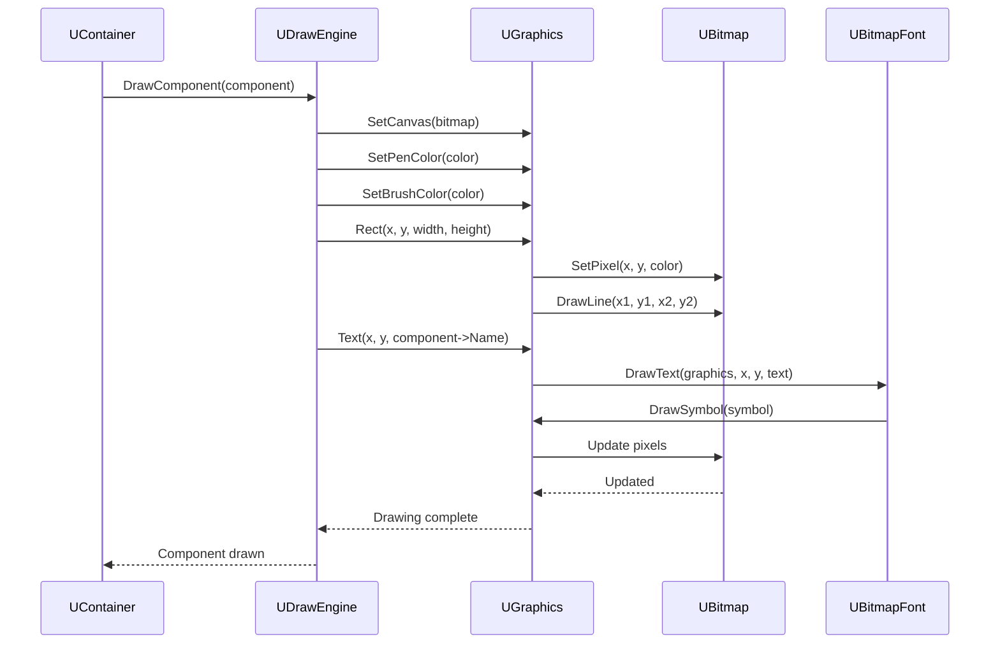
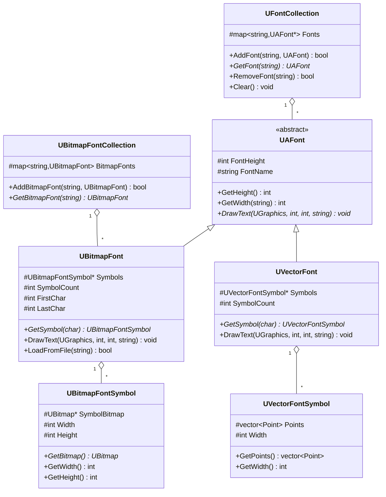

# Детальная документация модуля Core/Graphics

## RU

### Обзор

Модуль `Core/Graphics` предоставляет систему графики и визуализации для компонентов Rdk Core. Включает классы для работы с растровыми изображениями, отрисовки графических примитивов, управления шрифтами и сериализации графических данных.

### UML диаграмма классов графической системы



### Диаграмма последовательности отрисовки



### Диаграмма классов шрифтов



### Описание основных классов

#### UAGraphics

Абстрактный базовый класс для графических операций. Определяет интерфейс для отрисовки примитивов.

**Основные свойства:**
- `PenColor` - цвет пера
- `BrushColor` - цвет заливки
- `PenWidth` - ширина пера
- `PenX`, `PenY` - текущая позиция пера

**Основные методы:**
- `SetPenColor(color)` - установка цвета пера
- `SetBrushColor(color)` - установка цвета заливки
- `MoveTo(x, y)` - перемещение пера
- `Pixel(x, y)` - отрисовка пикселя
- `Line(x1, y1, x2, y2)` - отрисовка линии
- `Circle(x, y, r, fill)` - отрисовка окружности
- `Rect(x1, y1, x2, y2, fill)` - отрисовка прямоугольника

#### UGraphics

Конкретная реализация графического интерфейса. Наследуется от `UAGraphics` и добавляет работу с канвой и шрифтами.

**Основные свойства:**
- `Canvas` - канва для рисования (UBitmap)
- `Fonts` - коллекция шрифтов

**Основные методы:**
- `SetCanvas(bitmap)` - установка канвы
- `GetCanvas()` - получение канвы
- `Text(x, y, text)` - вывод текста
- Все методы отрисовки примитивов

#### UDrawEngine

Движок отрисовки для визуализации компонентов и их связей.

**Основные свойства:**
- `Elements` - список элементов для отрисовки
- `Links` - список связей для отрисовки

**Основные методы:**
- `DrawComponent(container, description)` - отрисовка компонента
- `DrawLink(link)` - отрисовка связи
- `UpdateView()` - обновление вида
- `GetElementAt(x, y)` - получение элемента по координатам

#### UBitmap

Класс для работы с растровыми изображениями.

**Основные свойства:**
- `Data` - данные изображения
- `Width`, `Height` - размеры изображения
- `ColorModel` - цветовая модель
- `Length` - число пикселей
- `ByteLength` - размер данных в байтах

**Основные методы:**
- `Resize(width, height)` - изменение размера
- `Clear(color)` - очистка изображения
- `Copy(bitmap, x, y)` - копирование изображения
- `GetPixel(x, y)` - получение пикселя
- `SetPixel(x, y, color)` - установка пикселя

#### UBitmapVector

Контейнер для коллекции растровых изображений.

**Основные методы:**
- `AddBitmap(bitmap)` - добавление изображения
- `GetBitmap(index)` - получение изображения
- `GetCount()` - получение количества
- `Clear()` - очистка коллекции

#### UAFont

Абстрактный базовый класс для шрифтов.

**Основные методы:**
- `GetHeight()` - получение высоты шрифта
- `GetWidth(text)` - получение ширины текста
- `DrawText(graphics, x, y, text)` - отрисовка текста

#### UBitmapFont

Растровый шрифт. Каждый символ представлен растровым изображением.

**Основные свойства:**
- `Symbols` - массив символов
- `SymbolCount` - количество символов

#### UVectorFont

Векторный шрифт. Каждый символ представлен набором точек.

**Основные свойства:**
- `Symbols` - массив символов
- `SymbolCount` - количество символов

#### UFontCollection

Коллекция шрифтов.

**Основные методы:**
- `AddFont(name, font)` - добавление шрифта
- `GetFont(name)` - получение шрифта
- `RemoveFont(name)` - удаление шрифта

### Примеры использования

#### Создание и отрисовка изображения

```cpp
#include "Rdk/Core/Graphics/UBitmap.h"
#include "Rdk/Core/Graphics/UGraphics.h"

// Создание изображения
RDK::UBitmap bitmap;
bitmap.Resize(800, 600);
bitmap.Clear(RDK::UColorT(255, 255, 255, 0)); // белый фон

// Создание графического контекста
RDK::UGraphics graphics(&bitmap);

// Установка цветов
graphics.SetPenColor(RDK::UColorT(0, 0, 0, 0)); // черный
graphics.SetBrushColor(RDK::UColorT(255, 0, 0, 0)); // красный

// Отрисовка примитивов
graphics.Rect(10, 10, 100, 100, true); // залитый прямоугольник
graphics.Circle(200, 200, 50, false); // окружность без заливки
graphics.Line(0, 0, 800, 600); // линия
```

#### Работа со шрифтами

```cpp
#include "Rdk/Core/Graphics/UFont.h"

// Загрузка шрифта
RDK::UBitmapFont font;
font.LoadFromFile("font.bmp");

// Использование шрифта
RDK::UGraphics graphics(&bitmap);
graphics.SetFont(&font);
graphics.Text(10, 10, "Hello, World!");
```

#### Использование движка отрисовки

```cpp
#include "Rdk/Core/Graphics/UDrawEngine.h"

// Создание движка отрисовки
RDK::UDrawEngine draw_engine;

// Получение компонента
RDK::UEPtr<RDK::UContainer> component = /* ... */;

// Описание элемента
RDK::UGEDescription desc;
desc.Header = component->Name;
desc.Position = component->Coord.GetValue();
desc.Type = 1; // обычный компонент

// Отрисовка компонента
draw_engine.DrawComponent(component.Get(), desc);

// Обновление вида
draw_engine.UpdateView();
```

### См. также

- [Architecture.md](Architecture.md) - общая архитектура
- [Engine-Detailed.md](Engine-Detailed.md) - детальная документация движка

---

## EN

### Overview

The `Core/Graphics` module provides graphics and visualization system for Rdk Core components. Includes classes for working with raster images, drawing graphics primitives, font management, and graphics data serialization.

### Main Classes

- `UAGraphics` - abstract graphics interface
- `UGraphics` - concrete graphics implementation
- `UDrawEngine` - drawing engine for component visualization
- `UBitmap` - raster image class
- `UAFont` - abstract font class
- `UBitmapFont` - bitmap font implementation
- `UVectorFont` - vector font implementation

### See Also

- [Architecture.md](Architecture.md) - general architecture
- [Engine-Detailed.md](Engine-Detailed.md) - engine detailed documentation
