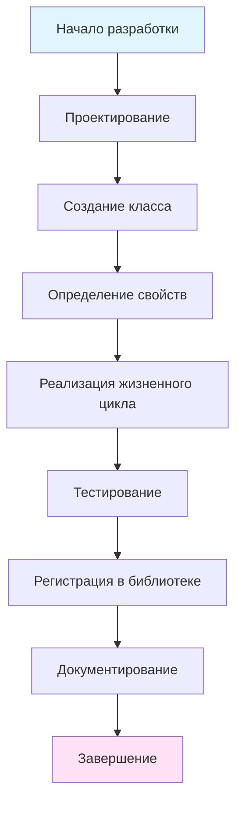
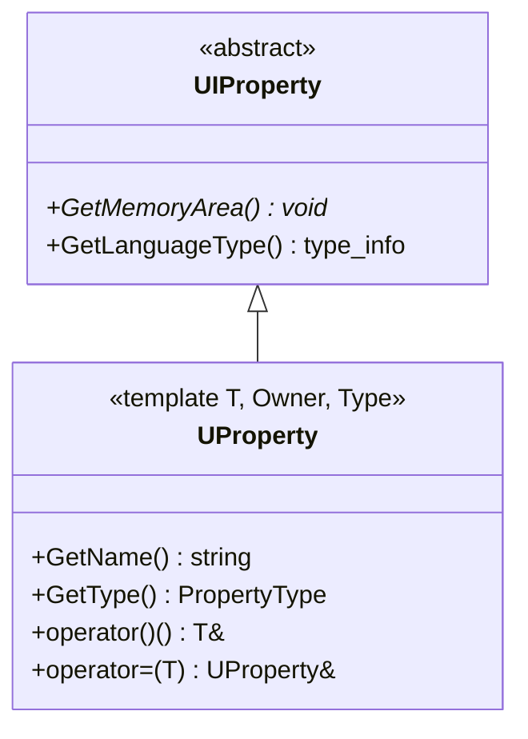
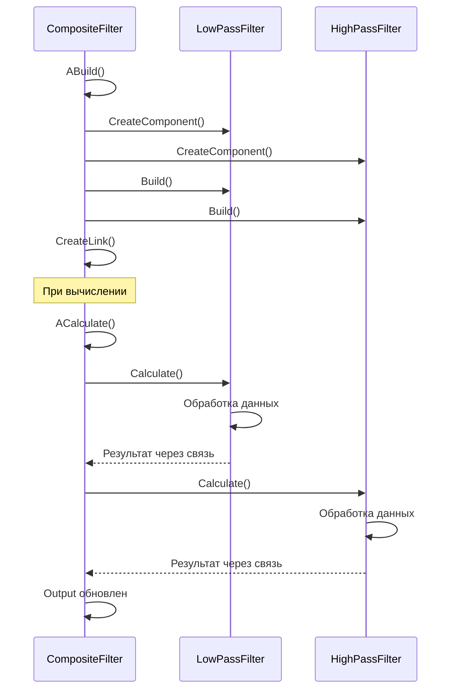

# Руководство по разработке компонентов (Component Development Guide)

## RU

### Обзор

Это руководство описывает процесс создания новых компонентов для системы Nmsdk. Компоненты являются основными строительными блоками системы и должны следовать определенным паттернам и best practices.

### Процесс разработки компонента

**Основные этапы:**



### Шаг 1: Проектирование компонента

Перед созданием компонента необходимо определить:

1. **Назначение компонента** - что делает компонент
2. **Входные данные** - какие данные компонент получает
3. **Выходные данные** - какие данные компонент производит
4. **Параметры** - какие параметры настраивает пользователь
5. **Состояния** - какие внутренние состояния хранит компонент
6. **Зависимости** - какие другие компоненты или библиотеки требуются

**Пример проектирования:**

```
Компонент: Фильтр скользящего среднего
- Назначение: Сглаживание сигнала методом скользящего среднего
- Входные данные: Входной сигнал (double)
- Выходные данные: Сглаженный сигнал (double)
- Параметры: Размер окна (int, по умолчанию 10)
- Состояния: Буфер значений (vector<double>)
- Зависимости: Rdk-BasicLib
```

### Шаг 2: Создание класса компонента

**Базовый шаблон компонента:**

```cpp
#ifndef MYCOMPONENT_H
#define MYCOMPONENT_H

#include "Rdk/Core/Engine/UContainer.h"
#include "Rdk/Core/Engine/UProperty.h"

namespace RDK {

class MyComponent : public UContainer
{
public:
    // --------------------------
    // Конструкторы и деструкторы
    // --------------------------
    MyComponent(void);
    virtual ~MyComponent(void);
    // --------------------------

protected:
    // --------------------------
    // Методы жизненного цикла
    // --------------------------
    virtual bool ADefault(void) override;
    virtual bool ABuild(void) override;
    virtual bool AReset(void) override;
    virtual bool ACalculate(void) override;
    // --------------------------
};

} // namespace RDK

#endif // MYCOMPONENT_H
```

**Реализация базового шаблона:**

```cpp
#include "MyComponent.h"
#include "Rdk/Core/Engine/UException.h"

namespace RDK {

MyComponent::MyComponent(void)
    : UContainer()
{
    // Инициализация выполняется в ADefault()
}

MyComponent::~MyComponent(void)
{
    // Очистка ресурсов
}

bool MyComponent::ADefault(void)
{
    // 1. Вызов базового метода
    if (!UContainer::ADefault())
        return false;
    
    // 2. Инициализация свойств значениями по умолчанию
    // (свойства будут определены на следующем шаге)
    
    return true;
}

bool MyComponent::ABuild(void)
{
    // 1. Вызов базового метода
    if (!UContainer::ABuild())
        return false;
    
    // 2. Создание подкомпонентов (если требуется)
    // 3. Настройка связей между компонентами
    // 4. Валидация параметров
    
    return true;
}

bool MyComponent::AReset(void)
{
    // 1. Вызов базового метода
    if (!UContainer::AReset())
        return false;
    
    // 2. Сброс внутренних состояний
    // 3. Очистка временных данных
    
    return true;
}

bool MyComponent::ACalculate(void)
{
    // 1. Проверка готовности компонента
    if (!IsReady())
        return false;
    
    // 2. Основная логика вычислений
    // 3. Обновление выходных свойств
    
    return true;
}

} // namespace RDK
```

### Шаг 3: Определение свойств

Свойства компонента определяются с помощью шаблона `UProperty<T, Owner, Type>`.

**Типы свойств:**

- `ptPubParameter` - публичный параметр (настраивается пользователем)
- `ptPubState` - публичное состояние (видимо пользователю)
- `ptPubInput` - публичный вход (соединяется с выходом другого компонента)
- `ptPubOutput` - публичный выход (соединяется со входом другого компонента)
- `ptTemp` - временное свойство (используется для промежуточных вычислений)

**Пример определения свойств:**

```cpp
class MovingAverageFilter : public UContainer
{
public:
    // Параметры
    UProperty<int, MovingAverageFilter, ptPubParameter> WindowSize;
    
    // Входы
    UProperty<double, MovingAverageFilter, ptPubInput> InputSignal;
    
    // Выходы
    UProperty<double, MovingAverageFilter, ptPubOutput> OutputSignal;
    
    // Состояния
    UProperty<std::vector<double>, MovingAverageFilter, ptPubState> Buffer;
    
    // Временные свойства (не публичные)
    UProperty<int, MovingAverageFilter, ptTemp> CurrentIndex;

public:
    MovingAverageFilter(void)
        : UContainer(),
          WindowSize("WindowSize", this, 10),  // имя, владелец, значение по умолчанию
          InputSignal("InputSignal", this, 0.0),
          OutputSignal("OutputSignal", this, 0.0),
          Buffer("Buffer", this),
          CurrentIndex("CurrentIndex", this, 0)
    {
    }

protected:
    virtual bool ADefault(void) override
    {
        if (!UContainer::ADefault())
            return false;
        
        // Инициализация свойств значениями по умолчанию
        WindowSize = 10;
        Buffer().clear();
        Buffer().reserve(WindowSize());
        CurrentIndex = 0;
        
        return true;
    }
    
    virtual bool ABuild(void) override
    {
        if (!UContainer::ABuild())
            return false;
        
        // Валидация параметров
        if (WindowSize() <= 0) {
            RDK_THROW(EStringError("WindowSize must be positive"));
            return false;
        }
        
        // Инициализация буфера
        Buffer().resize(WindowSize(), 0.0);
        
        return true;
    }
    
    virtual bool AReset(void) override
    {
        if (!UContainer::AReset())
            return false;
        
        // Очистка буфера
        std::fill(Buffer().begin(), Buffer().end(), 0.0);
        CurrentIndex = 0;
        OutputSignal = 0.0;
        
        return true;
    }
    
    virtual bool ACalculate(void) override
    {
        if (!IsReady())
            return false;
        
        // Добавление нового значения в буфер
        Buffer()[CurrentIndex()] = InputSignal();
        CurrentIndex = (CurrentIndex() + 1) % WindowSize();
        
        // Вычисление среднего
        double sum = 0.0;
        for (double value : Buffer()) {
            sum += value;
        }
        OutputSignal = sum / WindowSize();
        
        return true;
    }
};
```

**Иерархия свойств:**



### Шаг 4: Работа с вложенными компонентами

Компоненты могут содержать другие компоненты для создания сложных структур.

**Пример компонента с подкомпонентами:**

```cpp
class CompositeFilter : public UNet
{
public:
    // Подкомпоненты
    UEPtr<MovingAverageFilter> LowPassFilter;
    UEPtr<MovingAverageFilter> HighPassFilter;
    
    // Входы и выходы
    UProperty<double, CompositeFilter, ptPubInput> Input;
    UProperty<double, CompositeFilter, ptPubOutput> Output;

public:
    CompositeFilter(void)
        : UNet(),
          Input("Input", this, 0.0),
          Output("Output", this, 0.0)
    {
    }

protected:
    virtual bool ADefault(void) override
    {
        if (!UNet::ADefault())
            return false;
        
        return true;
    }
    
    virtual bool ABuild(void) override
    {
        if (!UNet::ABuild())
            return false;
        
        // Создание подкомпонентов
        LowPassFilter = CreateComponent<MovingAverageFilter>("LowPass");
        HighPassFilter = CreateComponent<MovingAverageFilter>("HighPass");
        
        // Настройка параметров подкомпонентов
        LowPassFilter->WindowSize = 20;
        HighPassFilter->WindowSize = 5;
        
        // Построение подкомпонентов
        LowPassFilter->Build();
        HighPassFilter->Build();
        
        // Создание связей
        // Input -> LowPassFilter.InputSignal
        CreateLink(&Input, LowPassFilter->FindProperty("InputSignal"));
        
        // LowPassFilter.OutputSignal -> HighPassFilter.InputSignal
        CreateLink(LowPassFilter->FindProperty("OutputSignal"), 
                   HighPassFilter->FindProperty("InputSignal"));
        
        // HighPassFilter.OutputSignal -> Output
        CreateLink(HighPassFilter->FindProperty("OutputSignal"), &Output);
        
        return true;
    }
    
    virtual bool AReset(void) override
    {
        if (!UNet::AReset())
            return false;
        
        // Сброс подкомпонентов выполняется автоматически
        // через UNet::AReset()
        
        return true;
    }
    
    virtual bool ACalculate(void) override
    {
        if (!IsReady())
            return false;
        
        // Вычисление подкомпонентов выполняется автоматически
        // через UNet::ACalculate()
        // Результат уже доступен в Output через связи
        
        return true;
    }
};
```

**Схема работы с подкомпонентами:**



### Шаг 5: Обработка ошибок

Компоненты должны правильно обрабатывать ошибки и логировать их.

**Пример обработки ошибок:**

```cpp
virtual bool ACalculate(void) override
{
    if (!IsReady()) {
        Logger->LogMessageEx(RDK_EX_WARNING, GetName(), __FUNCTION__,
                            "Component not ready");
        return false;
    }
    
    try {
        // Проверка входных данных
        if (InputSignal() < 0.0) {
            RDK_THROW(EStringError("InputSignal cannot be negative"));
            return false;
        }
        
        // Основные вычисления
        double result = PerformCalculation();
        
        // Проверка результата
        if (RDK::is_nan(result) || RDK::is_inf(result)) {
            Logger->LogMessageEx(RDK_EX_ERROR, GetName(), __FUNCTION__,
                                "Calculation produced invalid result");
            return false;
        }
        
        OutputSignal = result;
        
        return true;
        
    } catch (const RDK::UException& ex) {
        Logger->LogMessageEx(RDK_EX_ERROR, GetName(), __FUNCTION__,
                            std::string("Exception: ") + ex.what());
        return false;
    } catch (const std::exception& ex) {
        Logger->LogMessageEx(RDK_EX_ERROR, GetName(), __FUNCTION__,
                            std::string("STD exception: ") + ex.what());
        return false;
    } catch (...) {
        Logger->LogMessageEx(RDK_EX_FATAL, GetName(), __FUNCTION__,
                            "Unknown exception");
        return false;
    }
}
```

### Шаг 6: Оптимизация производительности

**Рекомендации по оптимизации:**

1. **Кэширование вычислений** - кэшируйте результаты, если входные данные не изменились
2. **Избегайте лишних копирований** - используйте ссылки и указатели
3. **Минимизация выделения памяти** - переиспользуйте буферы
4. **Проверка готовности** - проверяйте `IsReady()` только при необходимости

**Пример оптимизированного компонента:**

```cpp
class OptimizedComponent : public UContainer
{
private:
    // Кэш для проверки изменений
    double LastInputValue;
    double CachedOutput;
    bool CacheValid;

public:
    UProperty<double, OptimizedComponent, ptPubInput> Input;
    UProperty<double, OptimizedComponent, ptPubOutput> Output;

protected:
    virtual bool ADefault(void) override
    {
        if (!UContainer::ADefault())
            return false;
        
        LastInputValue = 0.0;
        CachedOutput = 0.0;
        CacheValid = false;
        
        return true;
    }
    
    virtual bool AReset(void) override
    {
        if (!UContainer::AReset())
            return false;
        
        CacheValid = false;
        
        return true;
    }
    
    virtual bool ACalculate(void) override
    {
        if (!IsReady())
            return false;
        
        // Проверка кэша
        if (CacheValid && Input() == LastInputValue) {
            Output = CachedOutput;
            return true;
        }
        
        // Вычисление
        double result = ExpensiveCalculation(Input());
        
        // Обновление кэша
        LastInputValue = Input();
        CachedOutput = result;
        CacheValid = true;
        Output = result;
        
        return true;
    }
    
private:
    double ExpensiveCalculation(double input)
    {
        // Дорогие вычисления
        return input * input;
    }
};
```

### Шаблоны компонентов

#### Шаблон простого компонента (без подкомпонентов)

```cpp
class SimpleComponent : public UContainer
{
public:
    // Параметры
    UProperty<double, SimpleComponent, ptPubParameter> Parameter1;
    
    // Входы
    UProperty<double, SimpleComponent, ptPubInput> Input1;
    
    // Выходы
    UProperty<double, SimpleComponent, ptPubOutput> Output1;
    
    // Состояния
    UProperty<int, SimpleComponent, ptPubState> State1;

    SimpleComponent(void)
        : UContainer(),
          Parameter1("Parameter1", this, 1.0),
          Input1("Input1", this, 0.0),
          Output1("Output1", this, 0.0),
          State1("State1", this, 0)
    {
    }

protected:
    virtual bool ADefault(void) override
    {
        if (!UContainer::ADefault())
            return false;
        
        // Инициализация значений по умолчанию
        Parameter1 = 1.0;
        State1 = 0;
        
        return true;
    }
    
    virtual bool ABuild(void) override
    {
        if (!UContainer::ABuild())
            return false;
        
        // Валидация параметров
        if (Parameter1() <= 0.0) {
            RDK_THROW(EStringError("Parameter1 must be positive"));
            return false;
        }
        
        return true;
    }
    
    virtual bool AReset(void) override
    {
        if (!UContainer::AReset())
            return false;
        
        // Сброс состояний
        State1 = 0;
        Output1 = 0.0;
        
        return true;
    }
    
    virtual bool ACalculate(void) override
    {
        if (!IsReady())
            return false;
        
        // Основная логика
        double result = Input1() * Parameter1();
        Output1 = result;
        State1 = State1() + 1;
        
        return true;
    }
};
```

#### Шаблон компонента с подкомпонентами

```cpp
class CompositeComponent : public UNet
{
public:
    UEPtr<SimpleComponent> SubComponent1;
    UEPtr<SimpleComponent> SubComponent2;
    
    UProperty<double, CompositeComponent, ptPubInput> Input;
    UProperty<double, CompositeComponent, ptPubOutput> Output;

    CompositeComponent(void)
        : UNet(),
          Input("Input", this, 0.0),
          Output("Output", this, 0.0)
    {
    }

protected:
    virtual bool ADefault(void) override
    {
        return UNet::ADefault();
    }
    
    virtual bool ABuild(void) override
    {
        if (!UNet::ABuild())
            return false;
        
        // Создание подкомпонентов
        SubComponent1 = CreateComponent<SimpleComponent>("Sub1");
        SubComponent2 = CreateComponent<SimpleComponent>("Sub2");
        
        // Настройка параметров
        SubComponent1->Parameter1 = 2.0;
        SubComponent2->Parameter1 = 3.0;
        
        // Построение
        SubComponent1->Build();
        SubComponent2->Build();
        
        // Создание связей
        CreateLink(&Input, SubComponent1->FindProperty("Input1"));
        CreateLink(SubComponent1->FindProperty("Output1"), 
                   SubComponent2->FindProperty("Input1"));
        CreateLink(SubComponent2->FindProperty("Output1"), &Output);
        
        return true;
    }
    
    virtual bool AReset(void) override
    {
        return UNet::AReset();
    }
    
    virtual bool ACalculate(void) override
    {
        if (!IsReady())
            return false;
        
        // Вычисление выполняется автоматически через UNet
        return true;
    }
};
```

### Best Practices

#### 1. Инициализация свойств

- Всегда инициализируйте свойства в конструкторе
- Устанавливайте значения по умолчанию в `ADefault()`
- Валидируйте параметры в `ABuild()`

#### 2. Управление памятью

- Используйте `UEPtr` для подкомпонентов
- Избегайте выделения памяти в `ACalculate()` - используйте буферы
- Очищайте ресурсы в деструкторе

#### 3. Обработка ошибок

- Всегда проверяйте возвращаемые значения базовых методов
- Используйте `RDK_THROW` для генерации исключений
- Логируйте ошибки через `Logger->LogMessageEx()`

#### 4. Потокобезопасность

- Для многопоточного использования используйте `thread_safe=true` при создании свойств
- Используйте мьютексы для защиты критических секций
- Избегайте глобальных состояний

#### 5. Производительность

- Кэшируйте результаты вычислений
- Минимизируйте выделение памяти
- Используйте эффективные алгоритмы

#### 6. Тестирование

- Создавайте unit тесты для каждого компонента
- Тестируйте все методы жизненного цикла
- Тестируйте обработку ошибок

**Пример unit теста:**

```cpp
#include <gtest/gtest.h>
#include "MyComponent.h"

class MyComponentTest : public ::testing::Test
{
protected:
    void SetUp() override
    {
        component = std::make_unique<RDK::MyComponent>();
    }
    
    std::unique_ptr<RDK::MyComponent> component;
};

TEST_F(MyComponentTest, DefaultInitialization)
{
    component->Default();
    EXPECT_EQ(component->WindowSize(), 10);
    EXPECT_TRUE(component->Buffer().empty());
}

TEST_F(MyComponentTest, BuildValidation)
{
    component->Default();
    component->WindowSize = -1;
    
    EXPECT_FALSE(component->Build());
}

TEST_F(MyComponentTest, Calculate)
{
    component->Default();
    component->Build();
    component->Reset();
    
    component->InputSignal = 5.0;
    EXPECT_TRUE(component->Calculate());
    
    // Проверка результата
    EXPECT_NEAR(component->OutputSignal(), 5.0, 0.001);
}
```

### Паттерны проектирования

#### Factory Pattern

Использование фабрики для создания компонентов:

```cpp
class ComponentFactory
{
public:
    static UEPtr<UContainer> CreateFilter(const std::string& type)
    {
        if (type == "MovingAverage") {
            return CreateComponent<MovingAverageFilter>();
        } else if (type == "Median") {
            return CreateComponent<MedianFilter>();
        }
        return nullptr;
    }
};
```

#### Observer Pattern

Использование контроллеров для наблюдения за компонентами:

```cpp
class ComponentObserver : public UController
{
protected:
    virtual bool AUpdate(void) override
    {
        if (!Component) return false;
        
        // Обновление интерфейса на основе состояния компонента
        UpdateUI(Component);
        return true;
    }
};
```

#### Strategy Pattern

Использование стратегий для алгоритмов:

```cpp
class FilterStrategy
{
public:
    virtual double Process(double value) = 0;
};

class MovingAverageStrategy : public FilterStrategy
{
    virtual double Process(double value) override
    {
        // Реализация скользящего среднего
        return value;
    }
};

class ComponentWithStrategy : public UContainer
{
private:
    std::unique_ptr<FilterStrategy> Strategy;
    
public:
    void SetStrategy(std::unique_ptr<FilterStrategy> strategy)
    {
        Strategy = std::move(strategy);
    }
    
protected:
    virtual bool ACalculate(void) override
    {
        if (!Strategy) return false;
        OutputSignal = Strategy->Process(InputSignal());
        return true;
    }
};
```

### См. также

- [Component System](Component-System.md) - обзор компонентной системы
- [Engine Architecture](../Architecture/Engine-Architecture.md) - архитектура движка
- [Property System](../Diagrams/Property-System.md) - система свойств
- [Testing Strategy](../../../Docs/Performance-And-Testing/Testing-Strategy.md) - стратегия тестирования

---

## EN

### Overview

This guide describes the process of creating new components for the Nmsdk system. Components are the main building blocks of the system and must follow certain patterns and best practices.

### Component Development Process

**Main Stages:**

1. Design - define component purpose, inputs, outputs, parameters
2. Create Class - create component class inheriting from `UContainer` or `UNet`
3. Define Properties - define properties using `UProperty` template
4. Implement Lifecycle - implement `ADefault()`, `ABuild()`, `AReset()`, `ACalculate()`
5. Test - create unit tests
6. Register - register component in library
7. Document - document component usage

### Step 1: Component Design

Before creating a component, define:

1. Component purpose
2. Input data
3. Output data
4. Parameters
5. States
6. Dependencies

### Step 2: Create Component Class

**Basic Component Template:**

```cpp
class MyComponent : public UContainer
{
public:
    MyComponent(void);
    virtual ~MyComponent(void);

protected:
    virtual bool ADefault(void) override;
    virtual bool ABuild(void) override;
    virtual bool AReset(void) override;
    virtual bool ACalculate(void) override;
};
```

### Step 3: Define Properties

Properties are defined using `UProperty<T, Owner, Type>` template.

**Property Types:**

- `ptPubParameter` - public parameter
- `ptPubState` - public state
- `ptPubInput` - public input
- `ptPubOutput` - public output
- `ptTemp` - temporary property

**Example:**

```cpp
class MovingAverageFilter : public UContainer
{
public:
    UProperty<int, MovingAverageFilter, ptPubParameter> WindowSize;
    UProperty<double, MovingAverageFilter, ptPubInput> InputSignal;
    UProperty<double, MovingAverageFilter, ptPubOutput> OutputSignal;
    
    MovingAverageFilter(void)
        : WindowSize("WindowSize", this, 10),
          InputSignal("InputSignal", this, 0.0),
          OutputSignal("OutputSignal", this, 0.0)
    {
    }
};
```

### Step 4: Working with Nested Components

Components can contain other components for creating complex structures.

**Example:**

```cpp
class CompositeFilter : public UNet
{
public:
    UEPtr<MovingAverageFilter> LowPassFilter;
    UEPtr<MovingAverageFilter> HighPassFilter;
    
protected:
    virtual bool ABuild(void) override
    {
        if (!UNet::ABuild())
            return false;
        
        LowPassFilter = CreateComponent<MovingAverageFilter>("LowPass");
        LowPassFilter->Build();
        
        CreateLink(&Input, LowPassFilter->FindProperty("InputSignal"));
        
        return true;
    }
};
```

### Step 5: Error Handling

Components must properly handle errors and log them.

**Example:**

```cpp
virtual bool ACalculate(void) override
{
    if (!IsReady())
        return false;
    
    try {
        // Calculations
        return true;
    } catch (const RDK::UException& ex) {
        Logger->LogMessageEx(RDK_EX_ERROR, GetName(), __FUNCTION__,
                            std::string("Exception: ") + ex.what());
        return false;
    }
}
```

### Step 6: Performance Optimization

**Optimization Recommendations:**

1. Cache computations
2. Avoid unnecessary copies
3. Minimize memory allocation
4. Check `IsReady()` only when necessary

### Component Templates

#### Simple Component Template

```cpp
class SimpleComponent : public UContainer
{
public:
    UProperty<double, SimpleComponent, ptPubParameter> Parameter1;
    UProperty<double, SimpleComponent, ptPubInput> Input1;
    UProperty<double, SimpleComponent, ptPubOutput> Output1;

protected:
    virtual bool ADefault(void) override { /* ... */ }
    virtual bool ABuild(void) override { /* ... */ }
    virtual bool AReset(void) override { /* ... */ }
    virtual bool ACalculate(void) override { /* ... */ }
};
```

### Best Practices

1. **Property Initialization** - always initialize properties in constructor
2. **Memory Management** - use `UEPtr` for subcomponents
3. **Error Handling** - always check return values, use `RDK_THROW` for exceptions
4. **Thread Safety** - use `thread_safe=true` for multithreaded usage
5. **Performance** - cache results, minimize memory allocation
6. **Testing** - create unit tests for each component

### Design Patterns

- **Factory Pattern** - use factories for component creation
- **Observer Pattern** - use controllers for component observation
- **Strategy Pattern** - use strategies for algorithms

### See Also

- [Component System](../../../Docs/Components-And-Configuration/Component-System.md) - component system overview
- [Engine Architecture](../../../Docs/Rdk-Core/Engine-Architecture.md) - engine architecture
- [Property System](../Diagrams/Property-System.md) - property system
- [Testing Strategy](../../../Docs/Performance-And-Testing/Testing-Strategy.md) - testing strategy
