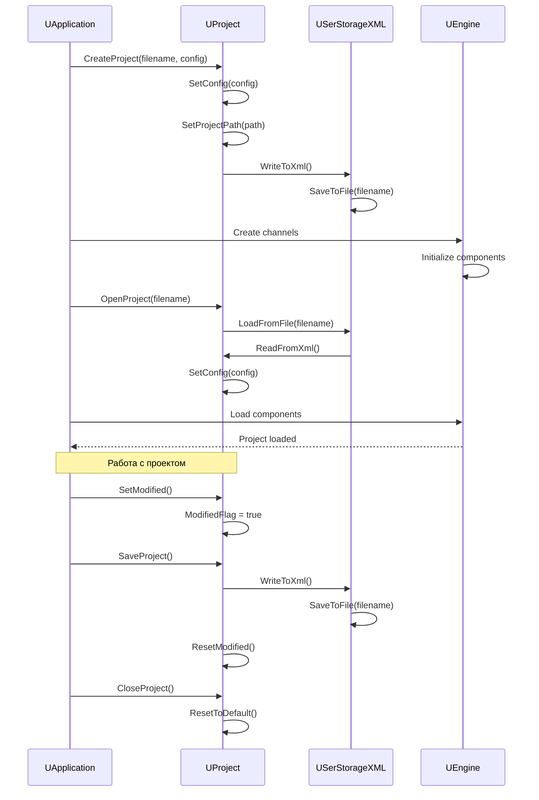
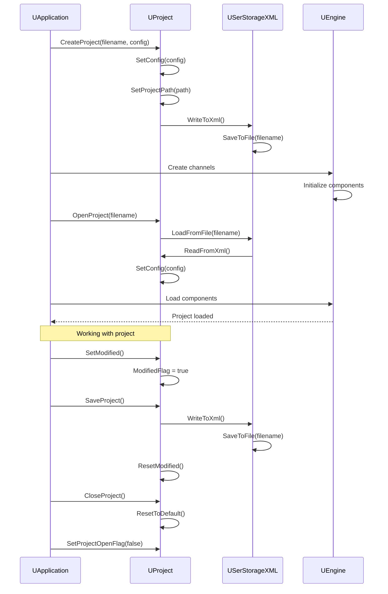
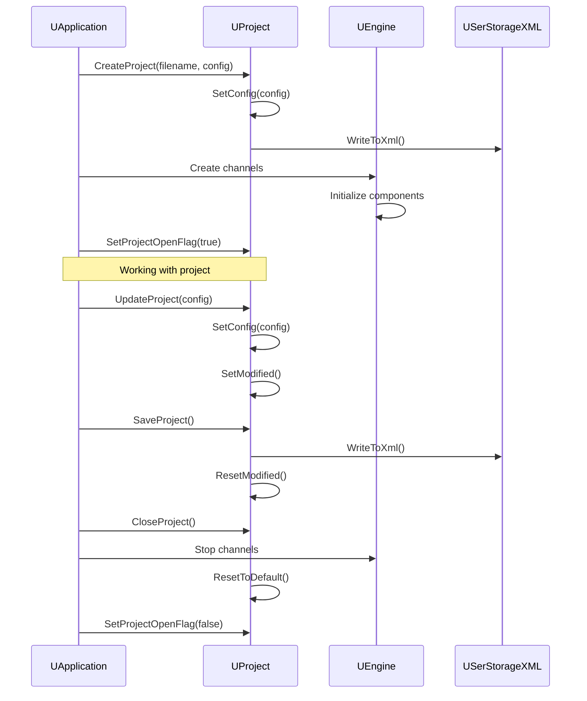

# Управление проектами (Project Management)

## RU

### Обзор

Система управления проектами Nmsdk предоставляет классы `UProject` и `UProjectDeployer` для создания, загрузки, сохранения и развертывания проектов. Проект представляет собой конфигурацию, содержащую описание компонентов, их параметры, соединения и настройки выполнения.

### Архитектура системы управления проектами

```mermaid
classDiagram
    class UProject {
        -TProjectConfig Config
        -std::string ProjectPath
        -bool ModifiedFlag
        -bool ForceOldXmlFormat
        -bool ForceNewConfigFilesStructure
        +GetConfig() TProjectConfig
        +SetConfig(TProjectConfig) bool
        +IsModified() bool
        +SetModified() bool
        +ResetModified() bool
        +GetProjectPath() std::string
        +SetProjectPath(std::string) bool
        +ReadFromXml(USerStorageXML) bool
        +WriteToXml(USerStorageXML) bool
        +GetNumChannels() int
        +SetNumChannels(int) bool
        +InsertChannel(int) bool
        +DeleteChannel(int) bool
    }
    
    class TProjectConfig {
        +std::string ProjectName
        +std::string ProjectDescription
        +std::string DescriptionFileName
        +std::string UserName
        +int UserId
        +std::string CreationTime
        +bool ProjectAutoSaveFlag
        +bool ProjectAutoSaveStatesFlag
        +bool EventsLogFlag
        +int ProjectMode
        +int ProjectType
        +int MultiThreadingMode
        +int CalcSourceTimeMode
        +int MTUpdateInterfaceInterval
        +int GuiUpdateMode
        +int NumChannels
        +std::vector~TProjectChannelConfig~ ChannelsConfig
        +GetNumChannels() int
        +SetNumChannels(int) bool
        +InsertChannel(int) bool
        +DeleteChannel(int) bool
    }
    
    class TProjectChannelConfig {
        +int ModelMode
        +int PredefinedStructure
        +std::string ModelFileName
        +std::string ParametersFileName
        +std::string StatesFileName
        +std::string ClassName
        +int GlobalTimeStep
        +int DefaultTimeStep
        +int CalculationMode
        +int MinInterstepsInterval
        +bool InitAfterLoad
        +bool ResetAfterLoad
        +bool DebugMode
        +unsigned int DebugSysEventsMask
        +bool DebuggerMessageFlag
        +bool EventsLogMode
        +std::string ChannelName
        +double MaxCalculationModelTime
        +bool UseIndTimeStepFlag
    }
    
    class UProjectDeployer {
        #UEPtr~UApplication~ Application
        #std::string database_address
        #std::string database_name
        #std::string database_login
        #std::string database_password
        #std::string ftp_remote_path
        #std::string temp_project_deployment_path
        +GetApplication() UEPtr~UApplication~
        +SetApplication(UEPtr~UApplication~) bool
        +StartProjectDeployment(int, bool) int
        +PrepareProject(std::string&) int
        +GetPreparationResult(std::string&) int
        +OpenPreparedProject(std::string&) int
        +RunPreparedProject() int
        +SetDatabaseAccess(...) void
        +AConnectToDatabase() void
        +GetDeploymentState() int
        +GetStageCap() int
        +GetStageProgress() int
        +GetLastError() std::string
        +GetProjectFileName() std::string
        +GetCalculationState() int
        +GetCaptureState(...) bool
        +ProcessCalculationLog(std::string&) bool
        +FinishCalculation() bool
        +UploadCalculationResults() bool
        +CloseSolver() bool
    }
    
    class UProjectDeployerQt {
        #QSqlDatabase* db
        #QString task_name
        #int task_id
        #int task_template_id
        #int task_weights_id
        #int task_src_type
        #int task_src_id
        #UProjectDeployProcessingThread* deployProcessingThread
        #UProjectResultsUploadingThread* projectResultsUploadingThread
        #DeploymentState deploymentState
        +StartProjectDeployment(int, bool) int
        +PrepareProject(std::string&) int
        +OpenPreparedProject(std::string&) int
        +RunPreparedProject() int
        +AConnectToDatabase() void
        +GetDeploymentState() int
        +GetStageCap() int
        +GetStageProgress() int
        +GetLastError() std::string
        +GetProjectFileName() std::string
        +GetCalculationState() int
        +GetCaptureState(...) bool
        +ProcessCalculationLog(std::string&) bool
        +FinishCalculation() bool
        +UploadCalculationResults() bool
        +CloseSolver() bool
        +UpdateTaskStateInDb(...) void
    }
    
    class UApplication {
        +CreateProject(std::string, TProjectConfig) bool
        +OpenProject(std::string) bool
        +SaveProject() bool
        +UpdateProject(TProjectConfig) bool
        +CloseProject() void
    }
    
    UProject --> TProjectConfig : содержит
    TProjectConfig --> TProjectChannelConfig : содержит массив
    UProjectDeployer --> UApplication : использует
    UProjectDeployerQt --|> UProjectDeployer : наследует
    UApplication --> UProject : использует
```



### Класс UProject

`UProject` - основной класс для управления конфигурацией проекта. Он отвечает за загрузку и сохранение проектов из XML файлов, отслеживание изменений и управление каналами проекта.

#### Основные методы

**Управление конфигурацией:**
- `GetConfig()` - получить текущую конфигурацию проекта
- `SetConfig(const TProjectConfig&)` - установить конфигурацию проекта
- `IsModified()` - проверить наличие несохраненных изменений
- `SetModified()` - отметить проект как измененный
- `ResetModified()` - сбросить флаг изменений
- `ResetToDefault()` - сбросить конфигурацию к значениям по умолчанию

**Работа с путями:**
- `GetProjectPath()` - получить путь к директории проекта
- `SetProjectPath(const std::string&)` - установить путь к проекту

**Сериализация:**
- `ReadFromXml(USerStorageXML&)` - загрузить конфигурацию из XML
- `WriteToXml(USerStorageXML&)` - сохранить конфигурацию в XML
- `FixSavePoint(USerStorageXML&)` - зафиксировать точку сохранения в истории

**Управление каналами:**
- `GetNumChannels()` - получить количество каналов
- `SetNumChannels(int)` - установить количество каналов
- `InsertChannel(int)` - вставить канал по индексу
- `DeleteChannel(int)` - удалить канал по индексу

#### Форматы XML конфигурации

Проект поддерживает три версии формата XML:

1. **Версия 1.0** (старый формат) - используется при `ForceOldXmlFormat == true`
2. **Версия 2.0** (новый формат) - стандартный новый формат
3. **Версия 2.1** (новый формат с новой файловой структурой) - используется при `ForceNewConfigFilesStructure == true`

**Различия между форматами:**

- **Версия 1.0**: Все каналы хранятся в одном узле с суффиксами (`ModelFileName_1`, `ModelFileName_2`, и т.д.)
- **Версия 2.0**: Каналы хранятся в отдельных узлах `Project/Channels/00`, `Project/Channels/01`, и т.д.
- **Версия 2.1**: Аналогично версии 2.0, но с улучшенной структурой имен файлов (`Model_00.xml`, `Model_01.xml`)

### Структура TProjectConfig

`TProjectConfig` содержит общие настройки проекта:

**Основная информация:**
- `ProjectName` - имя проекта
- `ProjectDescription` - описание проекта
- `DescriptionFileName` - имя файла описания (обычно `Description.rtf`)
- `UserName` - имя пользователя
- `UserId` - идентификатор пользователя
- `CreationTime` - время создания проекта

**Настройки сохранения:**
- `ProjectAutoSaveFlag` - автоматическое сохранение проекта при закрытии
- `ProjectAutoSaveStatesFlag` - автоматическое сохранение состояний моделей
- `EventsLogFlag` - сохранение лога событий в файл

**Режимы работы:**
- `ProjectMode` - режим проекта (0 - простой, 1 - сервер)
- `ProjectType` - тип проекта (0 - универсальный, 1 - видеоаналитика)
- `MultiThreadingMode` - режим многопоточности (0 - однопоточный, 1 - каждый канал в отдельном потоке)
- `CalcSourceTimeMode` - режим привязки времени модели (0 - к системному времени, 1 - ко времени источника данных)

**Настройки интерфейса:**
- `MTUpdateInterfaceInterval` - интервал обновления интерфейса в многопоточном режиме (мс)
- `GuiUpdateMode` - режим обновления GUI (0 - независимо от каналов, 1 - ожидание завершения расчета)
- `ShowChannelsStateFlag` - отображение состояния каналов
- `ProjectShowChannelsStates` - флаг отображения состояний каналов

**Настройки сервера:**
- `ServerInterfaceAddress` - адрес интерфейса управления сервером
- `ServerInterfacePort` - порт интерфейса управления сервером
- `HttpServerInterfaceAddress` - адрес HTTP интерфейса сервера
- `HttpServerInterfacePort` - порт HTTP интерфейса сервера
- `HttpServerLogin` - логин для подключения к серверу
- `HttpServerPassword` - пароль для подключения к серверу

**Настройки отладки:**
- `DebugMode` - включить отладочный режим
- `DebugSysEventsMask` - маска системных событий для логирования
- `DebuggerMessageFlag` - вывод лога в отладчик
- `EventsLogMode` - запись событий в отдельный лог-файл
- `OverrideLogParameters` - переопределять глобальные настройки логов

**Каналы:**
- `NumChannels` - количество каналов
- `ChannelsConfig` - массив конфигураций каналов

### Структура TProjectChannelConfig

`TProjectChannelConfig` содержит настройки отдельного канала проекта:

**Источник модели:**
- `ModelMode` - вариант источника модели (0 - по умолчанию, 1 - предустановленная конфигурация, 2 - модель из файла, 3 - модель из класса хранилища)
- `PredefinedStructure` - идентификатор предустановленной конфигурации
- `ModelFileName` - имя файла модели
- `ParametersFileName` - имя файла параметров
- `StatesFileName` - имя файла состояний
- `ClassName` - имя класса компонента модели

**Настройки расчета:**
- `GlobalTimeStep` - глобальный шаг счета (мс)
- `DefaultTimeStep` - шаг счета по умолчанию (мс)
- `CalculationMode` - режим расчета
- `MinInterstepsInterval` - минимальный интервал между шагами расчета (мс)
- `MaxCalculationModelTime` - максимально допустимое время расчета модели
- `UseIndTimeStepFlag` - использование индивидуальных параметров TimeStep для каждого компонента

**Настройки загрузки:**
- `InitAfterLoad` - инициализировать канал после загрузки
- `ResetAfterLoad` - сбросить расчет после загрузки

**Настройки отладки:**
- `DebugMode` - использовать отладочный режим
- `DebugSysEventsMask` - маска системных событий для логирования
- `DebuggerMessageFlag` - флаг включения вывода лога в отладчик
- `EventsLogMode` - включить запись событий в отдельный лог-файл канала

**Прочее:**
- `ChannelName` - имя канала

### Жизненный цикл проекта



### Примеры использования UProject

#### Создание нового проекта

```cpp
#include "UProject.h"
#include "USerStorageXML.h"

using namespace RDK;

// Создание конфигурации проекта
TProjectConfig config;
config.ProjectName = "MyProject";
config.ProjectDescription = "Описание проекта";
config.NumChannels = 2;
config.ChannelsConfig.resize(2);

// Настройка первого канала
config.ChannelsConfig[0].ModelFileName = "model.xml";
config.ChannelsConfig[0].ParametersFileName = "Parameters.xml";
config.ChannelsConfig[0].GlobalTimeStep = 30;
config.ChannelsConfig[0].DefaultTimeStep = 30;
config.ChannelsConfig[0].InitAfterLoad = true;
config.ChannelsConfig[0].ResetAfterLoad = true;

// Настройка второго канала
config.ChannelsConfig[1].ModelFileName = "model_01.xml";
config.ChannelsConfig[1].ParametersFileName = "Parameters_01.xml";
config.ChannelsConfig[1].GlobalTimeStep = 30;
config.ChannelsConfig[1].DefaultTimeStep = 30;

// Создание проекта
UProject project;
project.SetConfig(config);
project.SetProjectPath("/path/to/project/");

// Сохранение проекта
USerStorageXML xml;
xml.Create("Project");
project.WriteToXml(xml);
xml.SaveToFile("/path/to/project/project.ini");
```

#### Загрузка существующего проекта

```cpp
#include "UProject.h"
#include "USerStorageXML.h"

using namespace RDK;

UProject project;
USerStorageXML xml;

// Загрузка проекта
if (xml.LoadFromFile("/path/to/project/project.ini", ""))
{
    project.SetProjectPath("/path/to/project/");
    if (project.ReadFromXml(xml))
    {
        TProjectConfig config = project.GetConfig();
        std::cout << "Проект загружен: " << config.ProjectName << std::endl;
        std::cout << "Количество каналов: " << config.NumChannels << std::endl;
    }
}
```

#### Изменение конфигурации проекта

```cpp
using namespace RDK;

UProject project;
// ... загрузка проекта ...

TProjectConfig config = project.GetConfig();

// Изменение настроек
config.ProjectName = "Updated Project Name";
config.MultiThreadingMode = 1; // Многопоточный режим
config.ChannelsConfig[0].GlobalTimeStep = 60; // Изменить шаг времени

// Применение изменений
project.SetConfig(config);
project.SetModified(); // Отметить как измененный

// Сохранение
USerStorageXML xml;
xml.Create("Project");
project.WriteToXml(xml);
xml.SaveToFile("/path/to/project/project.ini");
project.ResetModified();
```

#### Управление каналами

```cpp
using namespace RDK;

UProject project;
// ... загрузка проекта ...

// Добавить новый канал
int newChannelIndex = project.GetNumChannels();
project.InsertChannel(newChannelIndex);

TProjectConfig config = project.GetConfig();
config.ChannelsConfig[newChannelIndex].ModelFileName = "model_new.xml";
config.ChannelsConfig[newChannelIndex].GlobalTimeStep = 30;
project.SetConfig(config);

// Удалить канал (нельзя удалить последний)
if (project.GetNumChannels() > 1)
{
    project.DeleteChannel(0);
}
```

### Класс UProjectDeployer

`UProjectDeployer` - базовый класс для развертывания проектов на удаленные системы. Он предоставляет интерфейс для загрузки проектов из базы данных, подготовки их к выполнению и управления процессом расчета.

#### Основные методы

**Развертывание проекта:**
- `StartProjectDeployment(int task_id, bool standalone)` - начать развертывание проекта по ID задачи
- `PrepareProject(std::string& response)` - подготовить проект к запуску
- `GetPreparationResult(std::string& response)` - получить результат подготовки
- `OpenPreparedProject(std::string& response)` - открыть подготовленный проект
- `RunPreparedProject()` - запустить подготовленный проект

**Управление базой данных:**
- `SetDatabaseAccess(...)` - задать параметры подключения к СУБД
- `AConnectToDatabase()` - установить соединение с базой данных

**Мониторинг состояния:**
- `GetDeploymentState()` - получить состояние развертывания
- `GetStageCap()` - получить максимум прогресса текущего этапа
- `GetStageProgress()` - получить текущий прогресс этапа
- `GetLastError()` - получить последнюю ошибку
- `GetProjectFileName()` - получить имя файла проекта

**Управление расчетом:**
- `GetCalculationState()` - получить состояние потока расчета
- `GetCaptureState(...)` - получить состояние активного компонента захвата
- `ProcessCalculationLog(std::string&)` - обработать накопившийся лог
- `FinishCalculation()` - завершить расчет проекта
- `UploadCalculationResults()` - отправить результаты расчета
- `CloseSolver()` - закрыть солвер

**Настройки путей:**
- `SetFtpRemotePath(const std::string&)` - установить путь к FTP серверу
- `SetTempProjectDeploymentPath(const std::string&)` - установить путь к временной директории развертывания
- `GetTempProjectDeploymentPath()` - получить путь к временной директории

### Класс UProjectDeployerQt

`UProjectDeployerQt` - Qt-реализация `UProjectDeployer`, предоставляющая полную функциональность для развертывания проектов с использованием базы данных SQLite/PostgreSQL и FTP сервера.

#### Состояния развертывания (DeploymentState)

```cpp
enum DeploymentState
{
    DS_NULL = 0,
    DS_Unknown = 1,
    DS_DownloadTemplate = 2,
    DS_UnpackTemplate = 3,
    DS_DownloadWeights = 4,
    DS_UnpackWeights = 5,
    DS_DownloadScripts = 6,
    DS_UnpackScripts = 7,
    DS_DownloadData = 8,
    DS_UnpackData = 9,
    DS_DeployFinished = 10,
    DS_CopyProject = 11,
    DS_PrepareProject = 12,
    DS_ProjectPrepared = 13,
    DS_OpenProject = 14,
    DS_ProjectOpened = 15,
    DS_Calculation = 16,
    DS_ProjectClosed = 17,
    DS_CopyResults = 18,
    DS_PackResults = 19,
    DS_UploadResults = 20,
    DS_UploadFinished = 21,
    DS_Error = 100
};
```

#### Состояния задачи в базе данных (DatabaseTaskStatus)

```cpp
enum DatabaseTaskStatus
{
    TS_New = 0,           // Новая задача
    TS_Accepted = 1,       // Принята в обработку
    TS_Deployment = 2,    // Развертывание
    TS_Calculation = 3,   // Расчет
    TS_Finished = 4,      // Завершена
    TS_Error = 1000        // Ошибка
};
```

#### Процесс развертывания проекта

```mermaid
flowchart TB
    Start[StartProjectDeployment] --> ConnectDB[Подключение к БД]
    ConnectDB --> LoadTask[Загрузка задачи из БД]
    LoadTask --> CheckTemplate{Нужен шаблон?}
    CheckTemplate -->|Да| DownloadTemplate[Загрузка шаблона с FTP]
    CheckTemplate -->|Нет| CheckWeights{Нужны веса?}
    DownloadTemplate --> UnpackTemplate[Распаковка шаблона]
    UnpackTemplate --> CheckWeights
    CheckWeights -->|Да| DownloadWeights[Загрузка весов с FTP]
    CheckWeights -->|Нет| CheckScript{Нужен скрипт?}
    DownloadWeights --> UnpackWeights[Распаковка весов]
    UnpackWeights --> CheckScript
    CheckScript -->|Да| DownloadScript[Загрузка скрипта с FTP]
    CheckScript -->|Нет| CheckData{Нужны данные?}
    DownloadScript --> UnpackScript[Распаковка скрипта]
    UnpackScript --> CheckData
    CheckData -->|Да| DownloadData[Загрузка данных с FTP]
    CheckData -->|Нет| CopyProject[Копирование проекта]
    DownloadData --> UnpackData[Распаковка данных]
    UnpackData --> CopyProject
    CopyProject --> PrepareProject[PrepareProject]
    PrepareProject --> OpenMock[Открытие в mock режиме]
    OpenMock --> SetupParams[Настройка параметров]
    SetupParams --> CloseMock[Закрытие mock проекта]
    CloseMock --> ProjectPrepared[Проект подготовлен]
    ProjectPrepared --> OpenProject[OpenPreparedProject]
    OpenProject --> RunProject[RunPreparedProject]
    RunProject --> Calculation[Расчет проекта]
    Calculation --> FinishCalc[FinishCalculation]
    FinishCalc --> UploadResults[UploadCalculationResults]
    UploadResults --> CloseSolver[CloseSolver]
    CloseSolver --> End[Завершено]
```



#### Пример использования UProjectDeployerQt

```cpp
#include "UProjectDeployerQt.h"
#include "UApplication.h"

using namespace RDK;

// Создание деплоера
UProjectDeployerQt* deployer = new UProjectDeployerQt();

// Настройка подключения к базе данных
deployer->SetDatabaseAccess(
    "localhost",           // адрес БД
    "nmsdk_db",           // имя БД
    "user",               // логин
    "password"            // пароль
);

// Настройка путей
deployer->SetFtpRemotePath("ftp://server.com/projects/");
deployer->SetTempProjectDeploymentPath("/tmp/nmsdk_deploy/");

// Установка связи с приложением
UEPtr<UApplication> app = /* ... получить приложение ... */;
deployer->SetApplication(app);

// Запуск развертывания задачи с ID = 123
std::string response;
int result = deployer->StartProjectDeployment(123, false);

if (result == 0)
{
    // Мониторинг прогресса развертывания
    while (deployer->GetDeploymentState() < DS_DeployFinished)
    {
        int state = deployer->GetDeploymentState();
        int progress = deployer->GetStageProgress();
        int cap = deployer->GetStageCap();
        
        std::cout << "Состояние: " << state 
                  << ", Прогресс: " << progress << "/" << cap << std::endl;
        
        // Проверка ошибок
        std::string error = deployer->GetLastError();
        if (!error.empty())
        {
            std::cerr << "Ошибка: " << error << std::endl;
            break;
        }
        
        std::this_thread::sleep_for(std::chrono::milliseconds(100));
    }
    
    // Подготовка проекта
    result = deployer->PrepareProject(response);
    if (result == 0)
    {
        // Открытие подготовленного проекта
        result = deployer->OpenPreparedProject(response);
        if (result == 0)
        {
            // Запуск расчета
            result = deployer->RunPreparedProject();
            
            // Мониторинг расчета
            while (deployer->GetCalculationState() != -1)
            {
                int state;
                unsigned long long frame_id, max_frame_id;
                if (deployer->GetCaptureState(state, frame_id, max_frame_id))
                {
                    std::cout << "Кадр: " << frame_id << "/" << max_frame_id << std::endl;
                }
                
                // Обработка лога
                std::string log_error;
                if (!deployer->ProcessCalculationLog(log_error))
                {
                    std::cerr << "Ошибка в логе: " << log_error << std::endl;
                    break;
                }
                
                std::this_thread::sleep_for(std::chrono::milliseconds(100));
            }
            
            // Завершение расчета
            deployer->FinishCalculation();
            
            // Загрузка результатов
            deployer->UploadCalculationResults();
            
            // Закрытие солвера
            deployer->CloseSolver();
        }
    }
}
```

### Интеграция с UApplication

`UProject` тесно интегрирован с `UApplication` для управления жизненным циклом проектов:


### Лучшие практики

1. **Всегда проверяйте флаг изменений** перед закрытием проекта:
```cpp
if (project.IsModified())
{
    // Предложить пользователю сохранить изменения
    if (userWantsToSave)
    {
        project.SaveProject();
    }
}
```

2. **Используйте правильный формат XML** в зависимости от требований:
```cpp
// Для совместимости со старыми версиями
project.SetForceOldXmlFormat(true);

// Для новой файловой структуры
project.SetForceNewConfigFilesStructure(true);
```

3. **Проверяйте результаты операций**:
```cpp
if (!project.ReadFromXml(xml))
{
    std::cerr << "Ошибка загрузки проекта" << std::endl;
    return false;
}
```

4. **Используйте транзакции при работе с базой данных** в `UProjectDeployerQt`:
```cpp
QSqlDatabase* db = deployer->GetDatabase();
db->transaction();
// ... операции с БД ...
if (success)
    db->commit();
else
    db->rollback();
```

5. **Обрабатывайте ошибки развертывания**:
```cpp
std::string error = deployer->GetLastError();
if (!error.empty())
{
    // Логирование и обработка ошибки
    logger->LogError("Deployment error: " + error);
    deployer->CloseSolver();
    return false;
}
```

### См. также

- [Application Architecture](../Architecture/Application-Architecture.md) - архитектура приложения
- [Component System](Component-System.md) - компонентная система
- [Configuration Management](../Configuration-Management.md) - управление конфигурациями
- [Bin/Docs/Configs-Structure.md](../../../Bin/Docs/Configs-Structure.md) - структура конфигурационных файлов

---

## EN

### Overview

The Nmsdk project management system provides `UProject` and `UProjectDeployer` classes for creating, loading, saving, and deploying projects. A project represents a configuration containing component descriptions, their parameters, connections, and execution settings.

### Project Management System Architecture

```mermaid
classDiagram
    class UProject {
        -TProjectConfig Config
        -std::string ProjectPath
        -bool ModifiedFlag
        -bool ForceOldXmlFormat
        -bool ForceNewConfigFilesStructure
        +GetConfig() TProjectConfig
        +SetConfig(TProjectConfig) bool
        +IsModified() bool
        +SetModified() bool
        +ResetModified() bool
        +GetProjectPath() std::string
        +SetProjectPath(std::string) bool
        +ReadFromXml(USerStorageXML) bool
        +WriteToXml(USerStorageXML) bool
        +GetNumChannels() int
        +SetNumChannels(int) bool
        +InsertChannel(int) bool
        +DeleteChannel(int) bool
    }
    
    class TProjectConfig {
        +std::string ProjectName
        +std::string ProjectDescription
        +std::string DescriptionFileName
        +std::string UserName
        +int UserId
        +std::string CreationTime
        +bool ProjectAutoSaveFlag
        +bool ProjectAutoSaveStatesFlag
        +bool EventsLogFlag
        +int ProjectMode
        +int ProjectType
        +int MultiThreadingMode
        +int CalcSourceTimeMode
        +int MTUpdateInterfaceInterval
        +int GuiUpdateMode
        +int NumChannels
        +std::vector~TProjectChannelConfig~ ChannelsConfig
        +GetNumChannels() int
        +SetNumChannels(int) bool
        +InsertChannel(int) bool
        +DeleteChannel(int) bool
    }
    
    class TProjectChannelConfig {
        +int ModelMode
        +int PredefinedStructure
        +std::string ModelFileName
        +std::string ParametersFileName
        +std::string StatesFileName
        +std::string ClassName
        +int GlobalTimeStep
        +int DefaultTimeStep
        +int CalculationMode
        +int MinInterstepsInterval
        +bool InitAfterLoad
        +bool ResetAfterLoad
        +bool DebugMode
        +unsigned int DebugSysEventsMask
        +bool DebuggerMessageFlag
        +bool EventsLogMode
        +std::string ChannelName
        +double MaxCalculationModelTime
        +bool UseIndTimeStepFlag
    }
    
    class UProjectDeployer {
        #UEPtr~UApplication~ Application
        #std::string database_address
        #std::string database_name
        #std::string database_login
        #std::string database_password
        #std::string ftp_remote_path
        #std::string temp_project_deployment_path
        +GetApplication() UEPtr~UApplication~
        +SetApplication(UEPtr~UApplication~) bool
        +StartProjectDeployment(int, bool) int
        +PrepareProject(std::string&) int
        +GetPreparationResult(std::string&) int
        +OpenPreparedProject(std::string&) int
        +RunPreparedProject() int
        +SetDatabaseAccess(...) void
        +AConnectToDatabase() void
        +GetDeploymentState() int
        +GetStageCap() int
        +GetStageProgress() int
        +GetLastError() std::string
        +GetProjectFileName() std::string
        +GetCalculationState() int
        +GetCaptureState(...) bool
        +ProcessCalculationLog(std::string&) bool
        +FinishCalculation() bool
        +UploadCalculationResults() bool
        +CloseSolver() bool
    }
    
    class UProjectDeployerQt {
        #QSqlDatabase* db
        #QString task_name
        #int task_id
        #int task_template_id
        #int task_weights_id
        #int task_src_type
        #int task_src_id
        #UProjectDeployProcessingThread* deployProcessingThread
        #UProjectResultsUploadingThread* projectResultsUploadingThread
        #DeploymentState deploymentState
        +StartProjectDeployment(int, bool) int
        +PrepareProject(std::string&) int
        +OpenPreparedProject(std::string&) int
        +RunPreparedProject() int
        +AConnectToDatabase() void
        +GetDeploymentState() int
        +GetStageCap() int
        +GetStageProgress() int
        +GetLastError() std::string
        +GetProjectFileName() std::string
        +GetCalculationState() int
        +GetCaptureState(...) bool
        +ProcessCalculationLog(std::string&) bool
        +FinishCalculation() bool
        +UploadCalculationResults() bool
        +CloseSolver() bool
        +UpdateTaskStateInDb(...) void
    }
    
    class UApplication {
        +CreateProject(std::string, TProjectConfig) bool
        +OpenProject(std::string) bool
        +SaveProject() bool
        +UpdateProject(TProjectConfig) bool
        +CloseProject() void
    }
    
    UProject --> TProjectConfig : contains
    TProjectConfig --> TProjectChannelConfig : contains array
    UProjectDeployer --> UApplication : uses
    UProjectDeployerQt --|> UProjectDeployer : inherits
    UApplication --> UProject : uses
```



### UProject Class

`UProject` is the main class for managing project configuration. It is responsible for loading and saving projects from XML files, tracking changes, and managing project channels.

#### Key Methods

**Configuration Management:**
- `GetConfig()` - get current project configuration
- `SetConfig(const TProjectConfig&)` - set project configuration
- `IsModified()` - check for unsaved changes
- `SetModified()` - mark project as modified
- `ResetModified()` - reset modification flag
- `ResetToDefault()` - reset configuration to default values

**Path Management:**
- `GetProjectPath()` - get project directory path
- `SetProjectPath(const std::string&)` - set project path

**Serialization:**
- `ReadFromXml(USerStorageXML&)` - load configuration from XML
- `WriteToXml(USerStorageXML&)` - save configuration to XML
- `FixSavePoint(USerStorageXML&)` - fix save point in history

**Channel Management:**
- `GetNumChannels()` - get number of channels
- `SetNumChannels(int)` - set number of channels
- `InsertChannel(int)` - insert channel at index
- `DeleteChannel(int)` - delete channel at index

#### XML Configuration Formats

The project supports three XML format versions:

1. **Version 1.0** (old format) - used when `ForceOldXmlFormat == true`
2. **Version 2.0** (new format) - standard new format
3. **Version 2.1** (new format with new file structure) - used when `ForceNewConfigFilesStructure == true`

**Format Differences:**

- **Version 1.0**: All channels stored in one node with suffixes (`ModelFileName_1`, `ModelFileName_2`, etc.)
- **Version 2.0**: Channels stored in separate nodes `Project/Channels/00`, `Project/Channels/01`, etc.
- **Version 2.1**: Similar to version 2.0, but with improved file naming structure (`Model_00.xml`, `Model_01.xml`)

### TProjectConfig Structure

`TProjectConfig` contains general project settings:

**Basic Information:**
- `ProjectName` - project name
- `ProjectDescription` - project description
- `DescriptionFileName` - description file name (usually `Description.rtf`)
- `UserName` - user name
- `UserId` - user identifier
- `CreationTime` - project creation time

**Save Settings:**
- `ProjectAutoSaveFlag` - auto-save project on close
- `ProjectAutoSaveStatesFlag` - auto-save model states
- `EventsLogFlag` - save event log to file

**Operation Modes:**
- `ProjectMode` - project mode (0 - simple, 1 - server)
- `ProjectType` - project type (0 - universal, 1 - video analytics)
- `MultiThreadingMode` - multithreading mode (0 - single-threaded, 1 - each channel in separate thread)
- `CalcSourceTimeMode` - model time binding mode (0 - to system time, 1 - to data source time)

**Interface Settings:**
- `MTUpdateInterfaceInterval` - interface update interval in multithreading mode (ms)
- `GuiUpdateMode` - GUI update mode (0 - independent of channels, 1 - wait for calculation completion)
- `ShowChannelsStateFlag` - show channel states
- `ProjectShowChannelsStates` - flag to show channel states

**Server Settings:**
- `ServerInterfaceAddress` - server management interface address
- `ServerInterfacePort` - server management interface port
- `HttpServerInterfaceAddress` - HTTP server interface address
- `HttpServerInterfacePort` - HTTP server interface port
- `HttpServerLogin` - server connection login
- `HttpServerPassword` - server connection password

**Debug Settings:**
- `DebugMode` - enable debug mode
- `DebugSysEventsMask` - system events mask for logging
- `DebuggerMessageFlag` - output log to debugger
- `EventsLogMode` - write events to separate log file
- `OverrideLogParameters` - override global log settings

**Channels:**
- `NumChannels` - number of channels
- `ChannelsConfig` - array of channel configurations

### TProjectChannelConfig Structure

`TProjectChannelConfig` contains settings for an individual project channel:

**Model Source:**
- `ModelMode` - model source variant (0 - default, 1 - predefined configuration, 2 - model from file, 3 - model from storage class)
- `PredefinedStructure` - predefined configuration identifier
- `ModelFileName` - model file name
- `ParametersFileName` - parameters file name
- `StatesFileName` - states file name
- `ClassName` - model component class name

**Calculation Settings:**
- `GlobalTimeStep` - global calculation step (ms)
- `DefaultTimeStep` - default calculation step (ms)
- `CalculationMode` - calculation mode
- `MinInterstepsInterval` - minimum interval between calculation steps (ms)
- `MaxCalculationModelTime` - maximum allowed model calculation time
- `UseIndTimeStepFlag` - use individual TimeStep parameters for each component

**Load Settings:**
- `InitAfterLoad` - initialize channel after load
- `ResetAfterLoad` - reset calculation after load

**Debug Settings:**
- `DebugMode` - use debug mode
- `DebugSysEventsMask` - system events mask for logging
- `DebuggerMessageFlag` - flag to enable log output to debugger
- `EventsLogMode` - enable event logging to separate channel log file

**Other:**
- `ChannelName` - channel name

### Project Lifecycle



### UProject Usage Examples

#### Creating a New Project

```cpp
#include "UProject.h"
#include "USerStorageXML.h"

using namespace RDK;

// Create project configuration
TProjectConfig config;
config.ProjectName = "MyProject";
config.ProjectDescription = "Project description";
config.NumChannels = 2;
config.ChannelsConfig.resize(2);

// Configure first channel
config.ChannelsConfig[0].ModelFileName = "model.xml";
config.ChannelsConfig[0].ParametersFileName = "Parameters.xml";
config.ChannelsConfig[0].GlobalTimeStep = 30;
config.ChannelsConfig[0].DefaultTimeStep = 30;
config.ChannelsConfig[0].InitAfterLoad = true;
config.ChannelsConfig[0].ResetAfterLoad = true;

// Configure second channel
config.ChannelsConfig[1].ModelFileName = "model_01.xml";
config.ChannelsConfig[1].ParametersFileName = "Parameters_01.xml";
config.ChannelsConfig[1].GlobalTimeStep = 30;
config.ChannelsConfig[1].DefaultTimeStep = 30;

// Create project
UProject project;
project.SetConfig(config);
project.SetProjectPath("/path/to/project/");

// Save project
USerStorageXML xml;
xml.Create("Project");
project.WriteToXml(xml);
xml.SaveToFile("/path/to/project/project.ini");
```

#### Loading an Existing Project

```cpp
#include "UProject.h"
#include "USerStorageXML.h"

using namespace RDK;

UProject project;
USerStorageXML xml;

// Load project
if (xml.LoadFromFile("/path/to/project/project.ini", ""))
{
    project.SetProjectPath("/path/to/project/");
    if (project.ReadFromXml(xml))
    {
        TProjectConfig config = project.GetConfig();
        std::cout << "Project loaded: " << config.ProjectName << std::endl;
        std::cout << "Number of channels: " << config.NumChannels << std::endl;
    }
}
```

#### Modifying Project Configuration

```cpp
using namespace RDK;

UProject project;
// ... load project ...

TProjectConfig config = project.GetConfig();

// Modify settings
config.ProjectName = "Updated Project Name";
config.MultiThreadingMode = 1; // Multithreading mode
config.ChannelsConfig[0].GlobalTimeStep = 60; // Change time step

// Apply changes
project.SetConfig(config);
project.SetModified(); // Mark as modified

// Save
USerStorageXML xml;
xml.Create("Project");
project.WriteToXml(xml);
xml.SaveToFile("/path/to/project/project.ini");
project.ResetModified();
```

#### Channel Management

```cpp
using namespace RDK;

UProject project;
// ... load project ...

// Add new channel
int newChannelIndex = project.GetNumChannels();
project.InsertChannel(newChannelIndex);

TProjectConfig config = project.GetConfig();
config.ChannelsConfig[newChannelIndex].ModelFileName = "model_new.xml";
config.ChannelsConfig[newChannelIndex].GlobalTimeStep = 30;
project.SetConfig(config);

// Delete channel (cannot delete the last one)
if (project.GetNumChannels() > 1)
{
    project.DeleteChannel(0);
}
```

### UProjectDeployer Class

`UProjectDeployer` is a base class for deploying projects to remote systems. It provides an interface for loading projects from a database, preparing them for execution, and managing the calculation process.

#### Key Methods

**Project Deployment:**
- `StartProjectDeployment(int task_id, bool standalone)` - start project deployment by task ID
- `PrepareProject(std::string& response)` - prepare project for launch
- `GetPreparationResult(std::string& response)` - get preparation result
- `OpenPreparedProject(std::string& response)` - open prepared project
- `RunPreparedProject()` - run prepared project

**Database Management:**
- `SetDatabaseAccess(...)` - set database connection parameters
- `AConnectToDatabase()` - establish database connection

**State Monitoring:**
- `GetDeploymentState()` - get deployment state
- `GetStageCap()` - get current stage progress maximum
- `GetStageProgress()` - get current stage progress
- `GetLastError()` - get last error
- `GetProjectFileName()` - get project file name

**Calculation Management:**
- `GetCalculationState()` - get calculation thread state
- `GetCaptureState(...)` - get active capture component state
- `ProcessCalculationLog(std::string&)` - process accumulated log
- `FinishCalculation()` - finish project calculation
- `UploadCalculationResults()` - upload calculation results
- `CloseSolver()` - close solver

**Path Settings:**
- `SetFtpRemotePath(const std::string&)` - set FTP server path
- `SetTempProjectDeploymentPath(const std::string&)` - set temporary deployment directory path
- `GetTempProjectDeploymentPath()` - get temporary deployment directory path

### UProjectDeployerQt Class

`UProjectDeployerQt` is a Qt implementation of `UProjectDeployer`, providing full functionality for deploying projects using SQLite/PostgreSQL database and FTP server.

#### Deployment States (DeploymentState)

```cpp
enum DeploymentState
{
    DS_NULL = 0,
    DS_Unknown = 1,
    DS_DownloadTemplate = 2,
    DS_UnpackTemplate = 3,
    DS_DownloadWeights = 4,
    DS_UnpackWeights = 5,
    DS_DownloadScripts = 6,
    DS_UnpackScripts = 7,
    DS_DownloadData = 8,
    DS_UnpackData = 9,
    DS_DeployFinished = 10,
    DS_CopyProject = 11,
    DS_PrepareProject = 12,
    DS_ProjectPrepared = 13,
    DS_OpenProject = 14,
    DS_ProjectOpened = 15,
    DS_Calculation = 16,
    DS_ProjectClosed = 17,
    DS_CopyResults = 18,
    DS_PackResults = 19,
    DS_UploadResults = 20,
    DS_UploadFinished = 21,
    DS_Error = 100
};
```

#### Database Task Status (DatabaseTaskStatus)

```cpp
enum DatabaseTaskStatus
{
    TS_New = 0,           // New task
    TS_Accepted = 1,      // Accepted for processing
    TS_Deployment = 2,     // Deployment
    TS_Calculation = 3,   // Calculation
    TS_Finished = 4,       // Finished
    TS_Error = 1000       // Error
};
```

#### Project Deployment Process

```mermaid
flowchart TB
    Start[StartProjectDeployment] --> ConnectDB[Connect to DB]
    ConnectDB --> LoadTask[Load task from DB]
    LoadTask --> CheckTemplate{Template needed?}
    CheckTemplate -->|Yes| DownloadTemplate[Download template from FTP]
    CheckTemplate -->|No| CheckWeights{Weights needed?}
    DownloadTemplate --> UnpackTemplate[Unpack template]
    UnpackTemplate --> CheckWeights
    CheckWeights -->|Yes| DownloadWeights[Download weights from FTP]
    CheckWeights -->|No| CheckScript{Script needed?}
    DownloadWeights --> UnpackWeights[Unpack weights]
    UnpackWeights --> CheckScript
    CheckScript -->|Yes| DownloadScript[Download script from FTP]
    CheckScript -->|No| CheckData{Data needed?}
    DownloadScript --> UnpackScript[Unpack script]
    UnpackScript --> CheckData
    CheckData -->|Yes| DownloadData[Download data from FTP]
    CheckData -->|No| CopyProject[Copy project]
    DownloadData --> UnpackData[Unpack data]
    UnpackData --> CopyProject
    CopyProject --> PrepareProject[PrepareProject]
    PrepareProject --> OpenMock[Open in mock mode]
    OpenMock --> SetupParams[Setup parameters]
    SetupParams --> CloseMock[Close mock project]
    CloseMock --> ProjectPrepared[Project prepared]
    ProjectPrepared --> OpenProject[OpenPreparedProject]
    OpenProject --> RunProject[RunPreparedProject]
    RunProject --> Calculation[Project calculation]
    Calculation --> FinishCalc[FinishCalculation]
    FinishCalc --> UploadResults[UploadCalculationResults]
    UploadResults --> CloseSolver[CloseSolver]
    CloseSolver --> End[Completed]
```



#### UProjectDeployerQt Usage Example

```cpp
#include "UProjectDeployerQt.h"
#include "UApplication.h"

using namespace RDK;

// Create deployer
UProjectDeployerQt* deployer = new UProjectDeployerQt();

// Configure database connection
deployer->SetDatabaseAccess(
    "localhost",           // DB address
    "nmsdk_db",           // DB name
    "user",               // login
    "password"            // password
);

// Configure paths
deployer->SetFtpRemotePath("ftp://server.com/projects/");
deployer->SetTempProjectDeploymentPath("/tmp/nmsdk_deploy/");

// Set application reference
UEPtr<UApplication> app = /* ... get application ... */;
deployer->SetApplication(app);

// Start deployment for task ID = 123
std::string response;
int result = deployer->StartProjectDeployment(123, false);

if (result == 0)
{
    // Monitor deployment progress
    while (deployer->GetDeploymentState() < DS_DeployFinished)
    {
        int state = deployer->GetDeploymentState();
        int progress = deployer->GetStageProgress();
        int cap = deployer->GetStageCap();
        
        std::cout << "State: " << state 
                  << ", Progress: " << progress << "/" << cap << std::endl;
        
        // Check for errors
        std::string error = deployer->GetLastError();
        if (!error.empty())
        {
            std::cerr << "Error: " << error << std::endl;
            break;
        }
        
        std::this_thread::sleep_for(std::chrono::milliseconds(100));
    }
    
    // Prepare project
    result = deployer->PrepareProject(response);
    if (result == 0)
    {
        // Open prepared project
        result = deployer->OpenPreparedProject(response);
        if (result == 0)
        {
            // Run calculation
            result = deployer->RunPreparedProject();
            
            // Monitor calculation
            while (deployer->GetCalculationState() != -1)
            {
                int state;
                unsigned long long frame_id, max_frame_id;
                if (deployer->GetCaptureState(state, frame_id, max_frame_id))
                {
                    std::cout << "Frame: " << frame_id << "/" << max_frame_id << std::endl;
                }
                
                // Process log
                std::string log_error;
                if (!deployer->ProcessCalculationLog(log_error))
                {
                    std::cerr << "Log error: " << log_error << std::endl;
                    break;
                }
                
                std::this_thread::sleep_for(std::chrono::milliseconds(100));
            }
            
            // Finish calculation
            deployer->FinishCalculation();
            
            // Upload results
            deployer->UploadCalculationResults();
            
            // Close solver
            deployer->CloseSolver();
        }
    }
}
```

### Integration with UApplication

`UProject` is closely integrated with `UApplication` for managing project lifecycle:



### Best Practices

1. **Always check modification flag** before closing project:
```cpp
if (project.IsModified())
{
    // Prompt user to save changes
    if (userWantsToSave)
    {
        project.SaveProject();
    }
}
```

2. **Use correct XML format** depending on requirements:
```cpp
// For compatibility with old versions
project.SetForceOldXmlFormat(true);

// For new file structure
project.SetForceNewConfigFilesStructure(true);
```

3. **Check operation results**:
```cpp
if (!project.ReadFromXml(xml))
{
    std::cerr << "Error loading project" << std::endl;
    return false;
}
```

4. **Use transactions when working with database** in `UProjectDeployerQt`:
```cpp
QSqlDatabase* db = deployer->GetDatabase();
db->transaction();
// ... database operations ...
if (success)
    db->commit();
else
    db->rollback();
```

5. **Handle deployment errors**:
```cpp
std::string error = deployer->GetLastError();
if (!error.empty())
{
    // Log and handle error
    logger->LogError("Deployment error: " + error);
    deployer->CloseSolver();
    return false;
}
```

### See Also

- [Bin/Docs/Configs-Structure.md](../../../Bin/Docs/Configs-Structure.md) - configuration file structure
- [Docs/Rdk-Core/Application-Architecture.md](../../../Docs/Rdk-Core/Application-Architecture.md) - application architecture
- [Docs/Components-And-Configuration/Component-System.md](../../../Docs/Components-And-Configuration/Component-System.md) - component system
