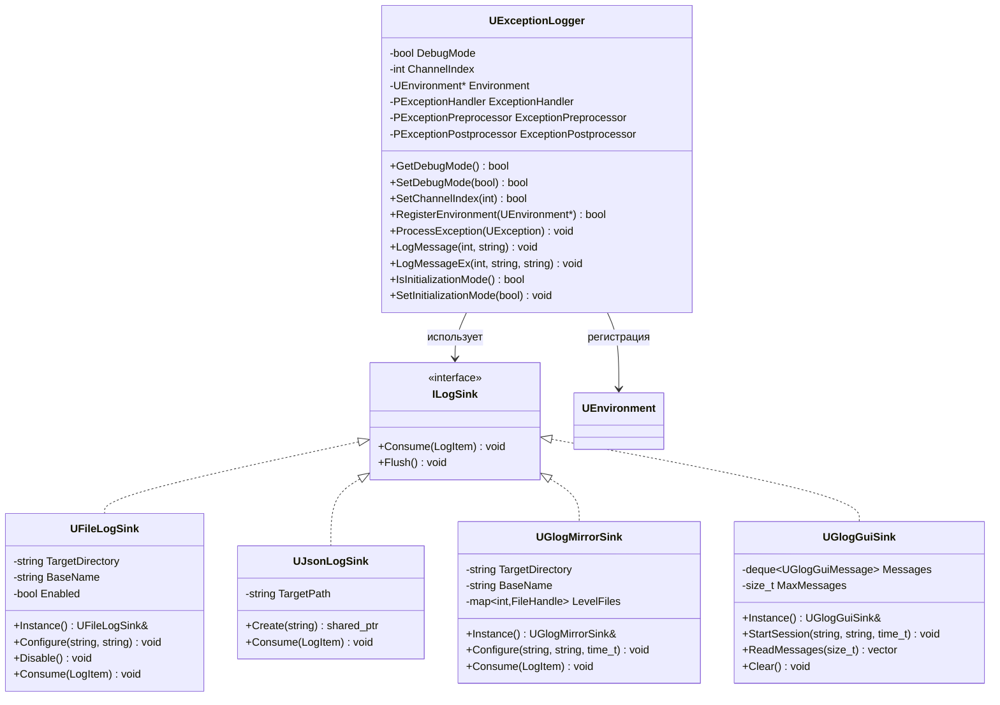
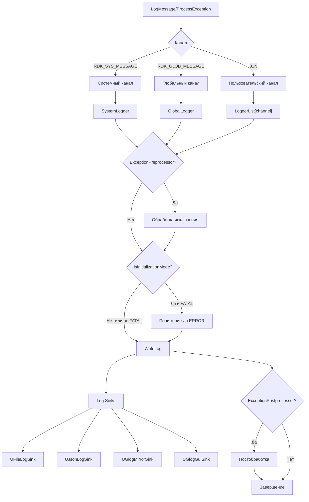
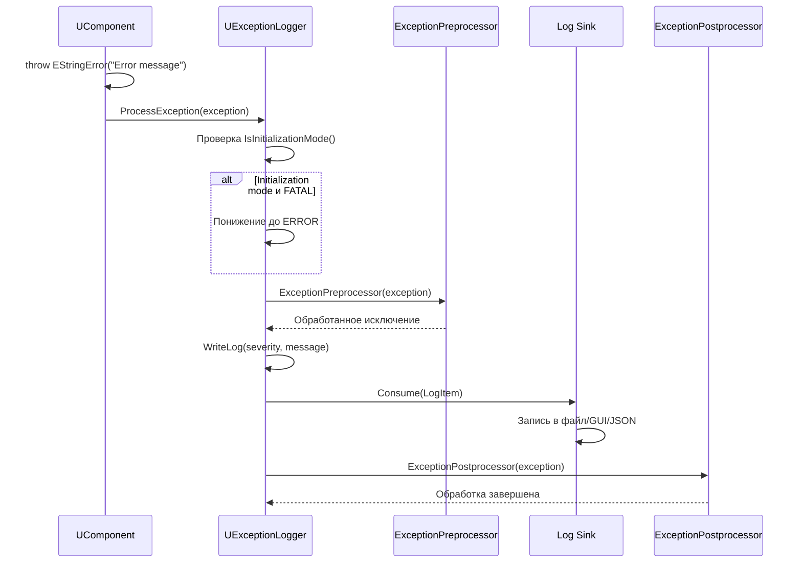
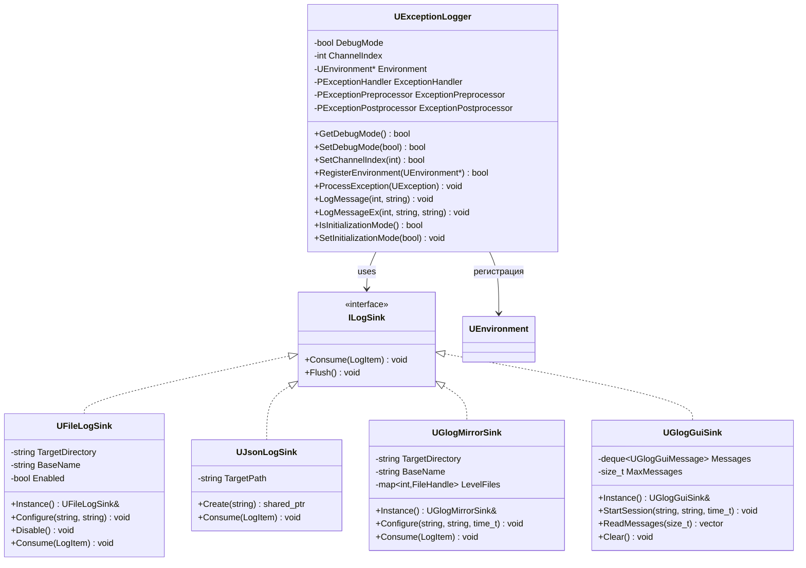
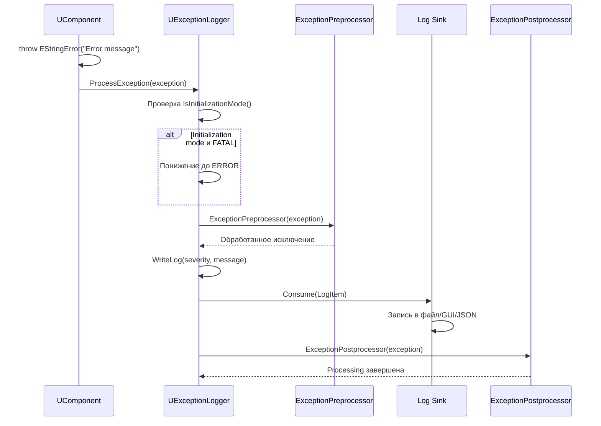

# Система логирования (Logging System)

## RU

### Обзор

Система логирования Nmsdk обеспечивает централизованное логирование сообщений, исключений и событий с поддержкой различных каналов, уровней серьезности и выходных форматов. Система построена на основе Google glog с дополнительными возможностями для интеграции с компонентами и GUI.

### Архитектура системы логирования

**Основные компоненты:**



### UExceptionLogger - Основной класс логирования

Класс для обработки исключений и логирования сообщений с поддержкой каналов, уровней серьезности и обработчиков.

#### Каналы логирования

Система поддерживает несколько каналов логирования:

- `RDK_SYS_MESSAGE` (-1) - системный канал для сообщений ядра
- `RDK_GLOB_MESSAGE` (-2) - глобальный канал, объединяющий сообщения со всех каналов
- `0..N` - каналы для отдельных компонентов/модулей

**Маршрутизация сообщений:**



#### Уровни логирования

Система поддерживает следующие уровни серьезности:

- `RDK_EX_UNKNOWN` (0) - Неизвестное исключение
- `RDK_EX_FATAL` (1) - Фатальная ошибка (исправление невозможно)
- `RDK_EX_ERROR` (2) - Исправимая ошибка
- `RDK_EX_WARNING` (3) - Предупреждение
- `RDK_EX_INFO` (4) - Информационное сообщение
- `RDK_EX_APP` (5) - Событие уровня приложения
- `RDK_EX_DEBUG` (6) - Отладочные сообщения

**Обработка исключений:**



#### Формат `UException::what()` для name-ошибок

`ProcessException` пишет `exception.what()`. Префикс: `[ObjectName> ][ExFileName:ExLineNumber ]`, затем `CreateLogMessage()`.

Для иерархии `ENameError` сообщения осмысленные (не только `Name=`):

| Тип | Текст |
|-----|--------|
| `ENameNotExist` (и `EComponentNameNotExist`, `EPointerNameNotExist`, `EPropertyNameNotExist`, …) | `name not found: X` |
| `ENameAlreadyExist` (и аналоги) | `name already exists: X` |
| `EComponentNameInvalid` | `invalid component name: X` |
| прочий `ENameError` | `name error: X` |

`ExFileName` / `ExLineNumber` выставляет `RDK_THROW` / `RDK_RAW_THROW`.

#### Режим инициализации

Режим инициализации (`IsInitializationMode()`) предотвращает фатальные краши во время инициализации системы, автоматически понижая уровень `RDK_EX_FATAL` до `RDK_EX_ERROR`.

**Примеры использования:**

```cpp
#include "Rdk/Core/Engine/UExceptionLogger.h"
#include "Rdk/Core/Engine/UEnvironment.h"

// Получение логгера для канала
RDK::UELockPtr<RDK::UEnvironment> env = RDK::GetEnvironmentLock();
if (env) {
    RDK::UExceptionLogger* logger = env->GetLogger();
    
    // Настройка режима отладки
    logger->SetDebugMode(true);
    
    // Настройка канала
    logger->SetChannelIndex(0); // канал компонента
    
    // Регистрация окружения
    logger->RegisterEnvironment(env.Get());
    
    // Логирование сообщений
    logger->LogMessage(RDK_EX_INFO, "Component initialized");
    logger->LogMessage(RDK_EX_WARNING, "Low memory detected");
    logger->LogMessage(RDK_EX_ERROR, "Calculation failed");
    
    // Логирование с именем объекта и метода
    logger->LogMessageEx(RDK_EX_DEBUG, "MyComponent", "ACalculate", 
                         "Starting calculation");
}

// Использование в компонентах
class MyComponent : public RDK::UContainer {
protected:
    virtual bool ACalculate(void) override {
        try {
            // Вычисления
            Logger->LogMessageEx(RDK_EX_INFO, GetName(), __FUNCTION__, 
                                "Calculation completed");
            return true;
        } catch (const RDK::UException& ex) {
            Logger->LogMessageEx(RDK_EX_ERROR, GetName(), __FUNCTION__, 
                                std::string("Error: ") + ex.what());
            return false;
        }
    }
};
```

#### Обработчики исключений

Система поддерживает три типа обработчиков:

1. **ExceptionHandler** - вызывается при обработке исключения
2. **ExceptionPreprocessor** - предобработка исключения перед логированием
3. **ExceptionPostprocessor** - постобработка после логирования

**Примеры использования обработчиков:**

```cpp
// Предобработчик - модификация исключения перед логированием
bool MyExceptionPreprocessor(RDK::UEnvironment* env, 
                             RDK::UContainer* model,
                             const RDK::UException& in_exception,
                             RDK::UException& out_exception) {
    // Добавление контекстной информации
    RDK::EStringError modified_ex(
        std::string("Context: ") + in_exception.what(),
        in_exception.GetNumber()
    );
    modified_ex.SetObjectName(model ? model->GetName() : "Unknown");
    out_exception = modified_ex;
    return true; // использовать модифицированное исключение
}

// Постобработчик - действия после логирования
bool MyExceptionPostprocessor(RDK::UEnvironment* env,
                               RDK::UContainer* model,
                               const RDK::UException& exception) {
    // Дополнительные действия (например, отправка уведомлений)
    if (exception.GetType() == RDK_EX_FATAL) {
        SendAlert("Fatal error occurred: " + std::string(exception.what()));
    }
    return true;
}

// Регистрация обработчиков
RDK::UExceptionLogger* logger = /* получение логгера */;
logger->SetExceptionPreprocessor(MyExceptionPreprocessor);
logger->SetExceptionPostprocessor(MyExceptionPostprocessor);
```

### Log Sinks - Выходные устройства логирования

Система поддерживает несколько типов выходных устройств (sinks) для записи логов.

#### UFileLogSink - Запись в файлы

Записывает логи в текстовые файлы с автоматическим созданием директорий и ротацией.

**Особенности:**

- Автоматическое создание директорий
- Форматирование сообщений с временными метками
- Потокобезопасная запись
- Singleton паттерн

**Примеры использования:**

```cpp
#include "Rdk/Core/Engine/UFileLogSink.h"

// Получение экземпляра sink
RDK::UFileLogSink& file_sink = RDK::UFileLogSink::Instance();

// Настройка записи в файл
file_sink.Configure(
    "/path/to/logs",  // директория для логов
    "application"      // базовое имя файла (application.log)
);

// Проверка состояния
if (file_sink.IsEnabled()) {
    std::cout << "File logging enabled" << std::endl;
}

// Отключение записи
file_sink.Disable();
```

**Формат файла лога:**

```
2026-01-20 14:30:45 [INFO] Component initialized
2026-01-20 14:30:46 [WARNING] Low memory detected
2026-01-20 14:30:47 [ERROR] Calculation failed: division by zero
```

#### UJsonLogSink - Запись в JSON формат

Записывает логи в формате JSON для последующего анализа и обработки.

**Особенности:**

- Структурированный формат JSON
- Легкий парсинг и анализ
- Поддержка метаданных (severity, file, line, timestamp)

**Примеры использования:**

```cpp
#include "Rdk/Core/Engine/UJsonLogSink.h"

// Создание JSON sink
auto json_sink = RDK::UJsonLogSink::Create("/path/to/logs/application.json");
if (json_sink) {
    // Sink автоматически регистрируется в системе логирования
    std::cout << "JSON logging enabled" << std::endl;
}
```

**Формат JSON лога:**

```json
{"severity":"INFO","file":"MyComponent.cpp","line":42,"timestamp":"2026-01-20T14:30:45","message":"Component initialized"}
{"severity":"ERROR","file":"MyComponent.cpp","line":100,"timestamp":"2026-01-20T14:30:47","message":"Calculation failed"}
```

#### UGlogMirrorSink - Зеркалирование в glog формат

Создает логи в формате Google glog с разделением по уровням серьезности в отдельные файлы.

**Особенности:**

- Разделение по уровням (INFO, WARNING, ERROR, FATAL)
- Формат совместимый с glog
- Поддержка временных меток и тегов хоста

**Примеры использования:**

```cpp
#include "Rdk/Core/Engine/UGlogMirrorSink.h"

// Получение экземпляра
RDK::UGlogMirrorSink& mirror_sink = RDK::UGlogMirrorSink::Instance();

// Настройка зеркалирования
std::time_t session_start = std::time(nullptr);
mirror_sink.Configure(
    "/path/to/logs",     // директория
    "application",        // базовое имя
    session_start         // время начала сессии
);

// Отключение
mirror_sink.Disable();
```

**Структура файлов:**

```
application.INFO.20260120-143045.hostname.pid
application.WARNING.20260120-143045.hostname.pid
application.ERROR.20260120-143045.hostname.pid
application.FATAL.20260120-143045.hostname.pid
```

#### UGlogGuiSink - Вывод в GUI виджет

Обеспечивает чтение сообщений для отображения в GUI виджете `ULoggerWidget`.

**Особенности:**

- Буферизация сообщений для GUI
- Дедупликация повторяющихся сообщений
- Чтение из файлов glog для отображения
- Ограничение размера буфера

**Примеры использования:**

```cpp
#include "Rdk/Core/Engine/UGlogGuiSink.h"

// Получение экземпляра
RDK::UGlogGuiSink& gui_sink = RDK::UGlogGuiSink::Instance();

// Начало сессии логирования
std::time_t session_start = std::time(nullptr);
gui_sink.StartSession(
    "/path/to/logs",
    "application",
    session_start
);

// Добавление директорий для мониторинга
gui_sink.AddDirectory("/path/to/additional/logs");

// Чтение сообщений для GUI
std::vector<RDK::UGlogGuiMessage> messages = gui_sink.ReadMessages(100);
for (const auto& msg : messages) {
    int severity = msg.Severity;
    std::string text = msg.Text;
    // Отображение в GUI
}

// Очистка буфера
gui_sink.Clear();

// Настройка максимального количества сообщений
gui_sink.SetMaxMessages(1000);
```

**Использование в ULoggerWidget:**

```cpp
// В методе AUpdateInterface()
void ULoggerWidget::AUpdateInterface() {
    if (!application) return;
    
    // Чтение сообщений из sink
    const std::vector<RDK::UGlogGuiMessage> messages = 
        RDK::UGlogGuiSink::Instance().ReadMessages(512);
    
    for (const RDK::UGlogGuiMessage& message : messages) {
        int severity = MapLogSeverity(message);
        QString text = QString::fromLocal8Bit(message.Text.c_str());
        AddString(severity, text);
    }
}
```

### Интеграция с glog

Система логирования интегрирована с Google glog через макросы и функции.

**Макросы логирования:**

```cpp
#include "Rdk/Deploy/Include/rdk_logging.h"

// Логирование в системный канал
RLOG(RDK_EX_INFO, RDK_SYS_MESSAGE, "sys", "System message");

// Логирование в глобальный канал
RLOG(RDK_EX_ERROR, RDK_GLOB_MESSAGE, "glob", "Global error");

// Логирование в канал компонента
RLOG(RDK_EX_WARNING, 0, "component", "Component warning");

// Условное логирование
RLOG_IF(RDK_EX_DEBUG, RDK_SYS_MESSAGE, "sys", 
        debug_mode, "Debug message");

// Логирование с уровнем детализации
VRLOG(2, RDK_SYS_MESSAGE, "sys", "Verbose message level 2");

// Использование функций
RDK::Logging::SystemLog(RDK_EX_INFO, "System info message");
RDK::Logging::GlobalLog(RDK_EX_ERROR, "Global error message");
RDK::Logging::ChannelLog(0, RDK_EX_WARNING, "Channel warning");
```

**Настройка glog:**

```cpp
#ifdef RDK_USE_GLOG
#include <glog/logging.h>

// Инициализация glog
google::InitGoogleLogging("ApplicationName");

// Настройка уровней логирования
FLAGS_minloglevel = google::GLOG_INFO;
FLAGS_v = 1; // уровень детализации

// Настройка директории для логов
FLAGS_log_dir = "/path/to/logs";
#endif
```

### Настройка логирования для проекта

**Полная настройка системы логирования:**

```cpp
#include "Rdk/Core/Engine/UExceptionLogger.h"
#include "Rdk/Core/Engine/UFileLogSink.h"
#include "Rdk/Core/Engine/UJsonLogSink.h"
#include "Rdk/Core/Engine/UGlogMirrorSink.h"
#include "Rdk/Core/Engine/UGlogGuiSink.h"

void SetupLogging(const std::string& log_directory) {
    // 1. Настройка режима инициализации
    RDK::UExceptionLogger::SetInitializationMode(true);
    
    // 2. Настройка файлового логирования
    RDK::UFileLogSink& file_sink = RDK::UFileLogSink::Instance();
    file_sink.Configure(log_directory, "application");
    
    // 3. Настройка JSON логирования
    auto json_sink = RDK::UJsonLogSink::Create(
        log_directory + "/application.json"
    );
    
    // 4. Настройка зеркалирования glog
    std::time_t session_start = std::time(nullptr);
    RDK::UGlogMirrorSink& mirror_sink = RDK::UGlogMirrorSink::Instance();
    mirror_sink.Configure(log_directory, "application", session_start);
    
    // 5. Настройка GUI sink
    RDK::UGlogGuiSink& gui_sink = RDK::UGlogGuiSink::Instance();
    gui_sink.StartSession(log_directory, "application", session_start);
    gui_sink.SetMaxMessages(1000);
    
    // 6. Настройка логгеров для каналов
    RDK::UELockPtr<RDK::UEnvironment> env = RDK::GetEnvironmentLock();
    if (env) {
        // Системный логгер
        RDK::UExceptionLogger* sys_logger = env->GetSystemLogger();
        sys_logger->SetDebugMode(true);
        sys_logger->SetChannelIndex(RDK_SYS_MESSAGE);
        sys_logger->SetLogDir(log_directory);
        
        // Логгер для канала 0
        RDK::UExceptionLogger* channel_logger = env->GetLogger(0);
        channel_logger->SetDebugMode(false);
        channel_logger->SetChannelIndex(0);
    }
    
    // 7. Отключение режима инициализации после настройки
    RDK::UExceptionLogger::SetInitializationMode(false);
}
```

### Создание кастомного Log Sink

**Пример создания кастомного sink:**

```cpp
#include "Rdk/Deploy/Include/rdk_logging.h"
#include <fstream>
#include <mutex>

class CustomLogSink : public RDK::Logging::ILogSink {
private:
    mutable std::mutex SinkMutex;
    std::ofstream Stream;
    std::string TargetPath;
    
public:
    CustomLogSink(const std::string& file_path) 
        : TargetPath(file_path) {
        Stream.open(TargetPath, std::ios::out | std::ios::app);
    }
    
    void Consume(const RDK::Logging::LogItem& item) override {
        std::lock_guard<std::mutex> lock(SinkMutex);
        if (!Stream.is_open()) return;
        
        // Кастомное форматирование
        Stream << "[" << SeverityToString(item.Severity) << "] "
               << "[" << item.BaseFilename << ":" << item.Line << "] "
               << item.Message << std::endl;
    }
    
    void Flush() override {
        std::lock_guard<std::mutex> lock(SinkMutex);
        if (Stream.is_open()) {
            Stream.flush();
        }
    }
    
private:
    std::string SeverityToString(int severity) const {
        switch (severity) {
            case RDK_EX_FATAL: return "FATAL";
            case RDK_EX_ERROR: return "ERROR";
            case RDK_EX_WARNING: return "WARN";
            case RDK_EX_INFO: return "INFO";
            case RDK_EX_DEBUG: return "DEBUG";
            default: return "UNKNOWN";
        }
    }
};

// Регистрация кастомного sink
// (требует доступа к внутреннему механизму регистрации sinks)
```

### Использование разных каналов для разных компонентов

**Пример разделения логирования по каналам:**

```cpp
// Компонент A использует канал 0
class ComponentA : public RDK::UContainer {
protected:
    virtual bool ACalculate(void) override {
        Logger->SetChannelIndex(0);
        Logger->LogMessageEx(RDK_EX_INFO, GetName(), __FUNCTION__, 
                            "Component A calculation");
        return true;
    }
};

// Компонент B использует канал 1
class ComponentB : public RDK::UContainer {
protected:
    virtual bool ACalculate(void) override {
        Logger->SetChannelIndex(1);
        Logger->LogMessageEx(RDK_EX_INFO, GetName(), __FUNCTION__, 
                            "Component B calculation");
        return true;
    }
};

// Системные сообщения в системный канал
void SystemFunction() {
    RDK::Logging::SystemLog(RDK_EX_INFO, "System function called");
}

// Глобальные сообщения
void GlobalFunction() {
    RDK::Logging::GlobalLog(RDK_EX_ERROR, "Global error occurred");
}
```

### Best Practices

1. **Использование правильных уровней** - не используйте FATAL для исправимых ошибок
2. **Режим инициализации** - включайте режим инициализации при старте приложения
3. **Каналы логирования** - используйте разные каналы для разных модулей
4. **Обработчики исключений** - используйте предобработчики для добавления контекста
5. **Производительность** - избегайте частого логирования в критических участках кода
6. **Дедупликация** - используйте GUI sink для предотвращения дублирования сообщений

### LLM assistant (read-only)

NeuroModeler LLM reads glog files via a **separate** `UGlogFileTail` instance (`UReadOnlyLogTail`). It must **not** call `UGlogGuiSink::ReadMessages`, which consumes the GUI queue used by `ULoggerWidget`.

Public API: `UApplication::GetApplicationLogReadPaths()`. See [Observability-and-Audit.md](../LLM/Docs/Observability-and-Audit.md) (System log read path).

### См. также

- [Exception Handling](Utilities-Reference.md#uexception---система-исключений) - обработка исключений
- [GUI Widgets Reference](../../Docs/GUI/Widgets-Reference.md) - ULoggerWidget
- [Engine Architecture](Architecture/Engine-Architecture.md) - использование логирования в компонентах

---

## EN

### Overview

The Nmsdk logging system provides centralized logging of messages, exceptions, and events with support for various channels, severity levels, and output formats. The system is built on Google glog with additional capabilities for integration with components and GUI.

### Architecture

**Main Components:**

The logging system consists of `UExceptionLogger` for exception handling, multiple log sinks for output, and channel-based message routing.

### UExceptionLogger - Main Logging Class

Class for handling exceptions and logging messages with support for channels, severity levels, and handlers.

#### Logging Channels

The system supports multiple logging channels:

- `RDK_SYS_MESSAGE` (-1) - system channel for core messages
- `RDK_GLOB_MESSAGE` (-2) - global channel combining messages from all channels
- `0..N` - channels for individual components/modules

#### Severity Levels

The system supports the following severity levels:

- `RDK_EX_UNKNOWN` (0) - Unknown exception
- `RDK_EX_FATAL` (1) - Fatal error (correction impossible)
- `RDK_EX_ERROR` (2) - Correctable error
- `RDK_EX_WARNING` (3) - Warning
- `RDK_EX_INFO` (4) - Information message
- `RDK_EX_APP` (5) - Application-level event
- `RDK_EX_DEBUG` (6) - Debug messages

#### Initialization Mode

Initialization mode (`IsInitializationMode()`) prevents fatal crashes during system initialization by automatically downgrading `RDK_EX_FATAL` to `RDK_EX_ERROR`.

**Usage Examples:**

```cpp
#include "Rdk/Core/Engine/UExceptionLogger.h"

RDK::UExceptionLogger* logger = /* get logger */;
logger->SetDebugMode(true);
logger->SetChannelIndex(0);
logger->LogMessage(RDK_EX_INFO, "Component initialized");
logger->LogMessageEx(RDK_EX_DEBUG, "MyComponent", "ACalculate", 
                     "Starting calculation");
```

#### Exception Handlers

The system supports three types of handlers:

1. **ExceptionHandler** - called when processing exception
2. **ExceptionPreprocessor** - preprocess exception before logging
3. **ExceptionPostprocessor** - postprocess after logging

### Log Sinks - Output Devices

The system supports several types of output devices (sinks) for writing logs.

#### UFileLogSink - File Writing

Writes logs to text files with automatic directory creation and rotation.

**Usage Examples:**

```cpp
#include "Rdk/Core/Engine/UFileLogSink.h"

RDK::UFileLogSink& file_sink = RDK::UFileLogSink::Instance();
file_sink.Configure("/path/to/logs", "application");
```

#### UJsonLogSink - JSON Format

Writes logs in JSON format for subsequent analysis and processing.

**Usage Examples:**

```cpp
#include "Rdk/Core/Engine/UJsonLogSink.h"

auto json_sink = RDK::UJsonLogSink::Create("/path/to/logs/application.json");
```

#### UGlogMirrorSink - Glog Format Mirroring

Creates logs in Google glog format with separation by severity levels into separate files.

**Usage Examples:**

```cpp
#include "Rdk/Core/Engine/UGlogMirrorSink.h"

RDK::UGlogMirrorSink& mirror_sink = RDK::UGlogMirrorSink::Instance();
std::time_t session_start = std::time(nullptr);
mirror_sink.Configure("/path/to/logs", "application", session_start);
```

#### UGlogGuiSink - GUI Widget Output

Provides message reading for display in GUI widget `ULoggerWidget`.

**Usage Examples:**

```cpp
#include "Rdk/Core/Engine/UGlogGuiSink.h"

RDK::UGlogGuiSink& gui_sink = RDK::UGlogGuiSink::Instance();
gui_sink.StartSession("/path/to/logs", "application", std::time(nullptr));
std::vector<RDK::UGlogGuiMessage> messages = gui_sink.ReadMessages(100);
```

### Integration with glog

The logging system is integrated with Google glog through macros and functions.

**Logging Macros:**

```cpp
#include "Rdk/Deploy/Include/rdk_logging.h"

RLOG(RDK_EX_INFO, RDK_SYS_MESSAGE, "sys", "System message");
RLOG_IF(RDK_EX_DEBUG, RDK_SYS_MESSAGE, "sys", debug_mode, "Debug message");
VRLOG(2, RDK_SYS_MESSAGE, "sys", "Verbose message level 2");
```

### Project Logging Configuration

**Complete logging system setup:**

```cpp
void SetupLogging(const std::string& log_directory) {
    RDK::UExceptionLogger::SetInitializationMode(true);
    
    RDK::UFileLogSink& file_sink = RDK::UFileLogSink::Instance();
    file_sink.Configure(log_directory, "application");
    
    auto json_sink = RDK::UJsonLogSink::Create(log_directory + "/application.json");
    
    std::time_t session_start = std::time(nullptr);
    RDK::UGlogMirrorSink& mirror_sink = RDK::UGlogMirrorSink::Instance();
    mirror_sink.Configure(log_directory, "application", session_start);
    
    RDK::UGlogGuiSink& gui_sink = RDK::UGlogGuiSink::Instance();
    gui_sink.StartSession(log_directory, "application", session_start);
    
    RDK::UExceptionLogger::SetInitializationMode(false);
}
```

### Best Practices

1. Use appropriate severity levels
2. Enable initialization mode at application startup
3. Use different channels for different modules
4. Use exception handlers for adding context
5. Avoid frequent logging in critical code sections
6. Use GUI sink for message deduplication

### See Also

- [Exception Handling](Utilities-Reference.md#uexception---exception-system) - exception handling
- [GUI Widgets Reference](../../Docs/GUI/Widgets-Reference.md) - ULoggerWidget
- [Engine Architecture](../../Docs/Rdk-Core/Engine-Architecture.md) - logging usage in components





