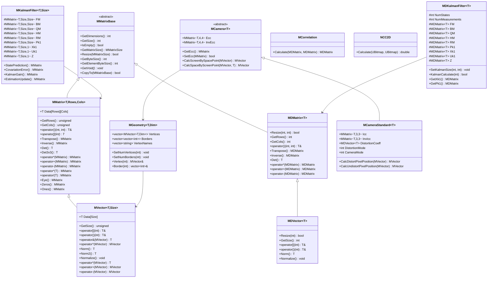
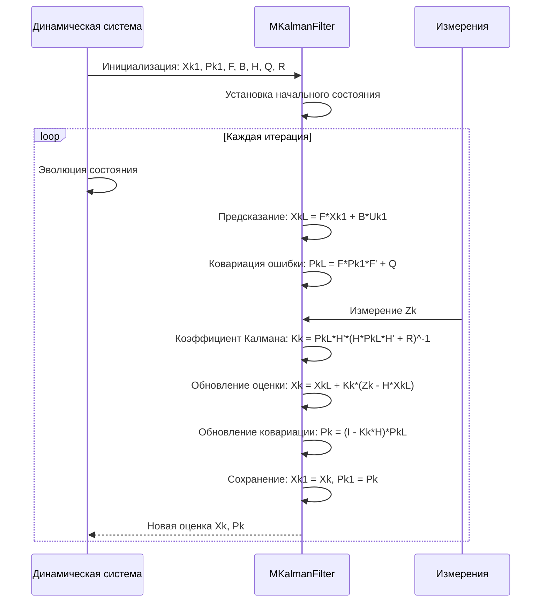
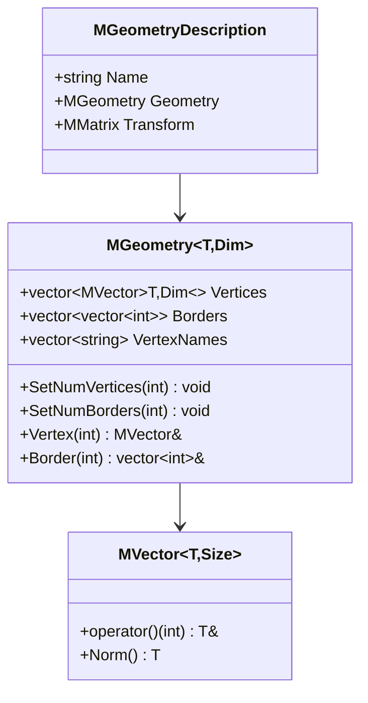

# Детальная документация модуля Core/Math

## RU

### Обзор

Модуль `Core/Math` предоставляет математические классы и функции для работы с матрицами, векторами, фильтрами Калмана, геометрией и камерными преобразованиями. Это расширенная версия документации с детальным описанием всех методов и примеров использования.

### UML диаграмма классов математических библиотек



### Диаграмма последовательности фильтра Калмана



### Детальное описание классов

#### MMatrix\<T, Rows, Cols\>

Шаблонный класс для работы с матрицами фиксированного размера.

**Конструкторы:**
- `MMatrix()` - создание матрицы с неинициализированными значениями
- `MMatrix(T defvalue)` - создание матрицы, заполненной значением `defvalue`
- `MMatrix(const MMatrix<T,Rows,Cols> &copy)` - копирующий конструктор
- `MMatrix(const MDMatrix<T> &copy)` - создание из динамической матрицы
- `MMatrix(const T data[Rows][Cols])` - создание из двумерного массива
- `MMatrix(const T* data)` - создание из одномерного массива
- `MMatrix(T v1, T v2, T v3)` - создание матрицы 3x1 из трех значений
- `MMatrix(T v1, T v2, T v3, T v4)` - создание матрицы 4x1 из четырех значений

**Методы доступа:**
- `GetRows()` - возвращает число строк (unsigned)
- `GetCols()` - возвращает число столбцов (unsigned)
- `GetSize()` - возвращает общее число элементов
- `GetSize(int i)` - возвращает размер по измерению i
- `IsEmpty()` - проверка на пустоту
- `GetData()` - получение указателя на данные
- `GetVoid()` - получение указателя как void*

**Операторы доступа:**
- `operator()(int row, int col)` - доступ к элементу [row][col]
- `operator[](int index)` - доступ к элементу как к одномерному массиву

**Математические операции:**
- `Transpose()` - транспонирование матрицы
- `Inverse()` - обращение матрицы
- `Det()` - вычисление детерминанта
- `Det3x3()` - вычисление детерминанта для матрицы 3x3
- `operator*(const MMatrix&)` - матричное умножение
- `operator+(const MMatrix&)` - сложение матриц
- `operator-(const MMatrix&)` - вычитание матриц
- `operator*(T scalar)` - умножение на скаляр
- `operator/(T scalar)` - деление на скаляр
- `operator*=(T scalar)` - умножение на скаляр с присваиванием
- `operator/=(T scalar)` - деление на скаляр с присваиванием
- `operator+=(const MMatrix&)` - сложение с присваиванием
- `operator-=(const MMatrix&)` - вычитание с присваиванием

**Статические методы:**
- `Eye()` - создание единичной матрицы
- `Zeros()` - создание нулевой матрицы
- `Ones()` - создание матрицы из единиц

**Операторы присваивания:**
- `operator=(const MMatrix&)` - копирование
- `operator=(const MDMatrix<T>&)` - присваивание из динамической матрицы
- `operator=(T value)` - заполнение всех элементов значением
- `operator=(const T data[Rows][Cols])` - присваивание из массива
- `operator=(const T* data)` - присваивание из указателя

**Примеры использования:**

```cpp
#include "Rdk/Core/Math/MMatrix.h"

// Создание и инициализация
RDK::MMatrix<double, 3, 3> m1;           // неинициализированная
RDK::MMatrix<double, 3, 3> m2(0.0);      // заполнена нулями
RDK::MMatrix<double, 3, 3> m3 = RDK::MMatrix<double, 3, 3>::Eye(); // единичная

// Заполнение значений
m1(0, 0) = 1.0; m1(0, 1) = 2.0; m1(0, 2) = 3.0;
m1(1, 0) = 4.0; m1(1, 1) = 5.0; m1(1, 2) = 6.0;
m1(2, 0) = 7.0; m1(2, 1) = 8.0; m1(2, 2) = 9.0;

// Доступ к элементам
double val = m1(1, 1);  // 5.0
double* data = m1.GetData();

// Математические операции
RDK::MMatrix<double, 3, 3> m4 = m1.Transpose();
RDK::MMatrix<double, 3, 3> m5 = m1.Inverse();
double det = m1.Det();

// Матричное умножение
RDK::MMatrix<double, 3, 3> m6 = m1 * m2;

// Скалярные операции
m1 *= 2.0;  // умножение всех элементов на 2
m1 += 1.0;  // добавление 1 ко всем элементам
```

#### MDMatrix\<T\>

Класс для работы с матрицами динамического размера.

**Конструкторы:**
- `MDMatrix()` - создание пустой матрицы
- `MDMatrix(int rows, int cols, T defvalue=0)` - создание матрицы заданного размера
- `MDMatrix(const MDMatrix<T> &copy)` - копирующий конструктор
- `MDMatrix(const MMatrix<T,Rows,Cols> &copy)` - создание из фиксированной матрицы

**Методы:**
- `Resize(int rows, int cols, T defvalue=0)` - изменение размера
- `GetRows()` - возвращает число строк
- `GetCols()` - возвращает число столбцов
- `GetSize()` - возвращает общее число элементов
- `operator()(int row, int col)` - доступ к элементу
- `Transpose()` - транспонирование
- `Inverse()` - обращение
- `Det()` - детерминант
- Все операторы как у MMatrix

**Примеры использования:**

```cpp
#include "Rdk/Core/Math/MDMatrix.h"

// Создание динамической матрицы
RDK::MDMatrix<double> m1(3, 3);
m1(0, 0) = 1.0; m1(0, 1) = 2.0; m1(0, 2) = 3.0;
m1(1, 0) = 4.0; m1(1, 1) = 5.0; m1(1, 2) = 6.0;
m1(2, 0) = 7.0; m1(2, 1) = 8.0; m1(2, 2) = 9.0;

// Изменение размера
m1.Resize(4, 4, 0.0);  // расширение с заполнением нулями

// Преобразование из фиксированной матрицы
RDK::MMatrix<double, 3, 3> fixed;
RDK::MDMatrix<double> dynamic(fixed);
```

#### MVector\<T, Size\>

Класс для работы с векторами фиксированной размерности.

**Конструкторы:**
- `MVector()` - создание неинициализированного вектора
- `MVector(T defvalue)` - создание вектора, заполненного значением
- `MVector(T xv, T yv, T zv=0)` - создание 3D вектора
- `MVector(T xv, T yv, T zv, T dv)` - создание 4D вектора
- `MVector(const MVector<T,Size> &copy)` - копирующий конструктор
- `MVector(const MMatrix<T,Size,1> &copy)` - создание из матрицы-столбца
- `MVector(const MDMatrix<T> &copy)` - создание из динамической матрицы

**Методы:**
- `GetSize()` - возвращает размерность вектора
- `operator[](int index)` - доступ к элементу
- `operator()(int index)` - доступ к элементу
- `Norm()` - норма вектора (L2)
- `Norm2()` - квадрат нормы (для оптимизации)
- `Normalize()` - нормализация вектора (изменяет сам вектор)
- `operator&(const MVector&)` - скалярное произведение
- `operator^(const MVector&)` - векторное произведение (для 3D)
- `operator*(const MVector&)` - скалярное произведение (альтернатива)
- `operator+(const MVector&)` - сложение векторов
- `operator-(const MVector&)` - вычитание векторов
- `operator*(T scalar)` - умножение на скаляр
- `operator/(T scalar)` - деление на скаляр

**Примеры использования:**

```cpp
#include "Rdk/Core/Math/MVector.h"

// Создание векторов
RDK::MVector<double, 3> v1(1.0, 2.0, 3.0);
RDK::MVector<double, 3> v2(4.0, 5.0, 6.0);

// Доступ к элементам
double x = v1(0);  // 1.0
double y = v1[1];  // 2.0

// Скалярное произведение
double dot = v1 & v2;  // 1*4 + 2*5 + 3*6 = 32

// Векторное произведение (только для 3D)
RDK::MVector<double, 3> cross = v1 ^ v2;

// Норма вектора
double len = v1.Norm();  // sqrt(1^2 + 2^2 + 3^2) = sqrt(14)

// Нормализация
RDK::MVector<double, 3> normalized = v1;
normalized.Normalize();  // длина становится 1.0

// Арифметические операции
RDK::MVector<double, 3> sum = v1 + v2;
RDK::MVector<double, 3> diff = v1 - v2;
RDK::MVector<double, 3> scaled = v1 * 2.0;
```

#### MDVector\<T\>

Класс для работы с векторами динамической размерности.

**Конструкторы:**
- `MDVector()` - создание пустого вектора
- `MDVector(int size, T defvalue=0)` - создание вектора заданного размера
- `MDVector(T xv, T yv, T zv=0)` - создание 3D вектора
- `MDVector(T xv, T yv, T zv, T dv)` - создание 4D вектора
- `MDVector(const MDVector<T> &copy)` - копирующий конструктор
- `MDVector(const MDMatrix<T> &copy)` - создание из матрицы

**Методы:**
- `Resize(int size, T defvalue=0)` - изменение размера
- `GetSize()` - возвращает размерность
- `Assign(int size, const T* data)` - присваивание из массива
- `Assign(int size, T data)` - заполнение значением
- Все методы как у MVector

**Примеры использования:**

```cpp
#include "Rdk/Core/Math/MDVector.h"

// Создание динамического вектора
RDK::MDVector<double> v1(5, 0.0);  // вектор из 5 элементов
v1(0) = 1.0;
v1(1) = 2.0;
// ...

// Изменение размера
v1.Resize(10, 0.0);  // расширение до 10 элементов

// Присваивание из массива
double arr[] = {1.0, 2.0, 3.0, 4.0, 5.0};
v1.Assign(5, arr);
```

#### MKalmanFilter\<T, Size\>

Шаблонный класс для фильтра Калмана фиксированного размера.

**Данные:**
- `FM` - матрица динамической модели (F)
- `BM` - матрица управляющего воздействия (B)
- `QM` - матрица ковариации шума процесса (Q)
- `HM` - матрица измерений (H)
- `RM` - матрица ковариации шума измерений (R)
- `Pk1` - матрица ковариации ошибки
- `Xk1` - вектор состояния
- `Uk1` - вектор управляющего воздействия
- `Z` - вектор измерений

**Методы:**
- `StatePrediction(const KMatrix &F, const KMatrix &B, const KVector &xk1, const KVector &uk1)` - предсказание состояния
- `CovariationError(const KMatrix &F, const KMatrix &Pk1, const KMatrix &Q)` - ковариация ошибки предсказания
- `KalmanGain(const KMatrix &PkL, const KMatrix &H, const KMatrix &R)` - коэффициент Калмана
- `EstimationUpdate(const KVector &xkL, const KMatrix &Kk, const KVector &zk, const KMatrix &H)` - обновление оценки

#### MDKalmanFilter\<T\>

Класс для фильтра Калмана динамического размера.

**Методы:**
- `SetKalmanSize(int num_states, int num_measurements)` - установка размерности
- `SetFM(const MDMatrix<T>&)` - установка матрицы F
- `SetBM(const MDMatrix<T>&)` - установка матрицы B
- `SetQM(const MDMatrix<T>&)` - установка матрицы Q
- `SetHM(const MDMatrix<T>&)` - установка матрицы H
- `SetRM(const MDMatrix<T>&)` - установка матрицы R
- `SetXk1(const MDMatrix<T>&)` - установка начального состояния
- `SetPk1(const MDMatrix<T>&)` - установка начальной ковариации
- `SetUk1(const MDMatrix<T>&)` - установка управляющего воздействия
- `SetZ(const MDMatrix<T>&)` - установка измерения
- `KalmanCalculate(int mode)` - выполнение одного шага фильтрации
- `GetXk1()` - получение текущего состояния
- `GetPk1()` - получение текущей ковариации

**Примеры использования:**

```cpp
#include "Rdk/Core/Math/MDKalmanFilter.h"

// Создание фильтра для системы с 2 состояниями и 1 измерением
RDK::MDKalmanFilter<double> kalman;
kalman.SetKalmanSize(2, 1);

// Настройка матриц
RDK::MDMatrix<double> F(2, 2);
F(0, 0) = 1.0; F(0, 1) = 1.0;  // модель движения
F(1, 0) = 0.0; F(1, 1) = 1.0;
kalman.SetFM(F);

RDK::MDMatrix<double> H(1, 2);
H(0, 0) = 1.0; H(0, 1) = 0.0;  // измеряем только первое состояние
kalman.SetHM(H);

RDK::MDMatrix<double> Q(2, 2);
Q(0, 0) = 0.1; Q(0, 1) = 0.0;
Q(1, 0) = 0.0; Q(1, 1) = 0.1;  // шум процесса
kalman.SetQM(Q);

RDK::MDMatrix<double> R(1, 1);
R(0, 0) = 0.5;  // шум измерений
kalman.SetRM(R);

// Инициализация
RDK::MDMatrix<double> x0(2, 1);
x0(0, 0) = 0.0;  // начальная позиция
x0(1, 0) = 0.0;  // начальная скорость
kalman.SetXk1(x0);

RDK::MDMatrix<double> P0(2, 2);
P0(0, 0) = 1.0; P0(0, 1) = 0.0;
P0(1, 0) = 0.0; P0(1, 1) = 1.0;  // начальная неопределенность
kalman.SetPk1(P0);

// Цикл фильтрации
for (int i = 0; i < 100; ++i) {
    // Получение измерения
    RDK::MDMatrix<double> measurement(1, 1);
    measurement(0, 0) = GetMeasurement();  // функция получения измерения
    
    kalman.SetZ(measurement);
    
    // Выполнение фильтрации
    kalman.KalmanCalculate(0);
    
    // Получение оценки состояния
    RDK::MDMatrix<double> state = kalman.GetXk1();
    double position = state(0, 0);
    double velocity = state(1, 0);
    
    std::cout << "Position: " << position << ", Velocity: " << velocity << std::endl;
}
```

#### MCamera\<T\> и MCameraStandard\<T\>

Классы для работы с камерными преобразованиями.

**MCamera (абстрактный базовый класс):**
- `Ecc` - матрица внешней калибровки (4x4)
- `InvEcc` - обратная матрица внешней калибровки
- `GetEcc()` - получение матрицы Ecc
- `SetEcc(const MMatrix<T,4,4>&)` - установка матрицы Ecc
- `CalcScreenBySpacePoint(const MVector<T,4>&)` - проецирование 3D точки на изображение
- `CalcSpaceByScreenPoint(const MVector<T,3>&, T distance)` - обратное проецирование

**MCameraStandard (конкретная реализация):**
- `Icc` - матрица внутренней калибровки (3x3)
- `InvIcc` - обратная матрица внутренней калибровки
- `DistortionCoeff` - коэффициенты дисторсии
- `DistortionMode` - модель дисторсии (0-нет, 1-OpenCV, 2-Artoolkit, 3-Tsai)
- `CameraMode` - модель камеры (0-обычная, 1-fisheye)
- `CalcDistortPixelPosition(const MVector<T,3>&)` - применение дисторсии
- `CalcUndistortPixelPosition(const MVector<T,3>&)` - устранение дисторсии
- `CalcIccByVisualAngle(...)` - вычисление Icc по углам поля зрения

**Примеры использования:**

```cpp
#include "Rdk/Core/Math/MCamera.h"

// Создание стандартной камеры
RDK::MCameraStandard<double> camera;

// Настройка матрицы внутренней калибровки
RDK::MMatrix<double, 3, 3> icc;
icc(0, 0) = 800.0;  // фокусное расстояние по X
icc(1, 1) = 800.0;  // фокусное расстояние по Y
icc(0, 2) = 320.0;  // главная точка по X
icc(1, 2) = 240.0;  // главная точка по Y
icc(2, 2) = 1.0;
camera.SetIcc(icc);

// Настройка матрицы внешней калибровки
RDK::MMatrix<double, 4, 4> ecc = RDK::MMatrix<double, 4, 4>::Eye();
// ... настройка позиции и ориентации камеры ...
camera.SetEcc(ecc);

// Настройка дисторсии (модель OpenCV)
RDK::MDVector<double> distortion_coeff(5);
distortion_coeff(0) = -0.1;  // k1
distortion_coeff(1) = 0.05;  // k2
distortion_coeff(2) = 0.0;   // p1
distortion_coeff(3) = 0.0;   // p2
distortion_coeff(4) = 0.0;   // k3
camera.SetDistortionCoeff(distortion_coeff);
camera.SetDistortionMode(1);  // модель OpenCV

// Проецирование 3D точки на изображение
RDK::MVector<double, 4> world_point(1.0, 2.0, 5.0, 1.0);  // точка в мировых координатах
RDK::MVector<double, 3> image_point = camera.CalcScreenBySpacePoint(world_point);
double pixel_x = image_point(0);
double pixel_y = image_point(1);

// Обратное проецирование (при известном расстоянии)
double distance = 5.0;
RDK::MVector<double, 3> screen_point(pixel_x, pixel_y, 1.0);
RDK::MVector<double, 4> reconstructed_point = camera.CalcSpaceByScreenPoint(screen_point, distance);

// Учет дисторсии
RDK::MVector<double, 3> undistorted_pixel(320, 240, 1);
RDK::MVector<double, 3> distorted_pixel = camera.CalcDistortPixelPosition(undistorted_pixel);

// Устранение дисторсии
RDK::MVector<double, 3> corrected_pixel = camera.CalcUndistortPixelPosition(distorted_pixel);
```

#### MGeometry\<T, Dim\>

Класс для работы с геометрическими объектами.

**Данные:**
- `Vertices` - вектор вершин (MVector<T,Dim>)
- `Borders` - вектор границ (каждая граница - вектор индексов вершин)
- `VertexNames` - имена вершин

**Методы:**
- `SetNumVertices(int)` - установка числа вершин
- `SetNumBorders(int)` - установка числа границ
- `Vertex(int index)` - доступ к вершине
- `Border(int index)` - доступ к границе
- `VertexName(int index)` - доступ к имени вершины

**Примеры использования:**

```cpp
#include "Rdk/Core/Math/MGeometry.h"

// Создание геометрии треугольника
RDK::MGeometry<double, 3> triangle;
triangle.SetNumVertices(3);
triangle.SetNumBorders(3);

// Задание вершин
triangle.Vertex(0) = RDK::MVector<double, 3>(0, 0, 0);
triangle.Vertex(1) = RDK::MVector<double, 3>(1, 0, 0);
triangle.Vertex(2) = RDK::MVector<double, 3>(0.5, 1, 0);

// Имена вершин
triangle.VertexName(0) = "A";
triangle.VertexName(1) = "B";
triangle.VertexName(2) = "C";

// Задание границ (ребер)
triangle.Border(0).push_back(0);
triangle.Border(0).push_back(1);

triangle.Border(1).push_back(1);
triangle.Border(1).push_back(2);

triangle.Border(2).push_back(2);
triangle.Border(2).push_back(0);

// Преобразование 3D геометрии в 2D через камеру
RDK::MCameraStandard<double> camera;
// ... настройка камеры ...

RDK::MGeometry<double, 4> geometry_3d;
// ... заполнение 3D геометрии ...

RDK::MGeometry<double, 3> geometry_2d;
camera.Convert3Dto2DGeometry(geometry_3d, geometry_2d);
```

### Диаграмма классов геометрии



### См. также

- [Math-Libraries-Reference.md](Math-Libraries-Reference.md) - справочник по математическим библиотекам
- [Utilities-Reference.md](Utilities-Reference.md) - вспомогательные функции
- [Graphics-Detailed.md](Graphics-Detailed.md) - использование математики в графике
- [Engine-Detailed.md](Engine-Detailed.md) - использование математики в компонентах

---

## EN

### Overview

The `Core/Math` module provides mathematical classes and functions for working with matrices, vectors, Kalman filters, geometry, and camera transformations. This is an extended version of the documentation with detailed description of all methods and usage examples.

### Main Classes

#### MMatrix\<T, Rows, Cols\>

Template class for working with fixed-size matrices.

**Key Methods:**
- `Transpose()` - matrix transposition
- `Inverse()` - matrix inversion
- `Det()` - determinant calculation
- `operator*()` - matrix multiplication
- `operator+()`, `operator-()` - matrix addition/subtraction
- `Eye()` - create identity matrix
- `Zeros()` - create zero matrix

#### MDMatrix\<T\>

Class for working with dynamic-size matrices.

**Key Methods:**
- `Resize(int rows, int cols)` - resize matrix
- `GetRows()`, `GetCols()` - get dimensions
- All matrix operations as in MMatrix

#### MVector\<T, Size\>

Class for working with fixed-size vectors.

**Key Methods:**
- `Norm()` - vector norm (L2)
- `Normalize()` - normalize vector
- `operator&()` - dot product
- `operator^()` - cross product (3D only)

#### MDVector\<T\>

Class for working with dynamic-size vectors.

#### MKalmanFilter\<T, Size\> / MDKalmanFilter\<T\>

Classes for Kalman filter implementation.

#### MCamera\<T\> / MCameraStandard\<T\>

Classes for camera transformations.

#### MGeometry\<T, Dim\>

Class for geometric objects.

### See Also

- [Math-Libraries-Reference.md](Math-Libraries-Reference.md) - math libraries reference
- [Utilities-Reference.md](Utilities-Reference.md) - utility functions
- [Graphics-Detailed.md](Graphics-Detailed.md) - math usage in graphics
- [Engine-Detailed.md](Engine-Detailed.md) - math usage in components
