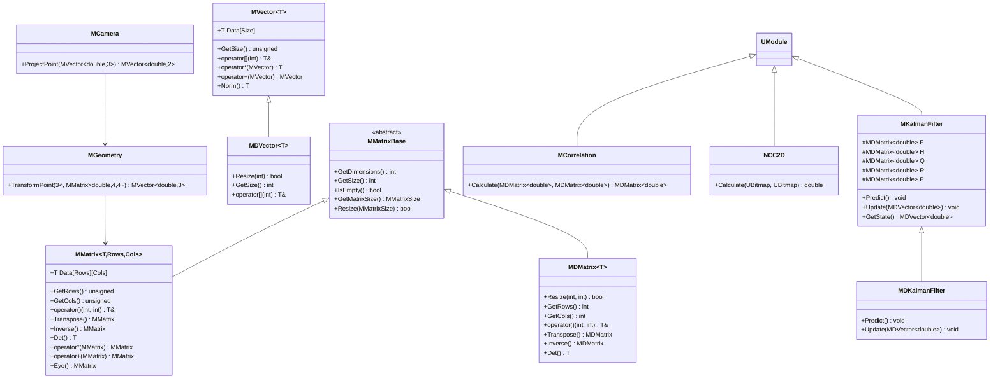
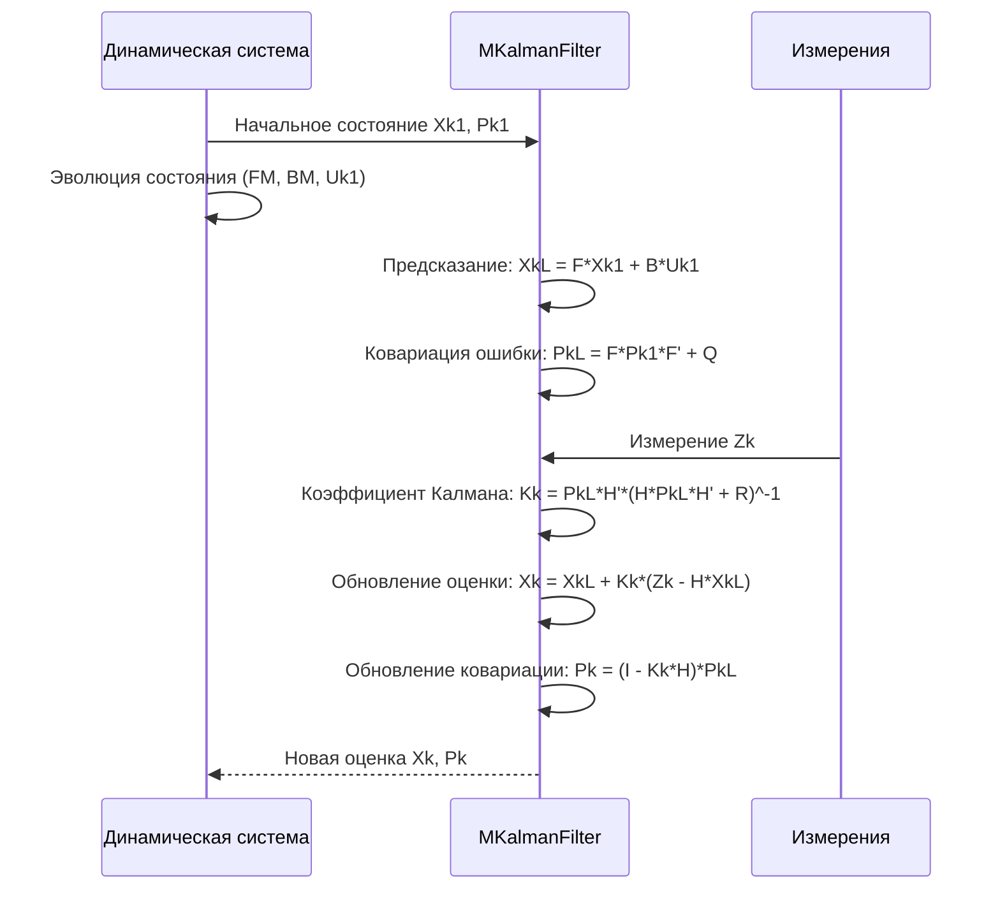
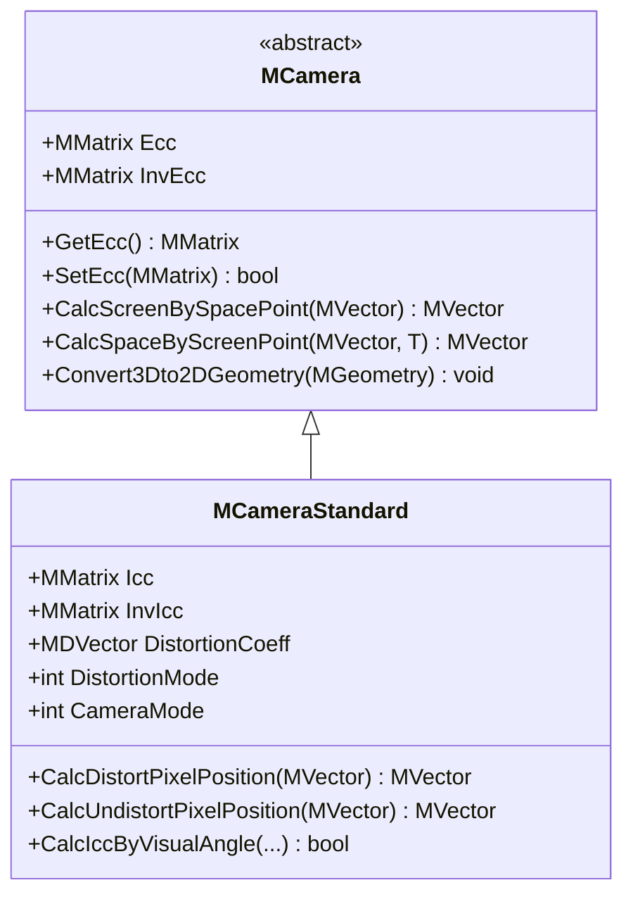
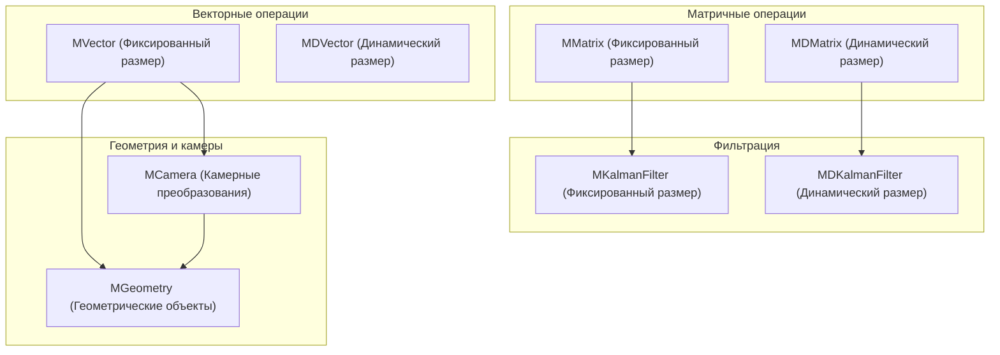

# Справочник по математическим библиотекам (Math Libraries Reference)

## RU

### Обзор

Модуль `Rdk/Core/Math/` содержит математические классы и функции для работы с матрицами, векторами, фильтрами Калмана, геометрией и камерными преобразованиями. Эти библиотеки используются во всем проекте Nmsdk для математических вычислений.

### UML диаграмма классов математических библиотек



### Основные классы

#### MMatrix / MDMatrix - Матричные операции

Шаблонные классы для работы с матрицами фиксированного размера (`MMatrix`) и динамического размера (`MDMatrix`).

**Основные операции:**

- Транспонирование (`Transpose()`)
- Инверсия (`Inverse()`)
- Вычисление детерминанта (`Det()`, `Det3x3()`)
- Матричное умножение (`operator*`)
- Сложение и вычитание (`operator+`, `operator-`)
- Скалярные операции (`operator*=`, `operator/=`)

**Примеры использования:**

```cpp
#include "Rdk/Core/Math/MMatrix.h"

// Создание матрицы фиксированного размера 3x3
RDK::MMatrix<double, 3, 3> matrix;
matrix = 0.0; // инициализация нулями

// Заполнение матрицы
matrix(0, 0) = 1.0;
matrix(0, 1) = 2.0;
matrix(0, 2) = 3.0;
matrix(1, 0) = 4.0;
matrix(1, 1) = 5.0;
matrix(1, 2) = 6.0;
matrix(2, 0) = 7.0;
matrix(2, 1) = 8.0;
matrix(2, 2) = 9.0;

// Создание единичной матрицы
RDK::MMatrix<double, 3, 3> identity = RDK::MMatrix<double, 3, 3>::Eye();

// Транспонирование
RDK::MMatrix<double, 3, 3> transposed = matrix.Transpose();

// Инверсия
RDK::MMatrix<double, 3, 3> inverted = matrix.Inverse();

// Вычисление детерминанта
double det = matrix.Det();

// Матричное умножение
RDK::MMatrix<double, 3, 3> result = matrix * identity;

// Скалярные операции
matrix *= 2.0;  // умножение на скаляр
matrix += 1.0;  // добавление скаляра

// Работа с динамическими матрицами
RDK::MDMatrix<double> dynamic_matrix(4, 4);
dynamic_matrix.Resize(5, 5);
dynamic_matrix(0, 0) = 1.0;

// Преобразование между фиксированными и динамическими матрицами
RDK::MMatrix<double, 3, 3> fixed_matrix(dynamic_matrix);
RDK::MDMatrix<double> from_fixed(fixed_matrix);
```

**Использование для обработки изображений:**

```cpp
// Преобразование изображения через матрицу
RDK::MMatrix<double, 3, 3> transform_matrix;
// ... заполнение матрицы преобразования ...

// Применение преобразования к точке
RDK::MVector<double, 3> point(100, 200, 1);
RDK::MVector<double, 3> transformed_point = transform_matrix * point;
```

#### MVector / MDVector - Векторные операции

Классы для работы с векторами фиксированной (`MVector`) и динамической (`MDVector`) размерности.

**Основные операции:**

- Скалярное произведение (`operator&`)
- Векторное произведение (для 3D векторов)
- Норма вектора (`Norm()`, `Norm2()`)
- Нормализация (`Normalize()`)
- Доступ к элементам (`operator()`, `operator[]`)

**Примеры использования:**

```cpp
#include "Rdk/Core/Math/MVector.h"

// Создание вектора фиксированного размера
RDK::MVector<double, 3> vec1(1.0, 2.0, 3.0);
RDK::MVector<double, 3> vec2(4.0, 5.0, 6.0);

// Доступ к элементам
double x = vec1(0);
double y = vec1(1);
double z = vec1(2);

// Скалярное произведение
double dot_product = vec1 & vec2;

// Векторное произведение (для 3D)
RDK::MVector<double, 3> cross_product = vec1 ^ vec2;

// Норма вектора
double norm = vec1.Norm();
double norm_squared = vec1.Norm2();

// Нормализация
RDK::MVector<double, 3> normalized = vec1;
normalized.Normalize();

// Арифметические операции
RDK::MVector<double, 3> sum = vec1 + vec2;
RDK::MVector<double, 3> diff = vec1 - vec2;
RDK::MVector<double, 3> scaled = vec1 * 2.0;

// Работа с динамическими векторами
RDK::MDVector<double> dynamic_vec(5);
dynamic_vec(0) = 1.0;
dynamic_vec(1) = 2.0;
// ...
```

**Использование для геометрических вычислений:**

```cpp
// Вычисление расстояния между точками
RDK::MVector<double, 3> point1(0, 0, 0);
RDK::MVector<double, 3> point2(3, 4, 0);
RDK::MVector<double, 3> diff = point2 - point1;
double distance = diff.Norm(); // расстояние = 5.0

// Вычисление угла между векторами
double cos_angle = (vec1 & vec2) / (vec1.Norm() * vec2.Norm());
double angle = acos(cos_angle);
```

#### MKalmanFilter / MDKalmanFilter - Фильтры Калмана

Классы для реализации фильтра Калмана - алгоритма рекурсивной фильтрации для оценки состояния динамической системы.

**Структура фильтра Калмана:**



**Матрицы фильтра:**

- `FM` - матрица динамической модели системы (F)
- `BM` - матрица применения управляющего воздействия (B)
- `QM` - матрица ковариации шума процесса (Q)
- `HM` - матрица отношения измерений и состояний (H)
- `RM` - матрица ковариации шума измерений (R)
- `Xk1` - вектор состояния системы
- `Uk1` - вектор управляющего воздействия
- `Z` - вектор измерений
- `Pk1` - матрица ошибки ковариации

**Примеры использования:**

```cpp
#include "Rdk/Core/Math/MKalmanFilter.h"

// Создание фильтра Калмана для системы с 2 состояниями и 1 измерением
RDK::MDKalmanFilter<double> kalman;
kalman.SetKalmanSize(2, 1); // 2 состояния, 1 измерение

// Настройка матриц фильтра
RDK::MDMatrix<double> F(2, 2);
F(0, 0) = 1.0; F(0, 1) = 1.0; // модель движения
F(1, 0) = 0.0; F(1, 1) = 1.0;
kalman.SetFM(F);

RDK::MDMatrix<double> H(1, 2);
H(0, 0) = 1.0; H(0, 1) = 0.0; // измеряем только первое состояние
kalman.SetHM(H);

RDK::MDMatrix<double> Q(2, 2);
Q(0, 0) = 0.1; Q(0, 1) = 0.0;
Q(1, 0) = 0.0; Q(1, 1) = 0.1; // шум процесса
kalman.SetQM(Q);

RDK::MDMatrix<double> R(1, 1);
R(0, 0) = 0.5; // шум измерений
kalman.SetRM(R);

// Инициализация начального состояния
RDK::MDMatrix<double> x0(2, 1);
x0(0, 0) = 0.0; // начальная позиция
x0(1, 0) = 0.0; // начальная скорость
kalman.SetXk1(x0);

RDK::MDMatrix<double> P0(2, 2);
P0(0, 0) = 1.0; P0(0, 1) = 0.0;
P0(1, 0) = 0.0; P0(1, 1) = 1.0; // начальная неопределенность
kalman.SetPk1(P0);

// Цикл фильтрации
for (int i = 0; i < 100; ++i) {
    // Получение измерения
    RDK::MDMatrix<double> measurement(1, 1);
    measurement(0, 0) = GetMeasurement(); // функция получения измерения
    
    kalman.SetZ(measurement);
    
    // Выполнение фильтрации
    kalman.KalmanCalculate(0);
    
    // Получение оценки состояния
    RDK::MDMatrix<double> state = kalman.GetXk1();
    double position = state(0, 0);
    double velocity = state(1, 0);
    
    std::cout << "Position: " << position << ", Velocity: " << velocity << std::endl;
}
```

**Использование для сглаживания траектории:**

```cpp
// Фильтрация траектории объекта
RDK::MDKalmanFilter<double> trajectory_filter;
trajectory_filter.SetKalmanSize(4, 2); // x, y, vx, vy - состояния; x, y - измерения

// Настройка модели постоянной скорости
RDK::MDMatrix<double> F(4, 4);
F(0, 0) = 1.0; F(0, 1) = 0.0; F(0, 2) = dt; F(0, 3) = 0.0;
F(1, 0) = 0.0; F(1, 1) = 1.0; F(1, 2) = 0.0; F(1, 3) = dt;
F(2, 0) = 0.0; F(2, 1) = 0.0; F(2, 2) = 1.0; F(2, 3) = 0.0;
F(3, 0) = 0.0; F(3, 1) = 0.0; F(3, 2) = 0.0; F(3, 3) = 1.0;
trajectory_filter.SetFM(F);

// Обработка измерений позиции
void ProcessPositionMeasurement(double x, double y) {
    RDK::MDMatrix<double> z(2, 1);
    z(0, 0) = x;
    z(1, 0) = y;
    trajectory_filter.SetZ(z);
    trajectory_filter.KalmanCalculate(0);
}
```

#### MCamera - Камерные преобразования

Класс для работы с камерными преобразованиями, включая внутреннюю и внешнюю калибровку, дисторсию и проекцию.

**Иерархия классов:**



**Модели дисторсии:**

- `0` - учет дисторсии отсутствует
- `1` - модель OpenCV (радиальная и тангенциальная дисторсия)
- `2` - модель Artoolkit
- `3` - модель Цая (Tsai)

**Модели камеры:**

- `0` - обычная камера (pinhole)
- `1` - fisheye камера (OpenCV)

**Примеры использования:**

```cpp
#include "Rdk/Core/Math/MCamera.h"

// Создание стандартной камеры
RDK::MCameraStandard<double> camera;

// Настройка матрицы внутренней калибровки (Icc)
RDK::MMatrix<double, 3, 3> icc;
icc(0, 0) = 800.0;  // фокусное расстояние по X
icc(1, 1) = 800.0;  // фокусное расстояние по Y
icc(0, 2) = 320.0;  // главная точка по X
icc(1, 2) = 240.0;  // главная точка по Y
icc(2, 2) = 1.0;
camera.SetIcc(icc);

// Настройка матрицы внешней калибровки (Ecc)
RDK::MMatrix<double, 4, 4> ecc = RDK::MMatrix<double, 4, 4>::Eye();
// ... настройка позиции и ориентации камеры ...
camera.SetEcc(ecc);

// Настройка дисторсии (модель OpenCV)
RDK::MDVector<double> distortion_coeff(5);
distortion_coeff(0) = -0.1;  // k1
distortion_coeff(1) = 0.05;  // k2
distortion_coeff(2) = 0.0;   // p1
distortion_coeff(3) = 0.0;   // p2
distortion_coeff(4) = 0.0;   // k3
camera.SetDistortionCoeff(distortion_coeff);
camera.SetDistortionMode(1); // модель OpenCV

// Проецирование 3D точки на изображение
RDK::MVector<double, 4> world_point(1.0, 2.0, 5.0, 1.0); // точка в мировых координатах
RDK::MVector<double, 3> image_point = camera.CalcScreenBySpacePoint(world_point);
double pixel_x = image_point(0);
double pixel_y = image_point(1);

// Обратное проецирование (при известном расстоянии)
double distance = 5.0;
RDK::MVector<double, 3> screen_point(pixel_x, pixel_y, 1.0);
RDK::MVector<double, 4> reconstructed_point = camera.CalcSpaceByScreenPoint(screen_point, distance);

// Учет дисторсии
RDK::MVector<double, 3> undistorted_pixel(320, 240, 1);
RDK::MVector<double, 3> distorted_pixel = camera.CalcDistortPixelPosition(undistorted_pixel);

// Устранение дисторсии
RDK::MVector<double, 3> corrected_pixel = camera.CalcUndistortPixelPosition(distorted_pixel);
```

**Использование для калибровки камеры:**

```cpp
// Вычисление матрицы внутренней калибровки по известным полям зрения
double angle_x = 60.0; // градусы
double angle_y = 45.0; // градусы
double principle_x = 0.5; // нормализованные координаты
double principle_y = 0.5;
int image_width = 640;
int image_height = 480;

RDK::MMatrix<double, 3, 3> icc, norm_icc;
camera.CalcIccByVisualAngle(
    angle_x * M_PI / 180.0, 
    angle_y * M_PI / 180.0,
    principle_x, principle_y,
    image_width, image_height,
    icc, norm_icc
);
camera.SetIcc(icc);
```

#### MGeometry - Геометрические операции

Класс для работы с геометрическими объектами (вершины, границы).

**Основные возможности:**

- Хранение вершин и границ
- Имена вершин
- Преобразования геометрии

**Примеры использования:**

```cpp
#include "Rdk/Core/Math/MGeometry.h"

// Создание геометрии треугольника
RDK::MGeometry<double, 3> triangle;
triangle.SetNumVertices(3);
triangle.SetNumBorders(3);

// Задание вершин
triangle.Vertex(0) = RDK::MVector<double, 3>(0, 0, 0);
triangle.Vertex(1) = RDK::MVector<double, 3>(1, 0, 0);
triangle.Vertex(2) = RDK::MVector<double, 3>(0.5, 1, 0);

// Имена вершин
triangle.VertexName(0) = "A";
triangle.VertexName(1) = "B";
triangle.VertexName(2) = "C";

// Задание границ (ребер)
triangle.Border(0).push_back(0);
triangle.Border(0).push_back(1);

triangle.Border(1).push_back(1);
triangle.Border(1).push_back(2);

triangle.Border(2).push_back(2);
triangle.Border(2).push_back(0);

// Преобразование 3D геометрии в 2D через камеру
RDK::MCameraStandard<double> camera;
// ... настройка камеры ...

RDK::MGeometry<double, 4> geometry_3d;
// ... заполнение 3D геометрии ...

RDK::MGeometry<double, 3> geometry_2d;
camera.Convert3Dto2DGeometry(geometry_3d, geometry_2d);
```

**Вспомогательные функции геометрии:**

```cpp
#include "Rdk/Core/Math/MGeometry.h"

// Вычисление матрицы позиции объекта из углов и смещений
RDK::MVector<double, 3> angles(M_PI/4, 0, 0); // углы в радианах
RDK::MVector<double, 3> shifts(1.0, 2.0, 3.0); // смещения в метрах
RDK::MMatrix<double, 4, 4> position_matrix = 
    RDK::CalcObjectPositionMatrix(angles, shifts, 3); // seqmat=3 (My*Mx*Mz)

// Обратное преобразование - получение углов и смещений из матрицы
RDK::MVector<double, 6> angles_and_shifts;
RDK::CalcObjectAnglesAndShifts(position_matrix, angles_and_shifts, 3);

// Обращение матрицы внешней калибровки
RDK::MMatrix<double, 4, 4> ecc, inv_ecc;
// ... заполнение ecc ...
RDK::InverseEcc(ecc, inv_ecc);
```

#### MCorrelation - Корреляционный анализ

Класс для вычисления корреляции между данными.

**Примеры использования:**

```cpp
#include "Rdk/Core/Math/MCorrelation.h"

// Вычисление корреляции между двумя сигналами
RDK::MDVector<double> signal1(100);
RDK::MDVector<double> signal2(100);
// ... заполнение сигналов ...

double correlation = RDK::Correlation(signal1, signal2);
```

### Схема взаимодействия математических классов



### См. также

- [Utilities Reference](Utilities-Reference.md) - вспомогательные функции
- [Graphics Architecture](Architecture/Graphics-Architecture.md) - использование математики в графике
- [Rdk-CvBasicLib](../../Libraries/Rdk-CvBasicLib/Docs/Architecture.md) - использование в компьютерном зрении

---

## EN

### Overview

The `Rdk/Core/Math/` module contains mathematical classes and functions for working with matrices, vectors, Kalman filters, geometry, and camera transformations. These libraries are used throughout the Nmsdk project for mathematical computations.

### Main Classes

#### MMatrix / MDMatrix - Matrix Operations

Template classes for working with fixed-size matrices (`MMatrix`) and dynamic-size matrices (`MDMatrix`).

**Main Operations:**

- Transposition (`Transpose()`)
- Inversion (`Inverse()`)
- Determinant calculation (`Det()`, `Det3x3()`)
- Matrix multiplication (`operator*`)
- Addition and subtraction (`operator+`, `operator-`)
- Scalar operations (`operator*=`, `operator/=`)

**Usage Examples:**

```cpp
#include "Rdk/Core/Math/MMatrix.h"

// Create fixed-size 3x3 matrix
RDK::MMatrix<double, 3, 3> matrix;
matrix = 0.0; // initialize with zeros

// Fill matrix
matrix(0, 0) = 1.0;
matrix(0, 1) = 2.0;
// ...

// Create identity matrix
RDK::MMatrix<double, 3, 3> identity = RDK::MMatrix<double, 3, 3>::Eye();

// Transpose
RDK::MMatrix<double, 3, 3> transposed = matrix.Transpose();

// Inverse
RDK::MMatrix<double, 3, 3> inverted = matrix.Inverse();

// Determinant
double det = matrix.Det();
```

#### MVector / MDVector - Vector Operations

Classes for working with fixed-size (`MVector`) and dynamic-size (`MDVector`) vectors.

**Main Operations:**

- Dot product (`operator&`)
- Cross product (for 3D vectors)
- Vector norm (`Norm()`, `Norm2()`)
- Normalization (`Normalize()`)
- Element access (`operator()`, `operator[]`)

**Usage Examples:**

```cpp
#include "Rdk/Core/Math/MVector.h"

RDK::MVector<double, 3> vec1(1.0, 2.0, 3.0);
RDK::MVector<double, 3> vec2(4.0, 5.0, 6.0);

// Dot product
double dot_product = vec1 & vec2;

// Cross product
RDK::MVector<double, 3> cross_product = vec1 ^ vec2;

// Norm
double norm = vec1.Norm();
```

#### MKalmanFilter / MDKalmanFilter - Kalman Filters

Classes for implementing Kalman filter - a recursive filtering algorithm for state estimation of dynamic systems.

**Filter Structure:**

The Kalman filter consists of prediction and update steps using system matrices F, B, H, Q, R.

**Usage Examples:**

```cpp
#include "Rdk/Core/Math/MKalmanFilter.h"

RDK::MDKalmanFilter<double> kalman;
kalman.SetKalmanSize(2, 1); // 2 states, 1 measurement

// Configure filter matrices
RDK::MDMatrix<double> F(2, 2);
// ... setup F, H, Q, R matrices ...

// Filtering loop
for (int i = 0; i < 100; ++i) {
    RDK::MDMatrix<double> measurement(1, 1);
    measurement(0, 0) = GetMeasurement();
    kalman.SetZ(measurement);
    kalman.KalmanCalculate(0);
    
    RDK::MDMatrix<double> state = kalman.GetXk1();
}
```

#### MCamera - Camera Transformations

Class for working with camera transformations, including internal and external calibration, distortion, and projection.

**Distortion Models:**

- `0` - no distortion
- `1` - OpenCV model (radial and tangential distortion)
- `2` - Artoolkit model
- `3` - Tsai model

**Camera Models:**

- `0` - standard camera (pinhole)
- `1` - fisheye camera (OpenCV)

**Usage Examples:**

```cpp
#include "Rdk/Core/Math/MCamera.h"

RDK::MCameraStandard<double> camera;

// Setup internal calibration matrix
RDK::MMatrix<double, 3, 3> icc;
icc(0, 0) = 800.0;  // focal length X
icc(1, 1) = 800.0;  // focal length Y
icc(0, 2) = 320.0;  // principal point X
icc(1, 2) = 240.0;  // principal point Y
icc(2, 2) = 1.0;
camera.SetIcc(icc);

// Project 3D point to image
RDK::MVector<double, 4> world_point(1.0, 2.0, 5.0, 1.0);
RDK::MVector<double, 3> image_point = camera.CalcScreenBySpacePoint(world_point);
```

#### MGeometry - Geometric Operations

Class for working with geometric objects (vertices, borders).

**Usage Examples:**

```cpp
#include "Rdk/Core/Math/MGeometry.h"

RDK::MGeometry<double, 3> triangle;
triangle.SetNumVertices(3);
triangle.Vertex(0) = RDK::MVector<double, 3>(0, 0, 0);
triangle.Vertex(1) = RDK::MVector<double, 3>(1, 0, 0);
triangle.Vertex(2) = RDK::MVector<double, 3>(0.5, 1, 0);
```

### See Also

- [Utilities Reference](Utilities-Reference.md) - utility functions
- [Graphics Architecture](../../Docs/Rdk-Core/Graphics-Architecture.md) - math usage in graphics
- [Rdk-CvBasicLib](../../Libraries/Rdk-CvBasicLib/Docs/Architecture.md) - usage in computer vision


