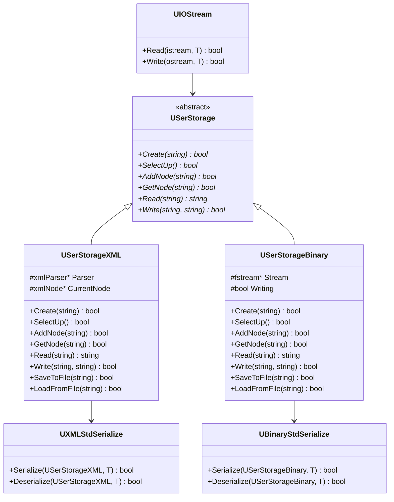
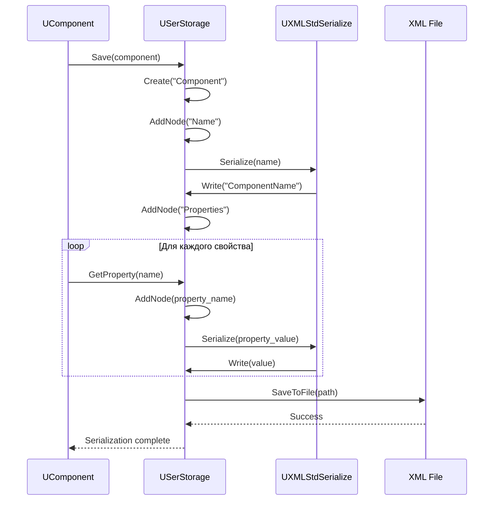
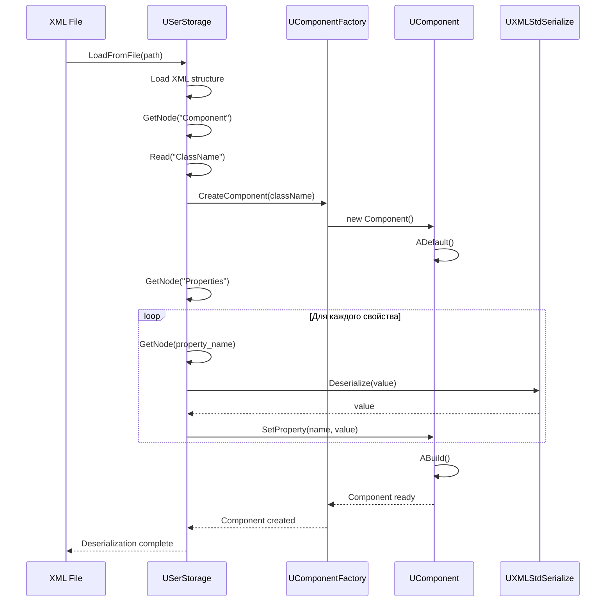

# Детальная документация модуля Core/Serialize

## RU

### Обзор

Модуль `Core/Serialize` предоставляет систему сериализации данных и компонентов в форматах XML и Binary. Используется для сохранения и загрузки проектов, конфигураций и состояний компонентов.

### UML диаграмма классов системы сериализации



### Диаграмма последовательности сериализации компонента



### Диаграмма последовательности десериализации



### Описание основных классов

#### USerStorage

Абстрактный базовый класс для хранилища данных сериализации.

**Основные методы:**
- `Create(name)` - создание узла
- `SelectUp()` - переход к родительскому узлу
- `AddNode(name)` - добавление дочернего узла
- `GetNode(name)` - получение дочернего узла
- `Read(name)` - чтение значения
- `Write(name, value)` - запись значения

#### USerStorageXML

Реализация хранилища для XML формата.

**Основные методы:**
- `SaveToFile(path)` - сохранение в файл
- `LoadFromFile(path)` - загрузка из файла

#### USerStorageBinary

Реализация хранилища для бинарного формата.

**Основные методы:**
- `SaveToFile(path)` - сохранение в файл
- `LoadFromFile(path)` - загрузка из файла

#### UXMLStdSerialize

Класс для сериализации стандартных типов в XML.

#### UBinaryStdSerialize

Класс для сериализации стандартных типов в бинарный формат.

#### UIOStream

Класс для работы с потоками ввода/вывода.

### Примеры использования

#### Сериализация компонента

```cpp
#include "Rdk/Core/Serialize/USerStorageXML.h"
#include "Rdk/Core/Engine/UComponent.h"

RDK::UEPtr<RDK::UContainer> component = /* ... */;

// Создание XML хранилища
RDK::USerStorageXML storage;
storage.Create("Component");

// Сохранение имени
storage.AddNode("Name");
storage.Write("Name", component->Name.GetValue());

// Сохранение свойств
storage.SelectUp();
storage.AddNode("Properties");
for (auto& prop : component->PropertiesLookupTable) {
    storage.AddNode(prop.first);
    prop.second.Property->Save(&storage);
    storage.SelectUp();
}

// Сохранение в файл
storage.SaveToFile("component.xml");
```

#### Десериализация компонента

```cpp
// Загрузка из файла
RDK::USerStorageXML storage;
storage.LoadFromFile("component.xml");

// Чтение имени класса
storage.GetNode("Component");
std::string class_name = storage.Read("ClassName");

// Создание компонента
RDK::UStorage* comp_storage = /* ... */;
RDK::UEPtr<RDK::UContainer> component = comp_storage->CreateComponent(class_name);

// Загрузка свойств
storage.GetNode("Properties");
// ... загрузка свойств ...

// Сборка компонента
component->Build();
```

### См. также

- [Architecture.md](Architecture.md) - общая архитектура
- [Engine-Detailed.md](Engine-Detailed.md) - детальная документация движка

---

## EN

### Overview

The `Core/Serialize` module provides serialization system for data and components in XML and Binary formats. Used for saving and loading projects, configurations, and component states.

### Main Classes

- `USerStorage` - abstract storage interface
- `USerStorageXML` - XML storage implementation
- `USerStorageBinary` - binary storage implementation
- `UXMLStdSerialize` - XML serialization for standard types
- `UBinaryStdSerialize` - binary serialization for standard types

### See Also

- [Architecture.md](Architecture.md) - general architecture
- [Engine-Detailed.md](Engine-Detailed.md) - engine detailed documentation


