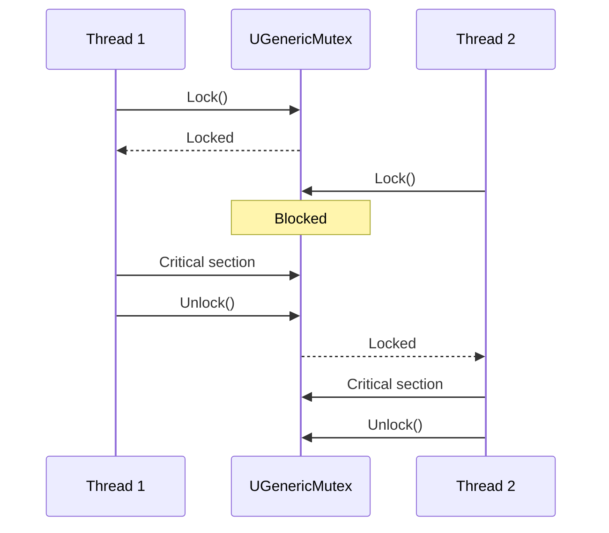
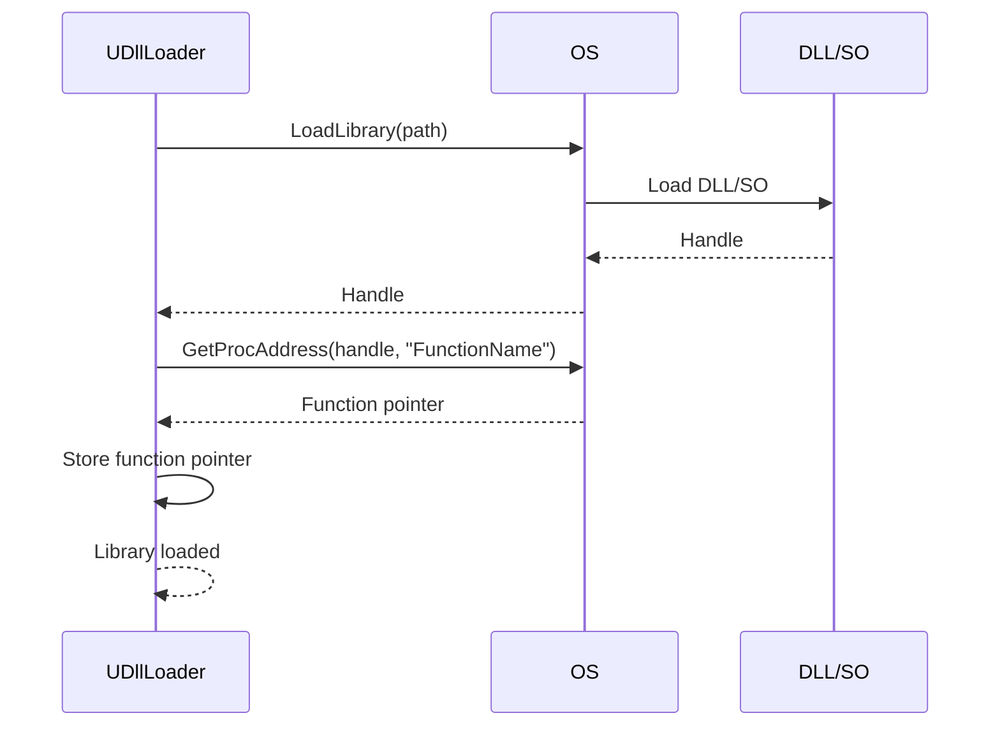

# Детальная документация модуля Core/System

## RU

### Обзор

Модуль `Core/System` предоставляет кроссплатформенные системные абстракции для работы с мьютексами, событиями, загрузкой библиотек и разделяемой памятью. Реализации для разных платформ: Qt, Windows, GCC, ANSI.

### UML диаграмма классов системных абстракций

```mermaid
classDiagram
    class UGenericMutex {
        <<abstract>>
        +Lock() bool
        +Unlock() bool
        +TryLock() bool
    }
    
    class UGenericMutexQt {
        #QMutex* Mutex
        +Lock() bool
        +Unlock() bool
    }
    
    class UGenericMutexWin {
        #CRITICAL_SECTION* CriticalSection
        +Lock() bool
        +Unlock() bool
    }
    
    class UGenericMutexGcc {
        #pthread_mutex_t* Mutex
        +Lock() bool
        +Unlock() bool
    }
    
    class UGenericMutexAnsi {
        #void* MutexData
        +Lock() bool
        +Unlock() bool
    }
    
    class UGenericEvent {
        <<abstract>>
        +Wait(timeout) bool
        +Signal() bool
        +Reset() bool
    }
    
    class UGenericEventQt {
        #QWaitCondition* Condition
        +Wait(timeout) bool
        +Signal() bool
    }
    
    class UGenericEventWin {
        #HANDLE Event
        +Wait(timeout) bool
        +Signal() bool
    }
    
    class UGenericEventGcc {
        #pthread_cond_t* Condition
        +Wait(timeout) bool
        +Signal() bool
    }
    
    class UGenericMutexExclusiveLocker {
        #UGenericMutex* Mutex
        +Lock() void
        +Unlock() void
    }
    
    class UGenericMutexSharedLocker {
        #UGenericMutex* Mutex
        +Lock() void
        +Unlock() void
    }
    
    class UDllLoader {
        <<abstract>>
        +Load(string) bool*
        +Unload() bool*
        +GetFunction(string) void*
    }
    
    class UDllLoaderQt {
        #QLibrary* Library
        +Load(string) bool
        +GetFunction(string) void*
    }
    
    class UDllLoaderWin {
        #HMODULE Module
        +Load(string) bool
        +GetFunction(string) void*
    }
    
    class UDllLoaderGcc {
        #void* Handle
        +Load(string) bool
        +GetFunction(string) void*
    }
    
    class USharedMemoryLoader {
        <<abstract>>
        +Create(string, size) bool*
        +Attach(string) bool*
        +Detach() bool*
    }
    
    UGenericMutex <|-- UGenericMutexQt
    UGenericMutex <|-- UGenericMutexWin
    UGenericMutex <|-- UGenericMutexGcc
    UGenericMutex <|-- UGenericMutexAnsi
    UGenericEvent <|-- UGenericEventQt
    UGenericEvent <|-- UGenericEventWin
    UGenericEvent <|-- UGenericEventGcc
    UDllLoader <|-- UDllLoaderQt
    UDllLoader <|-- UDllLoaderWin
    UDllLoader <|-- UDllLoaderGcc
```



### Диаграмма последовательности использования мьютекса



### Диаграмма последовательности загрузки библиотеки



### Описание основных классов

#### UGenericMutex

Абстрактный базовый класс для мьютексов. Предоставляет кроссплатформенный интерфейс.

**Основные методы:**
- `Lock()` - блокировка мьютекса
- `Unlock()` - разблокировка мьютекса
- `TryLock()` - попытка блокировки без ожидания

#### Платформо-зависимые реализации мьютексов

- `UGenericMutexQt` - реализация через QMutex (Qt)
- `UGenericMutexWin` - реализация через CRITICAL_SECTION (Windows)
- `UGenericMutexGcc` - реализация через pthread_mutex_t (Linux/GCC)
- `UGenericMutexAnsi` - базовая реализация (ANSI C)

#### UGenericEvent

Абстрактный базовый класс для событий. Используется для синхронизации потоков.

**Основные методы:**
- `Wait(timeout)` - ожидание сигнала
- `Signal()` - отправка сигнала
- `Reset()` - сброс события

#### Платформо-зависимые реализации событий

- `UGenericEventQt` - реализация через QWaitCondition
- `UGenericEventWin` - реализация через Windows Event
- `UGenericEventGcc` - реализация через pthread_cond_t

#### UGenericMutexExclusiveLocker

RAII обертка для эксклюзивной блокировки мьютекса.

#### UGenericMutexSharedLocker

RAII обертка для разделяемой блокировки мьютекса.

#### UDllLoader

Абстрактный базовый класс для загрузки динамических библиотек.

**Основные методы:**
- `Load(path)` - загрузка библиотеки
- `Unload()` - выгрузка библиотеки
- `GetFunction(name)` - получение указателя на функцию

#### Платформо-зависимые реализации загрузчика

- `UDllLoaderQt` - реализация через QLibrary
- `UDllLoaderWin` - реализация через Windows API
- `UDllLoaderGcc` - реализация через dlopen/dlclose

#### USharedMemoryLoader

Абстрактный класс для работы с разделяемой памятью.

**Основные методы:**
- `Create(name, size)` - создание разделяемой памяти
- `Attach(name)` - подключение к разделяемой памяти
- `Detach()` - отключение от разделяемой памяти

### Примеры использования

#### Использование мьютекса

```cpp
#include "Rdk/Core/System/UGenericMutex.h"

// Создание мьютекса
RDK::UGenericMutex* mutex = RDK::UCreateMutex();

// Блокировка
mutex->Lock();
// Критическая секция
// ...
// Разблокировка
mutex->Unlock();

// Использование RAII обертки
{
    RDK::UGenericMutexExclusiveLocker locker(mutex);
    // Критическая секция
    // Автоматическая разблокировка при выходе из области видимости
}
```

#### Использование события

```cpp
#include "Rdk/Core/System/UGenericMutex.h"

// Создание события
RDK::UGenericEvent* event = RDK::UCreateEvent();

// В потоке 1: ожидание события
event->Wait(1000); // timeout 1 секунда

// В потоке 2: отправка сигнала
event->Signal();
```

#### Загрузка библиотеки

```cpp
#include "Rdk/Core/System/UDllLoader.h"

// Создание загрузчика
RDK::UDllLoader* loader = RDK::UCreateDllLoader();

// Загрузка библиотеки
if (loader->Load("/path/to/library.dll")) {
    // Получение функции
    typedef void (*MyFunction)();
    MyFunction func = (MyFunction)loader->GetFunction("MyFunction");
    
    if (func) {
        func(); // Вызов функции
    }
    
    // Выгрузка библиотеки
    loader->Unload();
}
```

### См. также

- [Architecture.md](Architecture.md) - общая архитектура
- [Threading-Guide.md](Guides/Threading-Guide.md) - руководство по многопоточности

---

## EN

### Overview

The `Core/System` module provides cross-platform system abstractions for working with mutexes, events, library loading, and shared memory. Implementations for different platforms: Qt, Windows, GCC, ANSI.

### Main Classes

- `UGenericMutex` - abstract mutex interface
- `UGenericEvent` - abstract event interface
- `UDllLoader` - abstract DLL/SO loader interface
- `USharedMemoryLoader` - abstract shared memory interface
- Platform-specific implementations for Qt, Windows, GCC, ANSI

### See Also

- [Architecture.md](Architecture.md) - general architecture
- [Threading-Guide.md](Guides/Threading-Guide.md) - threading guide


