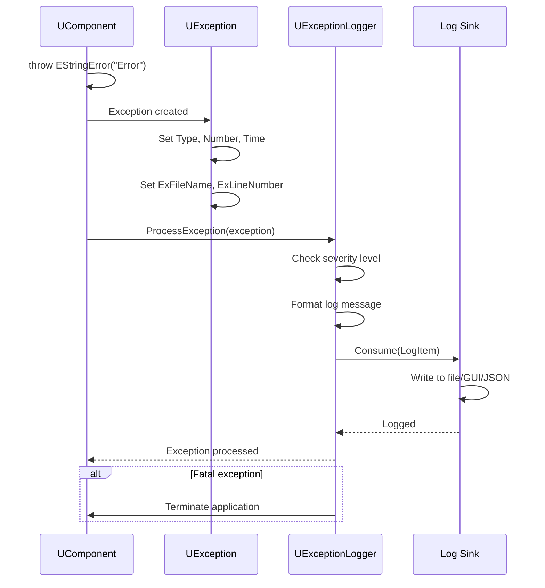

# Детальная документация модуля Core/Utilities

## RU

### Обзор

Модуль `Core/Utilities` предоставляет вспомогательные классы и функции, используемые во всем проекте Nmsdk. Это расширенная версия документации с детальным описанием всех классов, методов и примеров использования.

### UML диаграмма классов утилит

```mermaid
classDiagram
    class UException {
        <<abstract>>
        #int Number
        #int Type
        #time_t Time
        #string Message
        #string ObjectName
        #string ExFileName
        #int ExLineNumber
        +GetNumber() int
        +GetType() int
        +GetTime() time_t
        +what() const char*
        +Wrap(UException, string) void
        +SetMessage(string) void
        +GetMessage() string
    }
    
    class EFatal {
        +EFatal()
    }
    
    class EError {
        +EError()
    }
    
    class EWarning {
        +EWarning()
    }
    
    class EInfo {
        +EInfo()
    }
    
    class EDebug {
        +EDebug()
    }
    
    class EApp {
        +EApp()
    }
    
    class EStringError {
        #string Str
        +EStringError(string, int)
        +GetStr() string
    }
    
    class EIdError {
        #int Id
        +EIdError(int)
        +GetId() int
    }
    
    class ENameError {
        #string Name
        +ENameError(string)
        +GetName() string
    }
    
    class EIndexError {
        #int Index
        +EIndexError(int)
        +GetIndex() int
    }
    
    class UTransferPacket {
        #void* Data
        #int Size
        #int CmdId
        #int NumParams
        +GetData() void*
        +GetSize() int
        +GetCmdId() int
        +GetNumParams() int
        +SetCmdId(int) void
        +SetNumParams(int) void
        +SetParam(int, UParamT) void
        +GetParam(int) UParamT&
        +CalcChecksum() unsigned int
        +Load(UParamT, int) bool
        +Save(UParamT&) bool
    }
    
    class UTransferReader {
        #vector~UTransferPacket~ Packets
        +ProcessDataPart(UParamT) int
        +GetNumPackets() int
        +GetFirstPacket() UTransferPacket&
        +DelFirstPacket() void
    }
    
    class UIniFile {
        #map~string,map~string,string~~ Sections
        +ReadString(string, string, string) string
        +ReadInteger(string, string, int) int
        +ReadDouble(string, string, double) double
        +ReadBool(string, string, bool) bool
        +WriteString(string, string, string) bool
        +WriteInteger(string, string, int) bool
        +WriteDouble(string, string, double) bool
        +WriteBool(string, string, bool) bool
        +LoadFromFile(string) bool
        +SaveToFile(string) bool
    }
    
    class URegistry {
        +Read(string) string
        +Write(string, string) bool
    }
    
    class UTimeStamp {
        #time_t Time
        #double FPS
        #int Hours
        #int Minutes
        #int Seconds
        #int Frames
        +GetTime() time_t
        +GetFPS() double
        +operator()() double
        +operator+(UTimeStamp) UTimeStamp
        +operator-(UTimeStamp) UTimeStamp
        +ToString() string
        +FromString(string) bool
    }
    
    class UTree~T~ {
        #T Value
        #vector~UTree*~ Children
        #UTree* Parent
        +GetValue() T&
        +SetValue(T) void
        +AddChild(UTree) UTree*
        +GetChildren() vector~UTree*~
        +GetParent() UTree*
        +RemoveChild(UTree*) bool
    }
    
    class UQueue~T~ {
        #vector~T~ Data
        #int Front
        #int Back
        #int Size
        +push(T) void
        +pop() void
        +front() T&
        +back() T&
        +empty() bool
        +size() int
        +operator[](int) T&
        +reserve(int) void
    }
    
    class UDoubleBuffer~T~ {
        #TimedBuffer~T~* Buffer1
        #TimedBuffer~T~* Buffer2
        #TimedBuffer~T~* WriteBuffer
        #TimedBuffer~T~* ReadBuffer
        #UGenericMutex* Mutex
        +GetPtrForWrite() TimedBuffer*
        +GetPtrForRead() TimedBuffer*
        +MakeWrited(TimedBuffer*) void
        +MakeReaded(TimedBuffer*) void
        +Write(T) void
        +Read(T&) bool
    }
    
    class UPtr~T~ {
        #T* Ptr
        +Get() T*
        +Reset(T*) void
        +operator*() T&
        +operator->() T*
    }
    
    UException <|-- EFatal
    UException <|-- EError
    UException <|-- EWarning
    UException <|-- EInfo
    UException <|-- EDebug
    UException <|-- EApp
    EError <|-- EStringError
    EError <|-- EIdError
    EError <|-- ENameError
    EError <|-- EIndexError
```



### Диаграмма последовательности обработки исключения



### Детальное описание классов

#### UException

Базовый класс для всех исключений в системе Nmsdk.

**Данные:**
- `Number` - номер исключения
- `Type` - тип исключения (RDK_EX_FATAL, RDK_EX_ERROR, и т.д.)
- `Time` - время возникновения (time_t)
- `TimeMsecs` - время в миллисекундах
- `Message` - сообщение об ошибке
- `ObjectName` - имя объекта, сгенерировавшего исключение
- `ExFileName` - имя файла, где произошло исключение
- `ExLineNumber` - номер строки, где произошло исключение
- `InfoMessageString` - дополнительная информация

**Методы:**
- `GetNumber()` - получение номера исключения
- `GetType()` - получение типа исключения
- `GetTime()` - получение времени возникновения
- `SetTime(time_t)` - установка времени
- `GetMessage()` - получение сообщения
- `SetMessage(string)` - установка сообщения
- `GetObjectName()` - получение имени объекта
- `SetObjectName(string)` - установка имени объекта
- `GetExFileName()` - получение имени файла
- `SetExFileName(string)` - установка имени файла
- `GetExLineNumber()` - получение номера строки
- `SetExLineNumber(int)` - установка номера строки
- `what()` - получение строки описания (переопределение std::exception)
- `Wrap(const UException&, string)` - оборачивание существующего исключения
- `Wrap(const UException&, string, int)` - оборачивание с номером
- `Wrap(const UException&, string, int, int)` - оборачивание с номером и типом

**Типы исключений:**
- `RDK_EX_UNKNOWN` (0) - Неизвестное исключение
- `RDK_EX_FATAL` (1) - Фатальная ошибка
- `RDK_EX_ERROR` (2) - Исправимая ошибка
- `RDK_EX_WARNING` (3) - Предупреждение
- `RDK_EX_INFO` (4) - Информационное сообщение
- `RDK_EX_APP` (5) - Событие уровня приложения
- `RDK_EX_DEBUG` (6) - Отладочное сообщение

**Примеры использования:**

```cpp
#include "Rdk/Core/Utilities/UException.h"

// Простое исключение с сообщением
try {
    if (value < 0) {
        throw RDK::EStringError("Value cannot be negative", 1001);
    }
} catch (const RDK::EError& ex) {
    std::cerr << "Error: " << ex.what() << std::endl;
    std::cerr << "Type: " << ex.GetType() << std::endl;
    std::cerr << "Number: " << ex.GetNumber() << std::endl;
    std::cerr << "File: " << ex.GetExFileName() << std::endl;
    std::cerr << "Line: " << ex.GetExLineNumber() << std::endl;
}

// Исключение с идентификатором
try {
    if (id == 0) {
        throw RDK::EForbiddenId(0);
    }
    if (id < 0) {
        throw RDK::EInvalidId(id);
    }
} catch (const RDK::EIdError& ex) {
    std::cerr << "ID Error: " << ex.what() << ", ID=" << ex.Id << std::endl;
}

// Оборачивание исключения с дополнительной информацией
try {
    // какой-то код
} catch (const RDK::UException& inner_ex) {
    RDK::EStringError outer_ex("Failed to process data", 2001);
    outer_ex.Wrap(inner_ex, "Additional context information");
    throw outer_ex;
}

// Исключение с именем
try {
    if (name.empty()) {
        throw RDK::ENameNotExist("");
    }
} catch (const RDK::ENameError& ex) {
    std::cerr << "Name Error: " << ex.what() << ", Name=" << ex.Name << std::endl;
}
```

#### UTimeStamp

Класс для работы с временными метками в формате часов:минут:секунд:кадров.

**Данные:**
- `Time` - время в секундах (time_t)
- `FPS` - кадров в секунду
- `Hours` - часы
- `Minutes` - минуты
- `Seconds` - секунды
- `Frames` - кадры

**Методы:**
- `GetTime()` - получение времени в секундах
- `GetFPS()` - получение FPS
- `SetFPS(double)` - установка FPS
- `operator()()` - преобразование в секунды (double)
- `operator+(UTimeStamp)` - сложение временных меток
- `operator-(UTimeStamp)` - вычитание временных меток
- `operator+(double)` - добавление секунд
- `operator-(double)` - вычитание секунд
- `operator+=(double)` - добавление секунд с присваиванием
- `operator-=(double)` - вычитание секунд с присваиванием
- `operator<(UTimeStamp)` - сравнение меньше
- `operator>(UTimeStamp)` - сравнение больше
- `operator<=(UTimeStamp)` - сравнение меньше или равно
- `operator>=(UTimeStamp)` - сравнение больше или равно
- `operator==(UTimeStamp)` - сравнение на равенство
- `operator!=(UTimeStamp)` - сравнение на неравенство
- `ToString()` - преобразование в строку формата "HH:MM:SS:FF"
- `FromString(string)` - парсинг из строки

**Примеры использования:**

```cpp
#include "Rdk/Core/Utilities/UTimeStamp.h"

// Создание временной метки из секунд
RDK::UTimeStamp ts1(125.5, 30.0);  // 125.5 секунд при 30 FPS
std::cout << "Hours: " << ts1.Hours << std::endl;
std::cout << "Minutes: " << (int)ts1.Minutes << std::endl;
std::cout << "Seconds: " << (int)ts1.Seconds << std::endl;
std::cout << "Frames: " << (int)ts1.Frames << std::endl;

// Создание из кадров
RDK::UTimeStamp ts2(3750, 30.0);  // 3750 кадров при 30 FPS = 125 секунд

// Преобразование в секунды
double seconds = ts1();  // оператор ()

// Арифметические операции
RDK::UTimeStamp ts3 = ts1 + ts2;
RDK::UTimeStamp ts4 = ts1 - 10.5;  // вычитание секунд
ts1 += 5.0;  // добавление секунд

// Сравнение
if (ts1 < ts2) {
    std::cout << "ts1 is earlier than ts2" << std::endl;
}

// Форматирование в строку
std::string str = ts1.ToString();  // формат "HH:MM:SS:FF"
std::cout << "Time string: " << str << std::endl;

// Парсинг из строки
RDK::UTimeStamp ts5;
ts5.FromString("01:02:15:10");  // 1 час 2 минуты 15 секунд 10 кадров
```

#### UTransferPacket

Класс для создания и обработки пакетов данных для передачи по сети.

**Структура пакета:**
1. Префикс (16 байт)
2. Размер пакета (4 байта)
3. ID команды (4 байта)
4. Количество параметров (4 байта)
5. Параметры (массив)
6. Контрольная сумма (4 байта)

**Методы:**
- `SetCmdId(int)` - установка номера команды
- `GetCmdId()` - получение номера команды
- `SetNumParams(int)` - установка количества параметров
- `GetNumParams()` - получение количества параметров
- `SetParam(int index, const UParamT&)` - установка параметра
- `GetParam(int index)` - получение параметра
- `operator()(int index)` - доступ к параметру
- `CalcChecksum()` - вычисление контрольной суммы
- `Load(const UParamT&, int offset)` - загрузка пакета из буфера
- `Save(UParamT&)` - сохранение пакета в буфер
- `GetData()` - получение данных пакета
- `GetSize()` - получение размера пакета

**Примеры использования:**

```cpp
#include "Rdk/Core/Utilities/UTransferPacket.h"

// Создание пакета с командой
RDK::UTransferPacket packet;
packet.SetCmdId(1001);  // ID команды
packet.SetNumParams(2);  // 2 параметра

// Установка параметров
RDK::UParamT param1;
std::string data1 = "Hello";
param1.assign(data1.begin(), data1.end());
packet.SetParam(0, param1);

RDK::UParamT param2;
int value = 42;
param2.resize(sizeof(int));
std::memcpy(param2.data(), &value, sizeof(int));
packet.SetParam(1, param2);

// Вычисление контрольной суммы
unsigned int checksum = packet.CalcChecksum();

// Сохранение пакета в буфер
RDK::UParamT buffer;
packet.Save(buffer);

// Загрузка пакета из буфера
RDK::UTransferPacket received_packet;
if (received_packet.Load(buffer, 0)) {
    std::cout << "Command ID: " << received_packet.GetCmdId() << std::endl;
    std::cout << "Parameters: " << received_packet.GetNumParams() << std::endl;
    
    // Получение параметров
    RDK::UParamT& p1 = received_packet(0);
    std::string str1(p1.begin(), p1.end());
    std::cout << "Param 1: " << str1 << std::endl;
    
    RDK::UParamT& p2 = received_packet(1);
    int val;
    std::memcpy(&val, p2.data(), sizeof(int));
    std::cout << "Param 2: " << val << std::endl;
}
```

#### UTransferReader

Класс для чтения последовательности пакетов из потока данных.

**Методы:**
- `ProcessDataPart(const UParamT&)` - обработка части данных
  - Возвращает 0, если пакет полностью получен
  - Возвращает положительное число, если не хватает байт
  - Возвращает отрицательное число, если лишние байты
- `GetNumPackets()` - получение количества готовых пакетов
- `GetFirstPacket()` - получение первого пакета
- `DelFirstPacket()` - удаление первого пакета
- `Clear()` - очистка всех пакетов

**Примеры использования:**

```cpp
#include "Rdk/Core/Utilities/UTransferPacket.h"

// Чтение последовательности пакетов из потока
RDK::UTransferReader reader;

// Обработка данных из сети
void ProcessNetworkData(const RDK::UParamT& network_buffer) {
    int result = reader.ProcessDataPart(network_buffer);
    
    if (result == 0) {
        // Пакет полностью получен
        while (reader.GetNumPackets() > 0) {
            const RDK::UTransferPacket& packet = reader.GetFirstPacket();
            
            // Обработка пакета
            HandlePacket(packet);
            
            reader.DelFirstPacket();
        }
    } else if (result > 0) {
        // Не хватает байт для завершения пакета
        std::cout << "Need " << result << " more bytes" << std::endl;
    } else {
        // Лишние байты в буфере
        std::cout << "Extra " << -result << " bytes" << std::endl;
    }
}
```

#### UIniFile

Класс для чтения и записи конфигурационных файлов в формате INI.

**Методы чтения:**
- `ReadString(string section, string key, string default)` - чтение строки
- `ReadInteger(string section, string key, int default)` - чтение целого числа
- `ReadDouble(string section, string key, double default)` - чтение вещественного числа
- `ReadBool(string section, string key, bool default)` - чтение булева значения

**Методы записи:**
- `WriteString(string section, string key, string value)` - запись строки
- `WriteInteger(string section, string key, int value)` - запись целого числа
- `WriteDouble(string section, string key, double value)` - запись вещественного числа
- `WriteBool(string section, string key, bool value)` - запись булева значения

**Методы файлов:**
- `LoadFromFile(string path)` - загрузка из файла
- `SaveToFile(string path)` - сохранение в файл

**Примеры использования:**

```cpp
#include "Rdk/Core/Utilities/UIniFile.h"

RDK::UIniFile ini_file;

// Загрузка из файла
ini_file.LoadFromFile("config.ini");

// Чтение значений
std::string value = ini_file.ReadString("Section", "Key", "Default");
int int_value = ini_file.ReadInteger("Section", "IntKey", 0);
double double_value = ini_file.ReadDouble("Section", "DoubleKey", 0.0);
bool bool_value = ini_file.ReadBool("Section", "BoolKey", false);

// Запись значений
ini_file.WriteString("Section", "Key", "Value");
ini_file.WriteInteger("Section", "IntKey", 42);
ini_file.WriteDouble("Section", "DoubleKey", 3.14);
ini_file.WriteBool("Section", "BoolKey", true);

// Сохранение в файл
ini_file.SaveToFile("config.ini");
```

#### UQueue\<T\>

Шаблонный класс для реализации циклической очереди с автоматическим расширением.

**Методы:**
- `push(const T&)` - добавление элемента в конец
- `pop()` - удаление элемента из начала
- `front()` - получение первого элемента
- `back()` - получение последнего элемента
- `operator[](int index)` - доступ к элементу по индексу
- `empty()` - проверка на пустоту
- `size()` - получение размера
- `reserve(int)` - резервирование памяти
- `FromVec(const vector<T>&)` - заполнение из вектора
- `Clear()` - очистка очереди

**Примеры использования:**

```cpp
#include "Rdk/Core/Utilities/UQueue.h"

// Создание очереди
RDK::UQueue<int> queue;

// Добавление элементов
queue.push(1);
queue.push(2);
queue.push(3);

// Доступ к элементам
int first = queue.front();  // первый элемент
int last = queue.back();    // последний элемент
int second = queue[1];      // элемент по индексу

// Извлечение элементов
queue.pop();  // удаляет первый элемент

// Проверка состояния
if (queue.empty()) {
    std::cout << "Queue is empty" << std::endl;
}
std::cout << "Queue size: " << queue.size() << std::endl;

// Резервирование памяти
queue.reserve(1000);  // резервирует место для 1000 элементов

// Заполнение из вектора
std::vector<int> vec = {10, 20, 30, 40};
queue.FromVec(vec);
```

#### UDoubleBuffer\<T\>

Потокобезопасный класс для реализации двойной буферизации с временными метками.

**Методы:**
- `GetPtrForWrite()` - получение указателя на буфер для записи
- `GetPtrForRead()` - получение указателя на буфер для чтения
- `MakeWrited(TimedBuffer*)` - пометка буфера как записанного
- `MakeReaded(TimedBuffer*)` - пометка буфера как прочитанного
- `Write(const T&)` - безопасная запись (с автоматической блокировкой)
- `Read(T&)` - безопасное чтение (с автоматической блокировкой)

**Примеры использования:**

```cpp
#include "Rdk/Core/Utilities/UDoubleBuffer.h"

// Создание двойного буфера
RDK::UDoubleBuffer<DataBuffer> double_buffer;

// Поток записи
void WriteThread() {
    while (running) {
        DataBuffer new_data = PrepareData();
        
        // Получение указателя на буфер для записи
        RDK::TimedBuffer<DataBuffer>* write_buf = double_buffer.GetPtrForWrite();
        if (write_buf) {
            write_buf->Data = new_data;
            double_buffer.MakeWrited(write_buf);
        }
    }
}

// Поток чтения
void ReadThread() {
    while (running) {
        // Получение указателя на буфер для чтения
        RDK::TimedBuffer<DataBuffer>* read_buf = double_buffer.GetPtrForRead();
        if (read_buf) {
            DataBuffer data = read_buf->Data;
            ProcessData(data);
            double_buffer.MakeReaded(read_buf);
        }
    }
}

// Безопасные методы с автоматической блокировкой
void SafeWrite(const DataBuffer& data) {
    double_buffer.Write(data);
}

void SafeRead(DataBuffer& data) {
    double_buffer.Read(data);
}
```

#### UTree\<T\>

Класс для работы с древовидными структурами данных.

**Методы:**
- `GetValue()` - получение значения узла
- `SetValue(const T&)` - установка значения узла
- `AddChild(const T&)` - добавление дочернего узла
- `GetChildren()` - получение списка дочерних узлов
- `GetParent()` - получение родительского узла
- `RemoveChild(UTree*)` - удаление дочернего узла
- `GetDepth()` - получение глубины узла
- `GetPath()` - получение пути к узлу

**Примеры использования:**

```cpp
#include "Rdk/Core/Utilities/UTree.h"

// Создание дерева
RDK::UTree<std::string> root("Root");

// Добавление дочерних узлов
RDK::UTree<std::string>* child1 = root.AddChild("Child1");
RDK::UTree<std::string>* child2 = root.AddChild("Child2");

// Добавление внуков
child1->AddChild("Grandchild1");
child1->AddChild("Grandchild2");

// Обход дерева
void TraverseTree(RDK::UTree<std::string>* node, int depth) {
    std::string indent(depth * 2, ' ');
    std::cout << indent << node->GetValue() << std::endl;
    
    for (auto* child : node->GetChildren()) {
        TraverseTree(child, depth + 1);
    }
}

TraverseTree(&root, 0);
```

#### UPtr\<T\>

Система умных указателей для управления памятью.

**Методы:**
- `Get()` - получение указателя
- `Reset(T*)` - сброс указателя
- `operator*()` - разыменование
- `operator->()` - доступ к членам
- `operator bool()` - проверка на валидность

**Примеры использования:**

```cpp
#include "Rdk/Core/Utilities/UPtr.h"

// Создание умного указателя
RDK::UPtr<MyClass> ptr(new MyClass());

// Использование
if (ptr) {
    ptr->DoSomething();
    (*ptr).DoSomethingElse();
}

// Сброс указателя
ptr.Reset(nullptr);
```

### См. также

- [Utilities-Reference.md](Utilities-Reference.md) - справочник по утилитам
- [Error-Handling.md](Guides/Error-Handling.md) - руководство по обработке ошибок
- [Logging-System.md](Logging-System.md) - система логирования
- [System-Detailed.md](System-Detailed.md) - системные абстракции

---

## EN

### Overview

The `Core/Utilities` module provides utility classes and functions used throughout the Nmsdk project. This is an extended version of the documentation with detailed description of all classes, methods, and usage examples.

### Main Classes

#### UException

Base class for all exceptions in the Nmsdk system.

**Key Methods:**
- `GetNumber()`, `GetType()`, `GetTime()` - get exception properties
- `what()` - get exception message
- `Wrap()` - wrap existing exception with additional context

#### UTimeStamp

Class for working with timestamps in hours:minutes:seconds:frames format.

**Key Methods:**
- `operator()()` - convert to seconds
- `ToString()`, `FromString()` - string conversion
- Arithmetic and comparison operators

#### UTransferPacket / UTransferReader

Classes for network data packet handling.

#### UIniFile

Class for reading and writing INI configuration files.

#### UQueue\<T\>

Template class for circular queue with automatic expansion.

#### UDoubleBuffer\<T\>

Thread-safe class for double buffering.

#### UTree\<T\>

Class for tree data structures.

#### UPtr\<T\>

Smart pointer system.

### See Also

- [Utilities-Reference.md](Utilities-Reference.md) - utilities reference
- [Error-Handling.md](Guides/Error-Handling.md) - error handling guide
- [Logging-System.md](Logging-System.md) - logging system
- [System-Detailed.md](System-Detailed.md) - system abstractions
