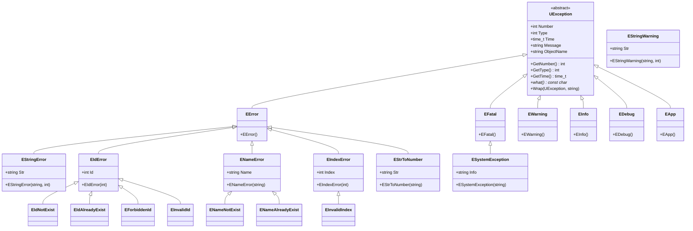
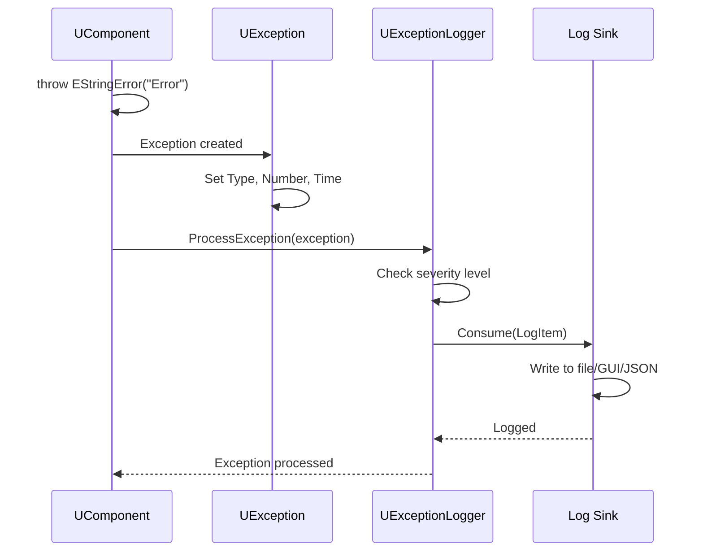
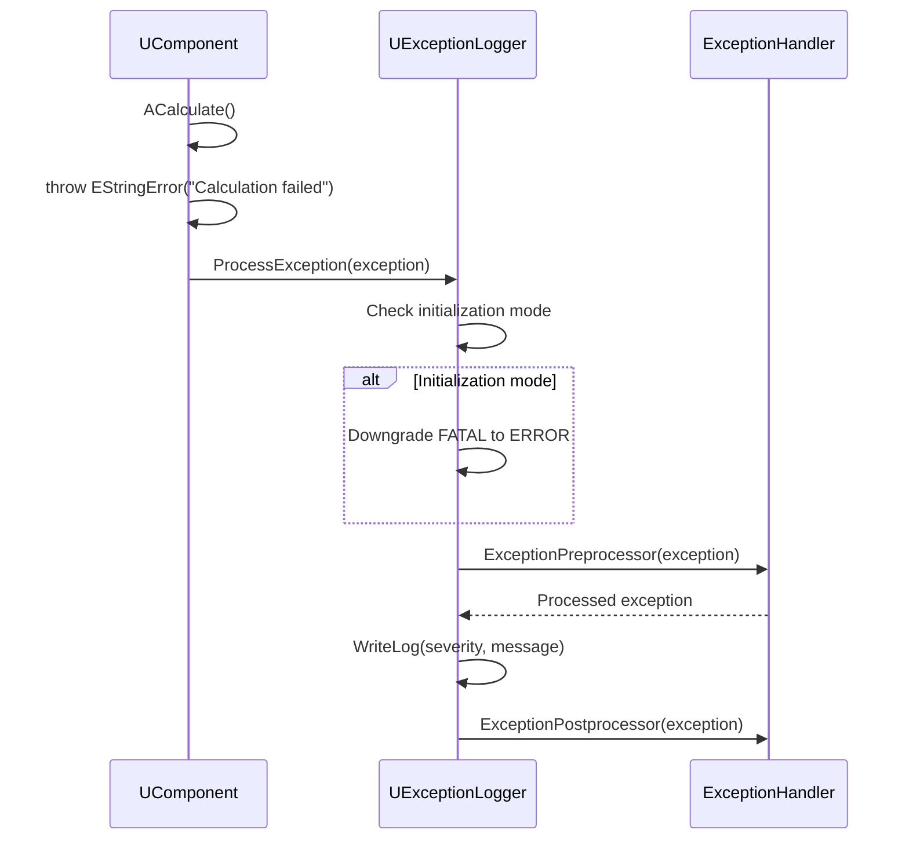
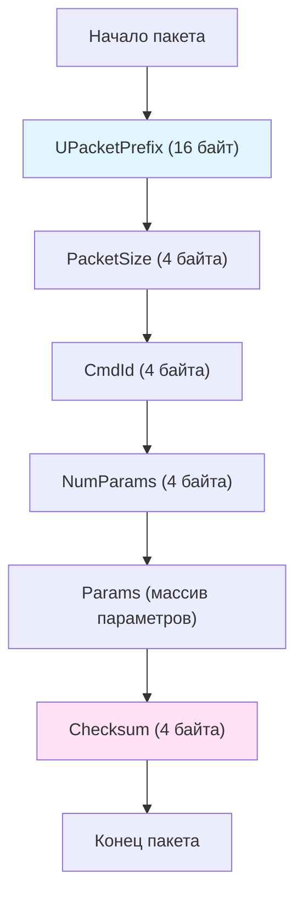
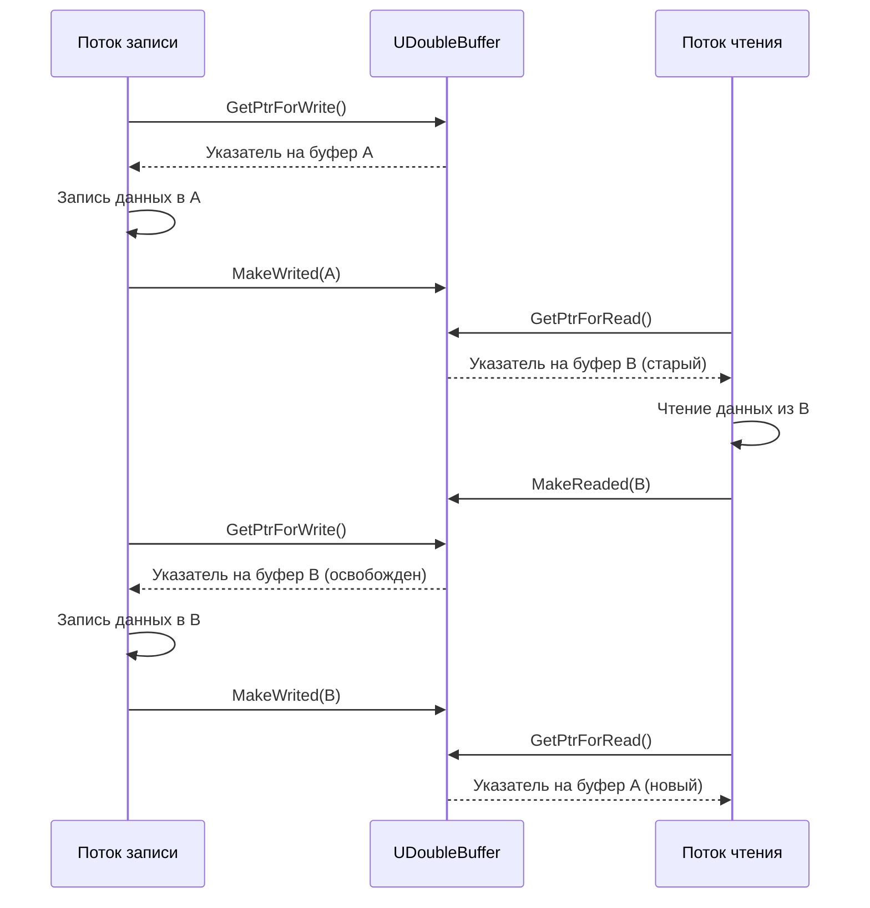

# Справочник по утилитам (Utilities Reference)

## RU

### Обзор

Модуль `Rdk/Core/Utilities/` содержит вспомогательные классы и функции, используемые во всем проекте Nmsdk. Эти утилиты обеспечивают базовую функциональность для работы с исключениями, временными метками, передачей данных, строками и другими общими задачами.

### UML диаграмма классов утилит

```mermaid
classDiagram
    class UException {
        <<abstract>>
        #int Number
        #int Type
        #time_t Time
        #string Message
        #string ObjectName
        +GetNumber() int
        +GetType() int
        +GetTime() time_t
        +what() const char*
        +Wrap(UException, string) UException
    }
    
    class EFatal {
        +EFatal()
    }
    
    class EError {
        +EError()
    }
    
    class EWarning {
        +EWarning()
    }
    
    class EInfo {
        +EInfo()
    }
    
    class EDebug {
        +EDebug()
    }
    
    class EApp {
        +EApp()
    }
    
    class EStringError {
        #string Str
        +EStringError(string, int)
    }
    
    class EIdError {
        #int Id
        +EIdError(int)
    }
    
    class ENameError {
        #string Name
        +ENameError(string)
    }
    
    class EIndexError {
        #int Index
        +EIndexError(int)
    }
    
    class UTransferPacket {
        #void* Data
        #int Size
        +GetData() void*
        +GetSize() int
    }
    
    class UTransferReader {
        +Read(UTransferPacket) bool
    }
    
    class UIniFile {
        #map~string,string~ Values
        +Read(string, string) string
        +Write(string, string) bool
        +LoadFromFile(string) bool
        +SaveToFile(string) bool
    }
    
    class URegistry {
        +Read(string) string
        +Write(string, string) bool
    }
    
    class UTimeStamp {
        #time_t Time
        +GetTime() time_t
        +ToString() string
    }
    
    class UTree~T~ {
        #T Value
        #vector~UTree*~ Children
        +GetValue() T&
        +AddChild(UTree) void
        +GetChildren() vector~UTree*~
    }
    
    class UQueue~T~ {
        #queue~T~ Queue
        +Push(T) void
        +Pop() T
        +Empty() bool
    }
    
    class UDoubleBuffer~T~ {
        #T* Front
        #T* Back
        +GetFront() T*
        +GetBack() T*
        +Swap() void
    }
    
    class UPtr~T~ {
        #T* Ptr
        +Get() T*
        +Reset(T*) void
    }
    
    UException <|-- EFatal
    UException <|-- EError
    UException <|-- EWarning
    UException <|-- EInfo
    UException <|-- EDebug
    UException <|-- EApp
    EError <|-- EStringError
    EError <|-- EIdError
    EError <|-- ENameError
    EError <|-- EIndexError
```



### Основные классы

#### UException - Система исключений

Базовый класс для всех исключений в системе Nmsdk. Предоставляет единый интерфейс для обработки ошибок с поддержкой различных уровней серьезности.

**Иерархия исключений:**



**Уровни исключений:**

- `RDK_EX_UNKNOWN` (0) - Неизвестное исключение
- `RDK_EX_FATAL` (1) - Фатальная ошибка (исправление невозможно)
- `RDK_EX_ERROR` (2) - Исправимая ошибка
- `RDK_EX_WARNING` (3) - Предупреждение (производительность, возможные ошибки)
- `RDK_EX_INFO` (4) - Информационное сообщение (порт открыт, клиент подключен)
- `RDK_EX_APP` (5) - Событие уровня приложения
- `RDK_EX_DEBUG` (6) - Отладочные сообщения (можно отключить)

**Диаграмма последовательности обработки исключения:**



**Примеры использования:**

```cpp
#include "Rdk/Core/Utilities/UException.h"

// Простое исключение с сообщением
try {
    if (value < 0) {
        throw RDK::EStringError("Value cannot be negative", 1001);
    }
} catch (const RDK::EError& ex) {
    std::cerr << "Error: " << ex.what() << std::endl;
    std::cerr << "Type: " << ex.GetType() << std::endl;
    std::cerr << "Number: " << ex.GetNumber() << std::endl;
}

// Исключение с идентификатором
try {
    if (id == 0) {
        throw RDK::EForbiddenId(0);
    }
    if (id < 0) {
        throw RDK::EInvalidId(id);
    }
} catch (const RDK::EIdError& ex) {
    std::cerr << "ID Error: " << ex.what() << ", ID=" << ex.Id << std::endl;
}

// Оборачивание исключения с дополнительной информацией
try {
    // какой-то код
} catch (const RDK::UException& inner_ex) {
    RDK::EStringError outer_ex("Failed to process data", 2001);
    outer_ex.Wrap(inner_ex, "Additional context information");
    throw outer_ex;
}
```

**Обработка исключений в компонентах:**



#### UTimeStamp - Временные метки

Класс для работы с временными метками в формате часов:минут:секунд:кадров с поддержкой FPS (кадров в секунду).

**Основные возможности:**

- Преобразование между секундами и кадрами
- Арифметические операции (сложение, вычитание)
- Операции сравнения
- Форматирование в строку

**Примеры использования:**

```cpp
#include "Rdk/Core/Utilities/UTimeStamp.h"

// Создание временной метки из секунд
RDK::UTimeStamp ts1(125.5, 30.0); // 125.5 секунд при 30 FPS
std::cout << "Hours: " << ts1.Hours << std::endl;
std::cout << "Minutes: " << (int)ts1.Minutes << std::endl;
std::cout << "Seconds: " << (int)ts1.Seconds << std::endl;
std::cout << "Frames: " << (int)ts1.Frames << std::endl;

// Создание из кадров
RDK::UTimeStamp ts2(3750, 30.0); // 3750 кадров при 30 FPS = 125 секунд

// Преобразование в секунды
double seconds = ts1(); // оператор ()

// Арифметические операции
RDK::UTimeStamp ts3 = ts1 + ts2;
RDK::UTimeStamp ts4 = ts1 - 10.5; // вычитание секунд
ts1 += 5.0; // добавление секунд

// Сравнение
if (ts1 < ts2) {
    std::cout << "ts1 is earlier than ts2" << std::endl;
}

// Форматирование в строку
std::string str;
ts1 >> str; // формат "HH:MM:SS:FF"
std::cout << "Time string: " << str << std::endl;

// Парсинг из строки
RDK::UTimeStamp ts5;
ts5 << "01:02:15:10"; // 1 час 2 минуты 15 секунд 10 кадров
```

**Использование для работы с видео:**

```cpp
// Обработка видео с временными метками
void ProcessVideoFrame(RDK::UTimeStamp current_time, double fps) {
    RDK::UTimeStamp frame_time(current_time(), fps);
    
    // Вычисление времени следующего кадра
    RDK::UTimeStamp next_frame = frame_time + (1.0 / fps);
    
    // Проверка, достигли ли мы определенной временной точки
    RDK::UTimeStamp target_time(60.0, fps); // 60 секунд
    if (current_time >= target_time) {
        std::cout << "Reached 60 second mark" << std::endl;
    }
}
```

#### UTransferPacket - Пакеты передачи данных

Класс для создания и обработки пакетов данных для передачи по сети. Поддерживает команды с параметрами и контрольную сумму.

**Структура пакета:**



**Основные методы:**

- `SetCmdId(int)` - установка номера команды
- `SetNumParams(int)` - установка количества параметров
- `SetParam(int, const UParamT&)` - установка параметра
- `Load(const UParamT&, int)` - загрузка пакета из буфера
- `Save(UParamT&)` - сохранение пакета в буфер
- `CalcChecksum()` - вычисление контрольной суммы

**Примеры использования:**

```cpp
#include "Rdk/Core/Utilities/UTransferPacket.h"

// Создание пакета с командой
RDK::UTransferPacket packet;
packet.SetCmdId(1001); // ID команды
packet.SetNumParams(2); // 2 параметра

// Установка параметров
RDK::UParamT param1;
std::string data1 = "Hello";
param1.assign(data1.begin(), data1.end());
packet.SetParam(0, param1);

RDK::UParamT param2;
int value = 42;
param2.resize(sizeof(int));
std::memcpy(param2.data(), &value, sizeof(int));
packet.SetParam(1, param2);

// Вычисление контрольной суммы
unsigned int checksum = packet.CalcChecksum();

// Сохранение пакета в буфер
RDK::UParamT buffer;
packet.Save(buffer);

// Загрузка пакета из буфера
RDK::UTransferPacket received_packet;
if (received_packet.Load(buffer, 0)) {
    std::cout << "Command ID: " << received_packet.GetCmdId() << std::endl;
    std::cout << "Parameters: " << received_packet.GetNumParams() << std::endl;
    
    // Получение параметров
    RDK::UParamT& p1 = received_packet(0);
    std::string str1(p1.begin(), p1.end());
    std::cout << "Param 1: " << str1 << std::endl;
}
```

**Использование UTransferReader для чтения потока пакетов:**

```cpp
// Чтение последовательности пакетов из потока
RDK::UTransferReader reader;

// Обработка данных из сети
void ProcessNetworkData(const RDK::UParamT& network_buffer) {
    int result = reader.ProcessDataPart(network_buffer);
    
    if (result == 0) {
        // Пакет полностью получен
        while (reader.GetNumPackets() > 0) {
            const RDK::UTransferPacket& packet = reader.GetFirstPacket();
            
            // Обработка пакета
            HandlePacket(packet);
            
            reader.DelFirstPacket();
        }
    } else if (result > 0) {
        // Не хватает байт для завершения пакета
        std::cout << "Need " << result << " more bytes" << std::endl;
    } else {
        // Лишние байты в буфере
        std::cout << "Extra " << -result << " bytes" << std::endl;
    }
}
```

#### USupport - Вспомогательные функции

Набор функций для преобразования чисел в строки и обратно, работы с буферами и других общих задач.

**Основные функции:**

- `ntoa(T, string&)` - преобразование числа в строку
- `sntoa(T)` - преобразование числа в строку (возвращает string)
- `atoi(const string&)` - преобразование строки в int
- `atof(const string&)` - преобразование строки в double
- `is_nan(T)` - проверка на NaN
- `is_inf(T)` - проверка на бесконечность

**Примеры использования:**

```cpp
#include "Rdk/Core/Utilities/USupport.h"

// Преобразование чисел в строки
std::string buf;
RDK::ntoa(42, buf);        // "42"
RDK::ntoa(3.14159, buf);   // "3.14159"
RDK::ntoa(-100, buf);      // "-100"

// Удобная функция, возвращающая строку
std::string str1 = RDK::sntoa(42);
std::string str2 = RDK::sntoa(3.14159);

// Преобразование строк в числа
int i = RDK::atoi("123");
double d = RDK::atof("3.14");

// Проверка на специальные значения
double value = std::numeric_limits<double>::quiet_NaN();
if (RDK::is_nan(value)) {
    std::cout << "Value is NaN" << std::endl;
}

double inf_value = std::numeric_limits<double>::infinity();
if (RDK::is_inf(inf_value)) {
    std::cout << "Value is Infinity" << std::endl;
}
```

#### UQueue - Очередь данных

Шаблонный класс для реализации циклической очереди с автоматическим расширением.

**Особенности:**

- Циклический буфер для эффективного использования памяти
- Автоматическое расширение при переполнении
- Поддержка индексации элементов
- Резервирование памяти

**Примеры использования:**

```cpp
#include "Rdk/Core/Utilities/UQueue.h"

// Создание очереди
RDK::UQueue<int> queue;

// Добавление элементов
queue.push(1);
queue.push(2);
queue.push(3);

// Доступ к элементам
int first = queue.front();  // первый элемент
int last = queue.back();    // последний элемент
int second = queue[1];      // элемент по индексу

// Извлечение элементов
queue.pop();  // удаляет первый элемент

// Проверка состояния
if (queue.empty()) {
    std::cout << "Queue is empty" << std::endl;
}
std::cout << "Queue size: " << queue.size() << std::endl;

// Резервирование памяти
queue.reserve(1000);  // резервирует место для 1000 элементов

// Заполнение из вектора
std::vector<int> vec = {10, 20, 30, 40};
queue.FromVec(vec);
```

**Использование для буферизации данных:**

```cpp
// Буферизация кадров видео
RDK::UQueue<VideoFrame> frame_buffer;
frame_buffer.reserve(100);  // буфер на 100 кадров

// Поток записи
void WriteThread() {
    while (running) {
        VideoFrame frame = CaptureFrame();
        frame_buffer.push(frame);
    }
}

// Поток чтения
void ReadThread() {
    while (running) {
        if (!frame_buffer.empty()) {
            VideoFrame frame = frame_buffer.front();
            ProcessFrame(frame);
            frame_buffer.pop();
        }
    }
}
```

#### UDoubleBuffer - Двойная буферизация

Потокобезопасный класс для реализации двойной буферизации с временными метками.

**Особенности:**

- Потокобезопасный доступ
- Автоматический выбор буфера для записи/чтения
- Временные метки для каждого буфера
- Минимизация блокировок

**Примеры использования:**

```cpp
#include "Rdk/Core/Utilities/UDoubleBuffer.h"

// Создание двойного буфера
RDK::UDoubleBuffer<DataBuffer> double_buffer;

// Поток записи
void WriteThread() {
    while (running) {
        DataBuffer new_data = PrepareData();
        
        // Получение указателя на буфер для записи
        RDK::TimedBuffer<DataBuffer>* write_buf = double_buffer.GetPtrForWrite();
        if (write_buf) {
            write_buf->Data = new_data;
            double_buffer.MakeWrited(write_buf);
        }
    }
}

// Поток чтения
void ReadThread() {
    while (running) {
        // Получение указателя на буфер для чтения
        RDK::TimedBuffer<DataBuffer>* read_buf = double_buffer.GetPtrForRead();
        if (read_buf) {
            DataBuffer data = read_buf->Data;
            ProcessData(data);
            double_buffer.MakeReaded(read_buf);
        }
    }
}

// Безопасные методы с автоматической блокировкой
void SafeWrite(const DataBuffer& data) {
    double_buffer.Write(data);
}

void SafeRead(DataBuffer& data) {
    double_buffer.Read(data);
}
```

**Схема работы двойной буферизации:**



#### UTree - Древовидные структуры

Класс для работы с древовидными структурами данных.

#### UPtr - Умные указатели

Система умных указателей для управления памятью.

#### UIniFile - Работа с INI файлами

Класс для чтения и записи конфигурационных файлов в формате INI.

**Примеры использования:**

```cpp
#include "Rdk/Core/Utilities/UIniFile.h"

RDK::UIniFile ini_file("config.ini");

// Чтение значений
std::string value = ini_file.ReadString("Section", "Key", "Default");
int int_value = ini_file.ReadInteger("Section", "IntKey", 0);
double double_value = ini_file.ReadDouble("Section", "DoubleKey", 0.0);
bool bool_value = ini_file.ReadBool("Section", "BoolKey", false);

// Запись значений
ini_file.WriteString("Section", "Key", "Value");
ini_file.WriteInteger("Section", "IntKey", 42);
ini_file.WriteDouble("Section", "DoubleKey", 3.14);
ini_file.WriteBool("Section", "BoolKey", true);
```

### См. также

- [Exception Handling](../../Docs/Rdk-Core/Engine-Architecture.md) - обработка исключений в компонентах
- [Logging System](Logging-System.md) - система логирования
- [System Platform Abstraction](../../Docs/Rdk-Core/System-Platform-Abstraction.md) - системные абстракции

---

## EN

### Overview

The `Rdk/Core/Utilities/` module contains utility classes and functions used throughout the Nmsdk project. These utilities provide basic functionality for exception handling, timestamps, data transfer, strings, and other common tasks.

### Main Classes

#### UException - Exception System

Base class for all exceptions in the Nmsdk system. Provides a unified interface for error handling with support for different severity levels.

**Exception Hierarchy:**

The exception system follows a hierarchical structure with base `UException` class and specialized exception types for different error categories.

**Exception Levels:**

- `RDK_EX_UNKNOWN` (0) - Unknown exception
- `RDK_EX_FATAL` (1) - Fatal error (correction impossible)
- `RDK_EX_ERROR` (2) - Correctable error
- `RDK_EX_WARNING` (3) - Warning (performance, possible errors)
- `RDK_EX_INFO` (4) - Information message (port open, client connected)
- `RDK_EX_APP` (5) - Application-level event
- `RDK_EX_DEBUG` (6) - Debug messages (can be switched off)

**Usage Examples:**

```cpp
#include "Rdk/Core/Utilities/UException.h"

// Simple exception with message
try {
    if (value < 0) {
        throw RDK::EStringError("Value cannot be negative", 1001);
    }
} catch (const RDK::EError& ex) {
    std::cerr << "Error: " << ex.what() << std::endl;
}

// Exception with identifier
try {
    if (id == 0) {
        throw RDK::EForbiddenId(0);
    }
} catch (const RDK::EIdError& ex) {
    std::cerr << "ID Error: " << ex.what() << ", ID=" << ex.Id << std::endl;
}
```

#### UTimeStamp - Timestamps

Class for working with timestamps in hours:minutes:seconds:frames format with FPS (frames per second) support.

**Main Features:**

- Conversion between seconds and frames
- Arithmetic operations (addition, subtraction)
- Comparison operations
- String formatting

**Usage Examples:**

```cpp
#include "Rdk/Core/Utilities/UTimeStamp.h"

// Create timestamp from seconds
RDK::UTimeStamp ts1(125.5, 30.0); // 125.5 seconds at 30 FPS

// Convert to seconds
double seconds = ts1(); // operator ()

// Arithmetic operations
RDK::UTimeStamp ts3 = ts1 + ts2;
ts1 += 5.0; // add seconds

// Format to string
std::string str;
ts1 >> str; // format "HH:MM:SS:FF"
```

#### UTransferPacket - Data Transfer Packets

Class for creating and processing data packets for network transmission. Supports commands with parameters and checksum.

**Packet Structure:**

The packet consists of prefix, size, command ID, number of parameters, parameter data, and checksum.

**Usage Examples:**

```cpp
#include "Rdk/Core/Utilities/UTransferPacket.h"

// Create packet with command
RDK::UTransferPacket packet;
packet.SetCmdId(1001);
packet.SetNumParams(2);

// Set parameters
RDK::UParamT param1;
std::string data1 = "Hello";
param1.assign(data1.begin(), data1.end());
packet.SetParam(0, param1);

// Calculate checksum
unsigned int checksum = packet.CalcChecksum();

// Save packet to buffer
RDK::UParamT buffer;
packet.Save(buffer);
```

#### USupport - Utility Functions

Set of functions for converting numbers to strings and vice versa, working with buffers, and other common tasks.

**Main Functions:**

- `ntoa(T, string&)` - convert number to string
- `sntoa(T)` - convert number to string (returns string)
- `atoi(const string&)` - convert string to int
- `atof(const string&)` - convert string to double
- `is_nan(T)` - check for NaN
- `is_inf(T)` - check for infinity

#### UQueue - Data Queue

Template class for implementing a circular queue with automatic expansion.

**Features:**

- Circular buffer for efficient memory usage
- Automatic expansion on overflow
- Element indexing support
- Memory reservation

**Usage Examples:**

```cpp
#include "Rdk/Core/Utilities/UQueue.h"

RDK::UQueue<int> queue;
queue.push(1);
queue.push(2);

int first = queue.front();
queue.pop();
```

#### UDoubleBuffer - Double Buffering

Thread-safe class for implementing double buffering with timestamps.

**Features:**

- Thread-safe access
- Automatic buffer selection for write/read
- Timestamps for each buffer
- Minimized locking

**Usage Examples:**

```cpp
#include "Rdk/Core/Utilities/UDoubleBuffer.h"

RDK::UDoubleBuffer<DataBuffer> double_buffer;

// Write thread
RDK::TimedBuffer<DataBuffer>* write_buf = double_buffer.GetPtrForWrite();
if (write_buf) {
    write_buf->Data = new_data;
    double_buffer.MakeWrited(write_buf);
}

// Read thread
RDK::TimedBuffer<DataBuffer>* read_buf = double_buffer.GetPtrForRead();
if (read_buf) {
    DataBuffer data = read_buf->Data;
    ProcessData(data);
    double_buffer.MakeReaded(read_buf);
}
```

#### UIniFile - INI File Handling

Class for reading and writing configuration files in INI format.

**Usage Examples:**

```cpp
#include "Rdk/Core/Utilities/UIniFile.h"

RDK::UIniFile ini_file("config.ini");
std::string value = ini_file.ReadString("Section", "Key", "Default");
ini_file.WriteString("Section", "Key", "Value");
```

### See Also

- [Exception Handling](../../Docs/Rdk-Core/Engine-Architecture.md) - exception handling in components
- [Logging System](Logging-System.md) - logging system
- [System Platform Abstraction](../../Docs/Rdk-Core/System-Platform-Abstraction.md) - system abstractions
- [Error-Handling.md](Guides/Error-Handling.md) - руководство по обработке ошибок
