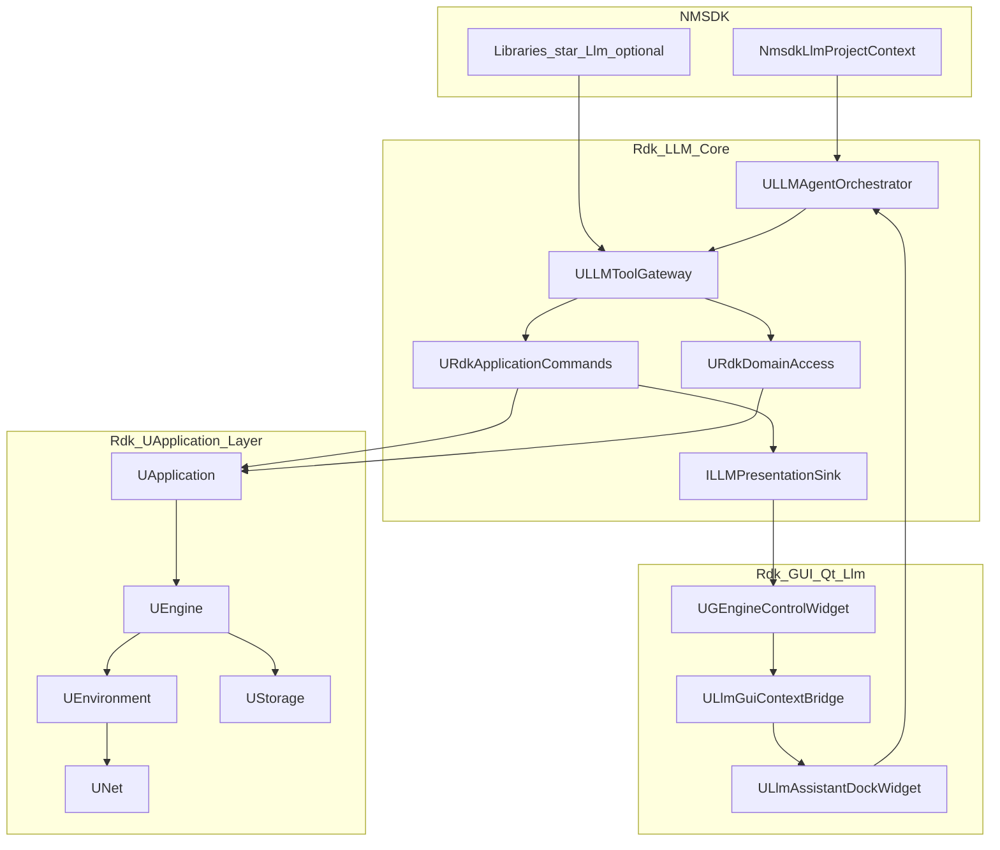

# Архитектура RDK LLM (краткий индекс)

**Подробная normative-архитектура:** [Developer-Architecture.md](Developer-Architecture.md).  
**Как расширять:** [Extension-Guide.md](Extension-Guide.md).

## 1. Роль LLM в системе

LLM — **планировщик и интерпретатор намерения**, не исполнитель и не источник истины.

```
Пользователь → UI → Orchestrator → ILLMProvider (модель)
                      ↓
              Tool Gateway → Policy → URdkApplicationCommands → UApplication
                      ↓                    ↘ URdkDomainAccess (UNet write/read)
              ILLMPresentationSink (optional GUI refresh)
                      ↓
              ILLMProjectContextProvider (NMSDK: Bin, ClDesc, Docs)
```

Модель **никогда** не:
- генерирует SQL/XML для прямого применения;
- читает файлы проекта в обход gateway;
- расширяет права пользователя.

---

## 2. Три плоскости



| Плоскость | Путь | Зависимости |
|-----------|------|-------------|
| Core | `Rdk/LLM/` | `rdk.static.qt`, CURL, nlohmann_json **только если** `RDK_USE_LLM` |
| GUI | `Rdk/GUI/Qt/Llm/` | Qt, `rdk.llm.core`, **только если** `RDK_USE_LLM` |
| NMSDK | `App/NeuroModeler/`, `Libraries/*/Llm/` | Регистрация контекста и доп. tools |

---

## 3. Слои (нумерация для кода)

| # | Слой | Namespace / префикс классов | Каталог |
|---|------|------------------------------|---------|
| 1 | UI / API | `ULlm*` (Qt) | `Rdk/GUI/Qt/Llm/` |
| 2 | Intent | `ULLMIntent*` | `Rdk/LLM/Core/Intent/` |
| 3 | Orchestrator | `ULLMAgentOrchestrator` | `Rdk/LLM/Core/Orchestrator/` |
| 4 | Tool Gateway | `ULLMToolGateway` | `Rdk/LLM/Core/Tools/` |
| 5 | Policy | `ULLMPolicyEngine` | `Rdk/LLM/Core/Policy/` |
| 6 | Application commands | `URdkApplicationCommands` | `Rdk/LLM/Core/Domain/` |
| 6a | Domain (net/model) | `URdkDomainAccess` | `Rdk/LLM/Core/Domain/` |
| 6b | Presentation (optional) | `ILLMPresentationSink` | `Rdk/LLM/Core/Gui/` + `Rdk/GUI/Qt/Llm/` |
| 6c | Project context | `ILLMProjectContextProvider` | `Rdk/LLM/Core/Context/` + NMSDK impl |
| 7 | Observability | `ULLMAuditLog` | `Rdk/LLM/Core/Observability/` |
| — | Providers | `ILLMProvider` | `Rdk/LLM/Core/Providers/` |

**Правило зависимостей:** слои 1–7 не включают заголовки Qt в `Rdk/LLM/Core` (кроме опционального bridge interface в Deploy).

---

## 4. Поток одного запроса пользователя

См. **[Developer-Architecture.md §4](Developer-Architecture.md#4-request-flow-current)** (worker thread, optional HITL, auto-apply, GUI-thread lifecycle tools, plans).

---

## 5. Сценарии зрелости

| ID | Имя | Фаза | Документ |
|----|-----|------|----------|
| A | Chat over data | 1 | [MVP-Roadmap.md](MVP-Roadmap.md) |
| B | Copilot for actions | 2 | MVP-Roadmap |
| C | Workflow operator | Post-MVP | [Orchestrator.md](Orchestrator.md), `ULLMPlanExecutor` |
| D | Autonomous agent | Post-MVP | [Post-MVP-Implementation-Plan.md](Post-MVP-Implementation-Plan.md) |

---

## 6. CMake targets (итог)

| Target | Условие |
|--------|---------|
| `rdk.llm.core` | `RDK_USE_LLM=ON` |
| `rdk.llm.embedded` | `RDK_USE_LLM=ON` && `RDK_LLM_BUILD_EMBEDDED=ON` |
| NeuroModeler + GUI Llm sources | `RDK_USE_LLM=ON` |

См. [Build.md](Build.md).

---

## 7. Точки регистрации NMSDK

```cpp
// App/NeuroModeler/NmsdkRegisterLlm.h — вызывается после UApplication::Init, до показа главного окна
void NmsdkRegisterLlm(RDK::UApplication* app,
                      ULLMToolRegistry& tools,
                      ILLMProjectContextProviderRegistry& ctx);
```

Аналоги:
- `RdkLoadPredefinedLibraries` → список библиотек для `list_registered_classes`
- `RegisterComponentGuiForms` → паттерн для `Libraries/*/Llm/*LibLlmRegistration.cpp`

---

## 8. Ссылки на код RDK (якоря)

| Сущность | Файл |
|----------|------|
| UApplication | `Rdk/Core/Application/UApplication.h` |
| UEngine | `Rdk/Core/Engine/UEngine.h` |
| UNet | `Rdk/Core/Engine/UNet.h` |
| UGuiModelSnapshot | `Rdk/GUI/Qt/UGuiModelSnapshot.h` |
| UGEngineControlWidget | `Rdk/GUI/Qt/UGEngineControlWidget.h` |
| Libraries load | `Libraries/Libraries.cpp` |
| C API | `Rdk/Deploy/Include/rdk_init.h` |
