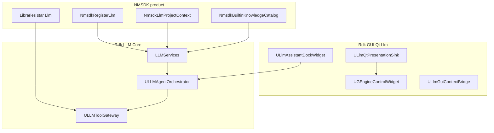
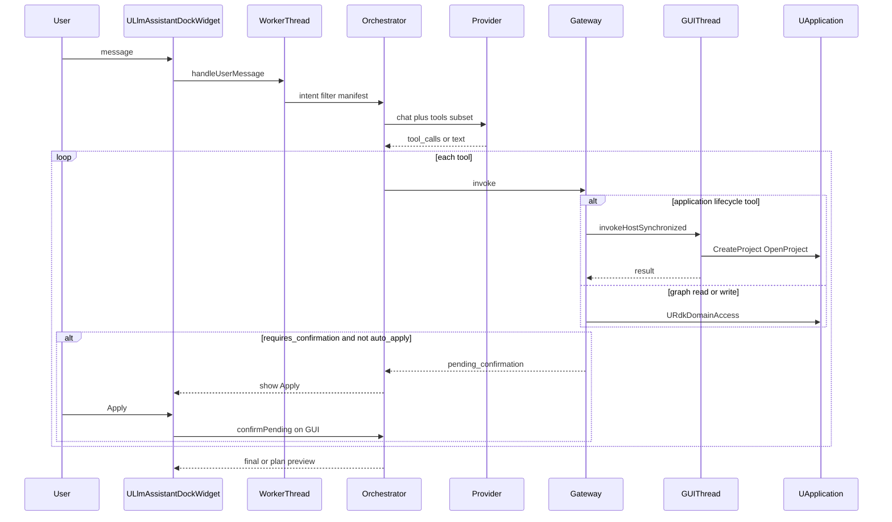

# Developer architecture — RDK LLM assistant

Normative overview for implementers and coding agents. Contract details remain in topic-specific docs; this file is the **single source of truth** for structure and request flow.

**See also:** [Extension-Guide.md](Extension-Guide.md) (how to add tools/knowledge), [Architecture.md](Architecture.md) (short index + CMake), [Post-MVP-Implementation-Plan.md](Post-MVP-Implementation-Plan.md) (deferred features).

---

## 1. Role of the LLM

The LLM is a **planner and intent interpreter**, not the source of truth and not a direct executor.

```
User → UI → Orchestrator → ILLMProvider
              ↓
        Tool Gateway → Policy
              ↓
        URdkApplicationCommands → UApplication   (configuration lifecycle)
        URdkDomainAccess        → UEngine/UNet   (graph read/write)
              ↓
        ILLMPresentationSink (shell refresh + GUI-thread host commands via `LLMPresentationEvent`)
              ↓
        ILLMProjectContextProvider + UDocSearchIndex (NMSDK knowledge)
```

The model must **never**:

- Apply SQL/XML or raw project files bypassing the gateway.
- Call `UEngine` / `UNet` / `UApplication` directly from provider output.
- Escalate permissions beyond `ULLMPolicyEngine` and session flags.

**Invariants** (full list): [README.md](README.md) § жёсткие инварианты.

---

## 2. Three deployment planes



| Plane | Path | Responsibility |
|-------|------|----------------|
| **Core** | `Rdk/LLM/Core/` | Orchestrator, gateway, policy, domain, providers, doc index |
| **GUI** | `Rdk/GUI/Qt/Llm/` | Assistant dock, settings, streaming, HITL UI, **GUI-thread host commands** |
| **NMSDK** | `App/NeuroModeler/`, `Libraries/*/Llm/` | `NmsdkRegisterLlm`, project context, library read tools |

**Product entry:** [`App/NeuroModeler/NmsdkRegisterLlm.cpp`](../../../App/NeuroModeler/NmsdkRegisterLlm.cpp) → `LLMServices::initialize`, `ULlmQtPresentationSink`, `LlmGui::RegisterLlmUi`.

**Headless:** initialize without `setPresentationSink`; application commands run on the orchestrator worker thread.

---

## 3. Layer stack

| # | Layer | Key types | Extend here when |
|---|--------|-----------|------------------|
| 1 | UI | `ULlmAssistantDockWidget`, settings widgets | Qt UX only |
| 2 | Intent | `ULLMIntentParser` | New RU/EN mutate/query patterns |
| 3 | Orchestrator | `ULLMAgentOrchestrator` | Turn loop, manifest, argument gate, plans |
| 4 | Tools | `ULLMToolRegistry`, `ULLMToolGateway` | **New actions** (handlers + schema) |
| 5 | Policy | `ULLMPolicyEngine`, `ULLMPathPolicy` | RBAC, paths, plan gates |
| 6a | App commands | `URdkApplicationCommands` | create/load/save configuration |
| 6b | Net domain | `URdkDomainAccess` | add/set/connect on `UNet` |
| 6c | Presentation | `ILLMPresentationSink` | Shell refresh + **host thread** marshaling |
| 6d | Context | `ILLMProjectContextProvider`, `UDocSearchIndex` | Docs, ClDesc, catalog roots |
| 7 | Observability | `ULLMAuditLog` | New audit event types |
| — | Providers | `ILLMProvider` | Ollama, OpenAI-compat, embedded GGUF |

**Dependency rule:** `Rdk/LLM/Core` must not include Qt headers (except optional deploy bridge).

---

## 4. Request flow (current)

NeuroModeler runs the orchestrator on a **worker thread** (`QtConcurrent` from the dock). Lifecycle tools that touch `UApplication` UI must run on the **GUI thread** when a Qt presentation sink is registered.



### 4.1 Branches

| Branch | Path | Notes |
|--------|------|--------|
| **Read tools** | Gateway → domain / doc index | Parallel `std::async` when all calls in one round are Read |
| **Graph write** | `add_component`, `set_property`, … | `ULLMWriteArgumentNormalizer`; HITL unless `session.auto_apply_writes` |
| **Lifecycle write** | `create_configuration`, `load_configuration`, … | `invokeApplicationTool` → `invokeHostSynchronized` (GUI) |
| **Argument gate** | Missing schema fields | `ULLMLifecycleArgumentGate`; follow-up user message merged |
| **Entity clarify** | Ambiguous `find_component` | `needs_entity_clarification` + candidates |
| **Plan** | `ULLMExecutionPlan` | **Run plan** in UI; not the same as auto-apply |
| **Auto-apply** | Settings `LLM/llm_auto_apply_writes` | Skips per-step Apply; plans still need Run plan |

Details: [Agent-Interaction.md](Agent-Interaction.md), [Policy-and-Safety.md](Policy-and-Safety.md), [GUI-Integration.md](GUI-Integration.md).

---

## 5. Tool registration

At `LLMServices::initialize`:

1. `RegisterCoreRdkTools(registry, domain, project_context)` — net, docs, application tools.
2. `project_context->registerExtraTools(registry, domain)` — e.g. Pulse/Motion/Hardware **read** tools from `Libraries/*/Llm/`.

**Graph mutations:** use core `add_component` / `set_property` only. Libraries expose `search_*_docs` and `list_*_component_classes` plus manifest hints via [`ULLMLibraryScopeHint`](../Core/Orchestrator/ULLMLibraryScopeHint.h).

**Filter exposed to the model:** `buildToolFilter(intent, llm_write_enabled, lifecycle_action)` — never all tools in one request.

---

## 6. Knowledge model (“ontology” surface)

What the assistant can “know” without guessing:

| Source | Mechanism | Tool / API |
|--------|-----------|------------|
| Runtime graph | Snapshot JSON | `get_net_snapshot` |
| Registered classes | ClDesc / storage | `list_registered_classes`, `describe_class` |
| Product docs + sources | `UDocSearchIndex` | `search_project_docs` (scope docs/sources/all) |
| Library docs | Per-lib roots in catalog | `search_pulse_docs`, … |
| User text focus | Keyword heuristics | `ULLMLibraryScopeHint` in manifest + argument merge |

Pipeline: `NmsdkBuiltinKnowledgeCatalog` → prebuilt `Bin/LLM/index` or dev `LLM/index/` → incremental `syncFromCatalog`. See [Knowledge-Sources.md](Knowledge-Sources.md).

---

## 7. Maturity scenarios

| ID | Name | Status | Doc |
|----|------|--------|-----|
| A | Chat over data | Done | [MVP-Roadmap.md](MVP-Roadmap.md) |
| B | Copilot + HITL / auto-apply | Done | Policy, GUI |
| C | Workflow operator (plans) | Done | [Orchestrator.md](Orchestrator.md) |
| D | Autonomous agent | **Post-MVP** | [Post-MVP-Implementation-Plan.md](Post-MVP-Implementation-Plan.md) |

---

## 8. Document map

| Task | Document |
|------|----------|
| Add a tool | [Extension-Guide.md](Extension-Guide.md), [Tools-Contracts.md](Tools-Contracts.md) |
| Gateway / registry | [Tool-Gateway-and-Registry.md](Tool-Gateway-and-Registry.md) |
| Policy / HITL | [Policy-and-Safety.md](Policy-and-Safety.md) |
| NMSDK paths / libraries | [Project-Context-NMSDK.md](Project-Context-NMSDK.md) |
| Qt / threading | [GUI-Integration.md](GUI-Integration.md) |
| Configuration tools | [Application-Commands.md](Application-Commands.md) |
| Session / plan state | [Conversation-State.md](Conversation-State.md) |
| Tests / CI | [Testing-Strategy.md](Testing-Strategy.md) |
| Deferred work | [Post-MVP-Implementation-Plan.md](Post-MVP-Implementation-Plan.md), [TECH-DEBT.md](../TECH-DEBT.md) |
