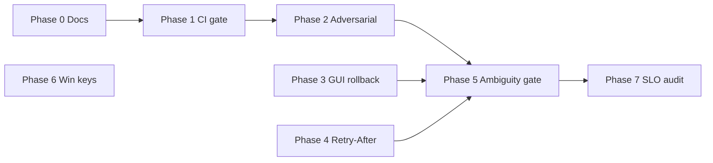

# Post-Audit Phase 2 — Implementation Plan (agent-ready)

**Audience:** Cursor / CI agents implementing the next LLM hardening sprint after the assistant audit (dialog + autonomy).

**Baseline:** Audit burn-down complete; all rows TD-068 … TD-071 are `done` in [TECH-DEBT.md](../TECH-DEBT.md). Normative architecture: [Developer-Architecture.md](Developer-Architecture.md). Process: [Development-Workflow.md](Development-Workflow.md).

**Do not edit:** `.cursor/plans/llm_assistant_audit_*.plan.md` (historical audit only).

---

## Как использовать (для человека)

1. Скопируйте блок **Agent bootstrap prompt** (§9) в новый чат агента.
2. Агент выполняет фазы **строго по порядку** (0 → 6); фаза 7 — опционально.
3. После каждой фазы — чеклист из [Development-Workflow.md](Development-Workflow.md) + commit в `Rdk/` + bump submodule в `Nmsdk/`.
4. Не коммитить `LLM/index/*` в корне без явного запроса пользователя.

---

## 1. Goals and non-goals

### Goals

| ID | Goal | Priority | Est. |
|----|------|----------|------|
| G1 | CI fails on P0/P1 agentic-risk regressions | P1 | 2 d |
| G2 | Adversarial fixtures for indirect injection via tool/retrieval payloads | P1 | 2 d |
| G3 | GUI surfaces `rollback_status` with correct UX (not only `resp.ok`) | P2 | 1 d |
| G4 | HTTP provider retry honors `Retry-After` when present | P2 | 1 d |
| G5 | Formal ambiguity gate before write tools (mixed / low-confidence intent) | P2 | 2–3 d |
| G6 | Windows Credential Manager for provider API keys | P2 | 2–3 d |
| G7 | Doc/matrix sync (TD-071 no longer “pending”) | P3 | 0.5 d |

### Non-goals (this sprint)

- Rewriting orchestrator agent loop or unbounded autonomy (Anti-Patterns #11).
- Committing root `LLM/index/index.jsonl` unless user asks.
- Full production SLO dashboard (Phase 7 stretch only).
- Replacing all provider auth with OAuth.

---

## 2. Inventory → TECH-DEBT IDs

Add/update rows in [TECH-DEBT.md](../TECH-DEBT.md) at phase start; set `done` at phase end.

| ID | Item | Phase | Priority |
|----|------|-------|----------|
| TD-072 | Sync Agentic-Risk-Test-Matrix with implemented controls (TD-071 done) | 0 | P3 |
| TD-073 | CI release gate: P0/P1 matrix rows must pass | 1 | P1 |
| TD-074 | Adversarial fixtures: tool/retrieval indirect injection | 2 | P1 |
| TD-075 | GUI consume `LLMFinalResponse.rollback_status` | 3 | P2 |
| TD-076 | Provider HTTP retry: parse `Retry-After` | 4 | P2 |
| TD-077 | Ambiguity gate before write invoke (intent confidence + mixed intent) | 5 | P2 |
| TD-078 | Windows secure API key storage (Credential Manager) | 6 | P2 |
| TD-079 | Agentic SLO counters in audit (task success / false-execution / escalation) | 7 | P3 |

---

## 3. Phase 0 — Documentation sync (0.5 d)

**Goal:** Remove stale gaps; agents must not re-implement TD-071.

### Tasks

| # | Action | File(s) |
|---|--------|---------|
| 0.1 | Row “Cancellation of one dialog…” → point to `Test_LLM_Orchestrator.CancelSessionDoesNotAffectOtherSessions` | [Agentic-Risk-Test-Matrix.md](Agentic-Risk-Test-Matrix.md) |
| 0.2 | Remove “Unit coverage pending (TD-071)” from Gaps; move TD-071 to “Covered” | same |
| 0.3 | Link this plan from [README.md](README.md) document map | [README.md](README.md) |
| 0.4 | Close TD-072 | [TECH-DEBT.md](../TECH-DEBT.md) |

### Acceptance

- [ ] Matrix has zero references to TD-071 as `pending`.
- [ ] README lists `Post-Audit-Phase-2-Implementation-Plan.md`.

### Commit

```
docs(rdk-llm): sync agentic risk matrix after audit phase

Refs TD-072
```

---

## 4. Phase 1 — CI release gate (2 d)

**Goal:** `Scripts/ci-llm-linux.sh` (or dedicated script) fails if P0/P1 matrix scenarios regress.

### Design

1. Add manifest `Rdk/Tests/Fixtures/LLM/agentic-risk/manifest.json`:

```json
{
  "version": 1,
  "suites": [
    { "id": "session-persist-pending", "ctest": "Test_LLM_SessionPersist", "filter": "RoundTripPendingToolArguments", "priority": "P0" },
    { "id": "session-redaction", "ctest": "Test_LLM_SessionPersist", "filter": "RedactsSensitiveMessageContentOnPersist", "priority": "P0" },
    { "id": "idempotency-cache", "ctest": "Test_LLM_ToolGateway", "filter": "IdempotencyReturnsCachedResult", "priority": "P0" },
    { "id": "rollback-failure-surface", "ctest": "Test_LLM_Orchestrator", "filter": "RollbackReportsFailureWhenCompensationFails", "priority": "P0" },
    { "id": "cancel-isolation", "ctest": "Test_LLM_Orchestrator", "filter": "CancelSessionDoesNotAffectOtherSessions", "priority": "P1" },
    { "id": "argument-validator-strict", "ctest": "Test_LLM_ArgumentValidator", "filter": "EnforcesTypeEnumAndNumericRange", "priority": "P1" }
  ]
}
```

2. Add runner `Scripts/ci-llm-agentic-risk.sh` (or extend `ci-llm-linux.sh`):
   - Parse manifest.
   - For each suite: `ctest -R '<ctest>' -E ''` with `-R` test name filter OR `ctest -R Test_LLM_Orchestrator --tests-regex CancelSession...`.
   - Exit non-zero on any failure; print suite id + priority.

3. Document in [Testing-Strategy.md](Testing-Strategy.md) § CI agentic gate.

4. Optional: wire into parent CI if a workflow exists; otherwise document “run locally before release”.

### Files (expected touch)

| Path | Change |
|------|--------|
| `Rdk/Tests/Fixtures/LLM/agentic-risk/manifest.json` | **new** |
| `Scripts/ci-llm-agentic-risk.sh` | **new**, executable |
| `Scripts/ci-llm-linux.sh` | call agentic script at end |
| `Rdk/LLM/Docs/Testing-Strategy.md` | CI section |
| `Rdk/LLM/Docs/Agentic-Risk-Test-Matrix.md` | “CI gate” row → implemented |

### Acceptance

- [ ] `./Scripts/ci-llm-agentic-risk.sh` passes on clean `build-llm-ci`.
- [ ] Deliberately breaking one P0 test causes script exit code ≠ 0 with suite id in stderr.
- [ ] TD-073 → `done`.

### Commit

```
test(rdk-llm): add P0/P1 agentic-risk CI gate from matrix manifest

Refs TD-073
```

---

## 5. Phase 2 — Adversarial fixtures (2 d)

**Goal:** Deterministic tests that tool/retrieval payloads cannot steer the model via unsanitized re-prompt (LLM01).

### Design

1. Directory: `Rdk/Tests/Fixtures/LLM/adversarial/`
   - `tool_output_injection_01.json` — payload with “ignore previous instructions…”.
   - `retrieval_snippet_injection_01.json` — doc chunk with fake system directive.
   - Each file: `{ "input": "<raw untrusted string>", "must_not_contain_in_model_context": ["ignore previous", "SYSTEM:"] }` (adjust to match `sanitizeUntrustedToolContent` contract).

2. New test target `Test_LLM_AdversarialFixtures` (or extend `Test_LLM_Orchestrator`):
   - Load fixtures.
   - Call sanitizer / orchestrator helper used before re-prompt (prefer **public test hook** or extract `sanitizeUntrustedToolContent` to testable unit in `ULLMAgentOrchestrator` or `ULLMTrustBoundary` if not already).
   - Assert sanitized output does not contain forbidden substrings OR is wrapped with trust markers per implementation.

3. Register in `Rdk/Tests/Unit/LLM/CMakeLists.txt`.

4. Add rows to [Agentic-Risk-Test-Matrix.md](Agentic-Risk-Test-Matrix.md) Automated coverage column.

### Key code references

| Component | Path |
|-----------|------|
| Sanitizer | `Rdk/LLM/Core/Orchestrator/ULLMAgentOrchestrator.cpp` (`sanitizeUntrustedToolContent`) |
| Orchestrator tests | `Rdk/Tests/Unit/LLM/test_llm_orchestrator.cpp` |

### Acceptance

- [ ] ≥2 adversarial fixtures; tests run without Ollama.
- [ ] Matrix gap “adversarial fixtures” removed.
- [ ] TD-074 → `done`.

### Commit

```
test(rdk-llm): add adversarial fixtures for untrusted tool context

Refs TD-074
```

---

## 6. Phase 3 — GUI `rollback_status` (1 d)

**Goal:** Plan rollback and any final response that sets `rollback_status` show user-visible outcome; do not treat `partial_rollback` / `rollback_failed` as silent success.

### Current gap

`ULlmAssistantDockWidget::onStreamFinished` only checks `resp.ok` and generic text. `onRollbackPlanClicked` appends `resp.text` without reading `resp.rollback_status`.

### Tasks

| # | Action | File |
|---|--------|------|
| 3.1 | Map status → localized QString (ru/en via `tr()`) | `ULlmAssistantDockWidget.cpp` |
| 3.2 | In `onStreamFinished`, if `!resp.rollback_status.empty()`, show status line even when `resp.ok` | same |
| 3.3 | In `onRollbackPlanClicked` finished handler, branch on `rollback_status` | same |
| 3.4 | Optional: style partial/failed (e.g. prefix `[Rollback]`) | same |
| 3.5 | Document in [GUI-Integration.md](GUI-Integration.md) | docs |

### Status → UX mapping (normative)

| `rollback_status` | `resp.ok` | User message (EN example) |
|-------------------|-----------|---------------------------|
| `rolled_back` | true | Plan rolled back successfully. |
| `rolled_back_nothing_to_compensate` | true | Nothing to roll back (no compensating actions). |
| `partial_rollback` | false | Rollback incomplete — review schema manually. |
| `rollback_failed` | false | Rollback failed — check audit log. |
| (empty) | * | Existing behavior |

### Acceptance

- [ ] Manual or unit-free compile check: NeuroModeler + `RDK_USE_LLM=ON` builds.
- [ ] TD-075 → `done`.

### Commit

```
fix(rdk-llm): surface rollback_status in assistant dock

Refs TD-075
```

---

## 7. Phase 4 — HTTP `Retry-After` (1 d)

**Goal:** Respect server backoff hints; avoid hammering rate-limited providers.

### Tasks

| # | Action | File |
|---|--------|------|
| 4.1 | In shared HTTP retry helper, parse `Retry-After` (seconds integer or HTTP-date) | `Rdk/LLM/Core/Providers/UOpenAICompatProvider.cpp`, `UOllamaNativeProvider.cpp`, possibly `ULLMHttpClient` |
| 4.2 | `sleep_ms = max(exponential_backoff, retry_after_ms)` capped (e.g. 60s) | same |
| 4.3 | Unit test with mock response headers (if HttpClient testable) or provider mock | `Rdk/Tests/Unit/LLM/` |
| 4.4 | Note in [Providers.md](Providers.md) | docs |

### Acceptance

- [ ] Test proves longer sleep when `Retry-After: 5` vs default backoff on first retry.
- [ ] TD-076 → `done`.

### Commit

```
fix(rdk-llm): honor Retry-After in provider HTTP retries

Refs TD-076
```

---

## 8. Phase 5 — Ambiguity gate before writes (2–3 d)

**Goal:** No write tool invoke when user intent is ambiguous or confidence below threshold without clarification turn.

### Current state

- `intent_contract_kind`, `intent_contract_confidence`, `INTENT_CONTRACT_MISMATCH` exist in orchestrator + session persist.
- Gap: mixed-intent utterances may still reach write path without explicit `needs_argument_clarification` / disambiguation.

### Design

1. Add `ULLMIntentAmbiguityGate` (or extend existing intent path) with API:

```cpp
struct IntentAmbiguityDecision {
    bool block_writes = false;
    std::string reason_code; // e.g. AMBIGUOUS_INTENT, LOW_CONFIDENCE
};
IntentAmbiguityDecision evaluate(const ConversationState&, const LLMIntentParseResult&);
```

2. Rules (configurable via env for tests):

| Condition | Action |
|-----------|--------|
| `confidence < NMSDK_LLM_INTENT_MIN_WRITE_CONFIDENCE` (default 0.65) | `block_writes` |
| Parsed tools include both read and write in same turn without explicit mutate intent | `block_writes` + clarification |
| `intent_contract_kind == Auto` and first write in session | require contract set or clarification |

3. Wire in `ULLMAgentOrchestrator` **before** `gateway.invoke` for write tools (reuse audit event `intent_ambiguity_blocked`).

4. Tests:
   - `Test_LLM_Orchestrator.IntentAmbiguityBlocksWriteUntilClarified`
   - Persist: ambiguity flag survives restart if needed (optional P2).

### Files

| Path |
|------|
| `Rdk/LLM/Core/Orchestrator/ULLMAgentOrchestrator.cpp` |
| `Rdk/LLM/Core/Intent/` (new gate module if cleaner) |
| `Rdk/Tests/Unit/LLM/test_llm_orchestrator.cpp` |
| [Conversation-State.md](Conversation-State.md), [Policy-and-Safety.md](Policy-and-Safety.md) |

### Acceptance

- [ ] Write blocked with typed error when fixture phrase is ambiguous (define 1–2 RU phrases in fixture JSON).
- [ ] Read tools still allowed when gate triggers.
- [ ] TD-077 → `done`.

### Commit

```
feat(rdk-llm): add ambiguity gate before write tool execution

Refs TD-077
```

---

## 9. Phase 6 — Windows secure key storage (2–3 d)

**Goal:** Parity with Linux `secret-tool` / macOS `security` for provider API keys in Qt settings source.

### Current state

`ULlmQtProviderSettingsSource.cpp` — secure path returns false on Windows; plaintext only with `NMSDK_LLM_ALLOW_PLAINTEXT_SETTINGS_KEYS`.

### Tasks

| # | Action |
|---|--------|
| 6.1 | Implement `readSecureKey` / `writeSecureKey` using Windows Credential Manager (`CredRead` / `CredWrite`, target name e.g. `Nmsdk/Llm/Provider/<profile>`) |
| 6.2 | Guard with `#ifdef _WIN32`; keep existing Linux/macOS paths |
| 6.3 | Unit test behind `#ifdef _WIN32` or abstract interface + mock (if CI is Linux-only, document manual Win verify in TECH-DEBT note) |
| 6.4 | Update [GUI-Integration.md](GUI-Integration.md) secrets section |

### Acceptance

- [ ] On Windows build: keys not written to QSettings when secure store succeeds.
- [ ] On Linux CI: no regression; existing `Test_LLM_ProviderAuth` passes.
- [ ] TD-078 → `done` (or `blocked` + note if no Win CI).

### Commit

```
fix(rdk-llm): store provider API keys in Windows Credential Manager

Refs TD-078
```

---

## 10. Phase 7 — Observability stretch (optional, 2 d)

**Goal:** Audit events for operational SLO (not a full dashboard).

### Tasks

- Append audit events: `task_completed`, `task_failed`, `false_execution_prevented`, `escalation_to_hitl`.
- Counters derivable via `llm_audit_verify` or simple grep script `Scripts/llm-audit-slo-snapshot.sh`.
- TD-079 → `done` or defer with `Target phase-8`.

---

## 11. Verification commands (every phase)

```bash
# Configure (once per build dir)
cmake -S /home/user/Nmsdk -B /home/user/Nmsdk/build-llm -DRDK_USE_LLM=ON -DBUILD_TESTING=ON
cmake --build /home/user/Nmsdk/build-llm --target rdk.llm.core NeuroModeler -j"$(nproc)"

# Full LLM unit suite
ctest --test-dir /home/user/Nmsdk/build-llm/Rdk/Tests/Unit/LLM --output-on-failure

# After Phase 1
/home/user/Nmsdk/Scripts/ci-llm-agentic-risk.sh   # or ci-llm-linux.sh
```

**Minimum per-phase subset:**

| Phase | ctest focus |
|-------|-------------|
| 0 | (docs only) |
| 1 | manifest suites only |
| 2 | `Test_LLM_AdversarialFixtures` or extended Orchestrator |
| 3 | build GUI target only |
| 4 | `Test_LLM_OllamaNative`, `Test_LLM_HttpSse`, new Retry-After test |
| 5 | `Test_LLM_Orchestrator` |
| 6 | `Test_LLM_ProviderAuth` |

---

## 12. Dependency graph



Phases 3, 4, 6 may run **in parallel** after Phase 2 if multiple agents; merge order: 3 → 4 → 6 → rebase → Phase 5.

---

## 13. Agent bootstrap prompt (copy into new chat)

```text
Implement Rdk/LLM Post-Audit Phase 2 per:
  Rdk/LLM/Docs/Post-Audit-Phase-2-Implementation-Plan.md

Rules:
- Follow Development-Workflow.md end-of-phase checklist.
- One English commit per phase in Rdk/; then chore(nmsdk): bump Rdk submodule in Nmsdk/.
- Update TECH-DEBT.md: open TD-072..079 at start, close on completion.
- Do not edit .cursor/plans/llm_assistant_audit_*.plan.md
- Do not commit Nmsdk/LLM/index/* unless I ask.

Start at Phase 0 (doc sync), then Phase 1. Report phase summary + ctest output after each phase.
Branch: llm (or create llm-phase2 from current llm).
```

---

## 14. Sprint calendar (estimate)

| Week | Phases | Deliverable |
|------|--------|-------------|
| W1 D1 | 0 + 1 | Matrix synced; CI agentic gate green |
| W1 D2–3 | 2 | Adversarial fixtures + tests |
| W1 D4 | 3 | GUI rollback_status |
| W2 D1 | 4 | Retry-After |
| W2 D2–3 | 5 | Ambiguity gate |
| W2 D4–5 | 6 | Windows secure keys (or blocked note) |
| Stretch | 7 | Audit SLO events |

**Total (required phases 0–6):** ~8–10 engineering days.

---

## 15. Root repo housekeeping (human decision)

| Path | Agent default |
|------|----------------|
| `Nmsdk/LLM/index/index-manifest.json` | Do not commit |
| `Nmsdk/LLM/index/index.jsonl` | Do not commit |
| `Bin/` untracked | Ignore |

---

*Plan version: `post-audit-phase2-1.0.0` — 2026-05-28*
