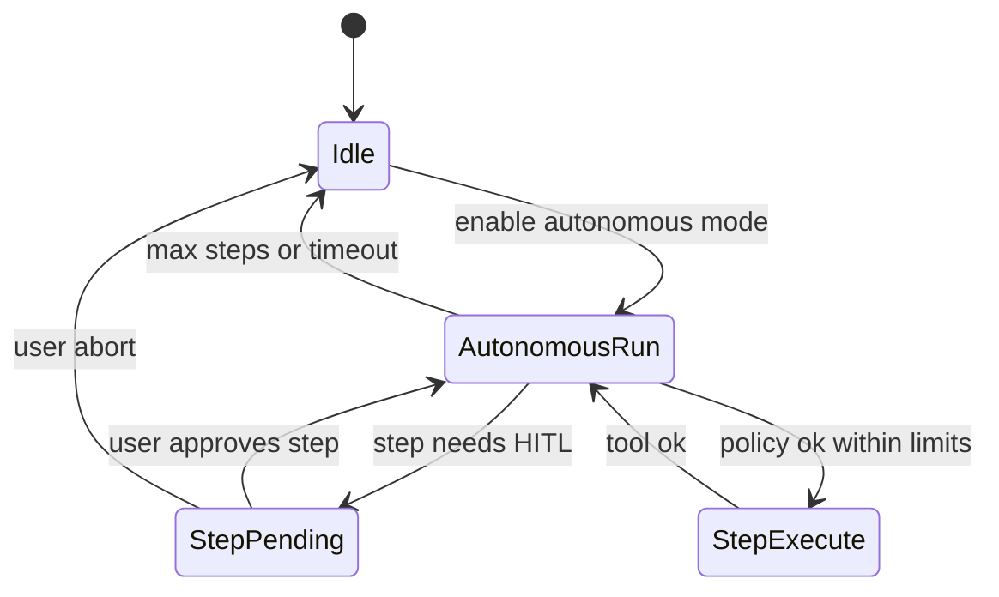

# Post-MVP implementation plan

Roadmap for **deferred code** after MVP / write-tools P1–P3. Architecture baseline: [Developer-Architecture.md](Developer-Architecture.md).

**Not in scope here:** documentation-only changes (see Development-Workflow). **Forbidden:** unbounded autonomous agent (Anti-Patterns #11).

---

## 1. Inventory

| ID | Topic | Current status | Priority |
|----|-------|----------------|----------|
| TD-041 | Manual GUI write-tools walkthrough | open | P0 — QA |
| **Scenario D** | Configurable autonomous / semi-autonomous agent | Post-MVP design | P1 |
| TD-035 | Dedicated `tool_disambiguation` UI | deferred | P2 |
| TD-036 | Embedding-based dynamic tool routing | cancelled MVP → revisit | P3 |
| TD-031 | YAML knowledge manifest | cancelled MVP → revisit | P3 |
| TD-034 | Function-level source chunking (ctags) | cancelled MVP → revisit | P3 |

Cancelled MVP items are **not rejected forever**; each needs a new TECH-DEBT row when work starts.

---

## 2. Phase 0 — QA and stabilization

**Goal:** Close TD-041; ensure auto-apply and GUI-thread lifecycle fixes are shipped.

| Task | Details |
|------|---------|
| TD-041 checklist | [Application-Commands.md](Application-Commands.md) § Manual E2E (TD-041) |
| Regression | `ctest -R 'Test_LLM_'` (lab tests skip if Ollama down) |
| Code | `llm_auto_apply_writes`, `invokeHostSynchronized` committed |

**Exit:** Checklist executed or TD-041 → `cancelled` with reason in [TECH-DEBT.md](../TECH-DEBT.md).

---

## 3. Phase 1 — Scenario D (configurable autonomy)

**Goal:** Optional multi-step tool chains with **strict limits by default** and a softer semi-auto mode.

### 3.1 Modes

| Mode | QSettings / runtime | Behavior |
|------|---------------------|----------|
| `off` | default | Current copilot: HITL per tool or global auto-apply |
| `strict` | autonomous default for D | Tool whitelist ≤ 5, `max_autonomous_steps` ≤ 3, **confirm each step** in UI |
| `semi_auto` | optional | Same whitelist/limits; auto-run reads; confirm non-exempt writes |

### 3.2 State machine

### 3.3 Implementation components

| Component | Work |
|-----------|------|
| Settings | `LLM/autonomous_mode`, limits in `LLMRuntimeProviderSettings` + Settings UI |
| Orchestrator | Session flag / `LLMWorkflowPhase::Autonomous`, step counter, cancel |
| Policy | `ULLMAutonomousPolicy` — whitelist, step cap, cloud rounds |
| Gateway | Reuse existing invoke; no bypass |
| GUI | Autonomous run panel: progress, Stop, per-step Approve (strict) |
| Audit | `autonomous_run_started`, `autonomous_step`, `autonomous_aborted`, `autonomous_completed` |

### 3.4 Security gate (before merge)

- [ ] Path policy unchanged for lifecycle tools
- [ ] No direct engine access
- [ ] Audit covers every step
- [ ] Default mode `off`; strict is default when D enabled
- [ ] Separate review sign-off documented in PR

### 3.5 Out of scope (iteration 1)

- Unbounded provider rounds
- Parallel write tools in autonomous loop
- Skipping audit or policy

### 3.6 Tests

- Unit: policy whitelist and step cap
- Mock orchestrator: 3-step chain in strict (each step confirmed)
- Optional GUI smoke

**Estimate:** 2–3 PRs (design/settings → policy+orchestrator → GUI).

---

## 4. Phase 2 — TD-035 UI disambiguation

| Task | Details |
|------|---------|
| API | `needs_tool_disambiguation` on `LLMFinalResponse` or extend `needs_entity_clarification` with typed payload |
| Orchestrator | Set flag when `find_component` / resolver returns structured candidates |
| GUI | Dedicated dock block (list buttons) vs plain text |

**Tests:** orchestrator mock with ambiguous fixture.

---

## 5. Phase 3 — Knowledge / retrieval

Implement **one ID per PR**; feature flags with fallback to static `ULLMToolFilterBuilder`.

| ID | Scope | Deliverables |
|----|-------|--------------|
| TD-036 | Dynamic tool routing | Optional embedding/score router; cap tools sent to provider |
| TD-031 | YAML catalog | Optional `yaml-cpp`; loader implementing `ILLMKnowledgeCatalog` |
| TD-034 | Ctags chunks | Finer `scope=sources` chunks; index size limits in CI |

---

## 6. Dependency order

---

## 7. Completion criteria

| Item | Done when |
|------|-----------|
| Scenario D | `strict` + `semi_auto` implemented, tested, default `off`; security checklist signed |
| TD-041 | Walkthrough complete or cancelled |
| TD-035 | UI flag + tests |
| TD-031/034/036 | Each `done` or `cancelled` with TECH-DEBT resolution |

Update this file and [TECH-DEBT.md](../TECH-DEBT.md) when phases close.
